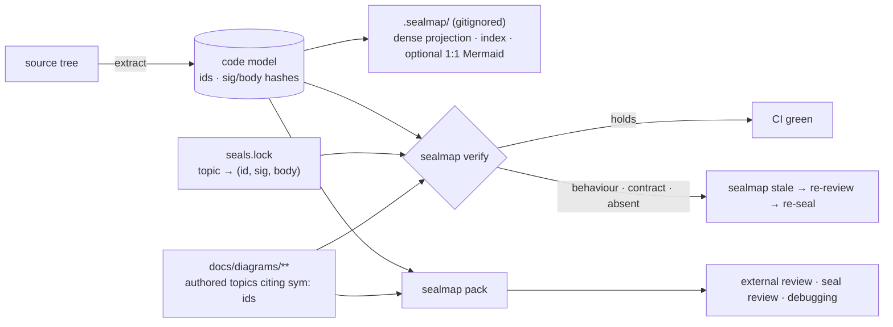

<div align="center">

# sealmap

### Deterministic code maps and sealed diagram contracts for LLM development harnesses

[](#licence)
[](Cargo.toml)
[](docs/DESIGN.md)

*The seal and the distillation do the work, not a bigger model.*

</div>

---

## What is sealmap?

sealmap is the deterministic layer under an LLM diagrams-as-code workflow.

**The workflow it serves.** Code and a dense corpus of Mermaid diagrams are
written in lockstep, one subsystem topic at a time. The whole corpus is then
analysed for a holistic view of the system. In the DreamLab estate this has
proven to be one of the most effective ways to build large codebases with
agents. It has one structural cost: **keeping the diagrams true**.

**What sealmap does.** It reads source without compiling it and builds a
language-neutral model: symbols, relations, and the ordered call flow of every
function. From that model it provides five things. The first four exist
in this tree; review packs are next:

- **Stable symbol ids** (exist), with no file path or line number in them,
  so moving code never breaks a citation.
- **Two content hashes per symbol** (exist), one for the signature and one
  for the body, both insensitive to whitespace, comments and formatting.
- **Seals** (exist). A lockfile records that a hand-consolidated diagram topic was
  reviewed against *these exact versions* of the functions it describes.
  `sealmap verify` enforces that in CI, with no LLM involved.
- **Precise staleness** (exists). When code changes, only the topics whose sealed
  symbols actually changed are flagged for another look. Topics that merely
  share a file with the change are left alone.
- **On-demand review packs** (planned, 0.2). A bounded, byte-identical blob is built from the
  sealed topics, dense slices of the code they cite, and source windows. It
  feeds an external reviewer, a seal review or a debugging session.

**What stays with the LLM skill:** the narratives, the register of tensions
and debt, the choice of what to merge, and the review that produces a seal.
sealmap does the bookkeeping that makes that judgement cheap to keep true.

## Why it exists (measured)

All figures come from the estate's own corpora (2026-10-05).

| Observation | Number |
|---|---|
| A hand-consolidated topic corpus is compact | **0.21–0.22×** source bytes, flat while the source grew 67 % |
| …but file-granular staleness makes it expensive to keep true | a median code commit flags **10 of 45** topics, and p90 flags **40 of 45**. One 4,399-line hub file is cited by 39 topics |
| A one-file-per-source Mermaid corpus is *not* a compression | **1.07×** source tokens |
| A dense agent projection is | **0.45×** source, about 13 tokens per call edge against 42 for Mermaid |
| Diagrams alone carry real review signal | a blind, diagrams-only critical review rediscovered 7 of 30 known tensions with no register visible (pilot, n = 1) |

**The design follows from these numbers:**

- Keep the human corpus consolidated and LLM-written.
- Make its citations symbol-granular and sealed.
- Generate everything mechanical on demand and never commit it.

## How it works



| Layer | Artefact | Committed | Written by |
|---|---|---|---|
| **Authored** | consolidated topics, narratives, register; citations are `sym:` ids | yes | the LLM skill |
| **Sealed** | `seals.lock`, plus a static `sealed:` pointer per topic | yes | the skill's seal step (a reviewed decision) |
| **Generated** | model, index, dense projection, optional 1:1 Mermaid | **never** | `sealmap generate`, rebuilt in seconds |

### What a seal check reports

| Condition | Class | CI |
|---|---|---|
| id resolves, both hashes match (code moves included) | `holds` | pass |
| signature same, body changed | `behaviour` | fail → cheap re-review |
| signature changed | `contract` | fail → re-consolidate, ADR addendum |
| id gone; candidates of the same kind with the sealed body are listed | `absent` (rename suspected) | fail → confirm rename |
| a file that may hold the id no longer parses | `unparsable` | fail (fail closed) |
| a `sym:` id cited but not sealed, or not a canonical id | `unsealed-citation` | fail |
| a lock entry whose topic file is gone, or a sealed symbol no longer cited | `orphan` | fail |
| topic prose edited since sealing | `prose-edited` | fail |
| `sealed:` pointer and lock disagree, or the lock is not canonical | `lock-fault` | fail |

Code, topic and lock land in **one commit**. No second "re-stamp" commit is
needed.

### A seal, end to end

A topic cites symbols as inline code spans (ids contain spaces, so the code
span is the delimiter):

```markdown
---
id: LED-01
title: Accounts
area: ledger
---
Money goes in through `sym:cargo ledger . accounts/LedgerAccount#deposit().`.
```

Sealing it derives the entry from the current code and adds one pointer
line to the front matter:

```console
$ sealmap seal sign LED-01 --reviewer zai:glm-5.3 --model claude:sonnet
sealmap: sealed LED-01 (ledger/01-accounts.md) with 1 symbol(s) into ./docs/diagrams/seals.lock
$ cat docs/diagrams/seals.lock
version = 1
algorithm = "sm1"
generator = "sealmap 0.1.0"

[[topic]]
id = "LED-01"
file = "ledger/01-accounts.md"
topic_hash = "blake3-16:…"
reviewer = "zai:glm-5.3"
model = "claude:sonnet"
date = "2026-10-05"
symbols = [
  { id = "sym:cargo ledger . accounts/LedgerAccount#deposit().", sig = "blake3-16:…", body = "blake3-16:…" },
]
$ sealmap verify && echo green
green
```

Edit `deposit`'s body and the gate goes red, naming the topic, the symbol
and the class:

```console
$ sealmap verify
behaviour         LED-01   sym:cargo ledger . accounts/LedgerAccount#deposit(). body blake3-16:… -> blake3-16:… (src/accounts.rs:4-6)
$ echo $?
1
```

`topic_hash` is BLAKE3 over the topic text with line endings normalised and
the `sealed:` line removed, truncated to 16 bytes; the lock is TOML in one
canonical form that `sealmap` writes and `verify` byte-checks. Reviewer and
model are opaque strings: reviewer policy belongs to the calling skill.

## Ids and hashes (exist today)

### `sym:` ids

Every symbol gets a kind-explicit id in SCIP descriptor style, with no file
path and a `.` version meaning "the tree being analysed":

```text
sym:cargo shop . db/Db#insert().          method insert of struct Db in module shop::db
sym:cargo shop . db/Db#[Store]put().      put from `impl Store for Db`
sym:cargo shop . db/                      the module itself
sym:extern serde_json::to_string          a dependency path whose kinds are unknown
sym:? insert                              a method on a receiver of unknown type
```

The suffix gives the kind: `/` module, `#` type or trait, `().` function or
method, `.` const or static, `!` macro. Methods sit under the type that owns
them, so splitting an `impl` or moving it to another file keeps every id.
Printing is injective and parsing accepts only canonical text (property
tested). The grammar is documented in `sealmap_model::sym`.

### Signature and body hashes

Every symbol carries `sig_hash` (its contract) and `body_hash` (its
implementation): 16-byte BLAKE3 values over a language-neutral token stream,
algorithm id `sm1`, with golden values pinned in CI.

| Change | `sig_hash` | `body_hash` | id |
|---|---|---|---|
| reformat, rustfmt rewrites (trailing commas, braces round a closure or match-arm body, `use` order) | same | same | same |
| comments, doc comments, `#[allow]` and other lint attributes | same | same | same |
| move within a file or to another file | same | same | same |
| edit the body | same | **changes** | same |
| change name, visibility, generics, parameters, return type or a non-lint attribute | **changes** | same | same (except the name) |
| rename | **changes** | same, so a rename can be matched | **changes** |

Reflowing tokio, VisionClaw and sealmap with rustfmt at `max_width = 50`
changes no id and no hash.

### Schema v2

`_model.json` and `_index.json` carry `schema_version: 2`. Every symbol has
its `sym:` id, span, `sig_hash` and `body_hash`; index fragments repeat their
symbol's hashes. `Codebase::from_json` refuses any other version. Version 1
(sealmap 0.1) has no reader. Output stays byte-deterministic.

### Mermaid ids

Diagram ids are derived from `sym:` ids by an injective encoding that is
readable where names are plain (`shop__db___tDb___finsert`). Two symbols
never share a node, by construction rather than by a collision check. The
corpus generator still asserts uniqueness across the codebase as a guard.

### Resolution honesty

A method call on a std or dependency value is never drawn as a call to an
internal method that happens to share its name. For example, `Path::parent`
on a value taken from an `Option<&Path>` is no longer bound to an internal
`parent`. Parts taken apart by `if let`, `match` or `for` inherit what is
known about their origin.

## Where sealmap sits in the estate

sealmap is a component of
**[VisionFlow](https://github.com/DreamLab-AI/VisionFlow)**. It is consumed by
the [agentbox](https://github.com/DreamLab-AI/agentbox) skill harness, much as
the Ontology Loom is: a deterministic scaffold that makes a model's judgement
cheap and checkable.

| Sibling | Relationship |
|:--------|:-------------|
| [agentbox](https://github.com/DreamLab-AI/agentbox) `diagrams-as-code` skill | Writes the authored corpus. With sealmap, its line-resolution role costs zero tokens and its citations become `sym:` ids |
| agentbox `sealmap-review` skill (shipped) | Diagrams-only external review (Gemini 3.8 Flash, critical and pre-mortem lenses) and an inline check against the cited code. It will consume `sealmap pack --review` |
| agentbox `build-with-quality` skill | Takes review findings as hypotheses to test. Gains a **re-seal** step driven by `sealmap stale` |
| agentbox `sealmap` skill (planned) | The seal workflow, model tiering per step, and the A/B bench |
| [diagram-ir](https://github.com/DreamLab-AI/diagram-ir) | The inverse direction: reads hand-written Mermaid back into an IR. The skill pairs it with `sealmap resolve` to catch invented edges |
| [VisionFlow](https://github.com/DreamLab-AI/VisionFlow) | Ecosystem canon, and the largest Rust corpus sealmap is tested on |

## Crates

**Today (in this tree: 0.1 plus steps 2 and 3a: ids, hashes and the seal surface; renamed from `codemaid-*`):**

| Crate | Role | Deps |
|---|---|---|
| [`sealmap`](crates/sealmap) | facade and CLI | all below, clap |
| [`sealmap-model`](crates/sealmap-model) | language-neutral model: `Codebase`, `Symbol`, `Relation`, `Flow`; the `sym:` id grammar; per-symbol `sig_hash` / `body_hash`; schema v2 | serde, blake3, ignore |
| [`sealmap-mermaid`](crates/sealmap-mermaid) | typed, escaping Mermaid writers: sequence, class, ER, flowchart; injective diagram ids from `sym:` ids (feature `model`) | sealmap-model (opt.; **none** without it) |
| [`sealmap-extract`](crates/sealmap-extract) | logic shared by every language adapter (replaces `sealmap-frontend` 0.1.0): raw flow IR, flow lowering, call aggregation, confidence policy, label rules, `sym:` id builder, token-stream fingerprints, panic-isolated collection | sealmap-model, blake3, rayon (opt.) |
| [`sealmap-rust`](crates/sealmap-rust) | Rust language adapter (syn), workspace-wide resolution | sealmap-extract, syn, toml |
| [`sealmap-corpus`](crates/sealmap-corpus) | projections and index; the `seal` module: lock format, `topic_hash`, `verify`, `seal_check`, `stale`, `resolve`, `sign` | serde_json, toml, blake3 |

**Planned for 0.2:**

| Crate | Role |
|---|---|
| `sealmap-ts` | **deferred:** TypeScript/TSX language adapter on oxc, built only if E0-R shows the precise-staleness gain is real |
| `sealmap-dense` | the agent projection: indented call trees and skeletons with line spans |
| `sealmap-corpus` gains | `pack`: bounded review packs |

Each crate will be published on crates.io under `MIT OR Apache-2.0`, with full
rustdoc. Depend on the facade for the common path. A project that only needs
safe Mermaid output can depend on `sealmap-mermaid` alone.

## Quickstart (today)

```sh
cargo install --path crates/sealmap

sealmap generate .                   # write the 1:1 corpus, model and index to .sealmap/ (gitignored)
sealmap generate . --check           # exit 1 if .sealmap/ differs from a fresh generation
sealmap model    .  > model.json     # just the model

# Several repositories as one codebase (cross-repo calls resolve):
sealmap generate --repo api=../api --repo core=../core -o .sealmap

# Seals over docs/diagrams/ (lock: docs/diagrams/seals.lock; -C ROOT, --diagrams DIR, --json)
sealmap resolve 'sym:cargo my_crate . net/Client#connect().'   # span + hashes, or absent + rename candidates
sealmap seal sign CP-03 --reviewer zai:glm-5.3 --model claude:sonnet   # seal a topic from the current code
sealmap verify                                               # the CI gate: exit 1 unless everything holds
sealmap seal-check CP-03 CP-07                               # classify chosen lock entries
sealmap stale --since main                                   # sealed symbols changed since a revision; exit 0
```

Exit codes: 0 success; 1 a check failed, an id is not found, or a seal was
refused; 2 usage or IO error. Seals depend on the extraction options that
shape ids (`--name`, `--tests`, `--repo`): check with the options you
signed with.

**Planned** (see [`docs/DESIGN.md`](docs/DESIGN.md) §4):

```sh
sealmap pack CP-03 CP-07 --max-bytes 1048576               # review blob
sealmap pack --review                                      # diagrams only, for an outside reviewer
```

## Properties

- **Deterministic.** The same sources give byte-identical output on every
  machine, CI compares two fresh generations byte for byte, and the lock has
  one canonical form, so signing topics in any order writes the same bytes.
- **Honest.** Every call and relation is tagged `exact`, `inferred` or
  `external`. Nothing is guessed silently, and an unparsable file fails a seal
  rather than passing it.
- **Valid.** Every diagram is built through typed, escaping writers. All 4,680
  diagrams generated from tokio, axum, ripgrep, oxdraw and this repository parse
  in Mermaid 12 ([`tools/validate-mermaid.mjs`](tools/validate-mermaid.mjs)),
  as do the 6,142 diagrams of a VisionClaw corpus with step-2 ids.
- **Bounded** (planned with `pack`). `pack` will refuse an over-budget request
  with a shard plan rather than truncating it.
- **Fast:**

  | Codebase | Release build | Notes |
  |---|---|---|
  | VisionClaw (934 files) | **1.13 s** | with ids and hashes; v0.1 overflowed its stack after 48 s |
  | tokio 1.53.2 | 0.25 s | with ids and hashes |
- **Checked on the MSRV.** CI builds and tests on Rust 1.85, the declared
  `rust-version`, as well as on stable.

## What it does not do

- **It never compiles or type-checks.** Calls that need type inference are
  resolved by name and receiver heuristics and tagged `inferred`, never
  against a std or dependency receiver.
  Macro-generated items are not sealed.
- **It never writes the diagrams people read.** Consolidation, narrative and
  judgement are the LLM skill's job.
- **It runs no model, makes no network calls, and spawns no processes** in the
  libraries. The CLI only shells out to `git` (and `tar`) for `stale --since`.
- **It knows nothing about reviewers.** The lock holds opaque strings, and
  reviewer policy (cross-family review, evidence) lives in the skill layer.

## Status and roadmap

**v0.1** is working. It is dogfooded on its own source, and the Rust language
adapter has been run on VisionClaw, tokio, axum, ripgrep and oxdraw. Steps 1
and 2 of the 0.2 plan and the seal half of step 3 are done in this tree and
not yet released.

The 0.2 plan, in order (detail in [`docs/DESIGN.md`](docs/DESIGN.md) §10):

1. **Done.** Rename to `sealmap-*`; dual licence; land the hardening; extract the
   shared core, now `sealmap-extract` (published as `sealmap-frontend` 0.1.0).
2. **Done.** `sym:` id grammar (SCIP-descriptor style), signature and body
   hashes, schema v2, injective Mermaid ids, the `Path::parent` resolver fix,
   and CI on the MSRV.
3. **In progress.** Seal surface: the lock, `resolve`, `stale`, `seal-check`,
   `verify` and `seal sign` are done and the committed generated corpus is
   retired; `pack` and `sealmap-dense` remain, then the first 0.2 crates.io
   release.
4. **E0:** replay 100 real commits and count topics flagged per commit, file
   level against sealed, with no LLM involved. This is the first headline
   number.
5. `sealmap-ts`, **deferred**: built only if E0-R on the Rust repositories
   shows the precise-staleness gain is real, with a shared conformance suite
   as the parity gate.
6. The pre-registered review A/B, dogfooded on this repository.

## Design and evidence

- [`docs/DESIGN.md`](docs/DESIGN.md): the governing design. It covers the
  layers, seal format, crate surface, skills, model-per-step tiering, evidence
  plan and owner decisions.
- [`docs/diagrams/`](docs/diagrams): the hand-authored, citation-verified
  diagram corpus of this repository. The v0.1 generated self-corpus
  (`docs/sealmap/`) is retired: `sealmap generate` rebuilds it into the
  gitignored `.sealmap/`.

## Licence

Licensed under either of

- Apache License, Version 2.0 ([`LICENSE-APACHE`](LICENSE-APACHE) or <https://www.apache.org/licenses/LICENSE-2.0>)
- MIT licence ([`LICENSE-MIT`](LICENSE-MIT) or <https://opensource.org/licenses/MIT>)

at your option.

Unless you explicitly state otherwise, any contribution intentionally submitted
for inclusion in the work by you, as defined in the Apache-2.0 licence, shall be
dual licensed as above, without any additional terms or conditions.
