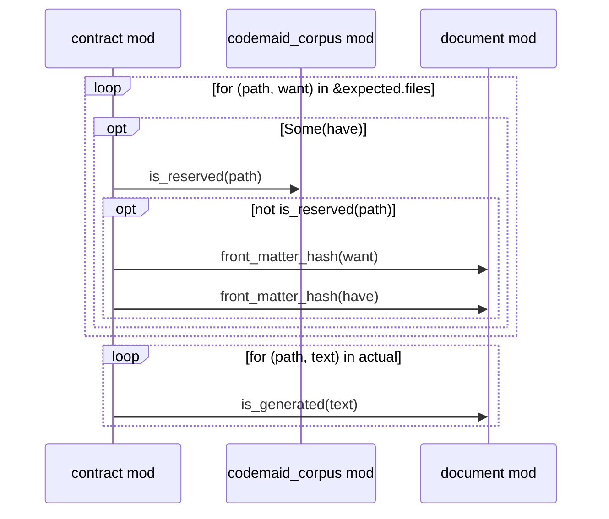

# codemaid

Deterministic, dense **codebase → Mermaid** generation for LLM agents, in pure Rust.

codemaid reads source code without compiling it, builds a language-neutral model
(symbols, relations, and the ordered call flow of every function), and projects it
into a **contract-enforced 1:1 corpus**: exactly one Markdown document of Mermaid
diagrams per source file, plus machine-readable metadata that lets an orchestrating
agent merge, inline and cross-reference diagrams by stable id.

```text
src/net/client.rs   ──►   codemaid/src/net/client.rs.md
                           ├─ front matter (source, module, BLAKE3 source hash)
                           ├─ structure: classDiagram of everything the file defines
                           └─ one sequenceDiagram per function that makes calls
                    +     codemaid/_index.json    fragment index and merge map
                          codemaid/_model.json    full code model
                          codemaid/_overview.md   crate/repo graph, module graphs,
                                                  data models (erDiagram), trait maps
```

* **Dense:** per-function sequence diagrams with `alt`/`opt`/`loop`/`par` fragments,
  std/prelude noise removed, compact labels, no styling.
* **Deterministic:** the same sources give byte-identical output on every machine.
* **Enforced:** `codemaid verify` fails CI when any document is missing, orphaned,
  stale or hand-edited.
* **Honest:** every call and relation is tagged `exact`, `inferred` or `external`.
* **Fast:** tokio (497 files, ~6k symbols, 2.1k sequence diagrams) in about 1.3 s.
* **Valid:** every diagram is built through typed, escaping writers. All 4,680
  diagrams generated from tokio, axum, ripgrep, oxdraw and this repo parse in
  Mermaid 12 (see [`tools/validate-mermaid.mjs`](tools/validate-mermaid.mjs)).

## Crates

| Crate | What it is | Deps |
|---|---|---|
| [`codemaid`](crates/codemaid) | Facade + `codemaid` CLI | all below, clap |
| [`codemaid-model`](crates/codemaid-model) | Language-neutral model: `Codebase`, `Symbol`, `Relation`, `Flow`, `SourceSet` | serde, blake3 |
| [`codemaid-mermaid`](crates/codemaid-mermaid) | Typed Mermaid writers: sequence, class, ER, flowchart | **none** |
| [`codemaid-rust`](crates/codemaid-rust) | Rust frontend (syn), workspace-wide resolution | syn, toml, rayon (opt) |
| [`codemaid-corpus`](crates/codemaid-corpus) | Projections, index, 1:1 contract (`verify`/`write`) | serde_json |

Depend on the facade for the common path, or pick crates individually: a project
that only needs to emit safe Mermaid can depend on `codemaid-mermaid` alone.

## Use it

### CLI

```sh
cargo install --path crates/codemaid

codemaid generate . -o docs/codemaid        # write / update the corpus
codemaid verify   . -o docs/codemaid        # exit 1 on any drift (put this in CI)
codemaid model    .  > model.json           # just the model

# Several repositories as one codebase (cross-repo calls resolve):
codemaid generate --repo api=../api --repo core=../core -o corpus
```

Useful flags: `--tests` (include tests/examples/benches), `--external all|non-std|none`,
`--owner-lanes`, `--min-calls N`, `--public-only`, `--no-model`, `--pretty`.

### Library

```rust
use std::path::Path;

let corpus = codemaid::generate_dir(Path::new("."), &codemaid::Options::default())?;
codemaid::corpus::write(Path::new("docs/codemaid"), &corpus)?;
# Ok::<(), std::io::Error>(())
```

Or step by step, entirely in memory:

```rust
use codemaid::model::SourceSet;
use codemaid::rust::{RustOptions, extract};
use codemaid::corpus::{CorpusOptions, generate};

let mut src = SourceSet::new();
src.insert("src/lib.rs", "pub fn a() { b(); } fn b() {}")?;
let model = extract(&src, &RustOptions::default()).codebase;
let corpus = generate(&model, &CorpusOptions::default());
println!("{}", corpus.document("src/lib.rs.md").unwrap());
# Ok::<(), codemaid::model::PathError>(())
```

## What the output looks like

A sequence fragment from this repository's own corpus
(`crates/codemaid-corpus/src/contract.rs.md`):

````markdown
## `codemaid_corpus::contract::verify_against`
`pub fn verify_against(expected: &Corpus, actual: &BTreeMap<SourcePath, String>) -> Report` · L72-L105
> Compare `expected` (freshly generated) with `actual` (file path → text as found on disk or elsewhere).

````

Reading conventions (also written into every corpus as `_README.md`):

| In a sequence | Means |
|---|---|
| first lane | the function's owner (its type, or its module) |
| `alt`/`else` | `if`/`else if`/`else` or `match` arms |
| `opt` | `if` without `else`, `if let`, a single live `match` arm, closures |
| `loop` | `for`/`while`/`loop`, or per-element closures (`for_each`, `filter`, ...) |
| `par` | spawned tasks (`tokio::spawn`, `thread::spawn`, ...) |
| `~call()` | callee inferred, not proven |
| `call()?` / `.await` | error propagates / awaited |
| `Note over X: return …` | early exit |
| lane `… ext` | external crate |

## The 1:1 contract

For every source file `S` there is exactly one document `S.md`, and its front
matter records the BLAKE3 hash of the newline-normalised source. `verify`
regenerates in memory and compares:

| Drift | Meaning |
|---|---|
| `missing` | source exists, document does not |
| `orphaned` | document exists, source does not |
| `stale` | source changed since generation |
| `modified` | source unchanged, document differs (hand edit, new generator or options) |

`write` fixes all four and only ever deletes files that carry the codemaid header.
This repository dogfoods it: [`docs/codemaid`](docs/codemaid) is the corpus of
codemaid itself, and CI runs `codemaid verify` on it.

## Determinism

* `BTreeMap`/`BTreeSet` everywhere; nothing iterates in hash order.
* Paths are relative, `/`-separated and normalised; newlines are normalised before hashing.
* BLAKE3 for content hashes, never `std`'s seeded hasher.
* No timestamps, absolute paths or environment data in any output.
* Parallel parsing (rayon) collects in input order; output is identical with
  `--no-default-features`.

## Ids and merging

Every diagram id is the canonical symbol path with `::` replaced by `__`
(`my_crate::net::Client` → `my_crate__net__Client`), identical in every document.
`_index.json` lists each fragment's participants and calls; a call whose callee has
its own sequence carries `"expands": "<fragment id>"`, which is all an orchestrator
needs to inline sequences into each other or stitch flows across files and repos.

## How resolution works (and its limits)

The Rust frontend parses with `syn` and never runs `rustc`, so it works on code that
does not build, without a toolchain. It resolves paths through local items, `use`
imports (renames, globs, `self`, `pub use` re-exports), `crate`/`self`/`super`/`Self`
and sibling workspace crates. Method calls are resolved from the receiver's declared
or constructed type (`self`, `self.field`, typed parameters, `impl Trait` parameters,
`let x = Foo::new()`), looking through `Box`/`Arc`/`Rc`, and through trait impls.

Without a type checker some calls cannot be proven. Those are labelled rather than
guessed: a unique, distinctive method name called on an untyped local is `inferred`
(`~` in diagrams); calls on values of unknown type are dropped. Macro bodies are
analysed when they parse as expressions or statements. `#[path]` module attributes
and code generated by build scripts or proc macros are not followed.

## Adding a language

Frontends only have to produce a `codemaid_model::Codebase`; everything downstream
is language-neutral. A TypeScript/JavaScript frontend on the pure-Rust
[oxc](https://oxc.rs) parser is the natural next one.

## Acknowledgements

Design references, both MIT-licensed:

* [oxdraw](https://github.com/rohanadwankar/oxdraw) © 2025 Rohan Adwankar: the idea of
  keeping code-location metadata alongside Mermaid. codemaid generates only (no
  editing) and makes the mapping deterministic and verifiable.
* [ts-morph](https://github.com/dsherret/ts-morph) © 2017 David Sherret: the navigation-API
  shape of the model, the in-memory file system (`SourceSet`) and the indentation
  writer (`CodeWriter`).

No code was copied from either project.

## License

MIT, see [LICENSE](LICENSE).
