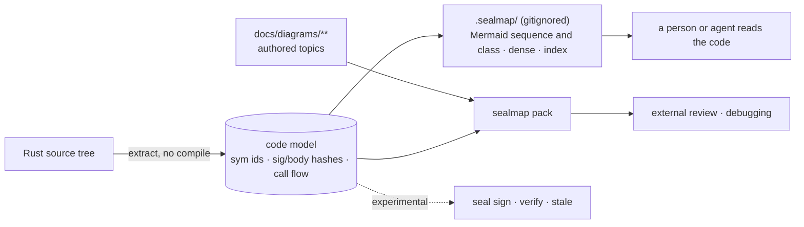

<div align="center">

# sealmap

### A deterministic code lens for Rust: extraction, generated views, `dense` and `pack`

[](#licence)
[](Cargo.toml)
[](docs/DESIGN.md)

*Views generated from the source, byte for byte the same on every run.*

</div>

---

## What is sealmap?

sealmap reads Rust source without compiling it and builds a language-neutral
model: symbols, relations, and the ordered call flow of every function. From
that model it generates views that a person or an agent can read in place of
the code. The libraries run no model and make no network calls, and the same
tree always gives the same bytes. Anything it cannot resolve exactly is
tagged `inferred` or `external` rather than guessed, so a view says how far
it can be trusted.

What it is good for, on the evidence ([below](#what-the-evidence-says)):

- **Generated views that find bugs.** Mermaid sequence and class diagrams and
  the dense projection draw what the code does, not what its docs say.
  Reading them caught regressions, resolver bugs and a projection bug in
  sealmap's own code that its tests had missed.
- **`dense`, a compact agent projection:** Rust-like skeletons with line
  spans and indented call trees, at 0.17–0.29× the source.
- **`pack`, a deterministic, budgeted review pack:** chosen topics, dense
  slices of the code they cite, and bounded source windows. It is
  byte-identical on every run, and over budget it refuses rather than cuts.
- **Stable symbol ids and content hashes.** `sym:` ids hold no path or line,
  so moving code keeps them; signature and body hashes ignore formatting.

**Seals and staleness are experimental, not recommended for corpus upkeep.**
`seal sign`, `verify`, `seal-check`, `stale` and `resolve` exist and behave as
documented. But every staleness rule finer than per-file that we measured
missed real changes, in exchange for at most about 2× fewer flags. The
upkeep that works is per-file flags, batched weekly and triaged by a model
(EH).

**What stays with the LLM skill:** the narratives, the register of tensions
and debt, and every judgement about whether a diagram is still true.

## Size, measured

All figures come from the estate's own corpora (2026-10-05).

| Observation | Number |
|---|---|
| A hand-consolidated topic corpus is compact | **0.21–0.22×** source bytes, flat while the source grew 67 % |
| …but file-granular staleness makes it expensive to keep true | a median code commit flags **10 of 45** topics, and p90 flags **40 of 45**. One 4,399-line hub file is cited by 39 topics |
| A one-file-per-source Mermaid corpus is *not* a compression | **1.07×** source tokens |
| A dense agent projection is | **0.17–0.29×** source (0.32–0.46× with its index), 13–18 tokens per call edge against 34–53 for Mermaid, on sealmap, tokio and VisionClaw ([`sealmap-dense`](crates/sealmap-dense)) |
| Diagrams alone carry real review signal | a blind, diagrams-only critical review rediscovered 7 of 30 known tensions with no register visible (pilot, n = 1) |

## What the evidence says

Each experiment was pre-registered, run as registered and published as
found, failures included. The records are under [`docs/evidence/`](docs/evidence).

**What held.**

- **The extraction and its views find real defects.** Reading sealmap's
  Mermaid and `dense` views of its own code caught 2 regressions, 5 resolver
  bugs and 1 projection bug that the tests had missed, and removed 138 wrong
  call edges ([consult record](docs/evidence/consult/2026-10-06-codex.md)).
  The ER review found the six defects fixed in 0.2.1 ([`CHANGELOG.md`](CHANGELOG.md)).
- **`dense` is small:** 0.17–0.29× source on sealmap, tokio and VisionClaw.
- **`pack` is deterministic and budgeted:** one request gives one byte
  sequence whatever the topic order, and an over-budget request is refused.

**What did not.**

- **Finer staleness loses real changes.** On 60 blind-labelled (topic,
  commit) pairs, 29 of them stale, per-file flags caught all 29. Per-symbol
  body hashes (the seal rule) caught 0.76 of them, per-region 0.66, call flow
  0.45 and changed-line overlap 0.38. In exchange they flagged 1.19×, 1.20×,
  1.53× and 1.96× fewer topics on VisionClaw. Seals do not cut upkeep.
- **Upkeep that works:** per-file flags batched weekly, with a model
  triaging each flag. Over the E0 window that projects to about 118 expensive
  re-authors, against 1,943 per-commit re-checks (−94%) and 229 weekly ones
  (−48%); batching does most of the work. Sonnet 5.5 was the only triage
  model with recall ≥ 0.90 (0.93), on labels that Sonnet itself produced.
- **Sequence-only corpora: no.** Dropping every other diagram kind cost more
  review recall than dropping the same bytes at random (EK). A sequence-first
  rewrite invented facts in 10 of 20 topics, and in 7 of 20 behind a
  cross-family fidelity gate (ES, ES2).
- **The corpus pack did not beat source for review when the source fits.**
  Full source gave as many or more confirmed findings under each of three
  reviewers (ER, ER-glm). sealmap is small, so this says nothing about a
  repository too large for one context.

| Experiment | Question | Outcome |
|---|---|---|
| [E0](docs/evidence/E0/RESULTS.md) | Per-symbol staleness: ≥ 2× fewer topics flagged than per-file? | No: 1.19× |
| [E0b](docs/evidence/E0b/RESULTS.md) | Per-region (innermost arm, branch or statement)? | No: 1.20×, 1.37× on Rust alone |
| [E0c](docs/evidence/E0c/RESULTS.md), [endpoint 4](docs/evidence/E0c/ENDPOINT4.md) | Flag only on a call-flow change? | No: 1.53×, and 44% of the pairs it skipped were real changes |
| [E0d](docs/evidence/E0d/RESULTS.md), [endpoint 4](docs/evidence/E0d/ENDPOINT4.md) | Changed-line overlap; every rule read with its recall | No: recall 0.38; only per-file reaches 1.0 |
| [EH](docs/evidence/EH/RESULTS.md) | Batching plus cheap model triage? | Yes: weekly batches, Sonnet 5.5 triage |
| [EK](docs/evidence/EK/RESULTS.md) | Is a sequence-only corpus as good for review? | No: worse than random removal |
| [ES](docs/evidence/ES/RESULTS.md) | A sequence-first rewrite by GLM-5.3-Flash? | No: invented facts in 10 of 20 topics |
| [ES2](docs/evidence/ES2/RESULTS.md) | The same behind a different-family fidelity gate? | No: invented facts in 7 of 20 topics |
| [ER](docs/evidence/ER/RESULTS.md) | Corpus pack against full source, for review? | No: source as good or better |
| [ER-glm](docs/evidence/ER-glm/RESULTS.md) | ER with a third reviewer (exploratory) | Agrees with ER |
| [consult](docs/evidence/consult/2026-10-06-codex.md) | An outside challenge to the programme | Keep the inspectable views; test upkeep in shadow |

## How it works



| Layer | Artefact | Committed | Written by |
|---|---|---|---|
| **Authored** | consolidated topics, narratives, register | yes | the LLM skill |
| **Generated** | model, index, dense projection, 1:1 Mermaid | **never** | `sealmap generate` and `sealmap dense`, rebuilt in seconds |
| **Sealed** (experimental) | `seals.lock`, plus a `sealed:` pointer per topic | only if you seal | `sealmap seal sign` |

### Seals (experimental)

A seal records that a topic was reviewed against exact versions of the
symbols it cites (`sym:` ids in inline code spans). `sealmap verify` then
classifies each sealed symbol. It works as specified, but a symbol whose body
hash holds can still have changed in a way that makes the topic wrong: the
seal rule caught 0.76 of real staleness in E0d. Treat `holds` as "no cited
body changed", never as "the topic is still true". The lock is canonical
TOML that `verify` byte-checks; reviewer and model are opaque strings.

| Condition | Class | CI |
|---|---|---|
| id resolves, both hashes match (code moves included) | `holds` | pass |
| signature same, body changed | `behaviour` | fail |
| signature changed | `contract` | fail |
| id gone; candidates of the same kind with the sealed body are listed | `absent` (rename suspected) | fail |
| a file that may hold the id no longer parses | `unparsable` | fail (fail closed) |
| a `sym:` id cited but not sealed, or not a canonical id | `unsealed-citation` | fail |
| a lock entry whose topic file is gone, or a sealed symbol no longer cited | `orphan` | fail |
| topic prose edited since sealing | `prose-edited` | fail |
| `sealed:` pointer and lock disagree, or the lock is not canonical | `lock-fault` | fail |

```console
$ sealmap seal sign LED-01 --reviewer zai:glm-5.3 --model claude:sonnet
sealmap: sealed LED-01 (ledger/01-accounts.md) with 1 symbol(s) into ./docs/diagrams/seals.lock
$ sealmap verify
behaviour         LED-01   sym:cargo ledger . accounts/LedgerAccount#deposit(). body blake3-16:… -> blake3-16:… (src/accounts.rs:4-6)
```

## Ids and hashes

### `sym:` ids

Every symbol gets a kind-explicit id in SCIP descriptor style, with no file
path and a `.` version meaning "the tree being analysed":

```text
sym:cargo shop . db/Db#insert().          method insert of struct Db in module shop::db
sym:cargo shop . db/Db#[Store]put().      put from `impl Store for Db`
sym:cargo shop . db/                      the module itself
sym:extern serde_json::to_string          a dependency path whose kinds are unknown
sym:? insert                              a method on a receiver of unknown type
```

The suffix gives the kind: `/` module, `#` type or trait, `().` function or
method, `.` const or static, `!` macro. Methods sit under the type that owns
them, so splitting an `impl` or moving it to another file keeps every id.
A crate name held by more than one directory is qualified with the package
directory (`sym:cargo a/core . run().`), so two same-named crates never merge.
Printing is injective and parsing accepts only canonical text (property
tested). The grammar is documented in `sealmap_model::sym`.

### Signature and body hashes

Every symbol carries `sig_hash` (its contract) and `body_hash` (its
implementation): 16-byte BLAKE3 values over a language-neutral token stream,
algorithm id `sm1`, with golden values pinned in CI.

| Change | `sig_hash` | `body_hash` | id |
|---|---|---|---|
| reformat, rustfmt rewrites (trailing commas, braces round a closure or match-arm body, `use` order) | same | same | same |
| comments, doc comments, `#[allow]` and other lint attributes | same | same | same |
| move within a file or to another file | same | same | same |
| edit the body | same | **changes** | same |
| change name, visibility, generics, parameters, return type or a non-lint attribute | **changes** | same | same (except the name) |
| rename | **changes** | same, so a rename can be matched | **changes** |

Reflowing tokio, VisionClaw and sealmap with rustfmt at `max_width = 50`
changes no id and no hash.

### Schema v2

`_model.json` and `_index.json` carry `schema_version: 2`. Every symbol has
its `sym:` id, span, `sig_hash` and `body_hash`; index fragments repeat their
symbol's hashes. `Codebase::from_json` refuses any other version. Version 1
(sealmap 0.1) has no reader. Output stays byte-deterministic.

### Mermaid ids

Diagram ids are derived from `sym:` ids by an injective encoding that is
readable where names are plain (`shop__db___tDb___finsert`). Two symbols
never share a node, by construction rather than by a collision check. The
corpus generator still asserts uniqueness across the codebase as a guard.

### Resolution honesty

A method call on a std or dependency value is never drawn as a call to an
internal method that happens to share its name. For example, `Path::parent`
on a value taken from an `Option<&Path>` is no longer bound to an internal
`parent`. Parts taken apart by `if let`, `match` or `for` inherit what is
known about their origin. Those bindings end with their block, so they never
retype a shadowed name after it.

## Where sealmap sits in the estate

sealmap is a component of
**[VisionFlow](https://github.com/DreamLab-AI/VisionFlow)**. It is consumed by
the [agentbox](https://github.com/DreamLab-AI/agentbox) skill harness, much as
the Ontology Loom is: a deterministic scaffold that makes a model's judgement
cheap and checkable.

| Sibling | Relationship |
|:--------|:-------------|
| [agentbox](https://github.com/DreamLab-AI/agentbox) `diagrams-as-code` skill | Writes the authored corpus, citing `path:line`. `sealmap generate`, `dense` and `resolve` help it find what to cite |
| agentbox `sealmap-review` skill (shipped) | Diagrams-only external review (Gemini 3.8 Flash, critical and pre-mortem lenses) and an inline check against the cited code. It can swap its own packer for `sealmap pack` |
| agentbox `build-with-quality` skill | Takes review findings as hypotheses to test. Corpus upkeep is per-file flags batched weekly with model triage (EH), not `sealmap stale` |
| agentbox `sealmap` skill | **Not planned:** it was to run the seal workflow, which is frozen |
| [diagram-ir](https://github.com/DreamLab-AI/diagram-ir) | The inverse direction: reads hand-written Mermaid back into an IR. The skill pairs it with `sealmap resolve` to catch invented edges |
| [VisionFlow](https://github.com/DreamLab-AI/VisionFlow) | Ecosystem canon, and the largest Rust corpus sealmap is tested on |

## Crates

**Today (0.2.1 on crates.io: extraction, ids and hashes, `sealmap-dense`, `pack`, and the experimental seal surface; renamed from `codemaid-*`):**

| Crate | Role | Deps |
|---|---|---|
| [`sealmap`](crates/sealmap) | facade and CLI | all below, clap |
| [`sealmap-model`](crates/sealmap-model) | language-neutral model: `Codebase`, `Symbol`, `Relation`, `Flow`; the `sym:` id grammar; per-symbol `sig_hash` / `body_hash`; schema v2 | serde, blake3, ignore |
| [`sealmap-mermaid`](crates/sealmap-mermaid) | typed, escaping Mermaid writers: sequence, class, ER, flowchart; injective diagram ids from `sym:` ids (feature `model`) | sealmap-model (opt.; **none** without it) |
| [`sealmap-extract`](crates/sealmap-extract) | logic shared by every language adapter (replaces `sealmap-frontend`, now a deprecated forwarding shim): raw flow IR, flow lowering, call aggregation, confidence policy, label rules, `sym:` id builder, token-stream fingerprints, panic-isolated collection | sealmap-model, blake3, rayon (opt.) |
| [`sealmap-rust`](crates/sealmap-rust) | Rust language adapter (syn), workspace-wide resolution | sealmap-extract, syn, toml |
| [`sealmap-corpus`](crates/sealmap-corpus) | projections and index; the `pack` module: review packs and change selection; the experimental `seal` module: lock format, `topic_hash`, `verify`, `seal_check`, `stale`, `resolve`, `sign` | sealmap-dense, serde_json, toml, blake3 |
| [`sealmap-dense`](crates/sealmap-dense) | the agent projection: Rust-like skeletons with `L<start>-<end>` spans, indented call trees (each callable expanded once; `^` / `↺` / `…` marks; `~` inferred, `?` external), a short-name `_index.txt`, and byte-budgeted slices that refuse rather than truncate | sealmap-model |

**Dropped:**

| Crate | Role |
|---|---|
| `sealmap-ts` | **dropped:** TypeScript/TSX language adapter on oxc. It was to be built only if finer staleness proved its worth, and it did not (E0–E0d) |

Each crate is published on crates.io under `MIT OR Apache-2.0`, with full
rustdoc. Depend on the facade for the common path. A project that only needs
safe Mermaid output can depend on `sealmap-mermaid` alone.

## Quickstart

```sh
cargo install --path crates/sealmap

sealmap generate .                   # write the 1:1 corpus, model and index to .sealmap/ (gitignored)
sealmap generate . --check           # exit 1 if .sealmap/ differs from a fresh generation
sealmap model    .  > model.json     # just the model

# Several repositories as one codebase (cross-repo calls resolve):
sealmap generate --repo api=../api --repo core=../core -o .sealmap

# Experimental, not for corpus upkeep: seals over docs/diagrams/ (lock: docs/diagrams/seals.lock; -C ROOT, --diagrams DIR, --json)
sealmap resolve 'sym:cargo my_crate . net/Client#connect().'   # span + hashes, or absent + rename candidates
sealmap seal sign CP-03 --reviewer zai:glm-5.3 --model claude:sonnet   # seal a topic from the current code
sealmap verify                                               # the CI gate: exit 1 unless everything holds
sealmap seal-check CP-03 CP-07                               # classify chosen lock entries
sealmap stale --since main                                   # sealed symbols changed since a revision; misses real changes (E0d)

# The dense agent projection: dense.txt + _index.txt into .sealmap/dense
sealmap dense . --stats

# Review packs: topics + dense slices of the code they cite + source windows
sealmap pack CP-03 CP-07 --budget 200000 > pack.txt          # refused (exit 1, sizes named) if over budget
sealmap pack --diff main --budget 200000 --shard -o packs/   # topics whose cited symbols changed (symbol-level: misses some), split by topic
```

Exit codes: 0 success; 1 a check failed, an id is not found, or a seal was
refused; 2 usage or IO error. Seals depend on the extraction options that
shape ids (`--name`, `--tests`, `--repo`): check with the options you
signed with.

A pack is plain text: a header recording what shaped it (generator,
revision, topics, budget, depth, source window), then per topic its text
verbatim, the dense slice of its cited symbols, the citations that do not
resolve, and a window of each cited symbol's source labelled
`path:Lstart-end`. Every block line gives its payload's length in bytes:

```text
==== topic CP-03 4120 bytes control-plane/03-the-scr-executor.md
==== dense CP-03 depth 1 2210 bytes
==== source CP-03 src/scr/executor.rs:L40-79 of L40-112 1630 bytes sym:cargo cp . scr/executor/execute().
==== end CP-03
```

Topics still citing `path:line` rather than `sym:` ids pack as text only.
A diagrams-only `--review` mode is designed but not built
([`docs/DESIGN.md`](docs/DESIGN.md) §4).

## Properties

- **Deterministic.** The same sources give byte-identical output on every
  machine, CI compares two fresh generations byte for byte, and the lock has
  one canonical form, so signing topics in any order writes the same bytes.
- **Honest.** Every call and relation is tagged `exact`, `inferred` or
  `external`. Nothing is guessed silently, and an unparsable file fails a seal
  rather than passing it.
- **Valid.** Every diagram is built through typed, escaping writers. All 4,680
  diagrams generated from tokio, axum, ripgrep, oxdraw and this repository parse
  in Mermaid 12 ([`tools/validate-mermaid.mjs`](tools/validate-mermaid.mjs)),
  as do the 6,142 diagrams of a VisionClaw corpus with step-2 ids.
- **Bounded.** `pack` refuses an over-budget request, naming the size of
  each topic, rather than truncating it; `--shard` splits it into numbered
  packs of whole topics instead.
- **Fast:**

  | Codebase | Release build | Notes |
  |---|---|---|
  | VisionClaw (934 files) | **1.13 s** | with ids and hashes; v0.1 overflowed its stack after 48 s |
  | tokio 1.53.2 | 0.25 s | with ids and hashes |
- **Checked on the MSRV.** CI builds and tests on Rust 1.85, the declared
  `rust-version`, as well as on stable.

## What it does not do

- **It never compiles or type-checks.** Calls that need type inference are
  resolved by name and receiver heuristics and tagged `inferred`, never
  against a std or dependency receiver.
  Macro-generated items are not sealed.
- **It never writes the diagrams people read.** Consolidation, narrative and
  judgement are the LLM skill's job.
- **It runs no model, makes no network calls, and spawns no processes** in the
  libraries. The CLI only shells out to `git` (and `tar`) for `stale --since`
  and `pack --diff`, and to `git` for a pack's revision line.
- **It does not tell you a diagram is still true.** No staleness rule we
  measured below per-file kept recall; that judgement stays with a reviewer.
- **It knows nothing about reviewers.** The lock holds opaque strings, and
  reviewer policy (cross-family review, evidence) lives in the skill layer.

## Status and roadmap

**0.2.1** is released. The Rust language adapter has been run on sealmap
itself, VisionClaw, tokio, axum, ripgrep and oxdraw; changes are listed in
[`CHANGELOG.md`](CHANGELOG.md). 0.2.1 fixes the defects found by the ER
review experiment: `generate` never writes through a symbolic link; `if let`
and `while let` bindings no longer leak past their block; `#[cfg]` twins keep
every definition's calls; impls on tuples, slices and other non-path types
keep their methods; `--no-model` removes a model left by an earlier run;
same-named crates stay apart, and clashing `--repo` names are refused.

After the evidence programme (2026-10-06; [`docs/DESIGN.md`](docs/DESIGN.md)
has the full status):

- **Kept:** extraction, `sym:` ids and hashes, the generated Mermaid views,
  `dense`, `pack` and `generate --check`. This is the code lens, and further
  work goes here.
- **Frozen:** the seal surface (`seal sign`, `verify`, `seal-check`, `stale`,
  `resolve`) and every finer-than-per-file staleness rule. The commands stay
  and keep their tests; no new seal or staleness work is planned, and this
  repository does not seal its own corpus.
- **Dropped:** `sealmap-ts`, the TypeScript adapter. It was to be built only
  if finer staleness proved its worth, and it did not (E0–E0d).

## Design and evidence

- [`docs/DESIGN.md`](docs/DESIGN.md): the governing design, with its status
  after the evidence programme at the top. Below that it records the design
  as accepted on 2026-10-05: layers, seal format, crate surface, skills,
  model-per-step tiering, evidence plan and owner decisions.
- [`docs/evidence/`](docs/evidence): pre-registrations, results and raw
  material for every experiment in the table above.
- [`docs/diagrams/`](docs/diagrams): the hand-authored, citation-verified
  diagram corpus of this repository. The v0.1 generated self-corpus
  (`docs/sealmap/`) is retired: `sealmap generate` rebuilds it into the
  gitignored `.sealmap/`.

## Licence

Licensed under either of

- Apache License, Version 2.0 ([`LICENSE-APACHE`](LICENSE-APACHE) or <https://www.apache.org/licenses/LICENSE-2.0>)
- MIT licence ([`LICENSE-MIT`](LICENSE-MIT) or <https://opensource.org/licenses/MIT>)

at your option.

Unless you explicitly state otherwise, any contribution intentionally submitted
for inclusion in the work by you, as defined in the Apache-2.0 licence, shall be
dual licensed as above, without any additional terms or conditions.
