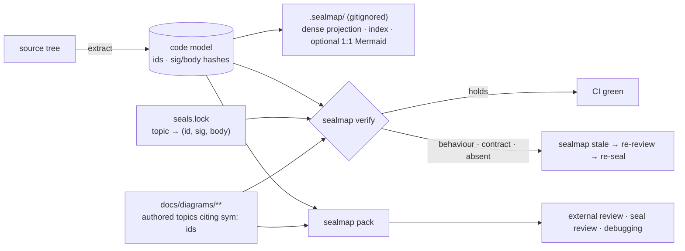

<div align="center">

# sealmap

### Deterministic code maps and sealed diagram contracts for LLM development harnesses

[](#licence)
[](Cargo.toml)
[](docs/DESIGN.md)

*The seal and the distillation do the work, not a bigger model.*

</div>

---

## What is sealmap?

sealmap is the deterministic layer under an LLM diagrams-as-code workflow.

**The workflow it serves.** Code and a dense corpus of Mermaid diagrams are
written in lockstep, one subsystem topic at a time. The whole corpus is then
analysed for a holistic view of the system. In the DreamLab estate this has
proven to be one of the most effective ways to build large codebases with
agents. It has one structural cost: **keeping the diagrams true**.

**What sealmap does.** It reads source without compiling it and builds a
language-neutral model: symbols, relations, and the ordered call flow of every
function. From that model it provides five things:

- **Stable symbol ids**, with no line numbers in them, so moving code never
  breaks a citation.
- **Two content hashes per symbol**, one for the signature and one for the
  body, both insensitive to whitespace and comments.
- **Seals.** A lockfile records that a hand-consolidated diagram topic was
  reviewed against *these exact versions* of the functions it describes.
  `sealmap verify` enforces that in CI, with no LLM involved.
- **Precise staleness.** When code changes, only the topics whose sealed
  symbols actually changed are flagged for another look. Topics that merely
  share a file with the change are left alone.
- **On-demand review packs.** A bounded, byte-identical blob is built from the
  sealed topics, dense slices of the code they cite, and source windows. It
  feeds an external reviewer, a seal review or a debugging session.

**What stays with the LLM skill:** the narratives, the register of tensions
and debt, the choice of what to merge, and the review that produces a seal.
sealmap does the bookkeeping that makes that judgement cheap to keep true.

## Why it exists (measured)

All figures come from the estate's own corpora (2026-10-05).

| Observation | Number |
|---|---|
| A hand-consolidated topic corpus is compact | **0.21–0.22×** source bytes, flat while the source grew 67 % |
| …but file-granular staleness makes it expensive to keep true | a median code commit flags **10 of 45** topics, and p90 flags **40 of 45**. One 4,399-line hub file is cited by 39 topics |
| A one-file-per-source Mermaid corpus is *not* a compression | **1.07×** source tokens |
| A dense agent projection is | **0.45×** source, about 13 tokens per call edge against 42 for Mermaid |
| Diagrams alone carry real review signal | a blind, diagrams-only critical review rediscovered 7 of 30 known tensions with no register visible (pilot, n = 1) |

**The design follows from these numbers:**

- Keep the human corpus consolidated and LLM-written.
- Make its citations symbol-granular and sealed.
- Generate everything mechanical on demand and never commit it.

## How it works



| Layer | Artefact | Committed | Written by |
|---|---|---|---|
| **Authored** | consolidated topics, narratives, register; citations are `sym:` ids | yes | the LLM skill |
| **Sealed** | `seals.lock`, plus a static `sealed:` pointer per topic | yes | the skill's seal step (a reviewed decision) |
| **Generated** | model, index, dense projection, optional 1:1 Mermaid | **never** | `sealmap generate`, rebuilt in seconds |

### What a seal check reports

| Sealed symbol | Class | CI |
|---|---|---|
| id resolves, both hashes match (code moves included) | holds | pass |
| signature same, body changed | behaviour | fail → cheap re-review |
| signature changed | contract | fail → re-consolidate, ADR addendum |
| id gone; another id has the same body | absent (rename suspected) | fail → confirm rename |
| file no longer parses | unparsable | fail (fail closed) |
| topic prose edited since sealing | prose changed | fail |

Code, topic and lock land in **one commit**. No second "re-stamp" commit is
needed.

## Where sealmap sits in the estate

sealmap is a component of
**[VisionFlow](https://github.com/DreamLab-AI/VisionFlow)**. It is consumed by
the [agentbox](https://github.com/DreamLab-AI/agentbox) skill harness, much as
the Ontology Loom is: a deterministic scaffold that makes a model's judgement
cheap and checkable.

| Sibling | Relationship |
|:--------|:-------------|
| [agentbox](https://github.com/DreamLab-AI/agentbox) `diagrams-as-code` skill | Writes the authored corpus. With sealmap, its line-resolution role costs zero tokens and its citations become `sym:` ids |
| agentbox `sealmap-review` skill (shipped) | Diagrams-only external review (Gemini 3.8 Flash, critical and pre-mortem lenses) and an inline check against the cited code. It will consume `sealmap pack --review` |
| agentbox `build-with-quality` skill | Takes review findings as hypotheses to test. Gains a **re-seal** step driven by `sealmap stale` |
| agentbox `sealmap` skill (planned) | The seal workflow, model tiering per step, and the A/B bench |
| [diagram-ir](https://github.com/DreamLab-AI/diagram-ir) | The inverse direction: reads hand-written Mermaid back into an IR. The skill pairs it with `sealmap resolve` to catch invented edges |
| [VisionFlow](https://github.com/DreamLab-AI/VisionFlow) | Ecosystem canon, and the largest Rust corpus sealmap is tested on |

## Crates

**Today (in this tree: 0.1 plus step 2, ids and hashes; renamed from `codemaid-*`):**

| Crate | Role | Deps |
|---|---|---|
| [`sealmap`](crates/sealmap) | facade and CLI | all below, clap |
| [`sealmap-model`](crates/sealmap-model) | language-neutral model: `Codebase`, `Symbol`, `Relation`, `Flow`; the `sym:` id grammar; per-symbol `sig_hash` / `body_hash`; schema v2 | serde, blake3, ignore |
| [`sealmap-mermaid`](crates/sealmap-mermaid) | typed, escaping Mermaid writers: sequence, class, ER, flowchart; injective diagram ids from `sym:` ids (feature `model`) | sealmap-model (opt.; **none** without it) |
| [`sealmap-extract`](crates/sealmap-extract) | logic shared by every language adapter (replaces `sealmap-frontend` 0.1.0): raw flow IR, flow lowering, call aggregation, confidence policy, label rules, `sym:` id builder, token-stream fingerprints, panic-isolated collection | sealmap-model, blake3, rayon (opt.) |
| [`sealmap-rust`](crates/sealmap-rust) | Rust language adapter (syn), workspace-wide resolution | sealmap-extract, syn, toml |
| [`sealmap-corpus`](crates/sealmap-corpus) | projections and index | serde_json |

**Planned for 0.2:**

| Crate | Role |
|---|---|
| `sealmap-ts` | **deferred:** TypeScript/TSX language adapter on oxc, built only if E0-R shows the precise-staleness gain is real |
| `sealmap-dense` | the agent projection: indented call trees and skeletons with line spans |
| `sealmap-corpus` gains | the `seal` lockfile module, `resolve`, `stale`, `seal-check`, `pack`, `verify` |

Each crate will be published on crates.io under `MIT OR Apache-2.0`, with full
rustdoc. Depend on the facade for the common path. A project that only needs
safe Mermaid output can depend on `sealmap-mermaid` alone.

## Quickstart (0.1, today)

```sh
cargo install --path crates/sealmap

sealmap generate .                   # write the 1:1 corpus, model and index to .sealmap/
sealmap verify   .                   # local consistency check against .sealmap/
sealmap model    .  > model.json     # just the model

# Several repositories as one codebase (cross-repo calls resolve):
sealmap generate --repo api=../api --repo core=../core -o .sealmap
```

**Planned 0.2 CLI** (see [`docs/DESIGN.md`](docs/DESIGN.md) §4):

```sh
sealmap resolve 'sym:rust:my_crate/net/Client#connect().'   # current span + hashes
sealmap stale --since main                                 # topics needing a look
sealmap verify                                             # the CI gate
sealmap pack CP-03 CP-07 --max-bytes 1048576               # review blob
sealmap pack --review                                      # diagrams only, for an outside reviewer
```

## Properties

- **Deterministic.** The same sources give byte-identical output on every
  machine, and `pack` is byte-identical for the same tree, lock and arguments.
- **Honest.** Every call and relation is tagged `exact`, `inferred` or
  `external`. Nothing is guessed silently, and an unparsable file fails a seal
  rather than passing it.
- **Valid.** Every diagram is built through typed, escaping writers. All 4,680
  diagrams generated from tokio, axum, ripgrep, oxdraw and this repository parse
  in Mermaid 12 ([`tools/validate-mermaid.mjs`](tools/validate-mermaid.mjs)).
- **Bounded.** `pack` refuses an over-budget request with a shard plan rather
  than truncating it.
- **Fast:**

  | Codebase | Release build | Notes |
  |---|---|---|
  | VisionClaw (934 files) | **1.05 s** | v0.1 overflowed its stack after 48 s |
  | tokio 1.53.2 | 0.25 s | |

## What it does not do

- **It never compiles or type-checks.** Calls that need type inference are
  resolved by name and receiver heuristics and tagged `inferred`.
  Macro-generated items are not sealed.
- **It never writes the diagrams people read.** Consolidation, narrative and
  judgement are the LLM skill's job.
- **It runs no model, makes no network calls, and spawns no processes** in the
  libraries. The CLI only shells out to `git` for `--since`.
- **It knows nothing about reviewers.** The lock holds opaque strings, and
  reviewer policy (cross-family review, evidence) lives in the skill layer.

## Status and roadmap

**v0.1** is working. It is dogfooded on its own source, and the Rust language adapter
has been run on VisionClaw, tokio, axum, ripgrep and oxdraw. The hardening
has landed and fixes four faults found on large real repositories: stack depth,
`.gitignore` handling, exponential glob resolution, and id collisions.

The 0.2 plan, in order (detail in [`docs/DESIGN.md`](docs/DESIGN.md) §10):

1. Rename to `sealmap-*`; dual licence; land the hardening; extract the
   shared core, now `sealmap-extract` (published as `sealmap-frontend` 0.1.0).
2. `sym:` id grammar (SCIP-descriptor style), signature and body hashes,
   injective Mermaid ids.
3. Seal surface (`resolve` / `stale` / `seal-check` / `verify` / `pack`) and
   `sealmap-dense`; first crates.io release.
4. **E0:** replay 100 real commits and count topics flagged per commit, file
   level against sealed, with no LLM involved. This is the first headline
   number.
5. `sealmap-ts`, **deferred**: built only if E0-R on the Rust repositories
   shows the precise-staleness gain is real, with a shared conformance suite
   as the parity gate.
6. The pre-registered review A/B, dogfooded on this repository.

## Design and evidence

- [`docs/DESIGN.md`](docs/DESIGN.md): the governing design. It covers the
  layers, seal format, crate surface, skills, model-per-step tiering, evidence
  plan and owner decisions.
- [`docs/sealmap/`](docs/sealmap): the v0.1 self-corpus. It is retired at
  0.2, when generated output moves to the gitignored `.sealmap/`.

## Licence

Licensed under either of

- Apache License, Version 2.0 ([`LICENSE-APACHE`](LICENSE-APACHE) or <https://www.apache.org/licenses/LICENSE-2.0>)
- MIT licence ([`LICENSE-MIT`](LICENSE-MIT) or <https://opensource.org/licenses/MIT>)

at your option.

Unless you explicitly state otherwise, any contribution intentionally submitted
for inclusion in the work by you, as defined in the Apache-2.0 licence, shall be
dual licensed as above, without any additional terms or conditions.
