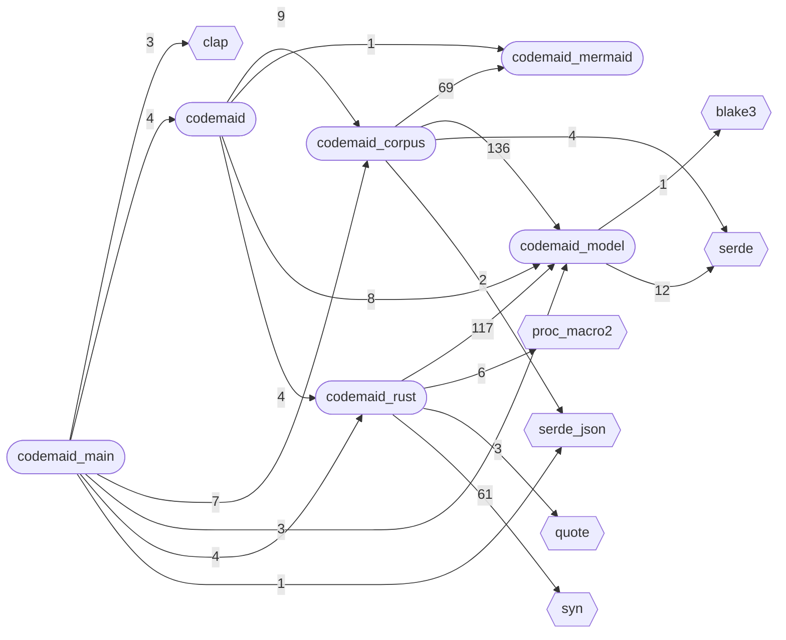
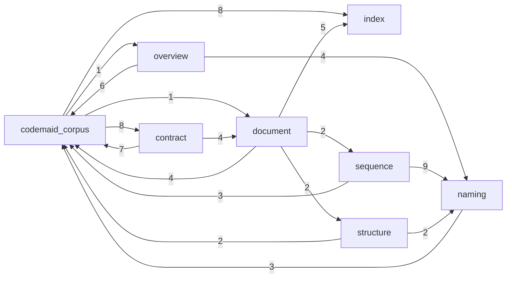
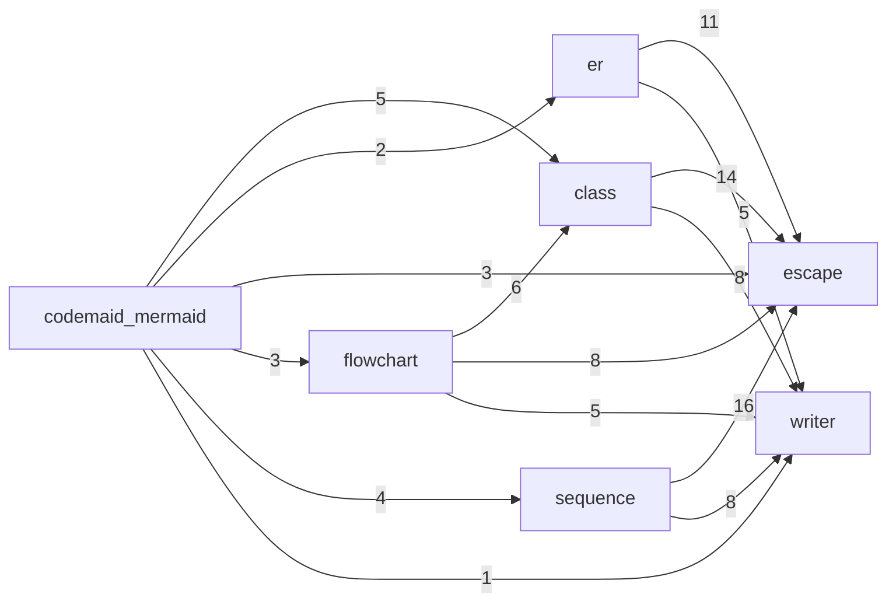
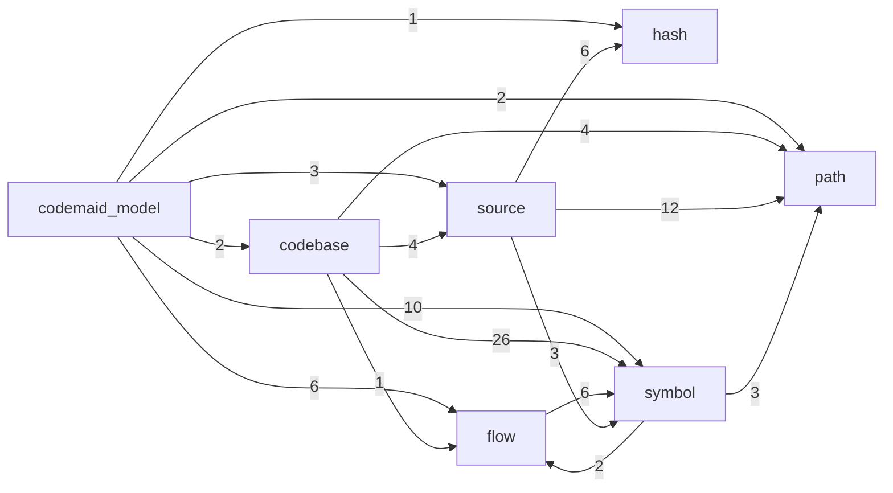
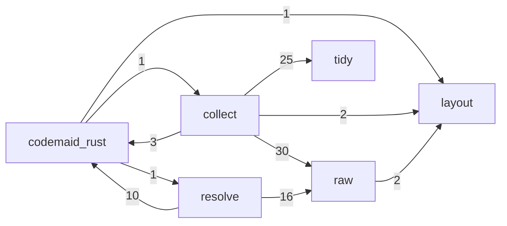
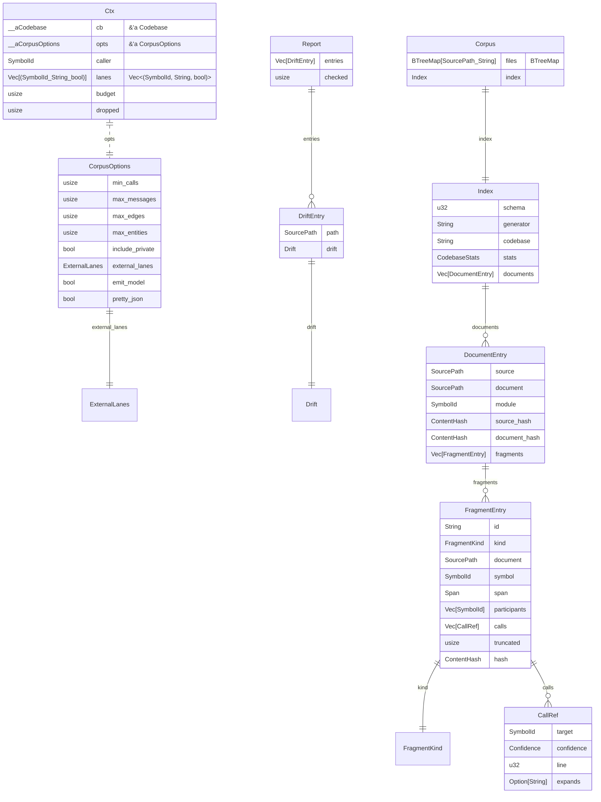
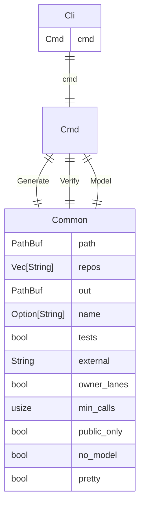
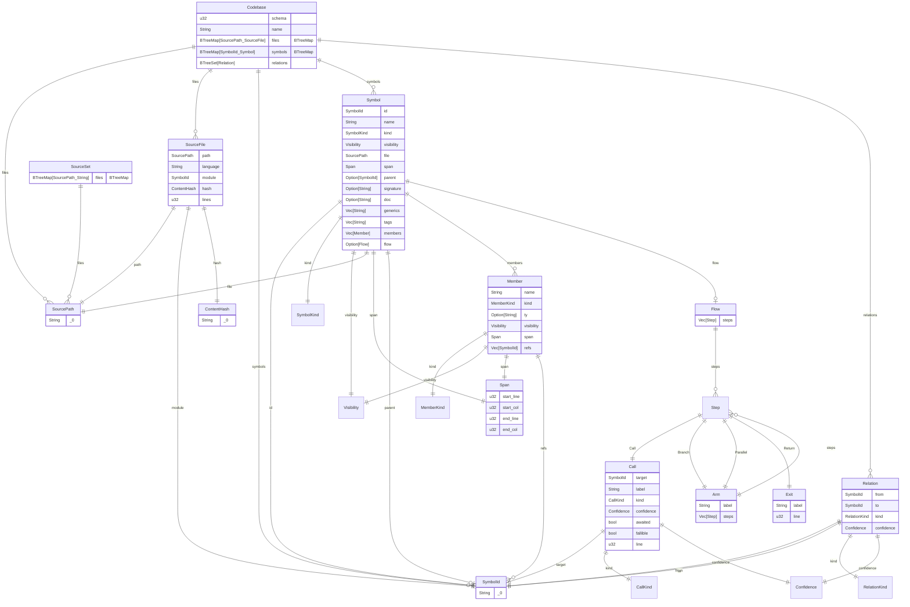
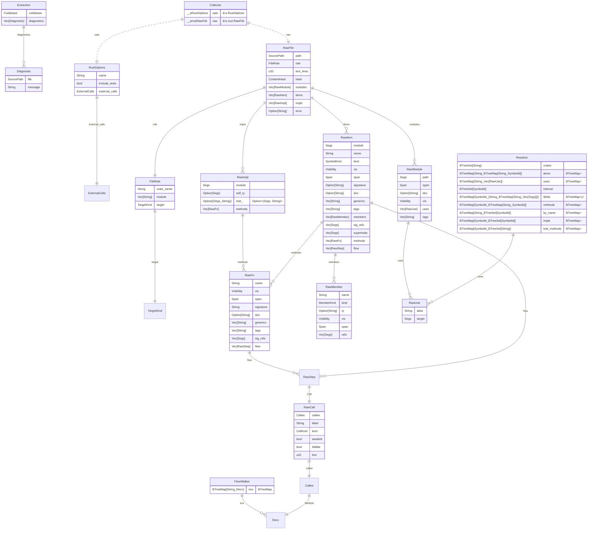

# codemaid overview
30 files · 393 symbols · 1093 relations · 144 flows · 707 calls

## crates

## modules: codemaid_corpus

## modules: codemaid_mermaid

## modules: codemaid_model

## modules: codemaid_rust

## data: codemaid_corpus

## data: codemaid_main

## data: codemaid_mermaid

```mermaid
erDiagram
  codemaid_mermaid__class__Class["Class"] {
    Ident id
    String label
    Option[String] annotation
    Vec[String] members
  }
  codemaid_mermaid__class__ClassDiagram["ClassDiagram"] {
    Option[Direction] direction_
    Vec[Class] classes
    Vec[ClassRelation] relations
  }
  codemaid_mermaid__class__ClassRelation["ClassRelation"] {
    Ident from
    Ident to
    ClassRelationKind kind
    Option[String] label
  }
  codemaid_mermaid__class__ClassRelationKind["ClassRelationKind"]
  codemaid_mermaid__class__Direction["Direction"]
  codemaid_mermaid__er__Attr["Attr"] {
    String ty
    String name
    Option[__staticstr] key "Option<&'static str>"
    Option[String] comment
  }
  codemaid_mermaid__er__Cardinality["Cardinality"]
  codemaid_mermaid__er__Entity["Entity"] {
    Ident id
    String label
    Vec[Attr] attrs
  }
  codemaid_mermaid__er__ErDiagram["ErDiagram"] {
    Vec[Entity] entities
    Vec[Rel] rels
  }
  codemaid_mermaid__er__Rel["Rel"] {
    Ident from
    Cardinality from_card
    Ident to
    Cardinality to_card
    bool identifying
    String label
  }
  codemaid_mermaid__escape__Ident["Ident"] {
    String _0
  }
  codemaid_mermaid__flowchart__EdgeStyle["EdgeStyle"]
  codemaid_mermaid__flowchart__Flowchart["Flowchart"] {
    Direction direction_
    Vec[Stmt] body
  }
  codemaid_mermaid__flowchart__NodeShape["NodeShape"]
  codemaid_mermaid__flowchart__Stmt["Stmt"]
  codemaid_mermaid__sequence__Arrow["Arrow"]
  codemaid_mermaid__sequence__BlockKind["BlockKind"]
  codemaid_mermaid__sequence__Item["Item"]
  codemaid_mermaid__sequence__SeqBuilder["SeqBuilder"] {
    Vec[Item] items
  }
  codemaid_mermaid__sequence__SequenceDiagram["SequenceDiagram"] {
    Option[String] title
    bool autonumber_
    Vec[(Ident_String_bool)] participants "Vec<(Ident, String, bool)>"
    SeqBuilder body
  }
  codemaid_mermaid__class__Class ||--|| codemaid_mermaid__escape__Ident : "id"
  codemaid_mermaid__class__ClassDiagram ||--o| codemaid_mermaid__class__Direction : "direction"
  codemaid_mermaid__class__ClassDiagram ||--o{ codemaid_mermaid__class__Class : "classes"
  codemaid_mermaid__class__ClassDiagram ||--o{ codemaid_mermaid__class__ClassRelation : "relations"
  codemaid_mermaid__class__ClassRelation ||--|| codemaid_mermaid__escape__Ident : "from"
  codemaid_mermaid__class__ClassRelation ||--|| codemaid_mermaid__escape__Ident : "to"
  codemaid_mermaid__class__ClassRelation ||--|| codemaid_mermaid__class__ClassRelationKind : "kind"
  codemaid_mermaid__er__Entity ||--|| codemaid_mermaid__escape__Ident : "id"
  codemaid_mermaid__er__Entity ||--o{ codemaid_mermaid__er__Attr : "attrs"
  codemaid_mermaid__er__ErDiagram ||--o{ codemaid_mermaid__er__Entity : "entities"
  codemaid_mermaid__er__ErDiagram ||--o{ codemaid_mermaid__er__Rel : "rels"
  codemaid_mermaid__er__Rel ||--|| codemaid_mermaid__escape__Ident : "from"
  codemaid_mermaid__er__Rel ||--|| codemaid_mermaid__er__Cardinality : "from_card"
  codemaid_mermaid__er__Rel ||--|| codemaid_mermaid__escape__Ident : "to"
  codemaid_mermaid__er__Rel ||--|| codemaid_mermaid__er__Cardinality : "to_card"
  codemaid_mermaid__flowchart__Flowchart ||--|| codemaid_mermaid__class__Direction : "direction"
  codemaid_mermaid__flowchart__Flowchart ||--o{ codemaid_mermaid__flowchart__Stmt : "body"
  codemaid_mermaid__flowchart__Stmt ||--|| codemaid_mermaid__escape__Ident : "Node"
  codemaid_mermaid__flowchart__Stmt ||--|| codemaid_mermaid__flowchart__NodeShape : "Node"
  codemaid_mermaid__flowchart__Stmt ||--|| codemaid_mermaid__escape__Ident : "Edge"
  codemaid_mermaid__flowchart__Stmt ||--|| codemaid_mermaid__flowchart__EdgeStyle : "Edge"
  codemaid_mermaid__flowchart__Stmt ||--|| codemaid_mermaid__escape__Ident : "Subgraph"
  codemaid_mermaid__flowchart__Stmt ||--|| codemaid_mermaid__class__Direction : "Subgraph"
  codemaid_mermaid__sequence__Item ||--|| codemaid_mermaid__escape__Ident : "Message"
  codemaid_mermaid__sequence__Item ||--|| codemaid_mermaid__sequence__Arrow : "Message"
  codemaid_mermaid__sequence__Item ||--|| codemaid_mermaid__escape__Ident : "Note"
  codemaid_mermaid__sequence__Item ||--|| codemaid_mermaid__sequence__BlockKind : "Block"
  codemaid_mermaid__sequence__SeqBuilder ||--o{ codemaid_mermaid__sequence__Item : "items"
  codemaid_mermaid__sequence__SequenceDiagram ||--o{ codemaid_mermaid__escape__Ident : "participants"
  codemaid_mermaid__sequence__SequenceDiagram ||--|| codemaid_mermaid__sequence__SeqBuilder : "body"
```

## data: codemaid_model

## data: codemaid_rust

