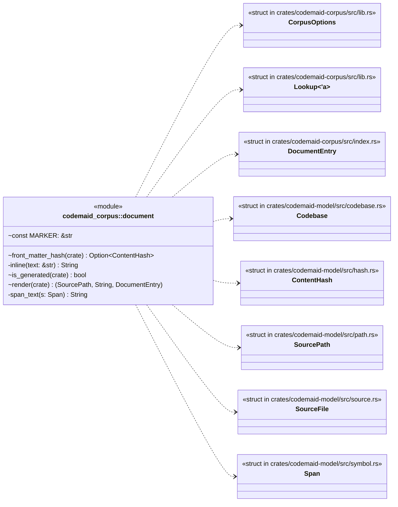
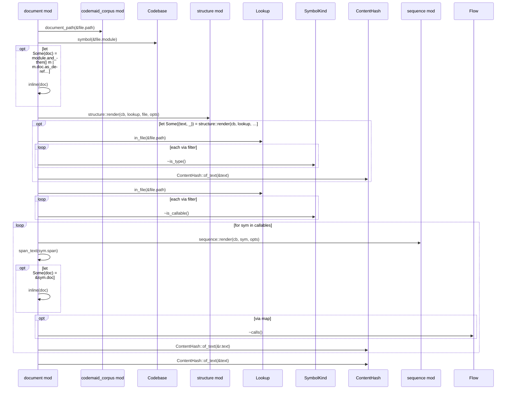
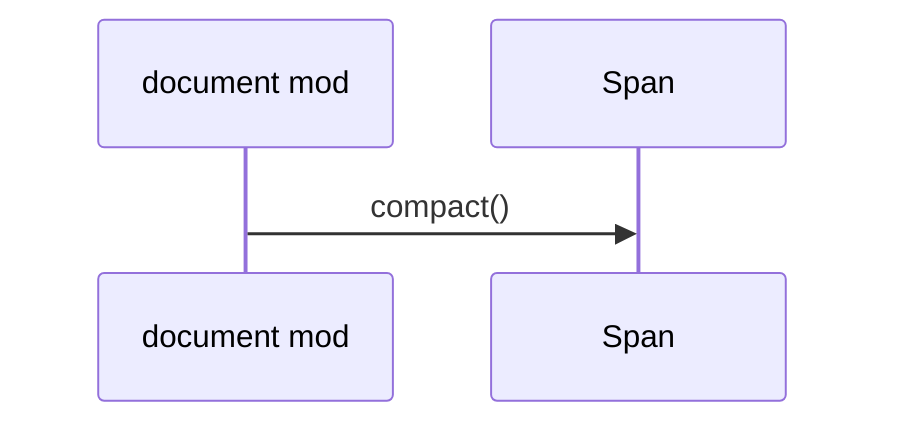

# `codemaid_corpus::document` · crates/codemaid-corpus/src/document.rs
> One Markdown document per source file.

## structure

## `codemaid_corpus::document::render`
`pub(crate) fn render(cb: &Codebase, lookup: &Lookup<'_>, file: &SourceFile, opts: &CorpusOptions,) -> (SourcePath, String, DocumentEntry)` · L14-L118

## `codemaid_corpus::document::span_text`
`fn span_text(s: Span) -> String` · L125-L127

