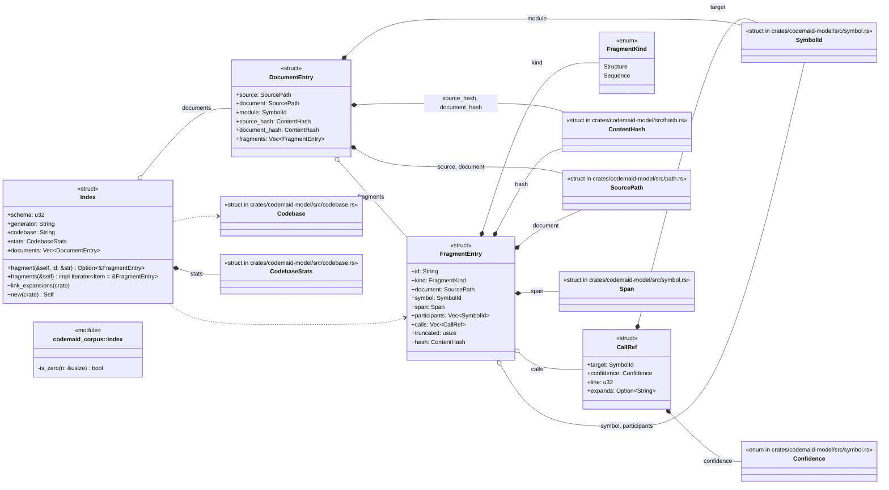
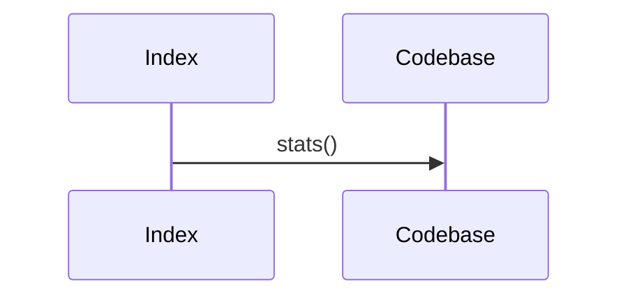
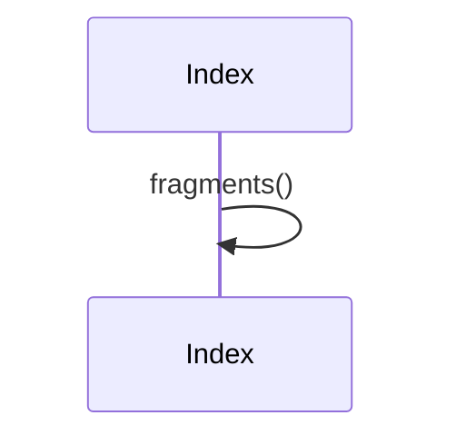

# `codemaid_corpus::index` · crates/codemaid-corpus/src/index.rs
> `_index.json`: the merge map for orchestrating agents.

## structure

## `codemaid_corpus::index::Index::new`
`pub(crate) fn new(cb: &Codebase) -> Self` · L97-L105

## `codemaid_corpus::index::Index::link_expansions`
`pub(crate) fn link_expansions(&mut self)` · L107-L120
> Fill in [`CallRef::expands`] once all fragments are known.

## `codemaid_corpus::index::Index::fragment`
`pub fn fragment(&self, id: &str) -> Option<&FragmentEntry>` · L127-L130
> Look up a fragment by id.

