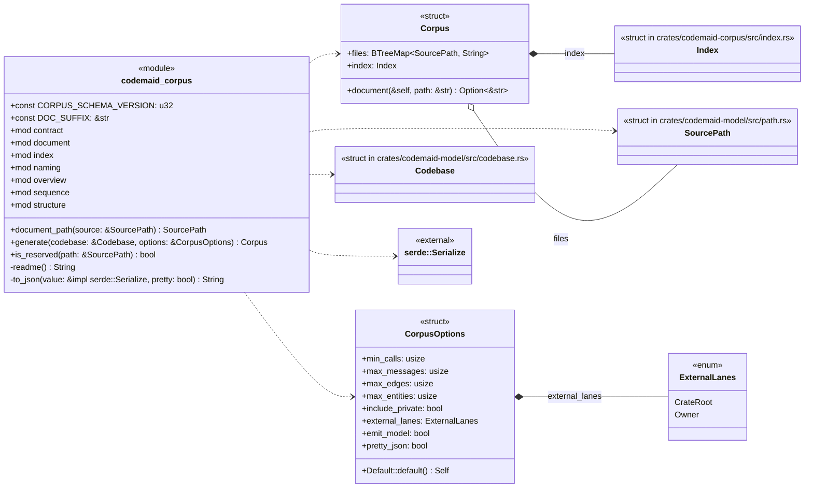
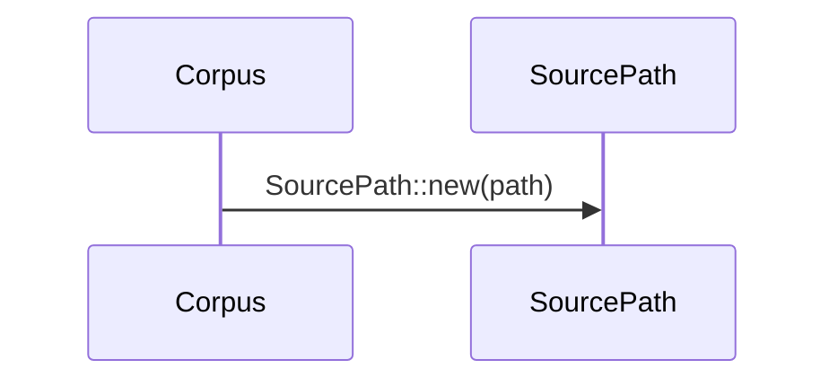
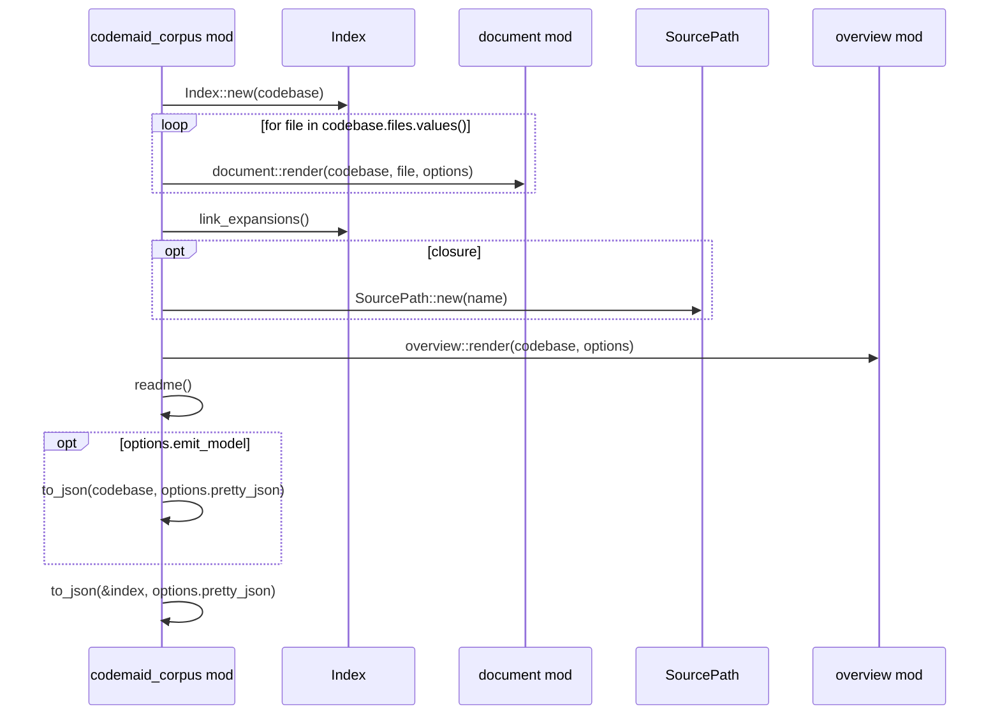
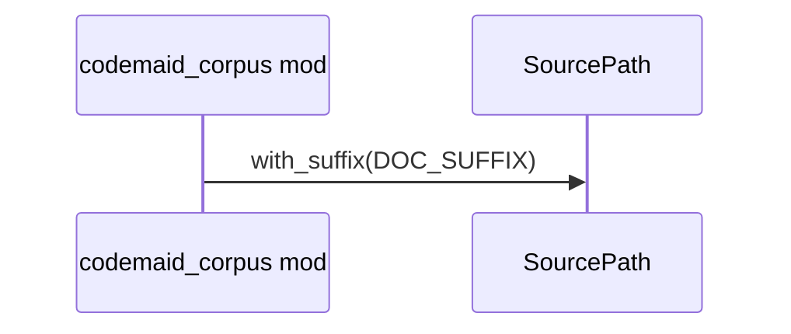
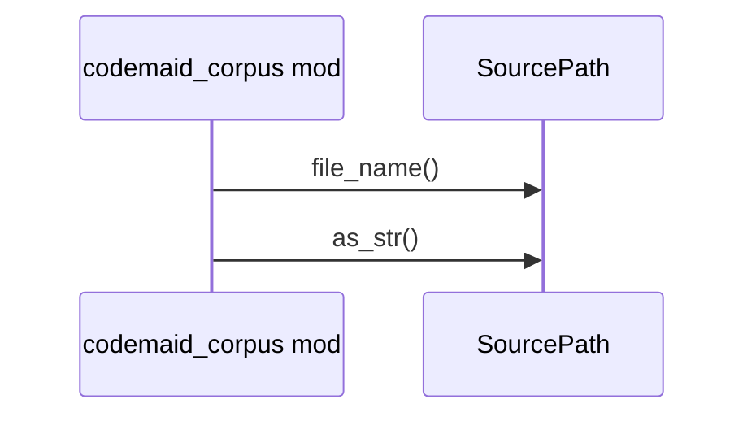
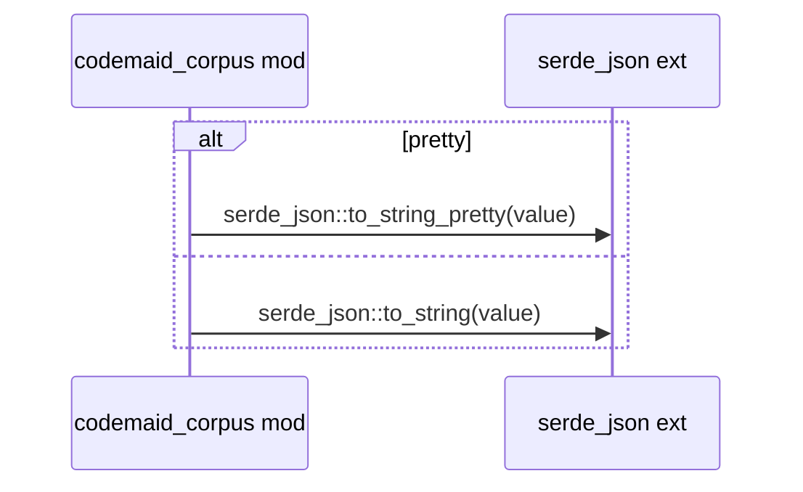

# `codemaid_corpus` · crates/codemaid-corpus/src/lib.rs
> Projects a [`Codebase`] into a **contract-enforced, 1:1 corpus** of dense Mermaid diagrams plus machine-readable metadata, designed to be read by LLM agents an…

## structure

## `codemaid_corpus::Corpus::document`
`pub fn document(&self, path: &str) -> Option<&str>` · L166-L169
> Contents of a generated file by relative path.

## `codemaid_corpus::generate`
`pub fn generate(codebase: &Codebase, options: &CorpusOptions) -> Corpus` · L172-L191
> Generate the full corpus in memory.

## `codemaid_corpus::document_path`
`pub fn document_path(source: &SourcePath) -> SourcePath` · L193-L196
> Map a source path to its document path (`src/a.rs` → `src/a.rs.md`).

## `codemaid_corpus::is_reserved`
`pub fn is_reserved(path: &SourcePath) -> bool` · L198-L201
> `true` for corpus-level files (`_index.json`, ...).

## `codemaid_corpus::to_json`
`fn to_json(value: &impl serde::Serialize, pretty: bool) -> String` · L203-L208

