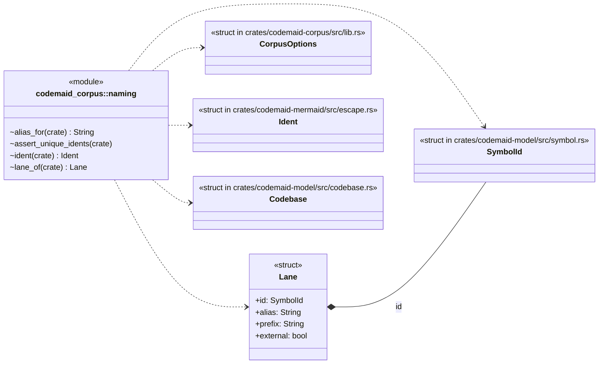
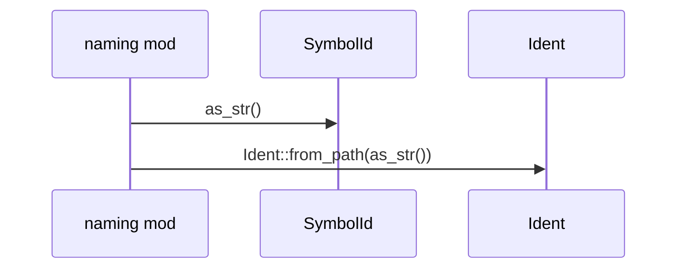
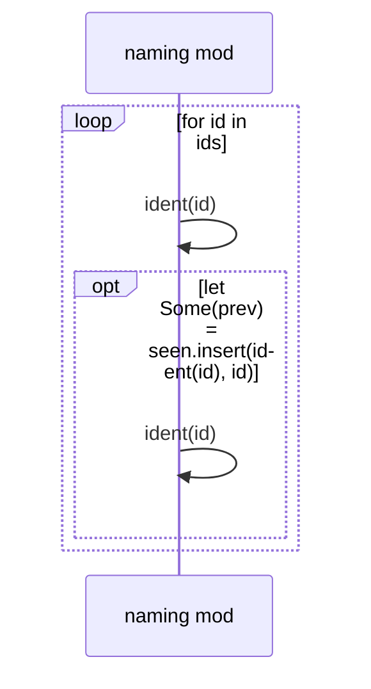
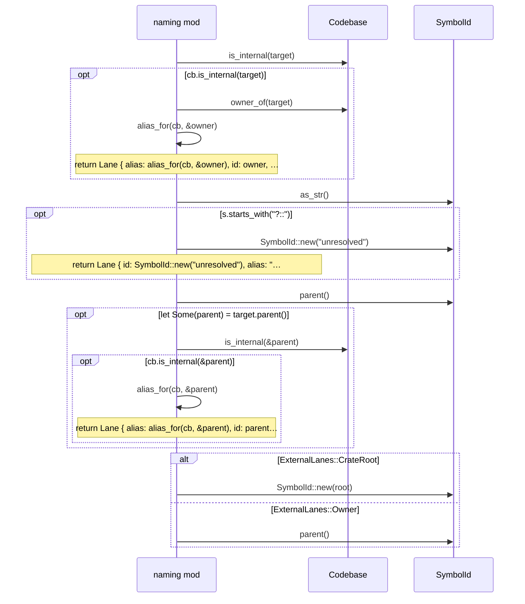
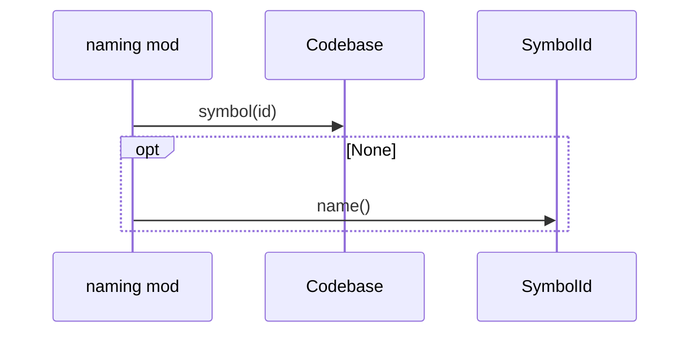

# `codemaid_corpus::naming` · crates/codemaid-corpus/src/naming.rs
> Stable ids, short labels and sequence lanes.

## structure

## `codemaid_corpus::naming::ident`
`pub(crate) fn ident(id: &SymbolId) -> Ident` · L8-L11
> Diagram id for a symbol (stable across all documents).

## `codemaid_corpus::naming::assert_unique_idents`
`pub(crate) fn assert_unique_idents(cb: &Codebase)` · L13-L30
> Every symbol and relation endpoint must get its own diagram id: a shared id would silently merge two nodes in every diagram both appear in, and break merge-by-…

## `codemaid_corpus::naming::lane_of`
`pub(crate) fn lane_of(cb: &Codebase, target: &SymbolId, opts: &CorpusOptions) -> Lane` · L41-L69

## `codemaid_corpus::naming::alias_for`
`pub(crate) fn alias_for(cb: &Codebase, id: &SymbolId) -> String` · L71-L78
> Alias for an internal lane: type name, or module name for modules.

