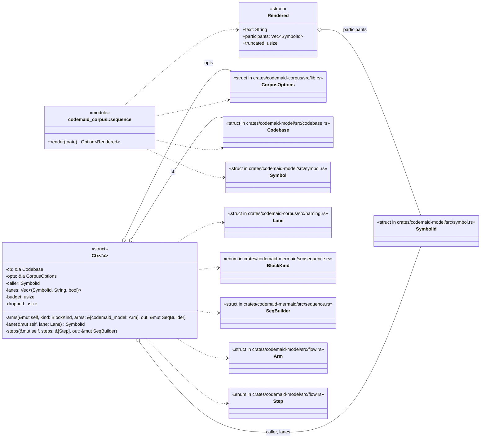
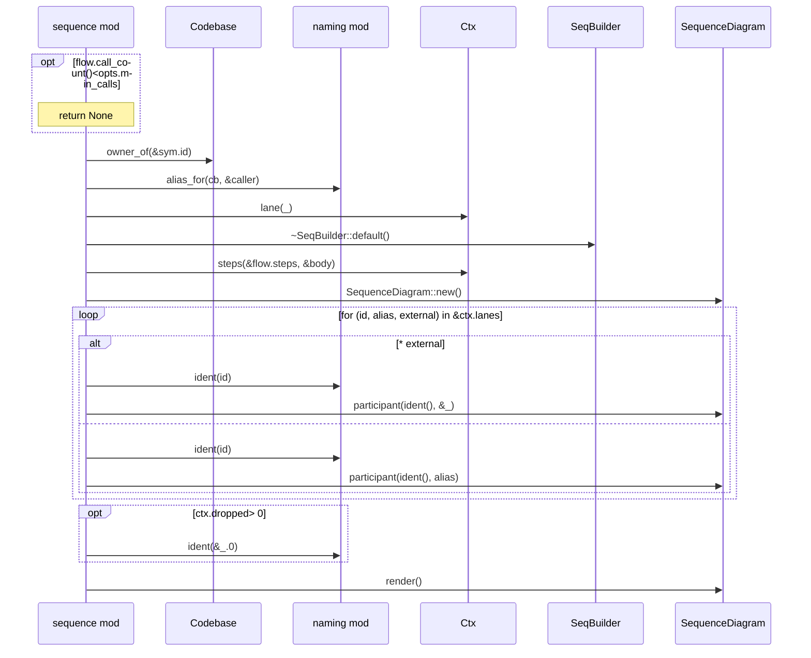
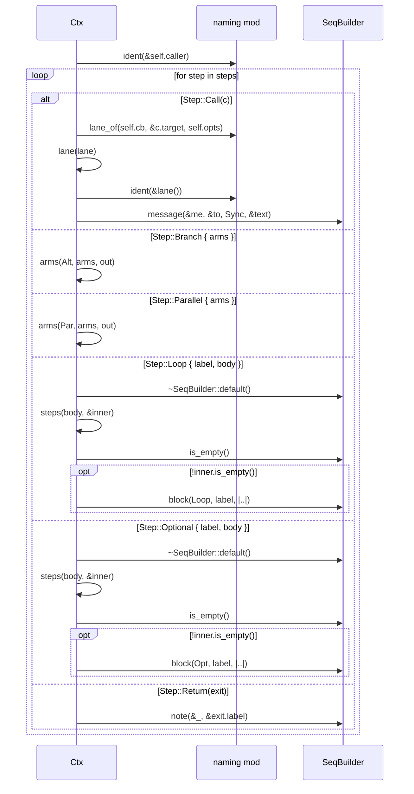
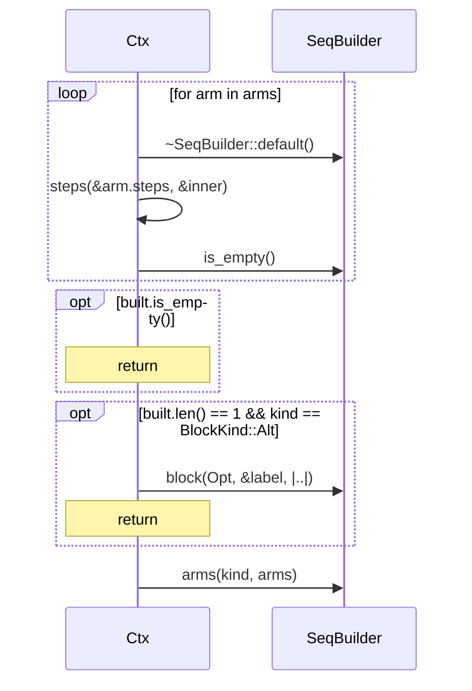

# `codemaid_corpus::sequence` · crates/codemaid-corpus/src/sequence.rs
> Flow → `sequenceDiagram`.

## structure

## `codemaid_corpus::sequence::render`
`pub(crate) fn render(cb: &Codebase, sym: &Symbol, opts: &CorpusOptions) -> Option<Rendered>` · L17-L47

## `codemaid_corpus::sequence::Ctx::steps`
`fn steps(&mut self, steps: &[Step], out: &mut SeqBuilder)` · L66-L118

## `codemaid_corpus::sequence::Ctx::arms`
`fn arms(&mut self, kind: BlockKind, arms: &[codemaid_model::Arm], out: &mut SeqBuilder)` · L120-L150

