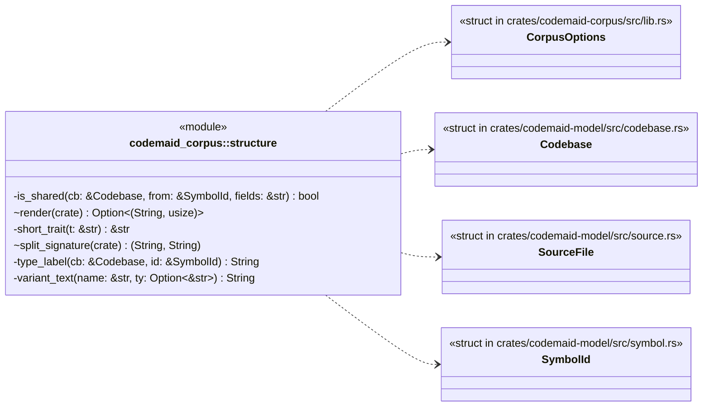
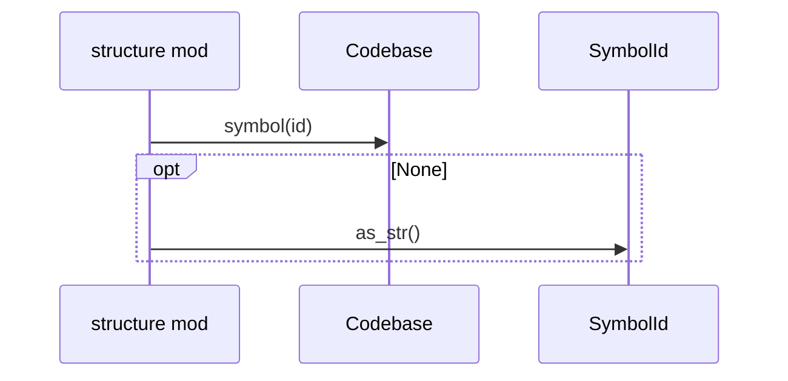
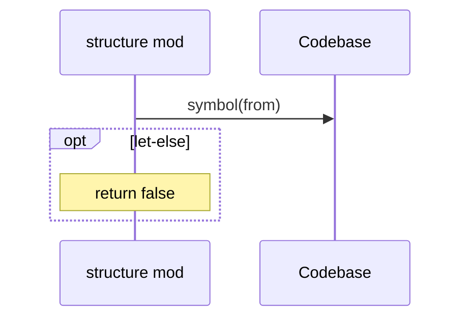

# `codemaid_corpus::structure` · crates/codemaid-corpus/src/structure.rs
> Per-file `classDiagram`: what the file defines and how it relates to the rest of the codebase.

## structure

## `codemaid_corpus::structure::render`
`pub(crate) fn render(cb: &Codebase, file: &SourceFile, opts: &CorpusOptions) -> Option<(String, usize)>` · L12-L198
> Render the structure diagram for `file`.

```mermaid
sequenceDiagram
  participant codemaid_corpus__structure as structure mod
  participant codemaid_model__codebase__Codebase as Codebase
  participant codemaid_mermaid__class__ClassDiagram as ClassDiagram
  participant codemaid_model__symbol__SymbolKind as SymbolKind
  participant codemaid_corpus__naming as naming mod
  participant codemaid_mermaid__class__Class as Class
  participant codemaid_model__symbol__Visibility as Visibility
  codemaid_corpus__structure->>codemaid_model__codebase__Codebase: symbols_in_file(&file.path)
  codemaid_corpus__structure->>codemaid_mermaid__class__ClassDiagram: ClassDiagram::new(LR)
  loop for s in &here
    codemaid_corpus__structure->>codemaid_model__symbol__SymbolKind: ~is_type()
  end
  loop for owner in &owners
    codemaid_corpus__structure->>codemaid_corpus__naming: ident(owner)
    codemaid_corpus__structure->>codemaid_corpus__structure: type_label(cb, owner)
    codemaid_corpus__structure->>codemaid_mermaid__class__Class: Class::new(ident(), &type_label())
    codemaid_corpus__structure->>codemaid_model__codebase__Codebase: symbol(owner)
    alt Some(t) if t.file == file.path
      codemaid_corpus__structure->>codemaid_model__symbol__SymbolKind: ~keyword()
      codemaid_corpus__structure->>codemaid_mermaid__class__Class: annotation(keyword())
      loop for m in &t.members
        alt MemberKind::Field
          codemaid_corpus__structure->>codemaid_model__symbol__Visibility: ~uml_marker()
          codemaid_corpus__structure->>codemaid_mermaid__class__Class: field(uml_marker(), &m.name, unwrap_or())
        else MemberKind::Variant
          codemaid_corpus__structure->>codemaid_corpus__structure: variant_text(&m.name, as_deref())
          codemaid_corpus__structure->>codemaid_mermaid__class__Class: field('', &variant_text(), #quot;#quot;)
        else MemberKind::AssocType
          codemaid_corpus__structure->>codemaid_mermaid__class__Class: field('+', &_, unwrap_or())
        else MemberKind::AssocConst
          codemaid_corpus__structure->>codemaid_mermaid__class__Class: field('+', &_, unwrap_or())
        else MemberKind::RequiredMethod
          codemaid_corpus__structure->>codemaid_corpus__structure: split_signature(unwrap_or())
          codemaid_corpus__structure->>codemaid_mermaid__class__Class: method('+', &m.name, &params, &ret)
        end
      end
    else Some(t)
      codemaid_corpus__structure->>codemaid_model__symbol__SymbolKind: ~keyword()
      codemaid_corpus__structure->>codemaid_mermaid__class__Class: annotation(&_)
    else None
      codemaid_corpus__structure->>codemaid_mermaid__class__Class: annotation(#quot;external#quot;)
    end
    loop for m in here.iter().filter(| s | s.kind == SymbolKind:…
      codemaid_corpus__structure->>codemaid_corpus__structure: split_signature(unwrap_or())
      opt Some(tr)
        codemaid_corpus__structure->>codemaid_corpus__structure: short_trait(tr)
      end
      codemaid_corpus__structure->>codemaid_model__symbol__Visibility: ~uml_marker()
      codemaid_corpus__structure->>codemaid_mermaid__class__Class: method(uml_marker(), &name, &params, &ret)
    end
    codemaid_corpus__structure->>codemaid_mermaid__class__ClassDiagram: class(class)
  end
  loop for module in &modules
    codemaid_corpus__structure->>codemaid_corpus__naming: ident(&module.id)
    codemaid_corpus__structure->>codemaid_mermaid__class__Class: Class::new(ident(), &to_string())
    codemaid_corpus__structure->>codemaid_mermaid__class__Class: annotation(#quot;module#quot;)
    codemaid_corpus__structure->>codemaid_model__codebase__Codebase: children(&module.id)
    loop for s in cb.children(&module.id).filter(| s | visible(s…
      alt SymbolKind::Module
        codemaid_corpus__structure->>codemaid_model__symbol__Visibility: ~uml_marker()
        codemaid_corpus__structure->>codemaid_mermaid__class__Class: field(uml_marker(), &_, #quot;#quot;)
      else SymbolKind::Function
        codemaid_corpus__structure->>codemaid_corpus__structure: split_signature(unwrap_or())
        codemaid_corpus__structure->>codemaid_model__symbol__Visibility: ~uml_marker()
        codemaid_corpus__structure->>codemaid_mermaid__class__Class: method(uml_marker(), &s.name, &params, &ret)
      else SymbolKind::Const | SymbolKind::Static
        codemaid_corpus__structure->>codemaid_model__symbol__Visibility: ~uml_marker()
        codemaid_corpus__structure->>codemaid_model__symbol__SymbolKind: ~keyword()
        codemaid_corpus__structure->>codemaid_mermaid__class__Class: field(uml_marker(), &_, ty)
      else SymbolKind::Macro
        codemaid_corpus__structure->>codemaid_model__symbol__Visibility: ~uml_marker()
        codemaid_corpus__structure->>codemaid_mermaid__class__Class: field(uml_marker(), &_, #quot;#quot;)
      end
    end
    opt any || owners.is_empty()
      codemaid_corpus__structure->>codemaid_mermaid__class__ClassDiagram: class(class)
    end
  end
  codemaid_corpus__structure->>codemaid_mermaid__class__ClassDiagram: class_count()
  opt d.class_count() == 0
    Note over codemaid_corpus__structure: return None
  end
  loop for s in &here
    codemaid_corpus__structure->>codemaid_model__codebase__Codebase: relations_from(&s.id)
  end
  loop for owner in &owners
    codemaid_corpus__structure->>codemaid_model__codebase__Codebase: relations_from(owner)
  end
  loop for (from, to, kind, label) in &edges
    opt !drawn.contains(to)
      codemaid_corpus__structure->>codemaid_corpus__naming: ident(to)
      codemaid_corpus__structure->>codemaid_corpus__structure: type_label(cb, to)
      codemaid_corpus__structure->>codemaid_mermaid__class__Class: Class::new(ident(), &type_label())
      codemaid_corpus__structure->>codemaid_model__codebase__Codebase: symbol(to)
      alt Some(t)
        codemaid_corpus__structure->>codemaid_model__symbol__SymbolKind: ~keyword()
        codemaid_corpus__structure->>codemaid_mermaid__class__Class: annotation(&_)
      else None
        codemaid_corpus__structure->>codemaid_mermaid__class__Class: annotation(#quot;external#quot;)
      end
      codemaid_corpus__structure->>codemaid_mermaid__class__ClassDiagram: class(stub)
    end
    codemaid_corpus__structure->>codemaid_corpus__naming: ident(from)
    codemaid_corpus__structure->>codemaid_corpus__naming: ident(to)
    codemaid_corpus__structure->>codemaid_mermaid__class__ClassDiagram: relation(&ident(), &ident(), k, label)
  end
  codemaid_corpus__structure->>codemaid_mermaid__class__ClassDiagram: class_count()
  codemaid_corpus__structure->>codemaid_mermaid__class__ClassDiagram: render()
```

## `codemaid_corpus::structure::type_label`
`fn type_label(cb: &Codebase, id: &SymbolId) -> String` · L200-L210
> Display label for a type: name with generics.

## `codemaid_corpus::structure::is_shared`
`fn is_shared(cb: &Codebase, from: &SymbolId, fields: &str) -> bool` · L225-L248
> Is the field holding the target behind `Option`, `Arc`, `Rc`, a reference or a collection (aggregation rather than composition)?

