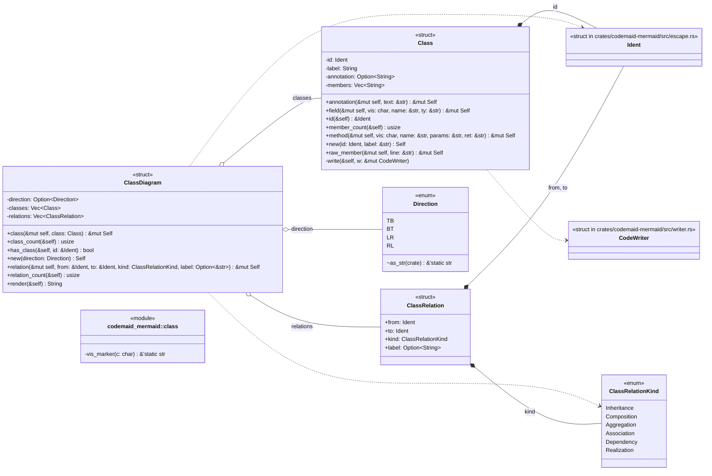
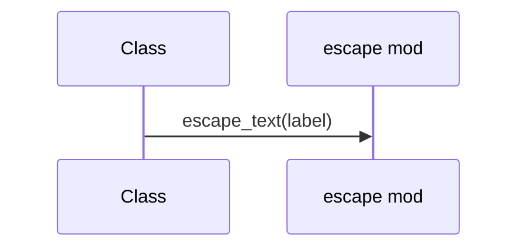
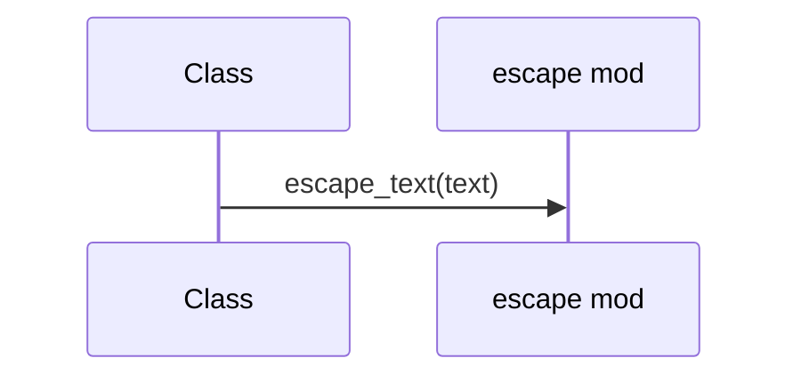
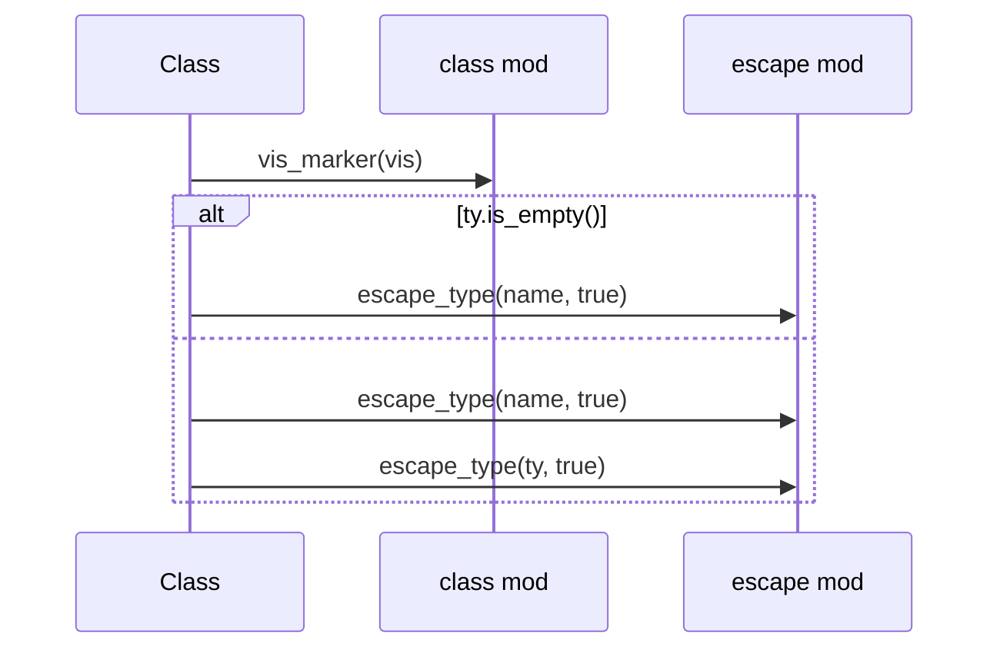
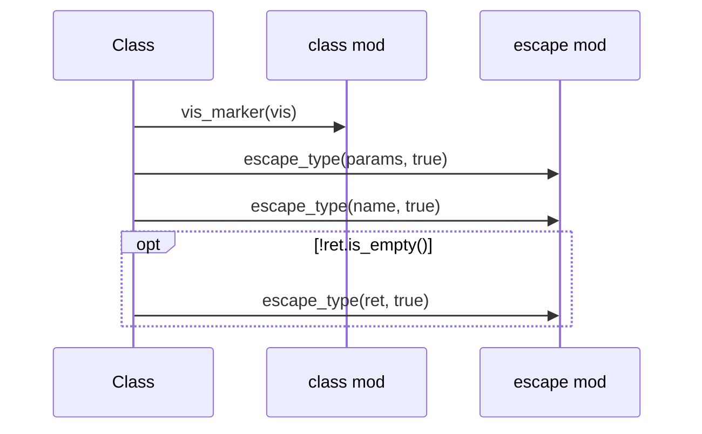
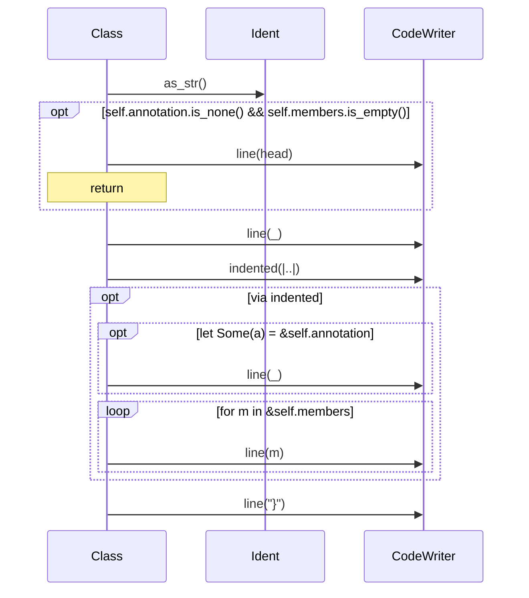
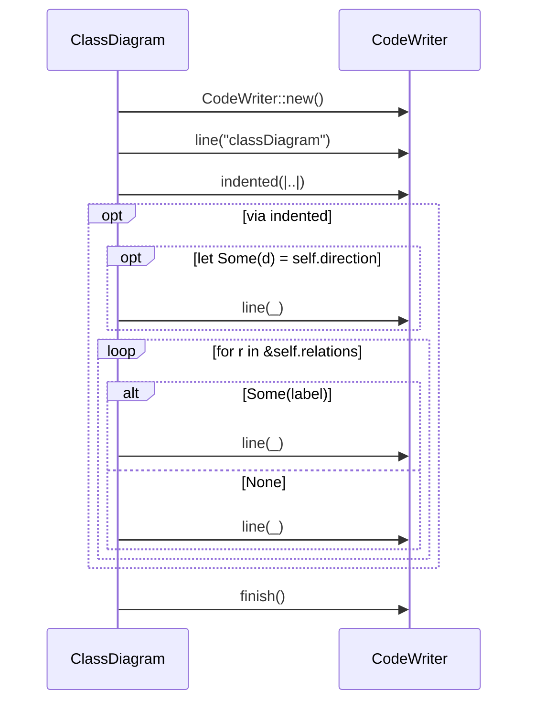

# `codemaid_mermaid::class` · crates/codemaid-mermaid/src/class.rs

## structure

## `codemaid_mermaid::class::Class::new`
`pub fn new(id: Ident, label: &str) -> Self` · L49-L55
> A class with display `label` (generics may be written with `<>`).

## `codemaid_mermaid::class::Class::annotation`
`pub fn annotation(&mut self, text: &str) -> &mut Self` · L62-L66
> `<<annotation>>`, e.g.

## `codemaid_mermaid::class::Class::field`
`pub fn field(&mut self, vis: char, name: &str, ty: &str) -> &mut Self` · L68-L79
> A field line: `<vis>name: Type`.

## `codemaid_mermaid::class::Class::method`
`pub fn method(&mut self, vis: char, name: &str, params: &str, ret: &str) -> &mut Self` · L81-L93
> A method line: `<vis>name(params) Ret`.

## `codemaid_mermaid::class::Class::write`
`fn write(&self, w: &mut CodeWriter)` · L106-L126

## `codemaid_mermaid::class::ClassDiagram::render`
`pub fn render(&self) -> String` · L231-L259
> Render to Mermaid text.

