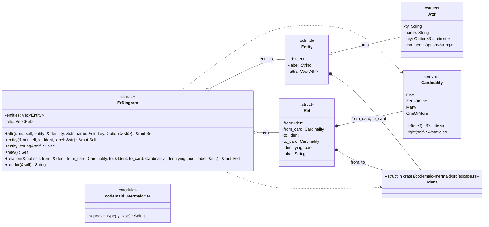
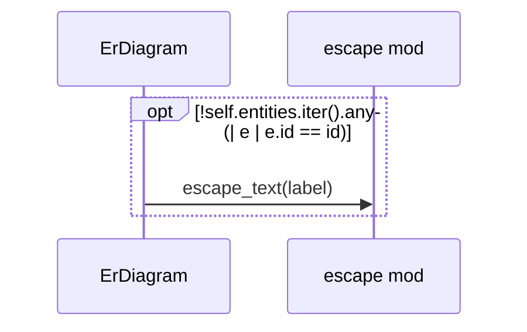
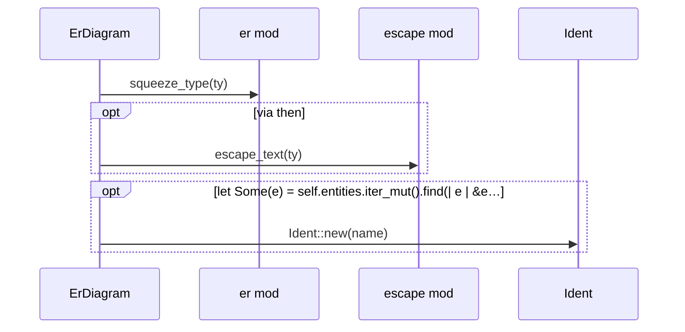
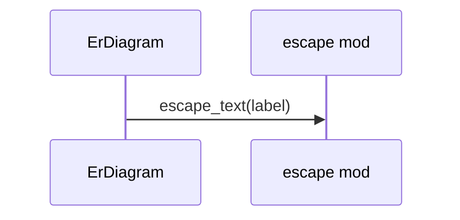
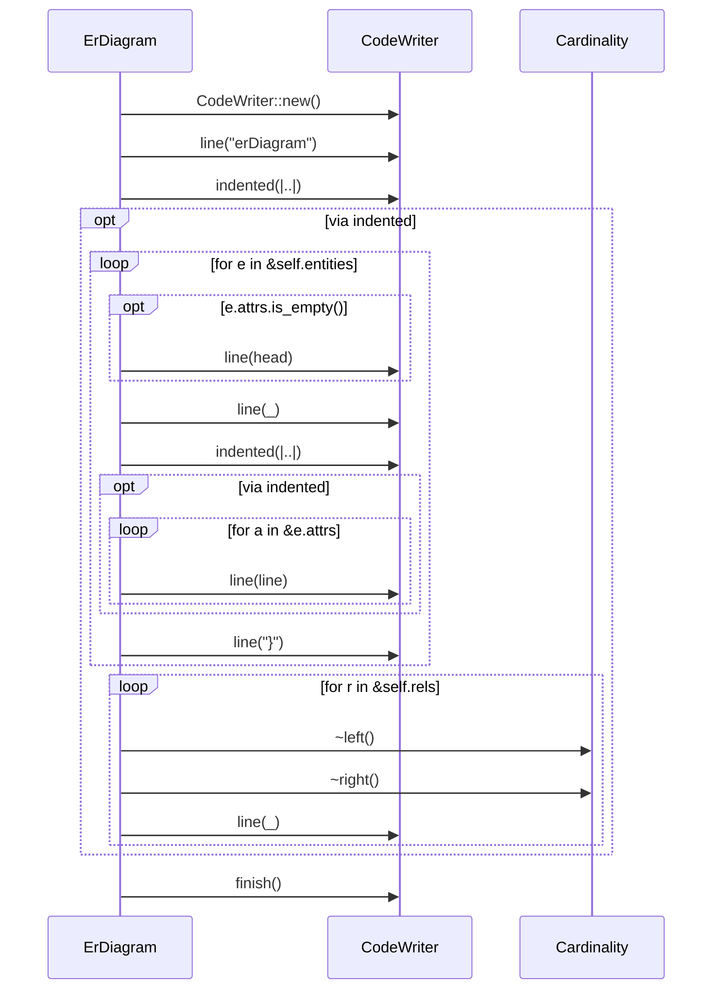

# `codemaid_mermaid::er` · crates/codemaid-mermaid/src/er.rs

## structure

## `codemaid_mermaid::er::ErDiagram::entity`
`pub fn entity(&mut self, id: Ident, label: &str) -> &mut Self` · L95-L101
> Declare an entity.

## `codemaid_mermaid::er::ErDiagram::attr`
`pub fn attr(&mut self, entity: &Ident, ty: &str, name: &str, key: Option<&str>) -> &mut Self` · L103-L119
> Add an attribute to an existing entity (no-op if `entity` is unknown).

## `codemaid_mermaid::er::ErDiagram::relation`
`pub fn relation(&mut self, from: &Ident, from_card: Cardinality, to: &Ident, to_card: Cardinality, identifying: bool, label: &str,) -> &mut Self` · L121-L137
> Add a relationship.

## `codemaid_mermaid::er::ErDiagram::render`
`pub fn render(&self) -> String` · L144-L182
> Render to Mermaid text.

