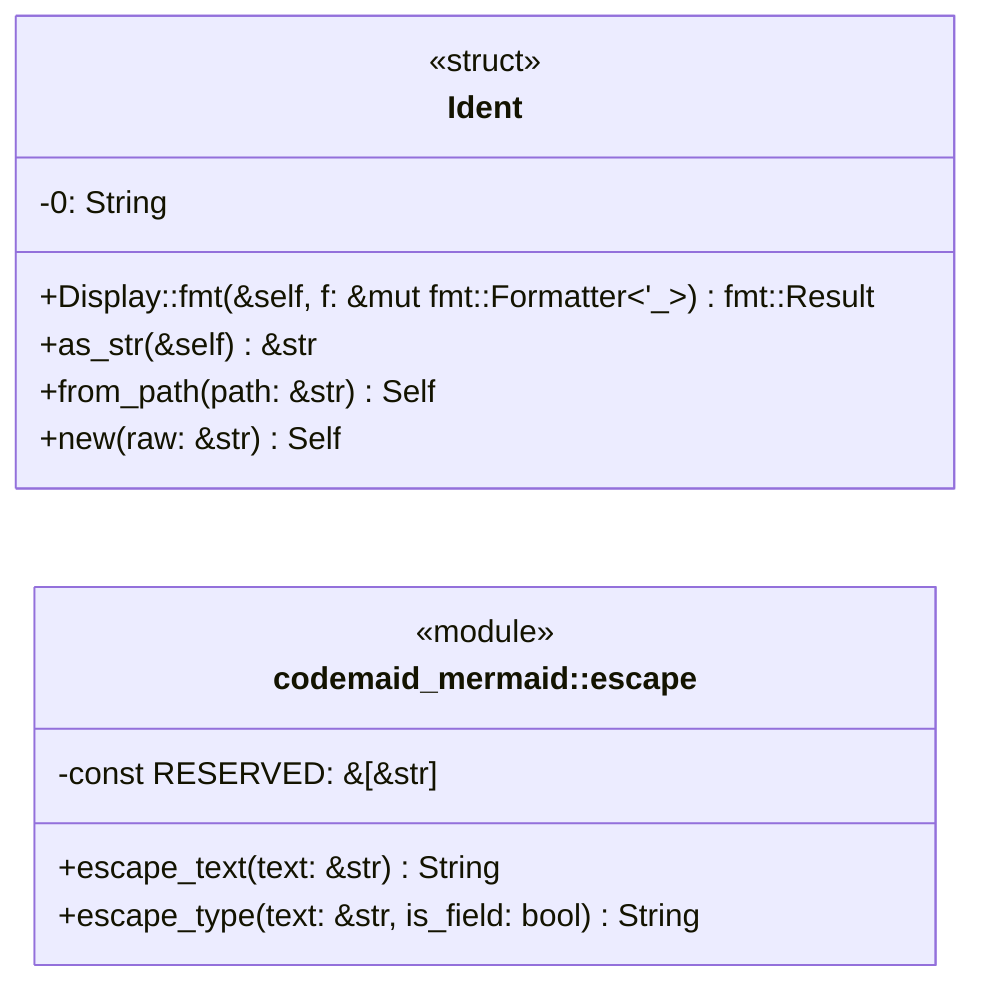
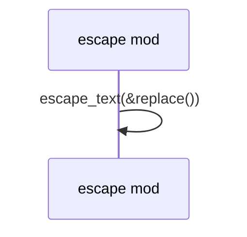

# `codemaid_mermaid::escape` · crates/codemaid-mermaid/src/escape.rs

## structure

## `codemaid_mermaid::escape::escape_type`
`pub fn escape_type(text: &str, is_field: bool) -> String` · L134-L165
> Escape a type or member text for a class-diagram body.

