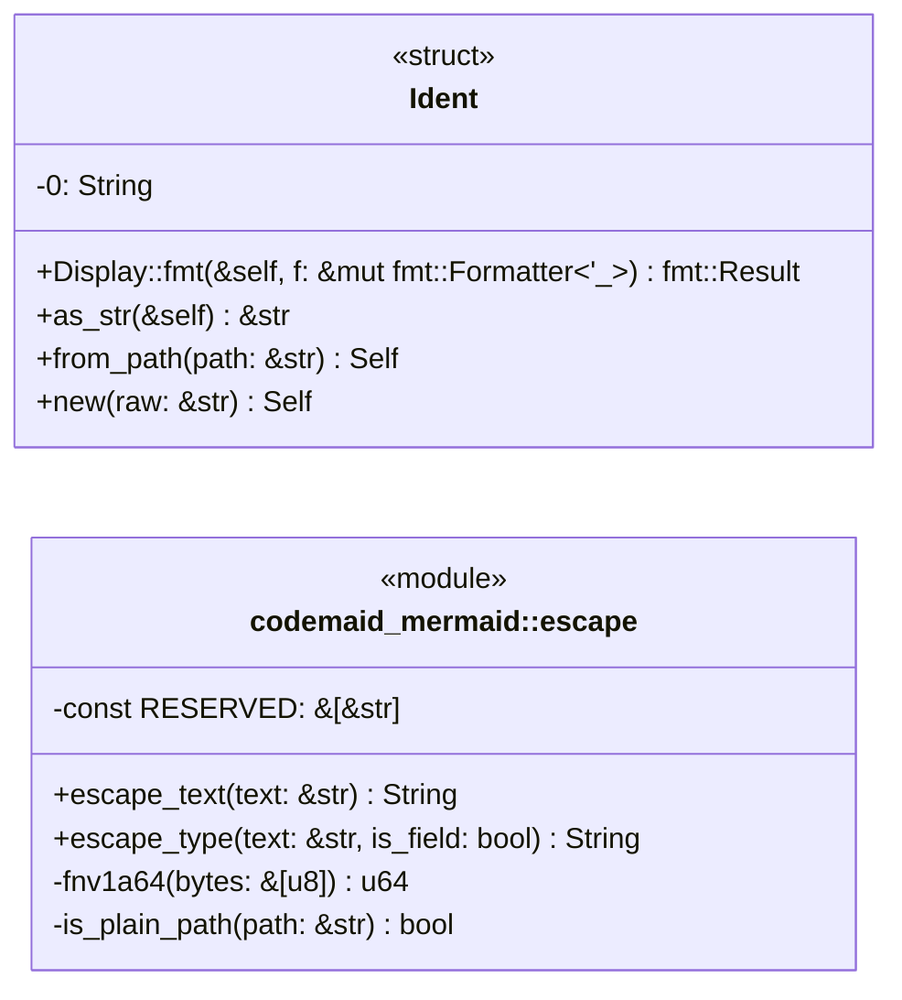
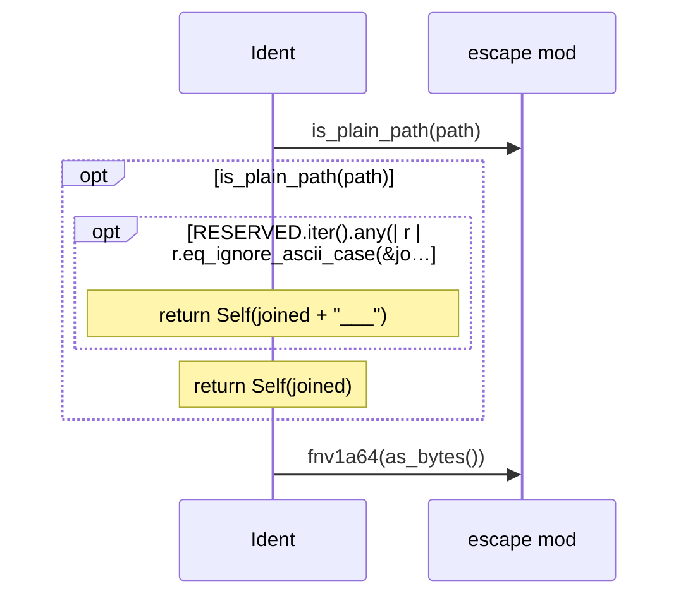
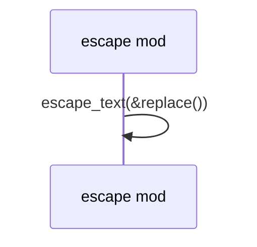

# `codemaid_mermaid::escape` · crates/codemaid-mermaid/src/escape.rs

## structure

## `codemaid_mermaid::escape::Ident::from_path`
`pub fn from_path(path: &str) -> Self` · L78-L102
> Map a `::`-separated path to an id, using `__` as the separator.

## `codemaid_mermaid::escape::escape_type`
`pub fn escape_type(text: &str, is_field: bool) -> String` · L186-L217
> Escape a type or member text for a class-diagram body.

