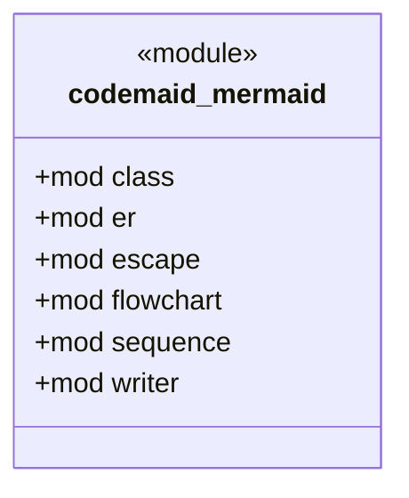

# `codemaid_mermaid` · crates/codemaid-mermaid/src/lib.rs
> Typed, deterministic writers for the Mermaid diagram kinds that explain code best: [`SequenceDiagram`] (behaviour), [`ClassDiagram`] (structure), [`ErDiagram`]…

## structure

