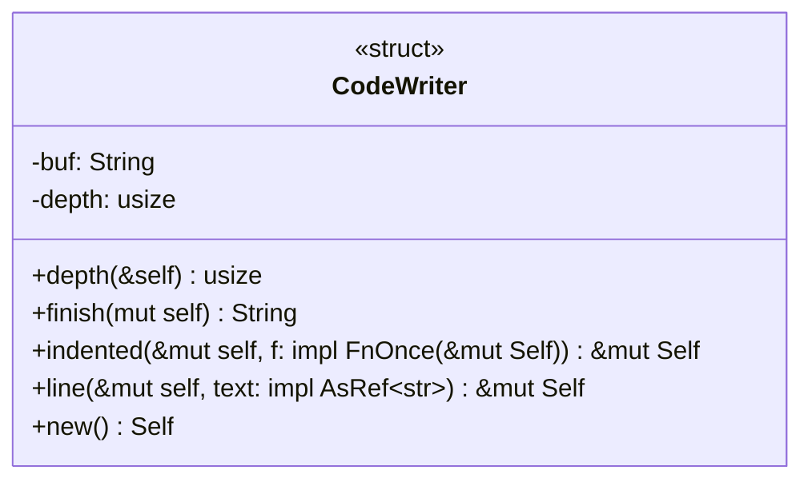

# `codemaid_mermaid::writer` · crates/codemaid-mermaid/src/writer.rs

## structure

```mermaid
classDiagram
  direction LR
  class codemaid_mermaid__writer__CodeWriter["CodeWriter"] {
    <<struct>>
    -buf: String
    -depth: usize
    +depth(&self) usize
    +finish(mut self) String
    +indented(&mut self, f: impl FnOnce#40;&mut Self#41;) &mut Self
    +line(&mut self, text: impl AsRef#lt;str#gt;) &mut Self
    +new() Self
  }
```
