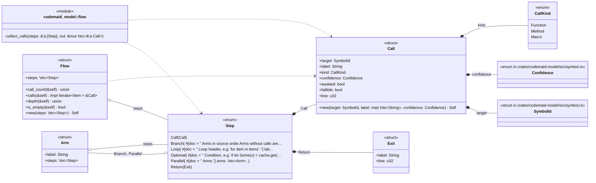
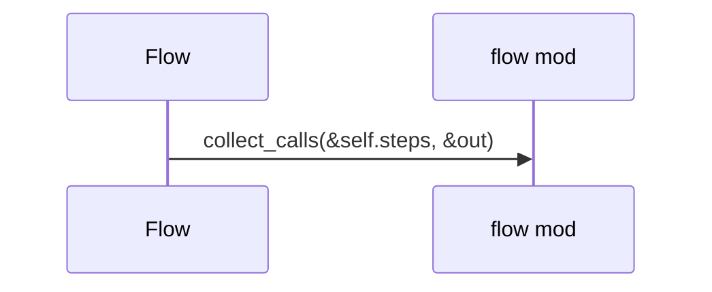
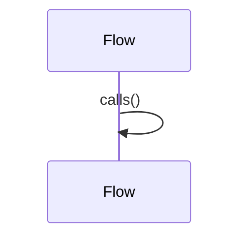
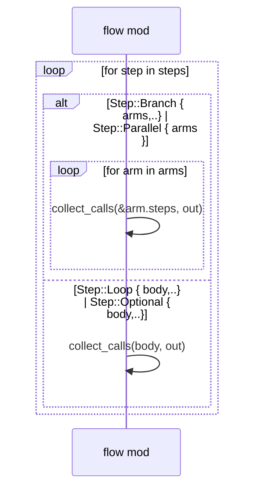

# `codemaid_model::flow` · crates/codemaid-model/src/flow.rs
> Ordered call/control flow of a function body: the raw material for sequence diagrams.

## structure

## `codemaid_model::flow::Flow::calls`
`pub fn calls(&self) -> impl Iterator<Item = &Call>` · L55-L60
> Every call in depth-first source order.

## `codemaid_model::flow::Flow::call_count`
`pub fn call_count(&self) -> usize` · L62-L65
> Number of calls in the whole tree.

## `codemaid_model::flow::collect_calls`
`fn collect_calls<'a>(steps: &'a [Step], out: &mut Vec<&'a Call>)` · L85-L98

