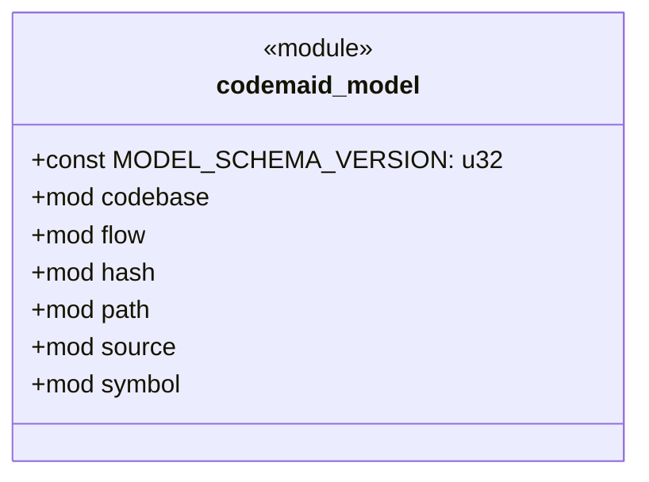

# `codemaid_model` · crates/codemaid-model/src/lib.rs
> A language-neutral, **deterministic** model of a codebase: source files, the symbols they define, and the typed relations between those symbols.

## structure

