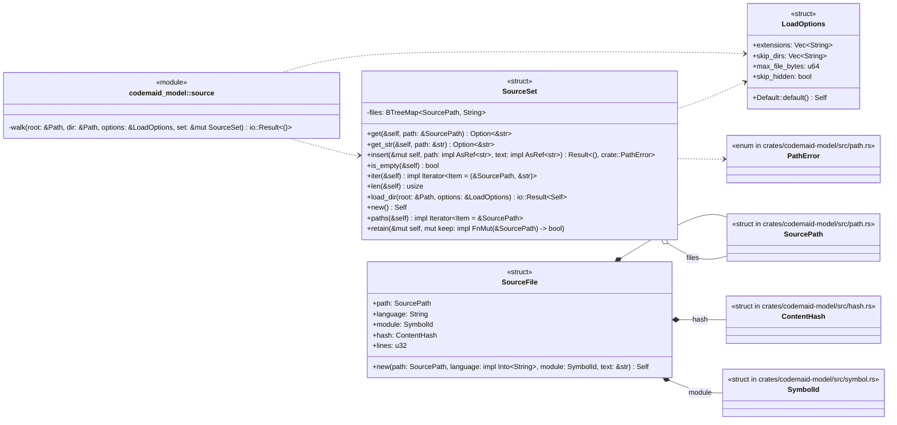
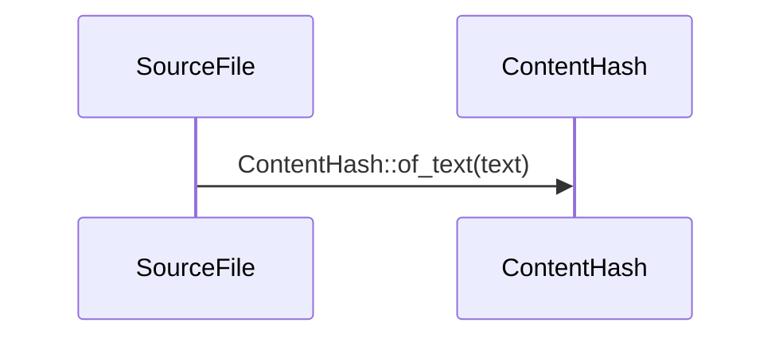
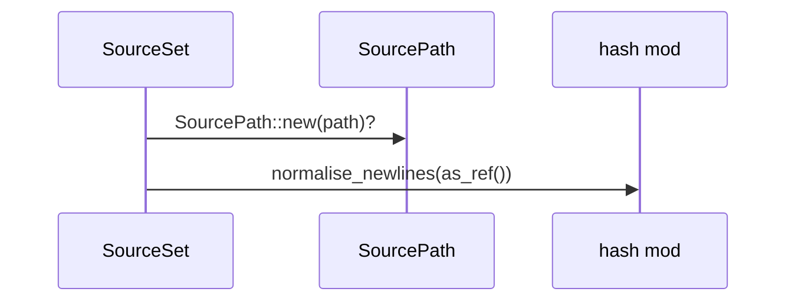
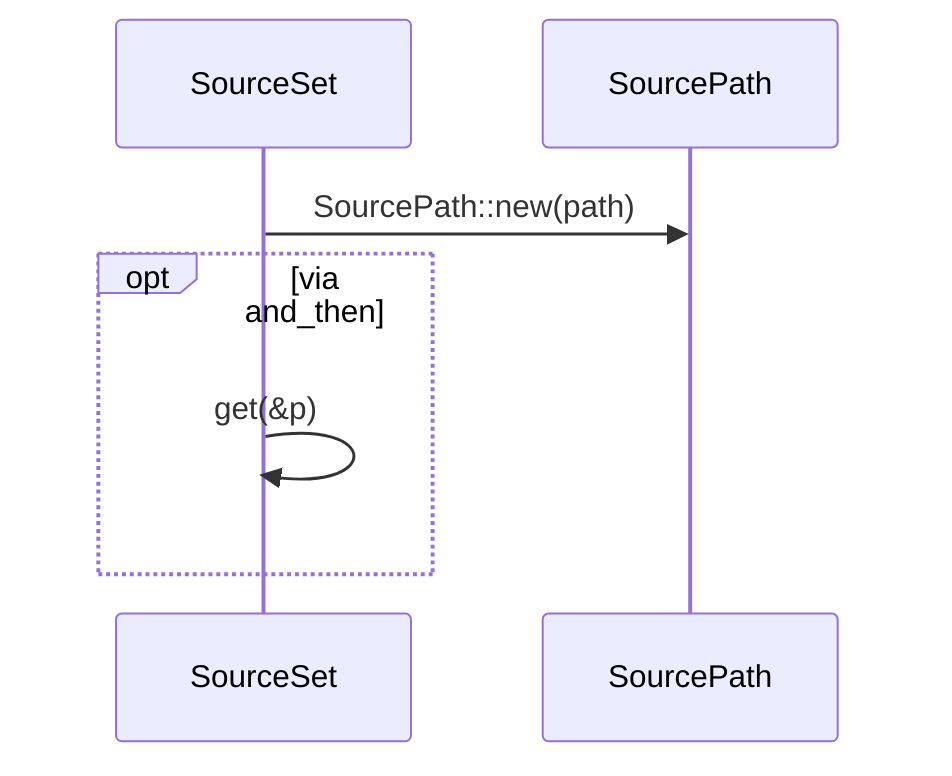
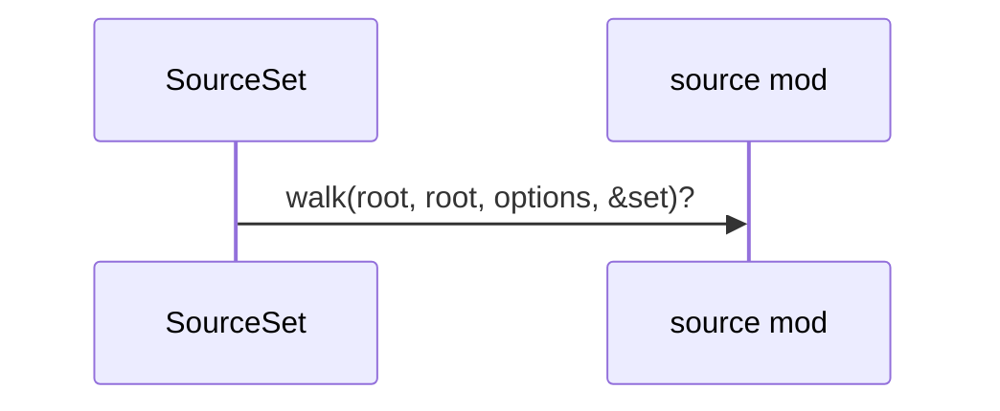
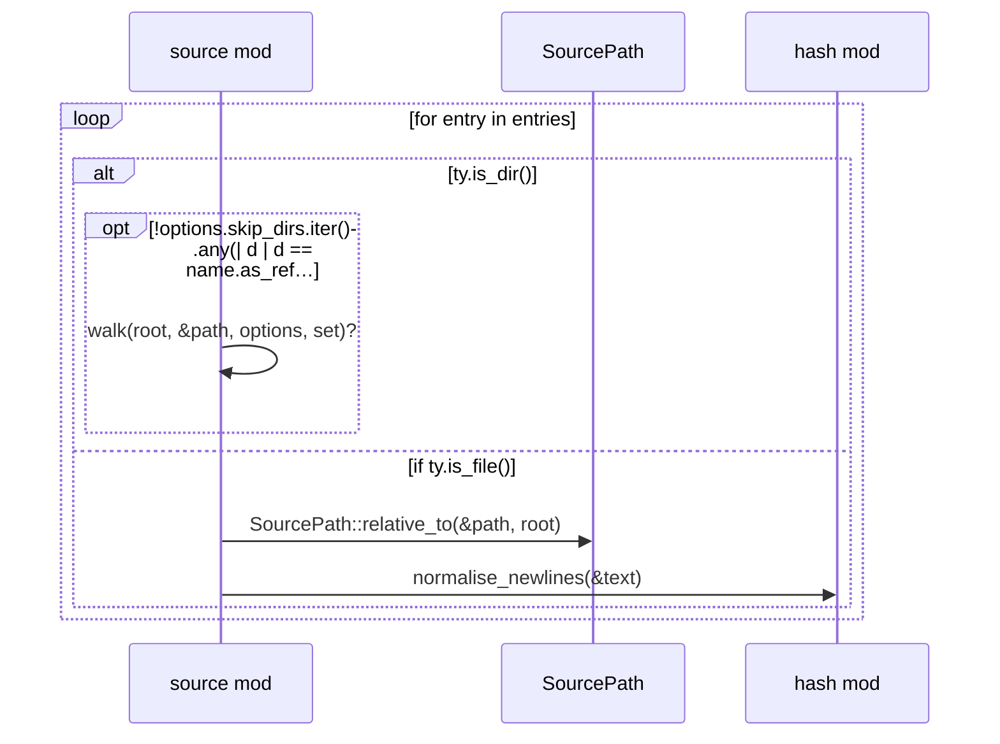

# `codemaid_model::source` · crates/codemaid-model/src/source.rs

## structure

## `codemaid_model::source::SourceFile::new`
`pub fn new(path: SourcePath, language: impl Into<String>, module: SymbolId, text: &str) -> Self` · L30-L39
> Describe `text` as the file at `path`.

## `codemaid_model::source::SourceSet::insert`
`pub fn insert(&mut self, path: impl AsRef<str>, text: impl AsRef<str>) -> Result<(), crate::PathError>` · L98-L104
> Insert or replace a file.

## `codemaid_model::source::SourceSet::get_str`
`pub fn get_str(&self, path: &str) -> Option<&str>` · L111-L114
> Text of the file at a raw path string (normalised first).

## `codemaid_model::source::SourceSet::load_dir`
`pub fn load_dir(root: &Path, options: &LoadOptions) -> io::Result<Self>` · L141-L149
> Recursively load every matching file under `root`.

## `codemaid_model::source::walk`
`fn walk(root: &Path, dir: &Path, options: &LoadOptions, set: &mut SourceSet) -> io::Result<()>` · L152-L179

