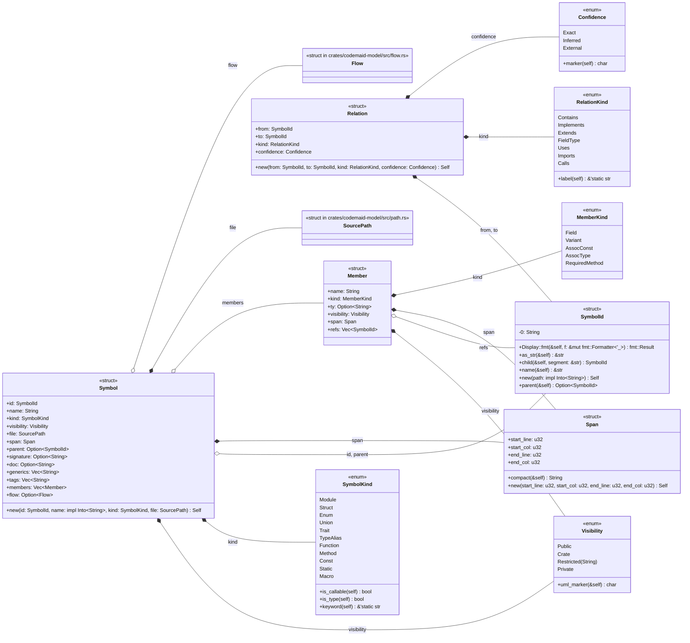
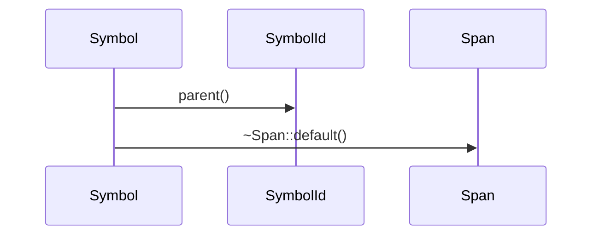

# `codemaid_model::symbol` · crates/codemaid-model/src/symbol.rs

## structure

## `codemaid_model::symbol::Symbol::new`
`pub fn new(id: SymbolId, name: impl Into<String>, kind: SymbolKind, file: SourcePath) -> Self` · L265-L283
> A symbol with only the required fields set; everything else empty / private.

