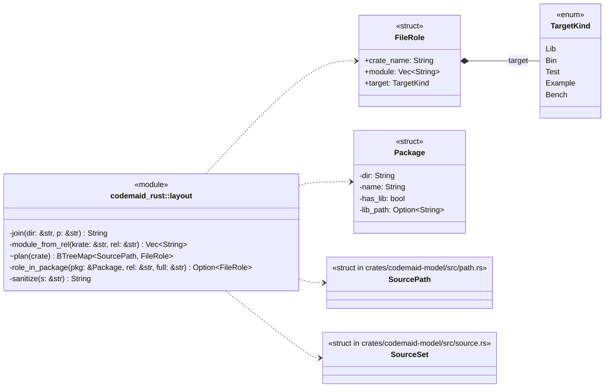
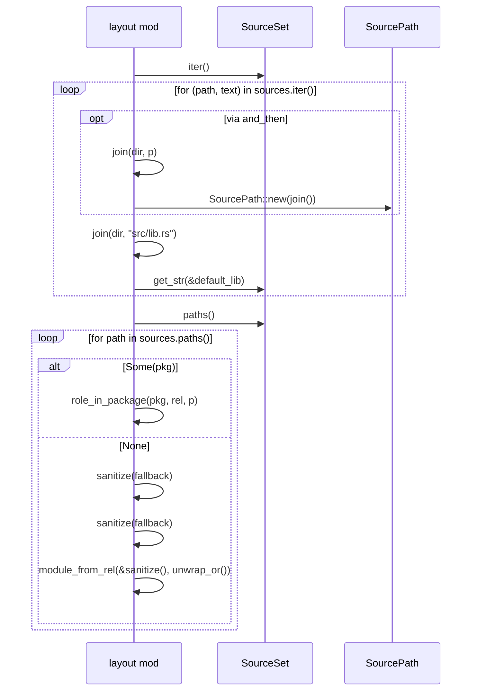
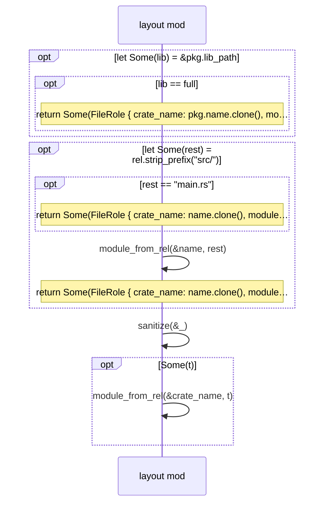
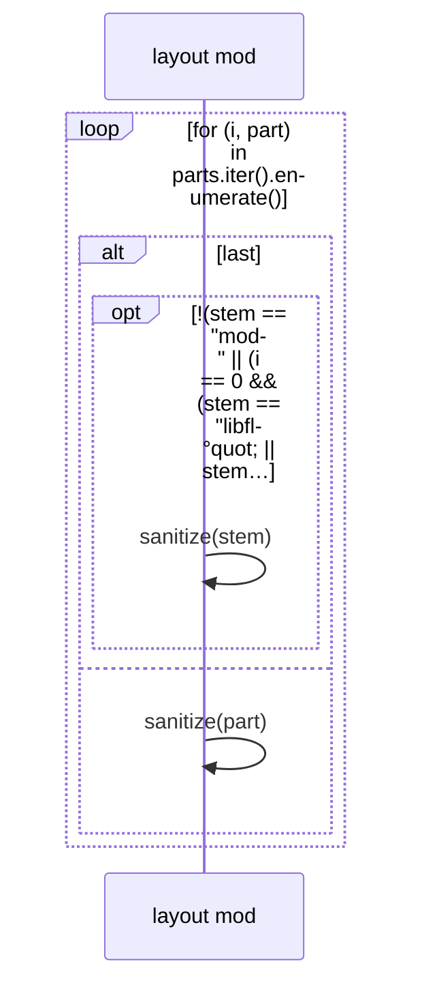

# `codemaid_rust::layout` · crates/codemaid-rust/src/layout.rs
> Mapping files to crates and module paths using Cargo conventions.

## structure

## `codemaid_rust::layout::plan`
`pub(crate) fn plan(sources: &SourceSet, fallback: &str) -> BTreeMap<SourcePath, FileRole>` · L36-L86
> Discover packages from every `Cargo.toml` with a `[package]` table.

## `codemaid_rust::layout::role_in_package`
`fn role_in_package(pkg: &Package, rel: &str, full: &str) -> Option<FileRole>` · L88-L138

## `codemaid_rust::layout::module_from_rel`
`fn module_from_rel(krate: &str, rel: &str) -> Vec<String>` · L140-L156
> `a/b.rs` → `[krate, a, b]`; `a/mod.rs` → `[krate, a]`; `lib.rs` → `[krate]`.

