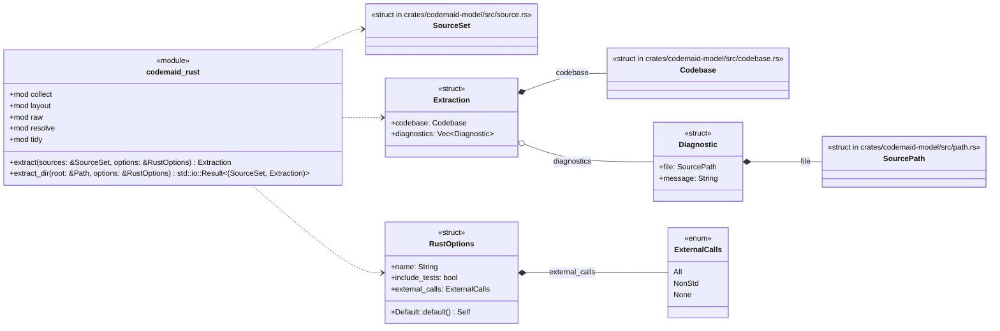
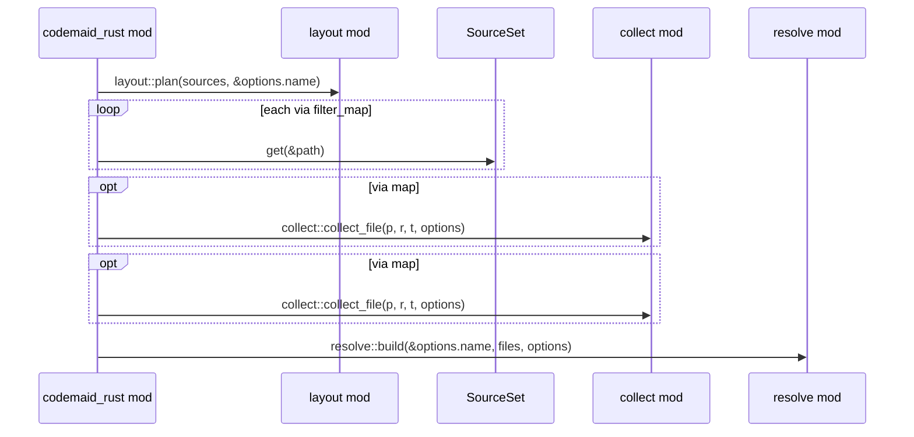
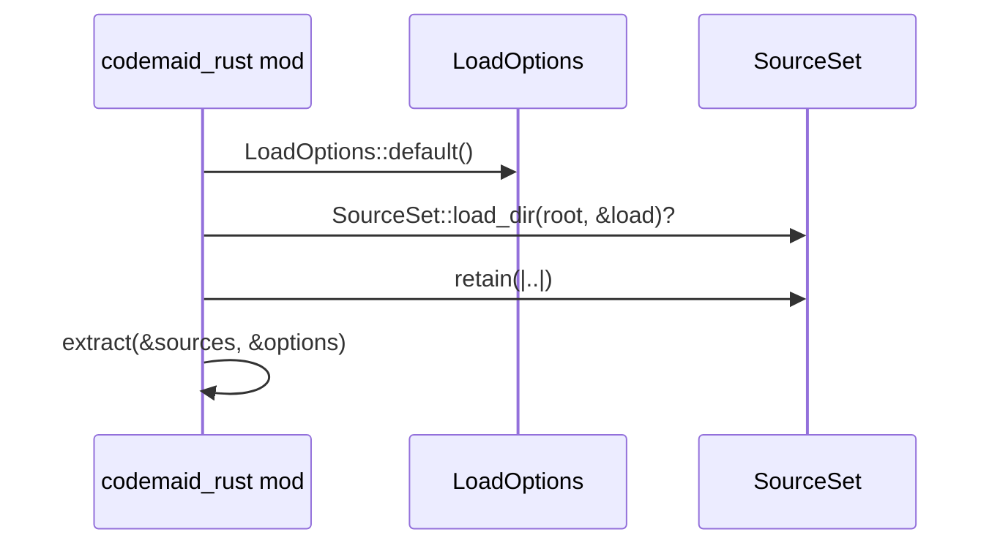

# `codemaid_rust` · crates/codemaid-rust/src/lib.rs
> A pure-Rust frontend that turns Rust source into a [`codemaid_model::Codebase`]: modules, types, traits, functions and methods, the relations between them, and…

## structure

## `codemaid_rust::extract`
`pub fn extract(sources: &SourceSet, options: &RustOptions) -> Extraction` · L158-L179
> Extract a [`Codebase`] from the `.rs` (and `Cargo.toml`) files in `sources`.

## `codemaid_rust::extract_dir`
`pub fn extract_dir(root: &Path, options: &RustOptions) -> std::io::Result<(SourceSet, Extraction)>` · L181-L199
> Load `root` from disk (`.rs` and `Cargo.toml` files, skipping `target/`, hidden directories and the like) and [`extract`] it.

