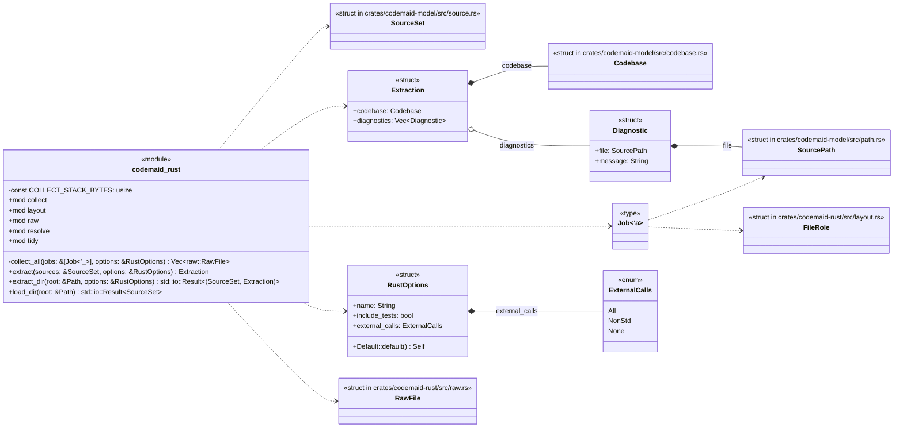
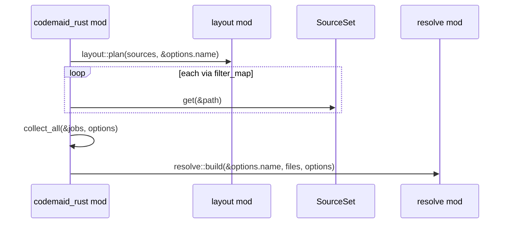
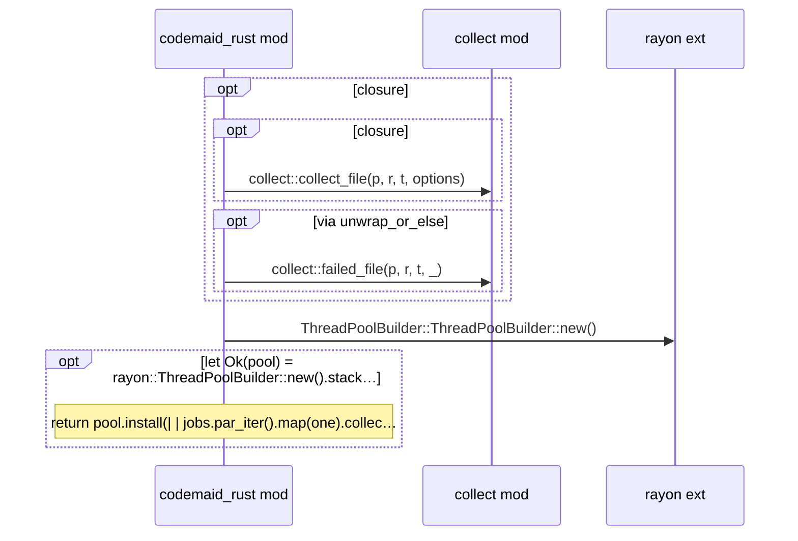
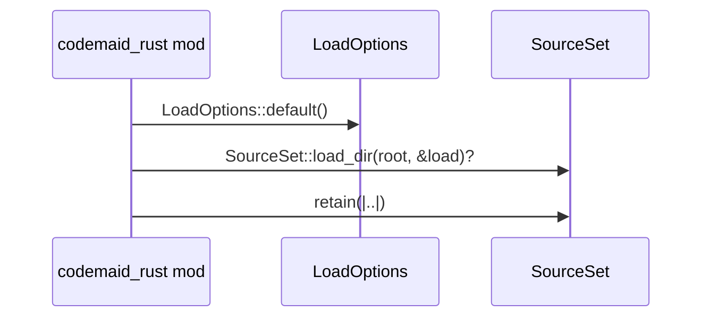
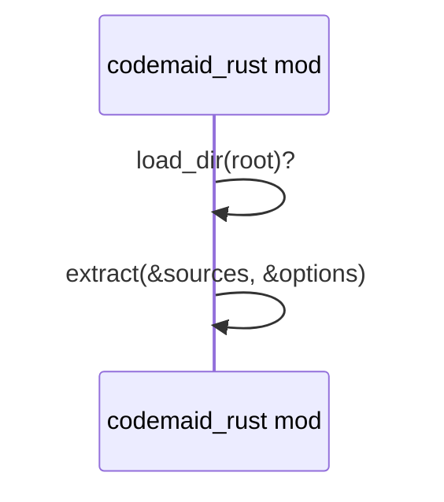

# `codemaid_rust` · crates/codemaid-rust/src/lib.rs
> A pure-Rust frontend that turns Rust source into a [`codemaid_model::Codebase`]: modules, types, traits, functions and methods, the relations between them, and…

## structure

## `codemaid_rust::extract`
`pub fn extract(sources: &SourceSet, options: &RustOptions) -> Extraction` · L158-L173
> Extract a [`Codebase`] from the `.rs` (and `Cargo.toml`) files in `sources`.

## `codemaid_rust::collect_all`
`fn collect_all(jobs: &[Job<'_>], options: &RustOptions) -> Vec<raw::RawFile>` · L185-L218
> Pass 1 over every file, on threads with [`COLLECT_STACK_BYTES`] of stack.

## `codemaid_rust::load_dir`
`pub fn load_dir(root: &Path) -> std::io::Result<SourceSet>` · L220-L228
> Load the `.rs` and `Cargo.toml` files under `root` (honouring `.gitignore`, skipping `target/`, hidden directories and the like) without extracting them.

## `codemaid_rust::extract_dir`
`pub fn extract_dir(root: &Path, options: &RustOptions) -> std::io::Result<(SourceSet, Extraction)>` · L230-L246
> Load `root` from disk (`.rs` and `Cargo.toml` files, skipping `target/`, hidden directories and the like) and [`extract`] it.

