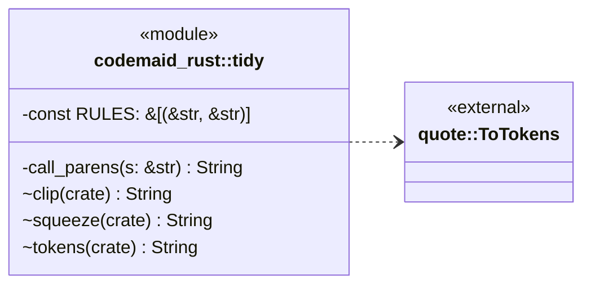
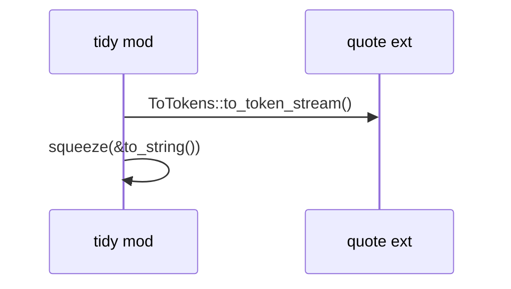
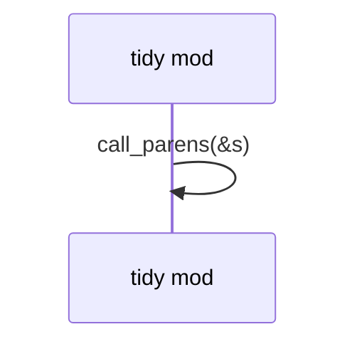

# `codemaid_rust::tidy` · crates/codemaid-rust/src/tidy.rs
> Compact, deterministic printing of token streams.

## structure

## `codemaid_rust::tidy::tokens`
`pub(crate) fn tokens(node: &impl ToTokens) -> String` · L41-L44
> Print any syn node compactly.

## `codemaid_rust::tidy::squeeze`
`pub(crate) fn squeeze(raw: &str) -> String` · L46-L69
> Apply the spacing rules until the string stops changing.

