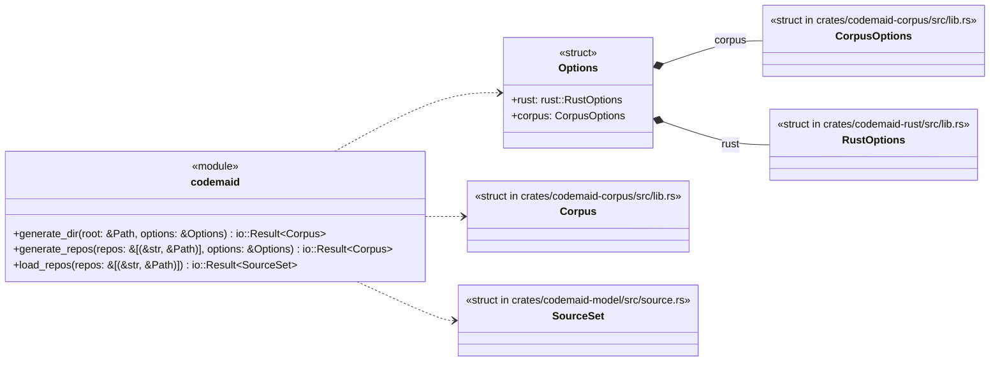
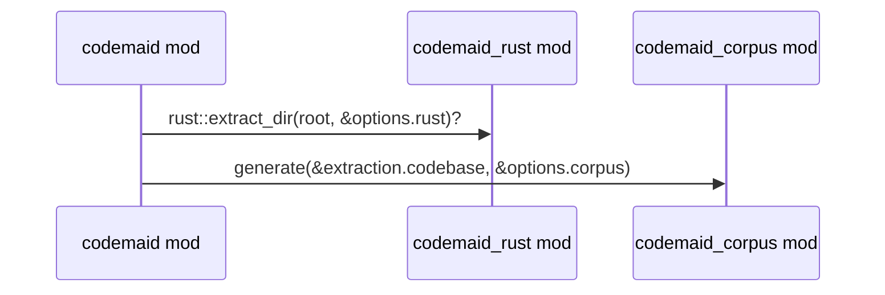
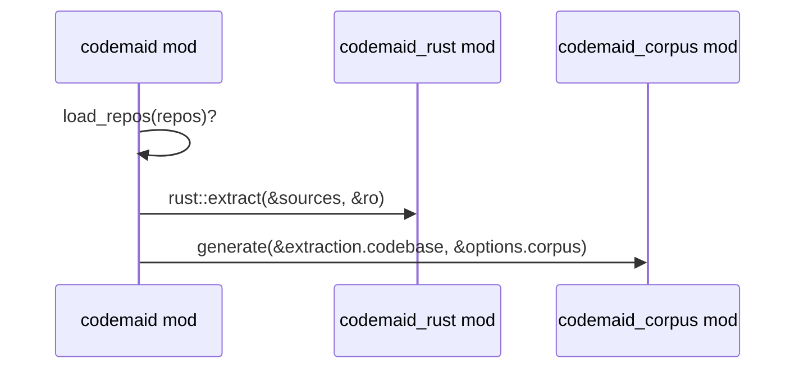
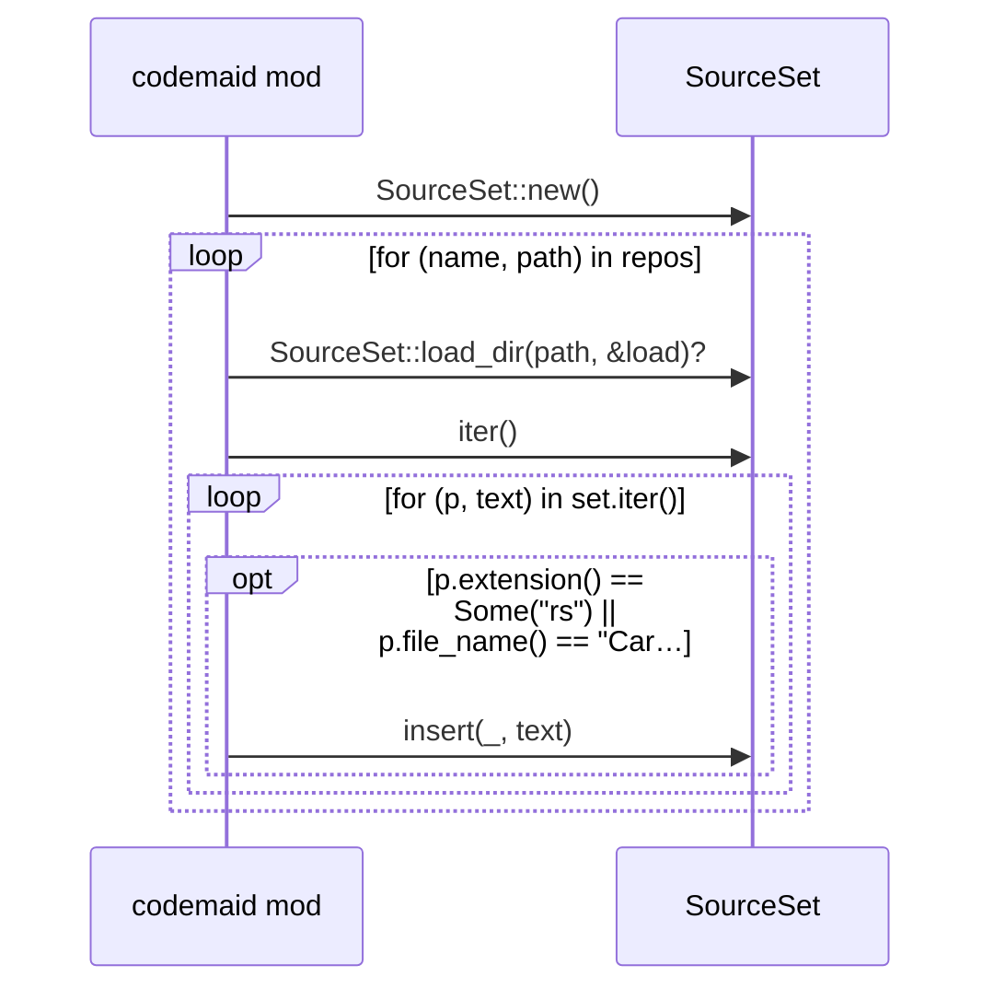

# `codemaid` · crates/codemaid/src/lib.rs
> Deterministic, dense **codebase → Mermaid** generation for LLM agents.

## structure

## `codemaid::generate_dir`
`pub fn generate_dir(root: &Path, options: &Options) -> io::Result<Corpus>` · L84-L88
> Load, extract and project a single directory.

## `codemaid::generate_repos`
`pub fn generate_repos(repos: &[(&str, &Path)], options: &Options) -> io::Result<Corpus>` · L90-L101
> Load several repositories as one codebase.

## `codemaid::load_repos`
`pub fn load_repos(repos: &[(&str, &Path)]) -> io::Result<SourceSet>` · L103-L116
> Load several repositories into one [`SourceSet`] under `<name>/` prefixes.

