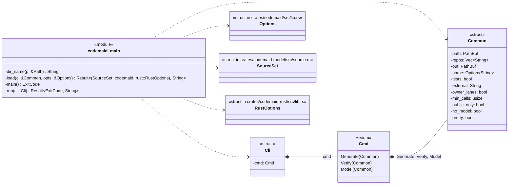
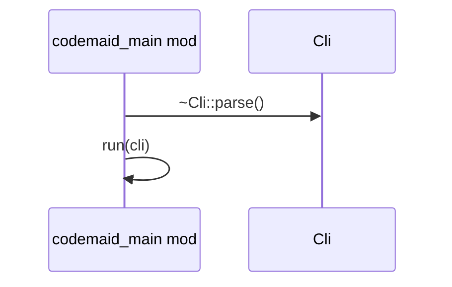
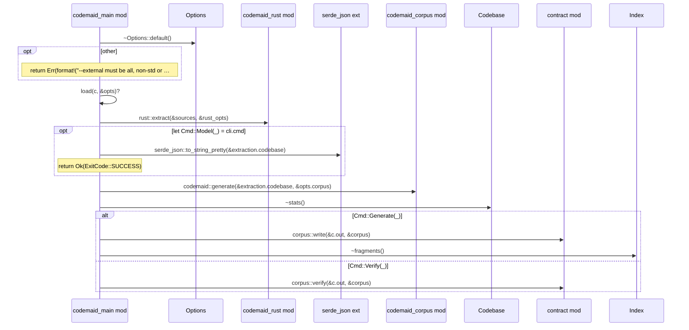
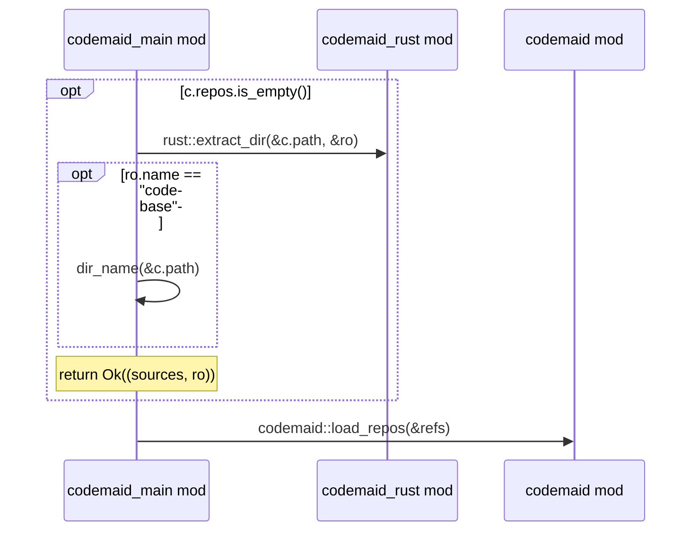

# `codemaid_main` · crates/codemaid/src/main.rs
> `codemaid` command-line tool.

## structure

## `codemaid_main::main`
`fn main() -> ExitCode` · L72-L81

## `codemaid_main::run`
`fn run(cli: Cli) -> Result<ExitCode, String>` · L83-L148

## `codemaid_main::load`
`fn load(c: &Common, opts: &Options) -> Result<(SourceSet, codemaid::rust::RustOptions), String>` · L150-L171

