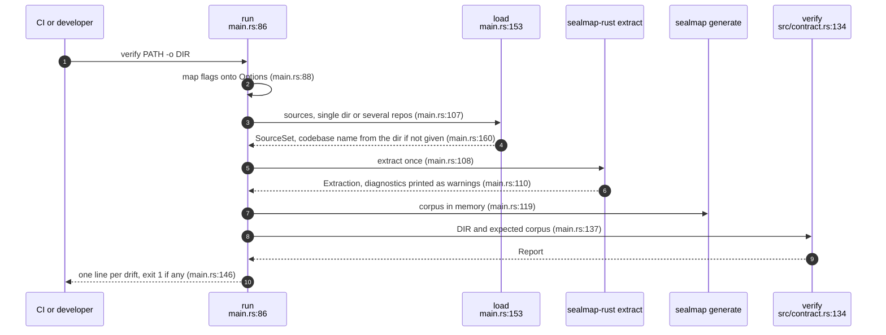
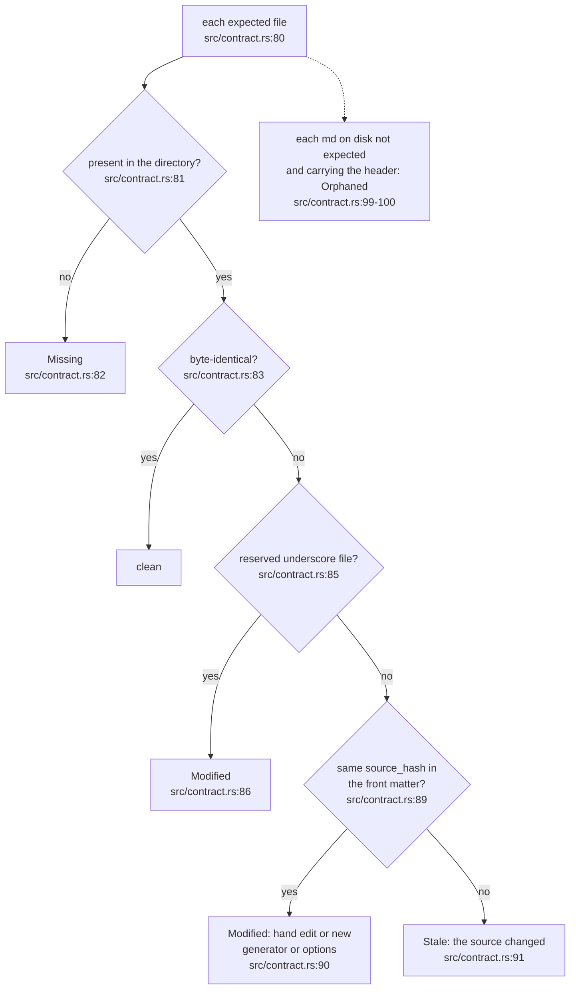
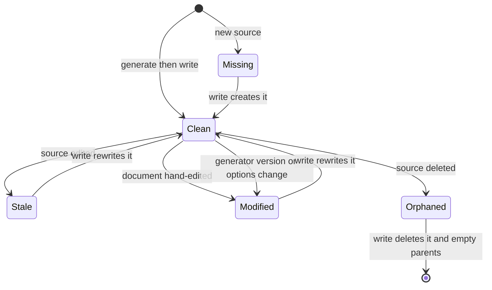
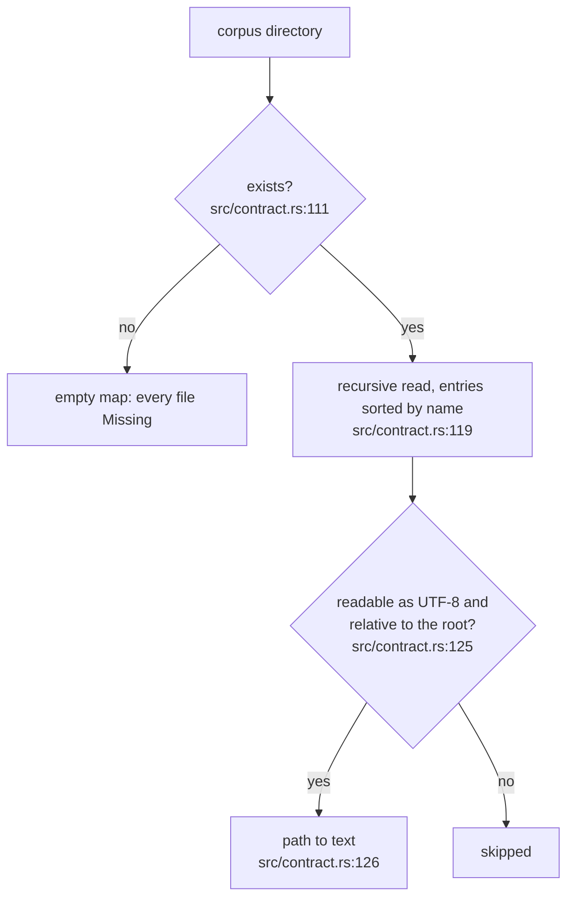
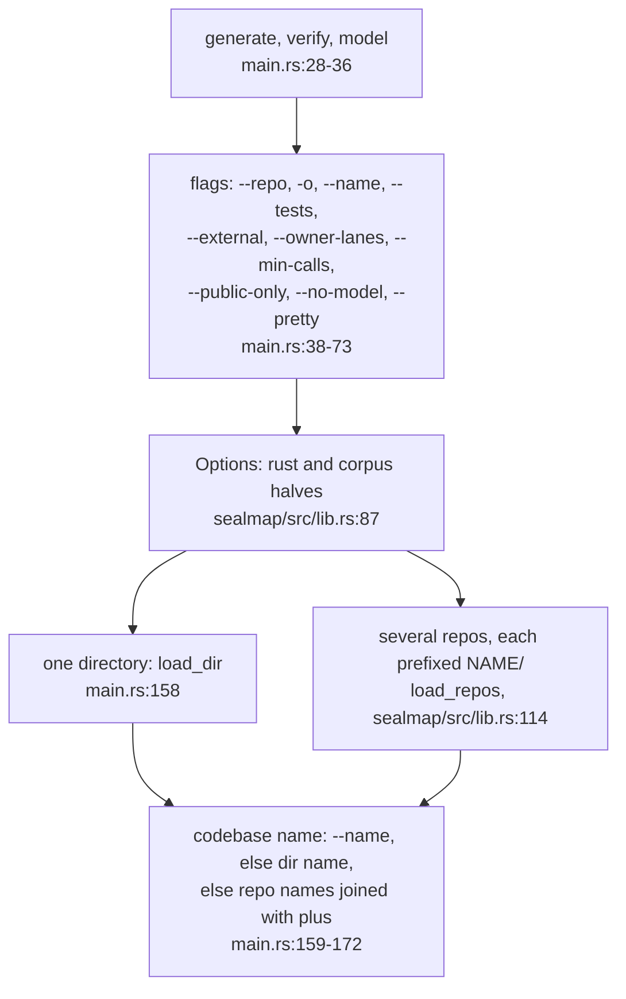

## For developers

`verify` and `write` are the 0.1 contract between a generated corpus and a
directory on disk. `verify_against` compares a freshly generated `Corpus`
with what a directory holds and classifies every difference as missing,
orphaned, stale or modified; `write` brings the directory into compliance and
only ever deletes files that carry the generator's header
(`crates/sealmap-corpus/src/contract.rs:1`-`2`,
`crates/sealmap-corpus/src/lib.rs:7`-`24`). The `sealmap` binary wraps both,
plus `model`, over the facade's load-extract-generate path.

This is the surface the accepted design changes most. Today's `sealmap verify`
is the 1:1 drift gate, and CI runs it on the committed self-corpus
(`.github/workflows/ci.yml:24`-`25`). The design keeps the 1:1 writer as an
optional view, turns this check into a local consistency check, and gives the
name `verify` to the planned seal gate (`docs/DESIGN.md:44`-`46`,
`docs/DESIGN.md:117`). DEL-02 catalogues that gap; this topic draws what runs.

## For the business

Today the command line does three things: write the generated corpus, check a
directory against the sources, and print the model. The check is what a CI
job can block on, and it is exact: it says which files are missing, which are
left over, which are out of date because the code changed, and which were
edited by hand or by a different generator version.

For an adopter planning on the 0.2 seal workflow, the important fact is that
`sealmap verify` today checks the mechanical corpus, not reviewed diagrams.
The command that will check seals has the same name and does not exist yet,
so a pipeline written against today's `verify` will change meaning at 0.2.

## COR-03.1 sealmap verify, end to end

**What it shows.** Verify regenerates the whole corpus in memory and compares;
nothing is trusted from disk except the bytes being checked.

**Why it is this way.** The CLI loads once and extracts once; an earlier
version ran the adapter twice and threw the first result away
(`crates/sealmap/src/main.rs:156`-`157`). Errors in arguments or IO exit 2,
drift exits 1 (`crates/sealmap/src/main.rs:81`, `crates/sealmap/src/main.rs:146`).

**Tension (default vs docs and CI):** the `-o` default is `.sealmap`
(`crates/sealmap/src/main.rs:47`), as the rename commit set it, but the
binary's own usage text writes `-o docs/sealmap`
(`crates/sealmap/src/main.rs:4`-`5`) and CI passes it explicitly
(`.github/workflows/ci.yml:25`).

## COR-03.2 Classifying a difference

**What it shows.** The front-matter source hash is what separates "the code
changed" from "the document was touched"; anything in the directory that is
not a generated document is ignored.

**Why it is this way.** Recording the source hash in each document makes drift
detectable without re-parsing the old state (`crates/sealmap-corpus/src/lib.rs:11`-`12`);
`verify_classifies_every_kind_of_drift` pins all four classes
(`crates/sealmap-corpus/tests/contract.rs:106`).

**Debt:** a reserved file is always `Modified` when it differs
(`crates/sealmap-corpus/src/contract.rs:85`-`86`), even when the difference is
that the code changed, so `_index.json` and `_model.json` never report stale.

## COR-03.3 A corpus file's drift states

**What it shows.** Every drift is repaired by `write` in one step: stale,
modified and missing files are written, orphaned generated documents are
deleted, and unchanged files are not touched.

**Why it is this way.** Untouched files keep their mtimes, so a re-run is cheap
for anything watching the directory (`crates/sealmap-corpus/src/contract.rs:138`-`141`);
`write_converges_and_is_idempotent` pins that a second `write` changes
nothing (`crates/sealmap-corpus/tests/contract.rs:138`).

**Invariant:** `write` deletes only Markdown files that start with the
generator marker, never anything else in the directory
(`crates/sealmap-corpus/src/contract.rs:99`, `crates/sealmap-corpus/src/document.rs:153`-`155`).

## COR-03.4 Reading a directory

**What it shows.** The directory is read into the same path-to-text map the
generator produces, in sorted order, so the comparison is a map diff.

**Why it is this way.** Sorting entries keeps the report order independent of
the file system (`crates/sealmap-corpus/src/contract.rs:119`); the whole corpus
can also be summarised as one hash for cheap cross-machine equality
(`crates/sealmap-corpus/src/contract.rs:174`-`183`).

## COR-03.5 Commands, flags and the facade

**What it shows.** All three commands share one flag set that fills the
facade's `Options`; several repositories are loaded into one `SourceSet` under
name prefixes, so calls between them resolve and the overview groups crates by
repository (`crates/sealmap/src/lib.rs:100`-`102`).

**Why it is this way.** The facade exists so the common path is one dependency
(`crates/sealmap/src/lib.rs:34`-`36`); the CLI is behind the default `cli`
feature, so a library user does not pull in clap.

**Drift (DESIGN.md vs CLI):** the design's CLI table lists `generate [--check]`
(`docs/DESIGN.md:119`); the binary has no `--check` flag on any command
(`crates/sealmap/src/main.rs:38`-`73`), and the local check is `verify`.
