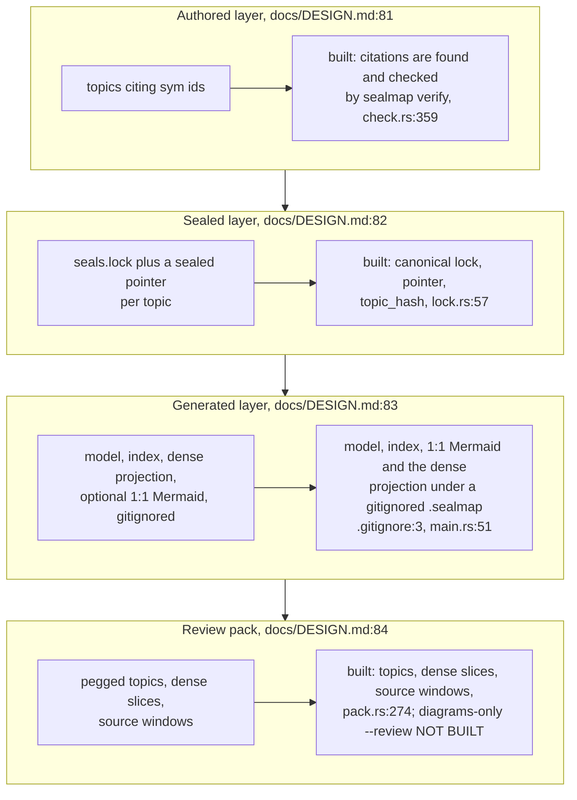
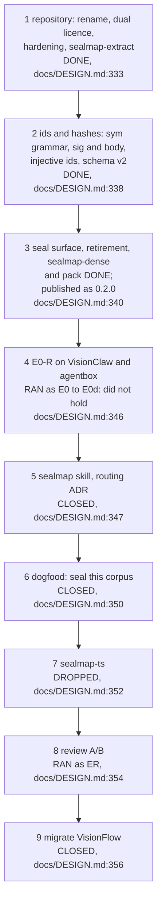
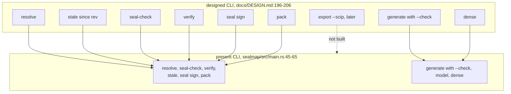
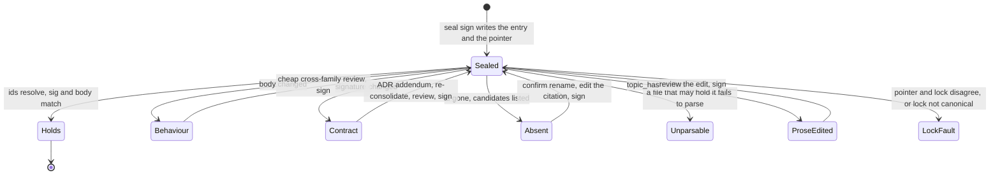
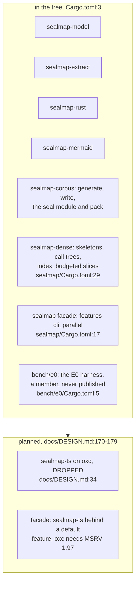
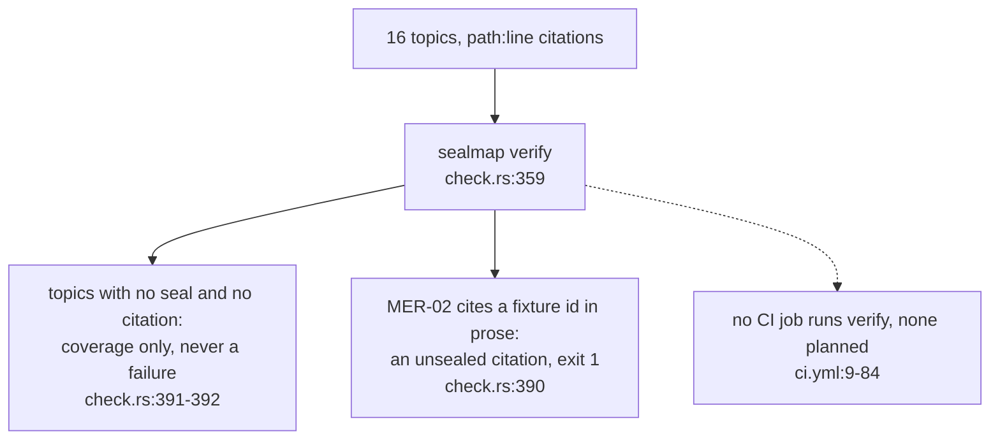

## For developers

`docs/DESIGN.md` was accepted on 2026-10-05 with every recommendation taken
(`docs/DESIGN.md:45`). Steps 1 and 2 of its order of work landed the same day,
and step 3 followed in the tree: the lock, `resolve`, `stale`, `seal-check`,
`verify`, `seal sign`, the retirement of the committed generated corpus,
`sealmap-dense` with its `sealmap dense` subcommand, and `pack`
(`docs/DESIGN.md:340`-`345`). Step 3 closed with the 0.2.0 publish
(`docs/DESIGN.md:344`-`345`), and 0.2.1 followed (`Cargo.toml:6`).

Then the evidence programme ran, and DESIGN now opens with its outcome
(`docs/DESIGN.md:3`-`41`). The code-lens surface is kept: extraction, ids and
hashes, the generated views, `sealmap-dense` and `pack`. The seal surface is
frozen as experimental: every staleness rule finer than per-file lost real
changes for at most about 2× fewer flags. `sealmap-ts` is dropped. The README
says the same to adopters (`README.md:41`-`46`, `README.md:367`-`378`). This
topic is the catalogue of the gap that leaves: what the design still
describes that the code does not do, which steps closed, and what is open.

It is a catalogue, not a plan. The design's order of work
(`docs/DESIGN.md:331`-`357`) is the plan. Where the build settled something
the design left loose, DESIGN now records it as built (`docs/DESIGN.md:114`-`116`,
`docs/DESIGN.md:122`-`136`, `docs/DESIGN.md:155`-`163`, `docs/DESIGN.md:213`-`233`), and the subsystem topics carry the detail: the
seal module in COR-04, the seal commands in COR-05, `generate --check` in
COR-03, `pack` in COR-06.

## For the business

What an adopter gets is a code lens: generated views that show what the
code does, a dense projection an agent can read at about a quarter of the
source's size, and review packs, one bounded, reproducible file holding the
topics to review and the code they cite. The designed variant that holds
diagrams alone, for an outside reviewer who should not see code, is not
built.

The seal workflow also exists, but the headline saving it was built for did
not survive measurement. Seals flagged only slightly fewer topics than
per-file flags and missed real changes, so the cheaper way to keep diagrams
true is per-file flags batched weekly, with a model triaging each one. The
seal commands stay, marked experimental; this repository does not seal its
own diagrams and its CI does not run the seal gate.

## DEL-02.1 The design's layers against the tree

**What it shows.** All four layers exist, the generated one no longer
committed; of the review pack, only the diagrams-only mode is missing.

**Why it is this way.** Step 3 split in two: the seal surface first, then
`pack` and `sealmap-dense` (`docs/DESIGN.md:319`-`321`); `sealmap-dense` was
built on a branch and merged after the seal surface. The generated corpus
is rebuilt on demand and never trusted from disk (`docs/DESIGN.md:86`-`90`).

`sealmap-dense` came in under its estimate. The README now reports the
measured 0.17–0.29× source (`README.md:60`) where it quoted the research's
0.45×, and DESIGN records why the built projection is smaller: each callable
is expanded once and each signature printed once (`docs/DESIGN.md:181`-`186`).

**Debt (designed, not built):** `--review`, a pack of diagrams only, is in
the layer table (`docs/DESIGN.md:84`) but not in the binary
(`docs/DESIGN.md:223`, `crates/sealmap/src/main.rs:45`-`65`).

## DEL-02.2 The order of work and where the tree stands

**What it shows.** Steps 1 to 3 are done and published. Step 4, the first
number the design was built to produce, ran as E0 and its successors E0b to
E0d and did not hold; step 8's review comparison ran as ER. The other steps
are closed or dropped (`docs/DESIGN.md:26`-`35`).

**Why it is this way.** The evidence endpoints are a fixed sequence, each
tested only if the previous one holds (`docs/DESIGN.md:304`-`305`). Step 4
failed, so the steps that depended on cheaper upkeep went with it.

The pre-registrations and results now live in the repository, one directory
per experiment under `docs/evidence/` (`docs/DESIGN.md:8`). The design's
older `research/01` to `05` are still cited from a design-session
scratchpad (`docs/DESIGN.md:46`-`47`).

## DEL-02.3 Planned commands against present ones

**What it shows.** Every designed command except the later `export --scip`
exists, and `verify` now means the seal gate only; the old drift check is
`generate --check`.

**Why it is this way.** Git stays out of the libraries: `--since` and
`--diff` export the revision with `git archive` and read it as a second model
(`docs/DESIGN.md:208`-`211`, `crates/sealmap/src/main.rs:608`-`617`). `pack`
was built to its own flags rather than the planned ones: `--diff REV`
against the working tree instead of two named trees, and `--budget` instead
of `--max-bytes`. DESIGN records both (`docs/DESIGN.md:203`,
`docs/DESIGN.md:213`-`222`).

## DEL-02.4 A sealed topic's life, as built

**What it shows.** The lifecycle the design gives a sealed topic
(`docs/DESIGN.md:141`-`153`), now with every state reachable from the code;
the review between a failing state and the next seal is the skill's step, not
the crate's.

**Why it is this way.** Code, topic and lock were to land in one commit,
ending the two-commit "change then re-stamp" routine (`docs/DESIGN.md:246`);
`seal sign` re-derives the entry from the code, so the lock is never
hand-edited (`docs/DESIGN.md:122`-`127`). The cycle works as drawn, but
`Holds` means only that no cited body changed: the per-symbol rule caught
0.76 of real staleness (`README.md:81`-`85`), which is why the surface is
frozen.

Reviewer family, evidence and signatures were left to a skill script,
`seal-gate.mjs`, next to `verify` (`docs/DESIGN.md:165`-`166`). With the seal
work frozen that script will not be written, so `seal sign` records whatever
reviewer string it is given and nothing enforces the cross-family rule.

## DEL-02.5 Crates planned against crates present

**What it shows.** Seven crates exist, `sealmap-dense` the newest, and the
corpus crate has gained `pack`; the one planned crate is dropped. The workspace has an
eighth member, the E0 benchmark harness, which is never published
(`bench/e0/Cargo.toml:5`).

**Why it is this way.** The owner deferred `sealmap-ts` on 2026-10-05, to be
built only if E0-R on the Rust repositories showed the precise-staleness
gain was real (`docs/DESIGN.md:352`-`353`). It did not, so the adapter is
dropped (`docs/DESIGN.md:34`-`35`, `README.md:261`). The crate-surface row
and its default facade feature (`docs/DESIGN.md:175`, `docs/DESIGN.md:179`)
stay in DESIGN as history; the MSRV question they raised no longer arises.

The workspace is at `0.2.1` (`Cargo.toml:6`), so a lock signed by this tree
names `sealmap` 0.2.1; 0.2.0 was the first release with the seal module
(`crates/sealmap-corpus/src/seal/lock.rs:21`).

## DEL-02.6 Dogfooding the gate on this repository

**What it shows.** Run on this repository at `ae478d9`, `sealmap verify` treats
fifteen topics as legacy coverage and fails on one: MER-02 writes an example
id from a fixture crate (`shop`) as an inline code span, which reads as a
citation of a symbol nobody sealed.

**Why it is this way.** Legacy `path:line` topics must not fail the gate, or
a corpus could not migrate one topic at a time (`docs/DESIGN.md:161`-`163`);
a global-shaped id in a code span is always a citation, so a mistyped one
fails rather than vanishing (COR-04).

Step 6, which would have run `verify` in CI here, is closed
(`docs/DESIGN.md:26`-`30`). MER-02's example id would still have to move into
a fenced block or be reworded before `verify` could pass on this repository
(`crates/sealmap-corpus/src/seal/check.rs:390`).
