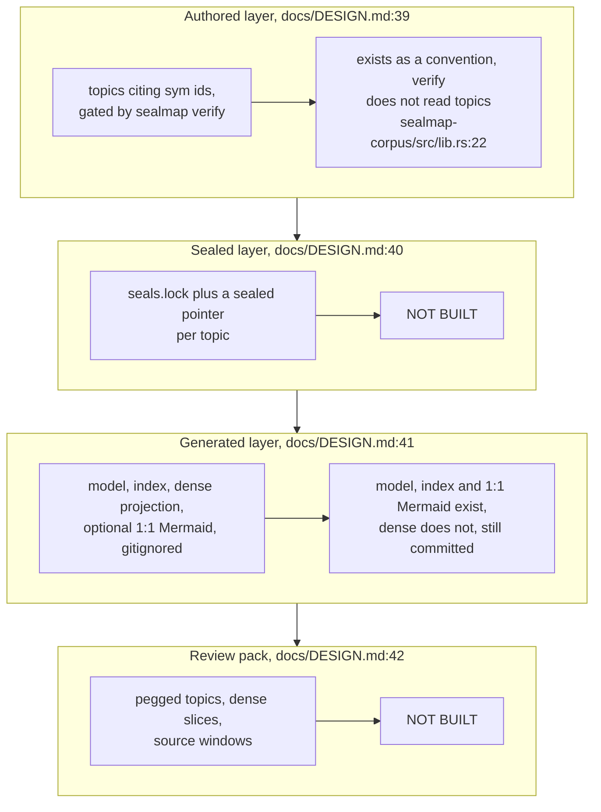
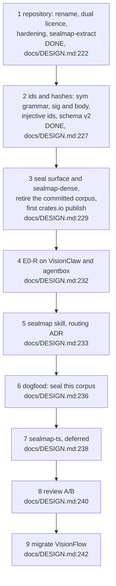
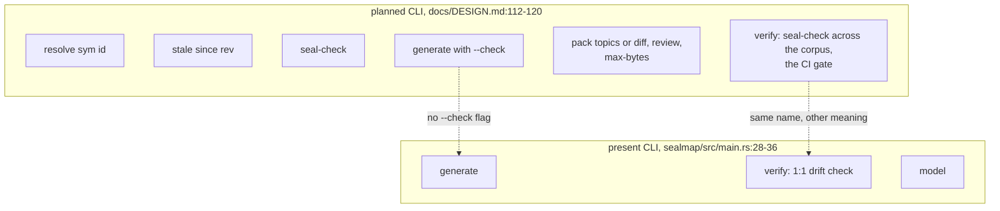
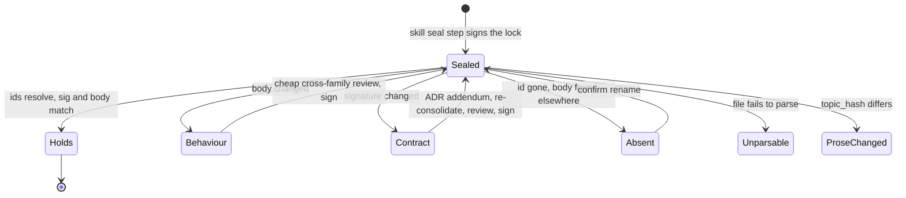
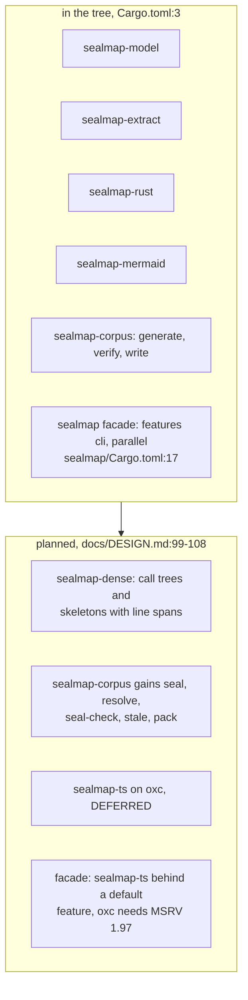
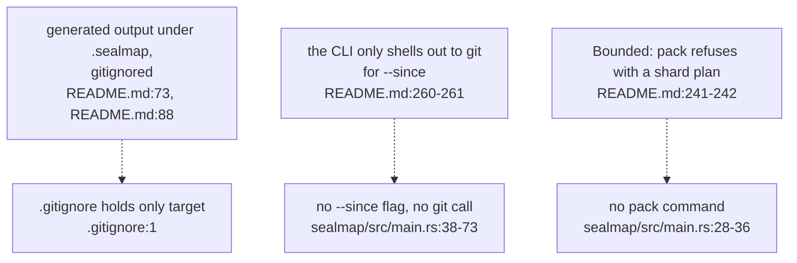

## For developers

`docs/DESIGN.md` was accepted on 2026-10-05 with every recommendation taken
(`docs/DESIGN.md:3`), and the same day steps 1 and 2 of its order of work
landed: the rename, licence, hardening and shared extraction core, then
`sym:` ids, fingerprints, schema v2, injective Mermaid ids, the resolver fix
and the MSRV job (`README.md:271`-`277`). Everything after step 2 is design
only. This topic is the catalogue of that gap: what the design and README
describe that the code at `af4b8b4` does not do, where the two documents speak
in the present tense about planned work, and the open questions the design
leaves.

It is a catalogue, not a plan. The design's order of work
(`docs/DESIGN.md:220`-`243`) is the plan; the register entries below are the
state of play against it. Topics elsewhere carry the gaps local to their
subsystem (the missing `flow_hash` in MOD-02, the stale id-suffix row in
MER-02, `generate --check` in COR-03).

## For the business

What an adopter can use today is the deterministic substrate: stable ids,
signature and body fingerprints on every symbol, and the generated per-file
corpus with its index. What the project is *for*, sealed diagrams that CI can
check without a model and precise "which topics need a look" after a commit,
is designed in detail but not built. The headline cost saving has not been
measured yet either: the evidence plan's first endpoint is step 4.

That matters for planning. A harness that wires in `sealmap verify` today gets
the mechanical drift check, which will change meaning when the seal gate takes
the name. The TypeScript adapter, needed for TypeScript estates, is deferred
until the Rust measurement shows the gain is real, so a TypeScript-heavy
adopter should not plan on it.

## DEL-02.1 The design's layers against the tree

**What it shows.** Of the four artefact layers in the design, only the
generated one exists, and it exists in its 0.1 form: committed under
`docs/sealmap/` and CI-gated, without the dense projection.

**Why it is this way.** Step 3 is the seal surface and `sealmap-dense`, with
the committed corpus retired in the same step (`docs/DESIGN.md:229`-`231`);
the tree stops after step 2.

**Debt (designed, not built):** seals do not exist: no lock format, no
`sealed:` pointer, no `topic_hash` (`docs/DESIGN.md:48`-`77`); the CLI has
`generate`, `verify` and `model` only (`crates/sealmap/src/main.rs:28`-`36`).

**Tension (DESIGN.md vs CI):** the design lists the committed 0.1 corpus and
its CI drift gate as retired (`docs/DESIGN.md:44`-`46`), while CI still runs
`sealmap verify` against the committed `docs/sealmap`
(`.github/workflows/ci.yml:24`-`25`) and the README dates the retirement to
0.2 (`README.md:293`-`294`).

## DEL-02.2 The order of work and where the tree stands

**What it shows.** Nine steps, two done. The first number the design is built
to produce, topics flagged per commit file-level against sealed, comes at
step 4 and depends on step 3.

**Why it is this way.** The evidence endpoints are a fixed sequence, each
tested only if the previous one holds (`docs/DESIGN.md:193`-`194`).

**Open:** the endpoints are to be pre-registered in `PREREG.md` before any run
(`docs/DESIGN.md:194`), and the design cites its evidence as `research/01`
to `05` in a design-session scratchpad (`docs/DESIGN.md:4`-`5`); neither is in
the repository, so where do the pre-registration and the evidence live?

## DEL-02.3 Planned commands against present ones

**What it shows.** Five of the planned commands do not exist; the two that
share names with present commands mean different things.

**Why it is this way.** The design keeps git out of the libraries, with
`--since` as CLI sugar (`docs/DESIGN.md:122`-`123`); none of the seal surface
has been started, so none of that plumbing exists.

**Debt (designed, not built):** `resolve`, `stale`, `seal-check` and `pack`
are designed (`docs/DESIGN.md:114`-`118`) and planned in the README
(`README.md:220`-`227`) but absent from the binary
(`crates/sealmap/src/main.rs:28`-`36`).

**Tension (verify, today vs planned):** the README's planned `sealmap verify`
is "the CI gate" over seals (`README.md:225`), while the present `verify` is the
1:1 drift check (`crates/sealmap/src/main.rs:32`-`33`); one name, two contracts.

## DEL-02.4 A sealed topic's planned life

**What it shows.** The lifecycle the design gives a sealed topic, from the
`verify` table and the build-with-quality re-seal step
(`docs/DESIGN.md:79`-`92`, `docs/DESIGN.md:136`). None of it runs today;
the fingerprints it depends on do (MOD-02).

**Why it is this way.** Code, topic and lock are to land in one commit, ending
today's two-commit "change then re-stamp" routine (`README.md:101`-`102`).

**Debt (designed, not built):** `stale`, which flags only topics whose sealed
symbols changed, is the design's answer to file-granular staleness
(`docs/DESIGN.md:115`, `README.md:39`-`41`); without it a code commit still
flags every topic citing a changed file, the cost the README measures at a
median 10 of 45 topics per commit (`README.md:57`).

## DEL-02.5 Crates planned against crates present

**What it shows.** Six crates exist; one more is planned, one is deferred, and
the corpus crate and facade are planned to grow.

**Why it is this way.** The owner deferred `sealmap-ts` on 2026-10-05: it is
built only if E0-R on the Rust repositories shows the precise-staleness gain
is real (`docs/DESIGN.md:174`-`177`, `README.md:199`).

**Debt (designed, not built):** `sealmap-dense`, the agent projection the
README credits with 0.45× source size and about 13 tokens per call edge
(`README.md:59`), does not exist (`docs/DESIGN.md:106`); the workspace has six
members and none of them is it (`Cargo.toml:3`).

**Open:** `sealmap-ts` is deferred (`docs/DESIGN.md:104`), yet the crate
surface still plans it behind a *default* facade feature because oxc needs
MSRV 1.97 (`docs/DESIGN.md:108`); if it is ever built, does the facade's 1.85
MSRV survive a default feature that needs 1.97?

## DEL-02.6 Present-tense claims about planned work

**What it shows.** Three README statements describe planned behaviour as if it
existed.

**Why it is this way.** The README separates "exist" from "planned" in its
opening list and roadmap (`README.md:29`-`44`), but the layer table, the
properties list and the "what it does not do" list were written for the
designed system.

**Drift (README vs .gitignore):** the README says generated output goes to a
gitignored `.sealmap/` (`README.md:73`, `README.md:88`); the repository's
`.gitignore` ignores only `/target` (`.gitignore:1`), and the CLI writes to
`.sealmap` by default (`crates/sealmap/src/main.rs:47`).

**Drift (README vs CLI):** "the CLI only shells out to `git` for `--since`"
(`README.md:260`-`261`) and "`pack` refuses an over-budget request with a
shard plan" (`README.md:241`-`242`) are written in the present tense; neither
`--since` nor `pack` exists (`crates/sealmap/src/main.rs:28`-`73`).
