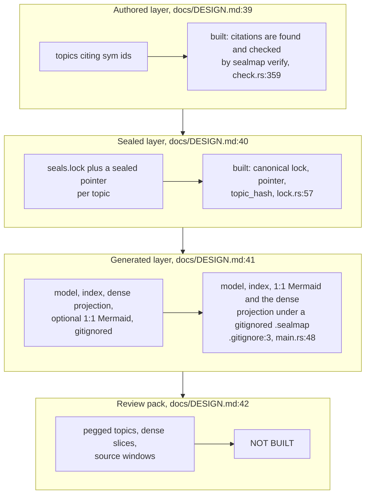
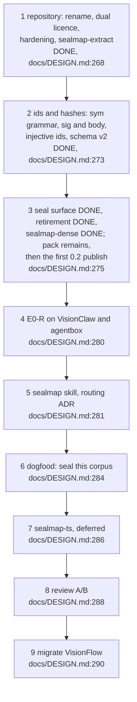
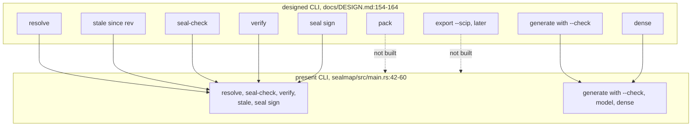
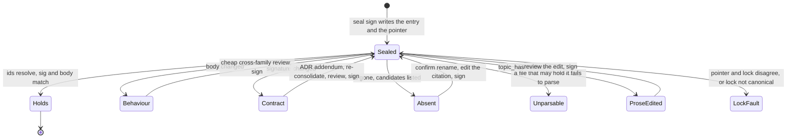
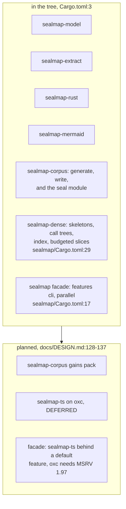
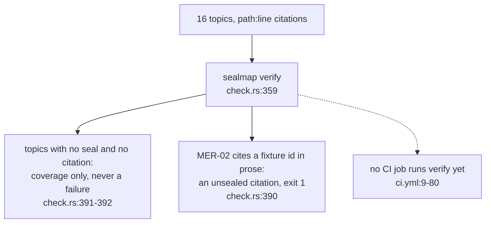

## For developers

`docs/DESIGN.md` was accepted on 2026-10-05 with every recommendation taken
(`docs/DESIGN.md:3`). Steps 1 and 2 of its order of work landed the same day,
and most of step 3 followed: the lock, `resolve`, `stale`, `seal-check`,
`verify`, `seal sign`, the retirement of the committed generated corpus, and
`sealmap-dense` with its `sealmap dense` subcommand
(`docs/DESIGN.md:275`-`279`, `README.md:349`-`352`). What remains of step 3
is `pack`. This topic is the catalogue of the gap at the merge of
`sealmap-dense`: what the design still describes that the code does not do,
and the questions the design leaves open.

It is a catalogue, not a plan. The design's order of work
(`docs/DESIGN.md:266`-`291`) is the plan. Where the build settled something
the design left loose, DESIGN now records it as built (`docs/DESIGN.md:72`-`74`,
`docs/DESIGN.md:80`-`94`, `docs/DESIGN.md:113`-`121`), and the subsystem topics carry the detail: the
seal module in COR-04, the seal commands in COR-05, `generate --check` in
COR-03.

## For the business

An adopter can now use what the project is *for*: hand-written diagram topics
cite functions by stable id, a lockfile records the exact versions a reviewer
checked them against, and one command in CI says whether every seal still
holds, with no model involved. After a commit, a second command lists only
the topics whose sealed functions changed.

The dense agent projection now exists: an agent can read the shape of the
code at about a quarter of the source's size. One thing is still to come
before the first 0.2 release: bounded review packs for an outside reviewer.
The headline
cost saving is not measured yet; that is step 4. And this repository has not
sealed its own diagrams yet, so its CI does not run the seal gate (step 6).

## DEL-02.1 The design's layers against the tree

**What it shows.** The authored, sealed and generated layers exist, the
generated one no longer committed; the review pack does not exist.

**Why it is this way.** Step 3 split in two: the seal surface first, then
`pack` and `sealmap-dense` (`docs/DESIGN.md:277`-`279`); `sealmap-dense` was
built on a branch and merged after the seal surface. The generated corpus
is rebuilt on demand and never trusted from disk (`docs/DESIGN.md:44`-`48`).

`sealmap-dense` came in under its estimate. The README now reports the
measured 0.17–0.29× source (`README.md:59`) where it quoted the research's
0.45×, and DESIGN records why the built projection is smaller: each callable
is expanded once and each signature printed once (`docs/DESIGN.md:139`-`144`).

**Debt (designed, not built):** the review pack is designed
(`docs/DESIGN.md:42`) and planned in the README (`README.md:42`-`44`) but
absent from the binary (`crates/sealmap/src/main.rs:42`-`60`).

## DEL-02.2 The order of work and where the tree stands

**What it shows.** Two steps done and all of the third but `pack`. The first
number the design is built to produce, topics flagged per commit file-level
against sealed, comes at step 4; `stale --since` is the tool it needs, and it
exists.

**Why it is this way.** The evidence endpoints are a fixed sequence, each
tested only if the previous one holds (`docs/DESIGN.md:239`-`240`).

**Open:** the endpoints are to be pre-registered in `PREREG.md` before any run
(`docs/DESIGN.md:240`), and the design cites its evidence as `research/01`
to `05` in a design-session scratchpad (`docs/DESIGN.md:4`-`5`); neither is in
the repository, so where do the pre-registration and the evidence live?

## DEL-02.3 Planned commands against present ones

**What it shows.** Every designed command except `pack` and the later
`export --scip` exists, and `verify` now means the seal gate only; the old
drift check is `generate --check`.

**Why it is this way.** Git stays out of the libraries: `--since` exports the
revision with `git archive` and reads it as a second model
(`docs/DESIGN.md:166`-`169`, `crates/sealmap/src/main.rs:557`-`566`).

**Debt (designed, not built):** `pack` is designed with a byte budget and a
shard plan (`docs/DESIGN.md:161`) and listed as planned in the README
(`README.md:292`-`297`), but the binary has no such command
(`crates/sealmap/src/main.rs:42`-`60`).

## DEL-02.4 A sealed topic's life, as built

**What it shows.** The lifecycle the design gives a sealed topic
(`docs/DESIGN.md:99`-`111`), now with every state reachable from the code;
the review between a failing state and the next seal is the skill's step, not
the crate's.

**Why it is this way.** Code, topic and lock land in one commit, ending the
two-commit "change then re-stamp" routine (`README.md:104`-`105`); `seal sign`
re-derives the entry from the code, so the lock is never hand-edited
(`docs/DESIGN.md:80`-`85`).

**Open:** reviewer family, evidence and signatures are left to a skill script,
`seal-gate.mjs`, next to `verify` (`docs/DESIGN.md:123`-`124`); `seal sign`
records whatever reviewer string it is given, so until that script exists
nothing enforces the cross-family rule.

## DEL-02.5 Crates planned against crates present

**What it shows.** Seven crates exist, `sealmap-dense` the newest; one is
deferred, and the corpus crate is planned to gain `pack`.

**Why it is this way.** The owner deferred `sealmap-ts` on 2026-10-05: it is
built only if E0-R on the Rust repositories shows the precise-staleness gain
is real (`docs/DESIGN.md:286`-`287`, `README.md:257`).

**Debt:** the workspace is still at version `0.1.0` (`Cargo.toml:6`), and the
lock records its writer as `sealmap` plus that version
(`crates/sealmap-corpus/src/seal/lock.rs:21`), so a lock signed by this tree
names a released version that has no seal module until the 0.2 bump.

**Open:** `sealmap-ts` is deferred (`docs/DESIGN.md:133`), yet the crate
surface still plans it behind a *default* facade feature because oxc needs
MSRV 1.97 (`docs/DESIGN.md:137`); if it is ever built, does the facade's 1.85
MSRV survive a default feature that needs 1.97?

## DEL-02.6 Dogfooding the gate on this repository

**What it shows.** Run on this repository at `ae478d9`, `sealmap verify` treats
fifteen topics as legacy coverage and fails on one: MER-02 writes an example
id from a fixture crate (`shop`) as an inline code span, which reads as a
citation of a symbol nobody sealed.

**Why it is this way.** Legacy `path:line` topics must not fail the gate, or
a corpus could not migrate one topic at a time (`docs/DESIGN.md:119`-`121`);
a global-shaped id in a code span is always a citation, so a mistyped one
fails rather than vanishing (COR-04).

**Debt:** step 6 needs MER-02's example id moved into a fenced block or
reworded before `verify` can run in CI on this repository
(`crates/sealmap-corpus/src/seal/check.rs:390`, `docs/DESIGN.md:284`-`285`).
