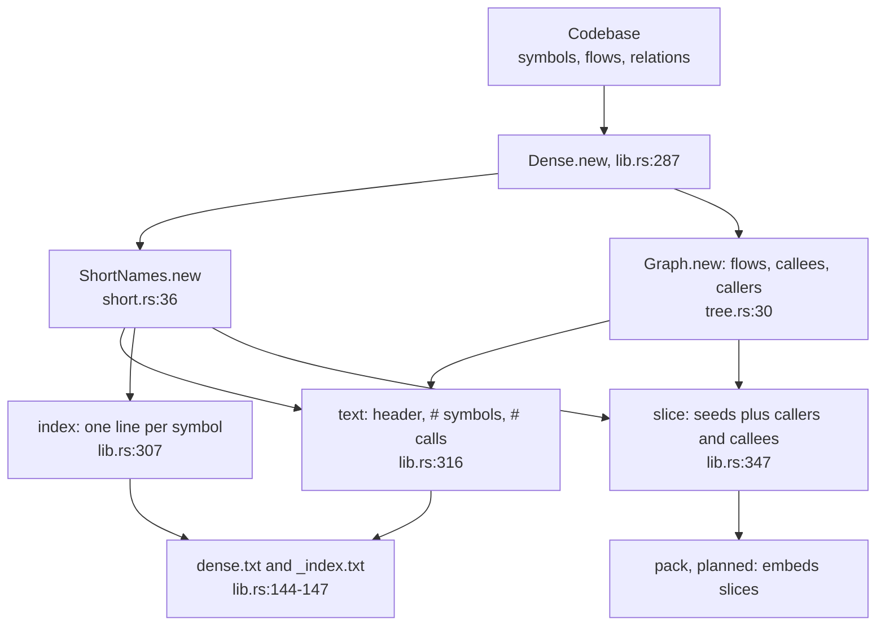
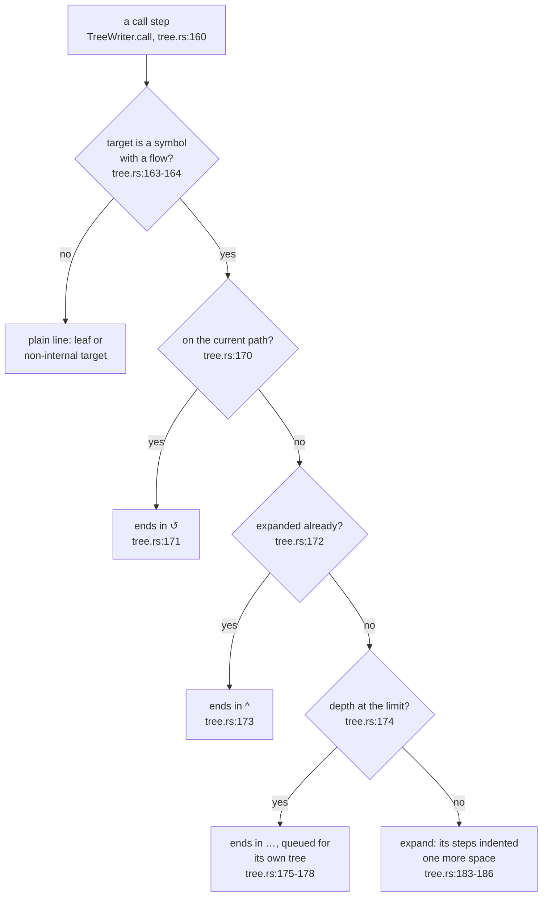
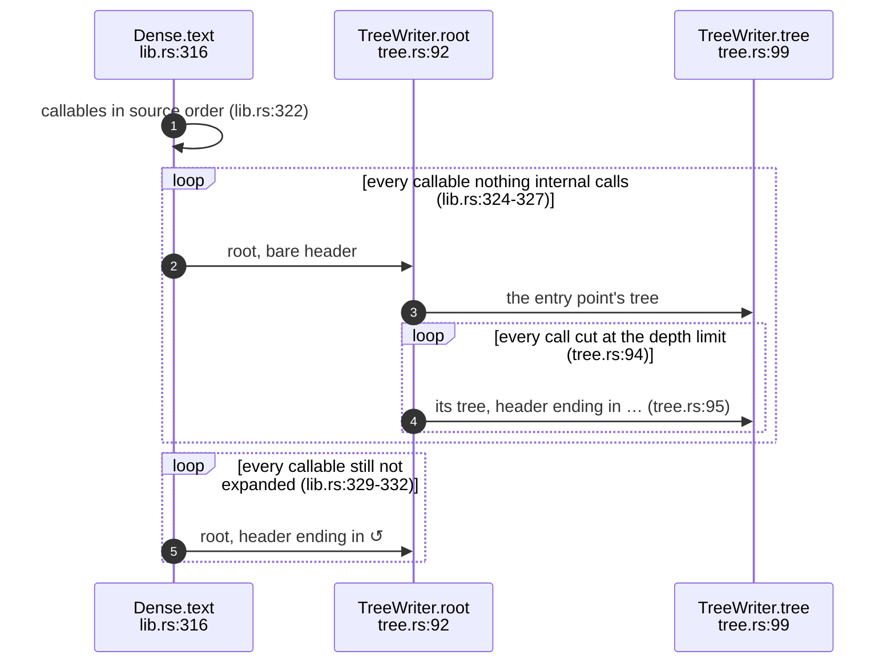
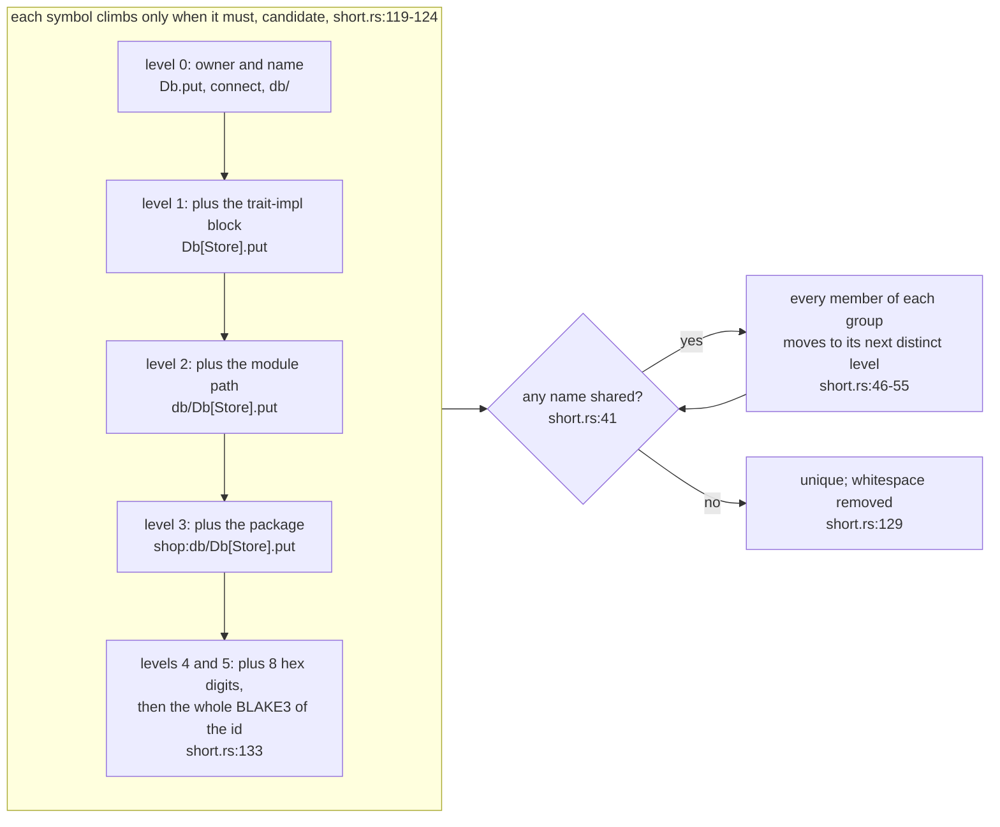
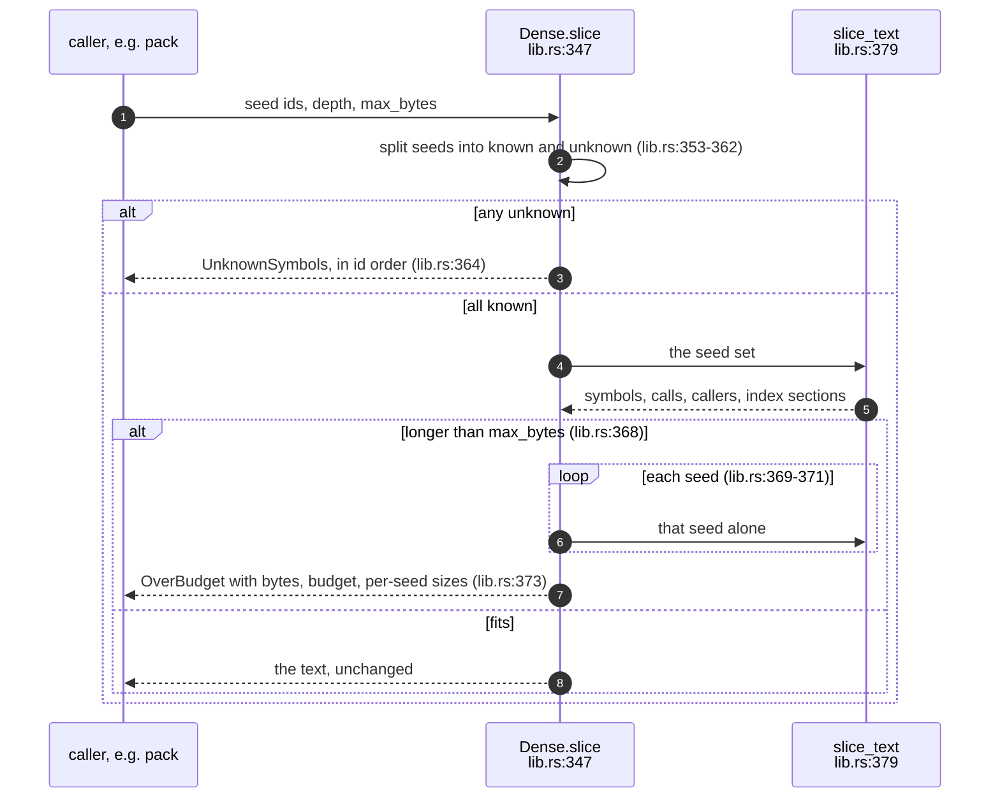
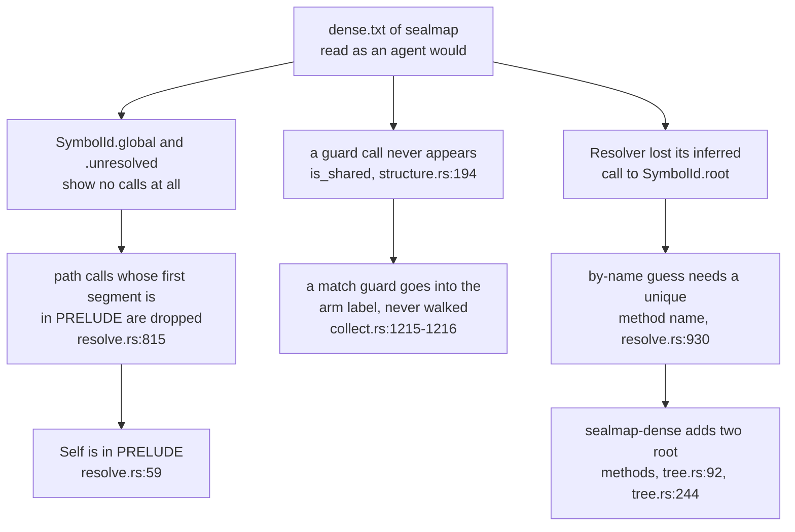

## For developers

`sealmap-dense` turns a `Codebase` into the text an agent reads instead of
source or Mermaid. It depends only on `sealmap-model`. A `Dense` value is
built once, assigning short names and reading the call graph from the flows
(`crates/sealmap-dense/src/lib.rs:287`). Any number of renders and slices can
then share it. A render is two texts: `dense.txt` holds skeletons and call
trees, and `_index.txt` maps each short name to its `sym:` id and location
(`crates/sealmap-dense/src/lib.rs:144`-`147`). A slice is the bounded excerpt
that the planned `pack` command will embed (`crates/sealmap-dense/src/lib.rs:347`).

Three rules carry the design:

- **Each callable is expanded once per output.** Every later call to it is a
  one-line reference. Every call site appears exactly once, and a test pins
  this at every depth (`crates/sealmap-dense/tests/dense.rs:255`).
- **Short names come from the ids alone.** When names collide, every member of
  the colliding group is qualified together
  (`crates/sealmap-dense/src/short.rs:46`-`55`).
- **A slice over its byte budget is refused, never truncated**
  (`crates/sealmap-dense/src/lib.rs:368`-`373`).

Skeleton lines are grouped by file and sorted by position, with the id as
the tie-break, so the order is total and reads like the source
(`crates/sealmap-dense/src/skeleton.rs:10`-`14`). Each line writes the
signature once, with fields, variants and implemented traits inline
(`crates/sealmap-dense/src/skeleton.rs:40`).

The research behind the crate estimated 0.45× source. As built, `dense.txt`
measures 0.17–0.29× (`docs/DESIGN.md:135`, `docs/DESIGN.md:139`).

On the command line, `sealmap dense [PATH] [-o DIR] [--depth N] [--stats]`
writes both files, by default into `.sealmap/dense`
(`crates/sealmap/src/main.rs:48`, `crates/sealmap/src/main.rs:299`-`306`).
It reads the code with the same `--repo`, `--name` and `--tests` options as
the seal commands, so its `_index.txt` names the ids a seal would. Until the
seal surface merged, the hook was an example binary; the subcommand replaced
it and the example is gone.

This topic also records what reading the projection of sealmap itself
revealed about the Rust adapter (DEN-01.6).

## For the business

An agent that loads the source of a codebase to learn its shape pays for
every comment, every formatting choice and every repeated name. The one-file
Mermaid corpus is no cheaper: it costs 0.48–0.88× the source. The dense
projection carries the same symbols, signatures, line spans and resolved
calls at 0.17–0.29× (`README.md:59`). A fixed context budget therefore holds
roughly three times more of the call graph.

Every call is marked exact, inferred or external, so an agent can tell a
proven edge from a guess. The slice gives a review pack a hard size ceiling.
If the request does not fit, the agent gets an error that names the
overflow. It never receives a silently shortened excerpt that looks complete.

## DEN-01.1 From a model to two texts and a slice

**What it shows.** The two expensive steps, naming and the call graph, run
once. Rendering and slicing only read their results.

**Why it is this way.** `pack` will take many slices of one codebase per
request. A `Dense` built once lets it do so without recomputing the names,
and the one-call `slice` function says so (`crates/sealmap-dense/src/lib.rs:473`-`474`).

**Invariant:** the call graph counts a call only when its target is a symbol
of the codebase, and a callable's own recursion is not counted as a caller,
so a self-recursive function can still be an entry point
(`crates/sealmap-dense/src/tree.rs:38`-`42`).

## DEN-01.2 One call line and its mark

**What it shows.** Every call line ends in at most one mark. A call is only
expanded if it is not on the current path, not already expanded and not at
the depth limit.

**Why it is this way.** Expanding a callable at every call site grows with
the number of paths through the graph. Expanding it once grows with the
number of call sites. The depth limit hardly matters for size (±3 % between
1 and 10 levels), so its default of 3 is chosen for reading, not for bytes
(`docs/DESIGN.md:139`).

**Invariant:** each callable with a flow is expanded exactly once, whatever
the depth (`crates/sealmap-dense/tests/dense.rs:266`).

## DEN-01.3 The order of trees in dense.txt

**What it shows.** Entry points come first, each followed at once by the
trees of the calls it cut. Callables reachable only through a cycle come
last.

**Why it is this way.** Reading sealmap's own projection showed the need for
the header marks. Without them, a cut continuation looked like an entry point
and suggested dead code that was not there. A bare header now means that
nothing in the codebase calls the function (`crates/sealmap-dense/src/lib.rs:150`).

**Invariant:** a pure cycle with no entry point still gets a tree
(`crates/sealmap-dense/tests/dense.rs:455`).

## DEN-01.4 Short names and collisions

**What it shows.** A name starts as short as possible and gains one
qualifier only when another symbol shares it. Both symbols move up
together.

**Why it is this way.** Moving every member keeps a name a function of the
set of ids, not of the order in which symbols were found. A test feeds the
same model in reverse and gets the same index
(`crates/sealmap-dense/tests/dense.rs:444`). The levels follow the `sym:`
grammar's own structure, so a short name reads as a fragment of the id it
stands for.

**Invariant:** short names are unique and resolve back to their ids, even
under deliberate collisions: same names across modules, two `From` impls,
two packages, and ids that differ only in a disambiguator
(`crates/sealmap-dense/tests/dense.rs:413`). If BLAKE3 ever collided, the
loop would still number the members (`crates/sealmap-dense/src/short.rs:57`-`64`).

**Tension (short names vs stability):** a new symbol whose name collides
re-qualifies an existing symbol's short name. Short names are stable for one
output, not across commits. Seals and citations must keep using `sym:` ids,
which `_index.txt` maps to (`crates/sealmap-dense/src/lib.rs:307`).

## DEN-01.5 A slice, and refusing one

**What it shows.** A slice either fits whole or is refused. The refusal
carries what a caller needs to split the request into shards: the total size
and the size of each seed's slice alone.

**Why it is this way.** The design requires that `pack` never truncates
silently (`docs/DESIGN.md:161`). The slice's own index section keeps it
self-contained, so a review pack does not need `_index.txt` alongside.
Seeds are a set, so their order and any duplicates make no difference
(`crates/sealmap-dense/tests/dense.rs:240`).

**Invariant:** at exactly the budget, the slice is returned unchanged. One
byte under the budget, it is refused, with the overflow named
(`crates/sealmap-dense/tests/dense.rs:304`).

## DEN-01.6 What reading sealmap's own projection revealed

**What it shows.** Three adapter behaviours that the Mermaid corpus hid and
the dense trees exposed in a single read. Each is an edge the model loses.

**Why it is this way.** In the dense format a missing edge is visible. A
function whose body plainly calls something shows no calls, or a private
helper appears as an entry point. The Mermaid corpus spreads the same facts
over one diagram per function.

**Debt:** every `Self::f(..)` call is dropped from flows. The prelude filter
returns before resolution (`crates/sealmap-rust/src/resolve.rs:815`-`816`),
and `"Self"` is on the prelude list (`crates/sealmap-rust/src/resolve.rs:59`),
so the resolver's `Self` arm (`crates/sealmap-rust/src/resolve.rs:651`) is
never reached for calls. Example: `Self::from_repr` in `SymbolId::global`
(`crates/sealmap-model/src/sym.rs:406`). `Type::f(..)` on the same function
resolves.

**Debt:** calls in a match guard are not walked. The guard is only formatted
into the arm label (`crates/sealmap-rust/src/collect.rs:1215`-`1216`), so
`is_shared` (`crates/sealmap-corpus/src/structure.rs:194`) has no caller in
the model.

**Tension (inferred edges vs locality):** the by-name guess accepts a method
name only if it is unique in the workspace
(`crates/sealmap-rust/src/resolve.rs:930`). Adding `TreeWriter::root` and
`CallerWriter::root` (`crates/sealmap-dense/src/tree.rs:92`,
`crates/sealmap-dense/src/tree.rs:244`) therefore removed a correct inferred
edge from `Resolver` to `SymbolId::root`
(`crates/sealmap-rust/src/resolve.rs:588`) in another crate, and changed that
crate's generated diagrams. Inferred edges depend on every name in the
workspace, not only on the code that makes the call.

**Open:** a method called on a struct-literal receiver, such as
`Parser { .. }.id()` in `SymbolId::parse`
(`crates/sealmap-model/src/sym.rs:437`), is missing from the flow. Its cause
in the walker has not been traced.
