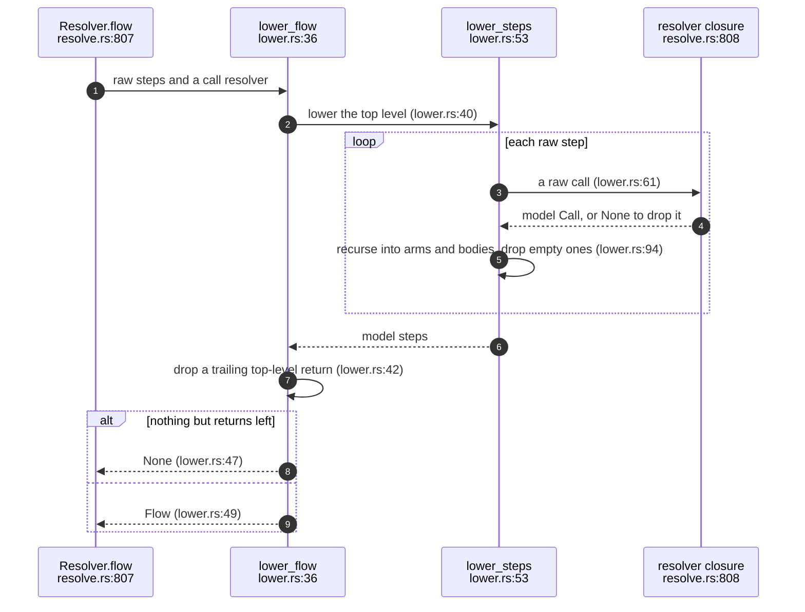
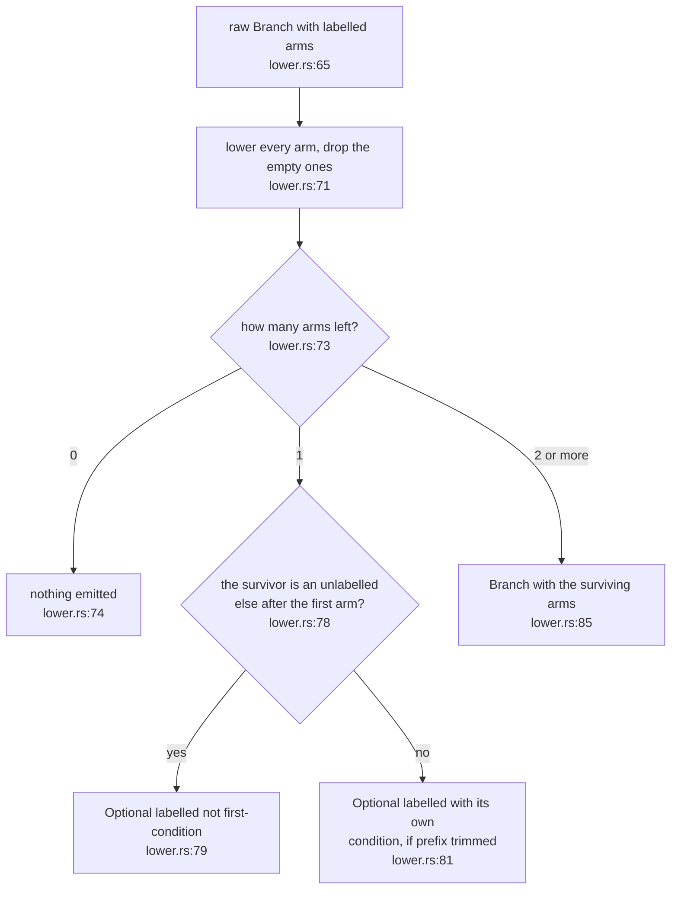
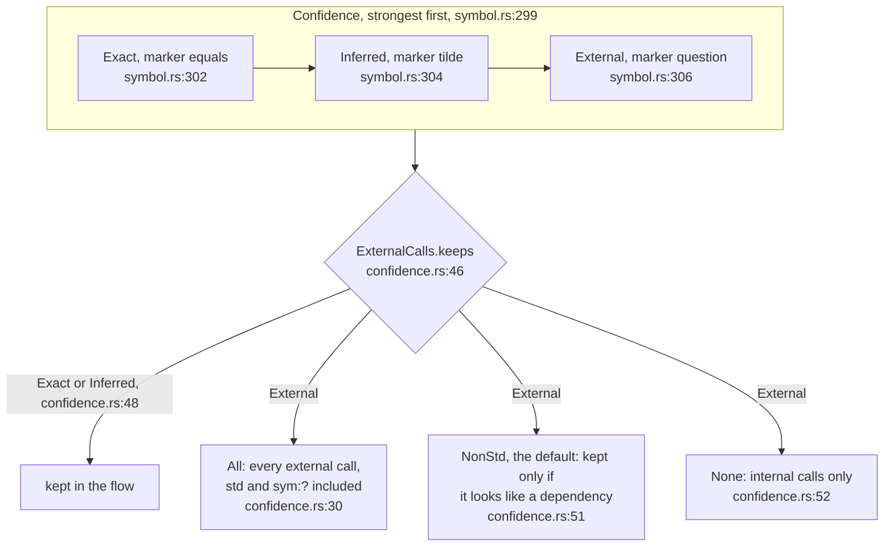
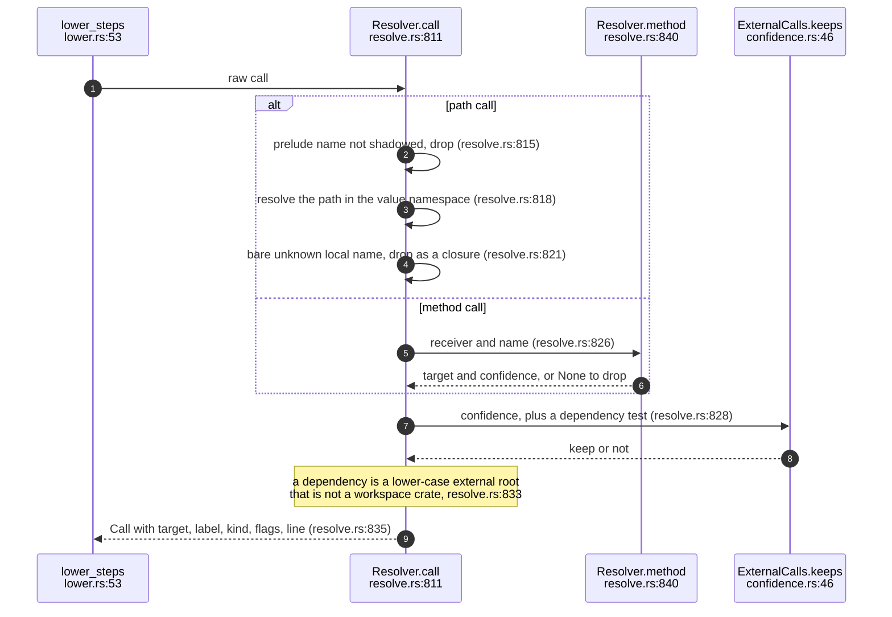
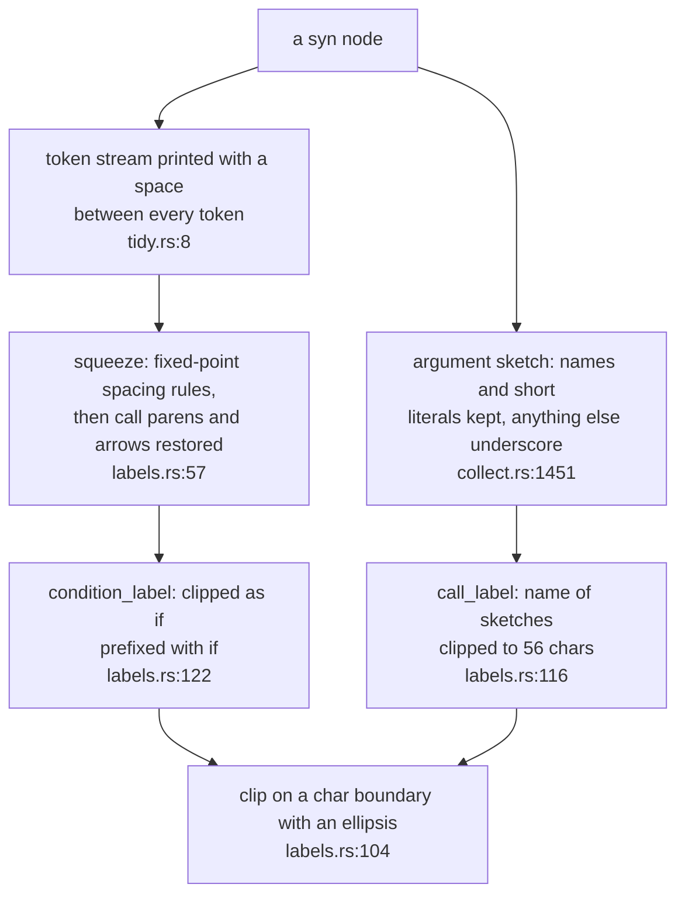

## For developers

Between the walker's raw IR (EXT-03) and the model's `Flow` (MOD-03) sit three
pieces of shared, language-neutral policy, all in `sealmap-extract`:

- **lowering** (`lower`): the shape rules that run once every call has been
  resolved or dropped (`crates/sealmap-extract/src/lower.rs:4`-`12`);
- **confidence** (`confidence`): the three-level evidence lattice, the policy
  for which external calls stay in a flow, and the aggregation of call sites
  into call relations (`crates/sealmap-extract/src/confidence.rs:1`-`7`);
- **labels** (`labels`): how source text becomes the short strings on arrows
  and fragments (`crates/sealmap-extract/src/labels.rs:1`-`7`).

They were extracted from the Rust adapter in `a02b381` with no behaviour
change, so a second adapter would draw flows, confidences and labels by the
same rules (the design calls this the parity lever, `docs/DESIGN.md:131`). The resolver
closure that lowering takes is the Rust adapter's `Resolver::call`, drawn in
EXT-04.4; how it finds targets is EXT-05.

## For the business

This is where sealmap is honest about what it does not know. Every call in
every diagram carries one of three tags: `exact` (resolved through explicit
paths, imports or declared types), `inferred` (matched by a weaker rule) or
`external` (outside the analysed code). Nothing is guessed silently
(`README.md:304`-`306`), and the generated sequence diagrams mark inferred
calls with a `~` so a reviewer can see which arrows to doubt (COR-01).

By default calls into the standard library and calls on values of unknown
type are left out, which keeps diagrams about *your* code and its
dependencies. The cost of that density is that a reviewer never sees those
calls; the policy can be widened to everything for debugging.

## EXT-04.1 Lowering a raw flow

**What it shows.** Lowering is one recursive pass that asks the adapter's
closure about every call, then prunes: dropped calls disappear, fragments with
empty bodies disappear, a final `return` is just the end of the function, and a
flow with nothing but returns is no flow at all.

**Why it is this way.** Resolution decides which calls survive, and only after
that is it known which branches still say anything, so the shape rules have to
run after resolution, not in the walker (`crates/sealmap-extract/src/lower.rs:1`-`5`).

**Invariant:** a symbol whose body makes no kept call has `flow: None`, so
"has a sequence diagram" and "has a flow" are the same test
(`crates/sealmap-extract/src/lower.rs:46`-`48`).

## EXT-04.2 Collapsing a branch after resolution

**What it shows.** `if cached { log() } else { fetch() }` with `log` dropped as
std becomes an `opt` labelled `not cached` around `fetch()`; a branch where
every arm lost its calls vanishes.

**Why it is this way.** The raw IR keeps empty arms precisely so this rule can
name the condition that guards the survivor
(`crates/sealmap-extract/src/raw.rs:32`-`34`, EXT-03.1); without the
labels an `opt` would read as unconditional.

**Drift (flow.rs vs lower.rs):** the model's doc says arms without calls are
kept "with empty steps" when they matter for reading the branch
(`crates/sealmap-model/src/flow.rs:109`-`111`); lowering removes every arm
whose lowered steps are empty (`crates/sealmap-extract/src/lower.rs:71`), and
an early-return `else` survives only because its `Return` step is not empty.

## EXT-04.3 The confidence lattice and the external policy

**What it shows.** Confidence is totally ordered from strongest to weakest
evidence; exact and inferred calls always stay; an external call stays
according to the policy, and under the default only when the adapter says its
target is a real dependency.

**Why it is this way.** The order is the enum's declaration order, so "the
stronger of two" is simply the minimum (`crates/sealmap-extract/src/confidence.rs:59`-`61`).
The dependency test is a closure evaluated only for external calls, so the
policy stays language-neutral while the adapter decides what "dependency"
means (`crates/sealmap-extract/src/confidence.rs:41`-`45`).

**Invariant:** one call relation exists per distinct caller and target, with
the strongest confidence of the call sites behind it
(`crates/sealmap-extract/src/confidence.rs:66`-`78`).

## EXT-04.4 The Rust adapter's keep-or-drop decision

**What it shows.** Path calls to prelude names (`Some`, `Vec::new`, `drop`)
never reach the policy; everything else is resolved, then the policy decides
whether an external target counts as a dependency.

**Why it is this way.** The Rust adapter's documentation states the default
plainly: std, prelude constructors and calls on receivers of unknown type are
dropped so diagrams stay dense (`crates/sealmap-rust/src/lib.rs:59`-`63`).

**Debt:** "looks like a dependency" is a lower-case first letter on the
target's root (`crates/sealmap-rust/src/resolve.rs:833`), so an unresolved
lower-case path that is a local module alias or a misspelling is kept and drawn
as a dependency lane.

## EXT-04.5 From tokens to a label

**What it shows.** Labels are built from printed tokens folded back into the
spacing a person would write, with arguments reduced to a sketch and every
label clipped to a fixed budget.

**Why it is this way.** Printed token streams put a space between almost
every token (`Vec < String >`); the rules are purely textual, so the result
depends only on the text (`crates/sealmap-extract/src/labels.rs:4`-`7`). The
limits are shared constants: 56 characters on arrows and fragments, 200 for a
signature, 14 for a literal argument, 160 for a doc summary
(`crates/sealmap-extract/src/labels.rs:17`-`24`).

**Invariant:** a guard and the `if` arm it labels clip identically, because
the condition is clipped with its `if ` prefix and the prefix removed after
(`crates/sealmap-extract/src/labels.rs:122`-`124`).
