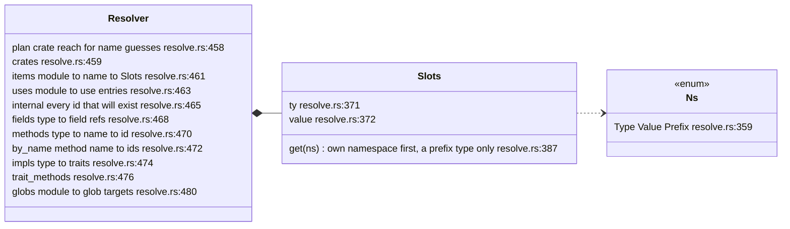
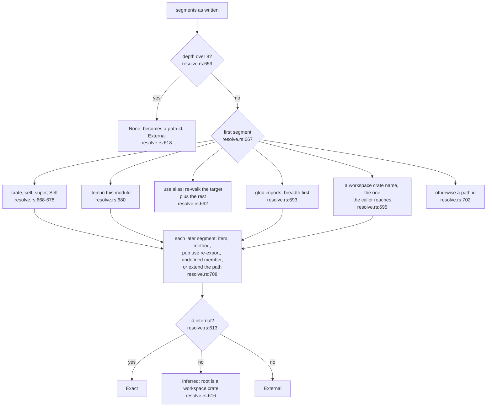
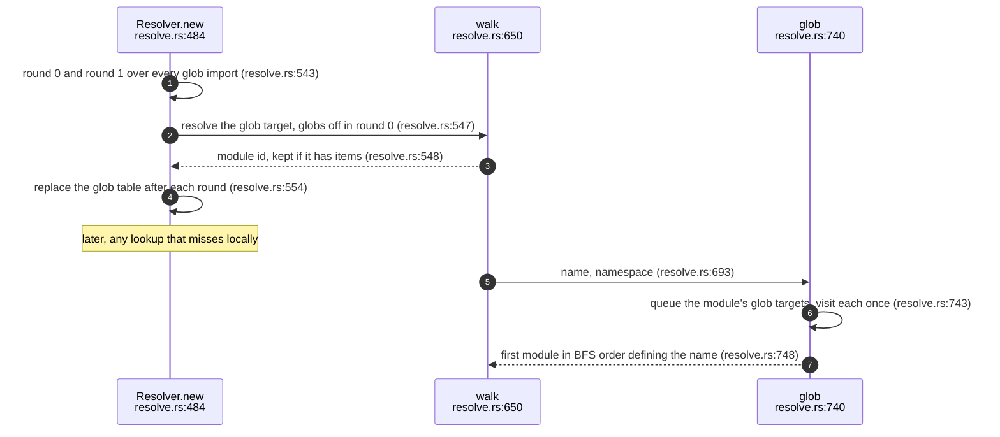
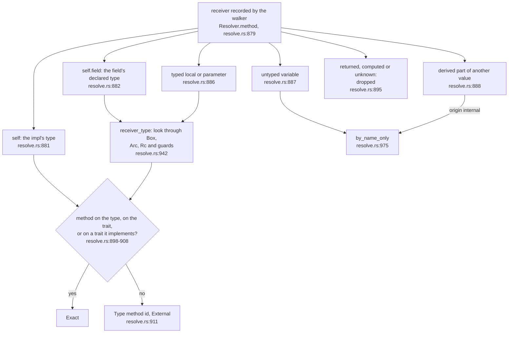
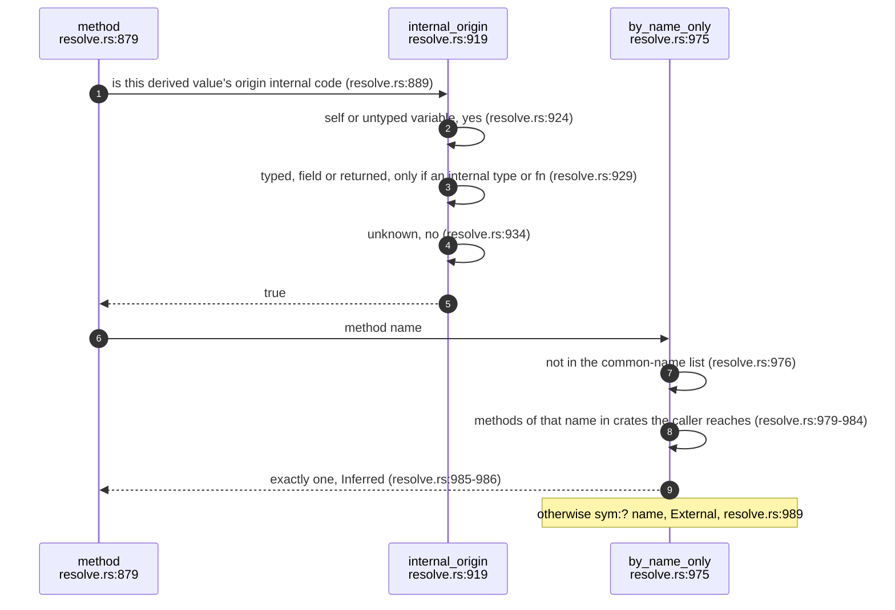
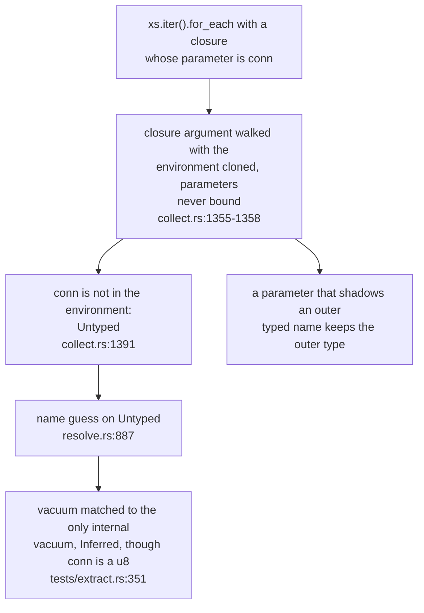

## For developers

Resolution is the one sequential pass of the Rust adapter. It builds lookup
tables from every raw file, then resolves each path and method call to a
`SymbolId` with a confidence, without a type checker. Paths go through local
items, `use` imports (renames, globs, `pub use` re-exports),
`crate`/`self`/`super`/`Self` and sibling workspace crates; method calls are
resolved from what the walker recorded about the receiver
(`crates/sealmap-rust/src/lib.rs:24`-`30` summarises the same list; the tables are in
`crates/sealmap-rust/src/resolve.rs:455`-`481`).

Three commits shaped it. The hardening work replaced an exponential recursive
glob walk with a precomputed table and a breadth-first search
(`docs/DESIGN.md:234`). The grammar work keyed every table by typed ids and
split types from values, so a module and a function of one name no longer
collide (commit `5973a4e`). The `Path::parent` fix taught it receiver
provenance: a value taken from std or a dependency is never matched to an
internal method by name (`docs/DESIGN.md:236`, commit `5aac8a8`). This topic
draws the path walk, the method decision, the provenance rule, and the false
guesses that remain.

## For the business

Resolution quality is the difference between a diagram that shows how the
code actually talks to itself and one that invents conversations. sealmap
resolves most calls exactly; for the rest it either says it does not know, or
makes a narrow, labelled guess: a method name that exists exactly once among
the crates the calling crate can reach, and is not a common name like `get`
or `insert`.

The `Path::parent` fix shows the stakes: before it, a call on a file path was
drawn as a call into sealmap's own id type. On a 934-file workspace it
withdrew 76 name guesses, 64 of them on std or third-party values (commit
`5aac8a8`). The guesses that are left are tagged `inferred` and drawn with a
`~`; the main remaining source of wrong ones is untyped closure parameters,
recorded below.

## EXT-05.1 The tables, built before anything resolves

**What it shows.** Every table is an ordered map keyed by typed ids. Each name
in a module has a type slot and a value slot, so `mod config` and
`fn config` in one module are both reachable. A segment with more after it
is a prefix and reads the type slot alone, since only a module or type has
members (`crates/sealmap-rust/src/resolve.rs:391`).

**Why it is this way.** Rust keeps types and modules apart from values
(`crates/sealmap-rust/src/resolve.rs:354`-`357`); looking a path's last segment
up in its own namespace first, with the other as a fallback, mirrors that
without a full name-resolution pass. The fallback once applied to prefixes
too, so the CLI's `fn pack` captured `pack::shard(..)` from the imported
module `pack` (DEN-01.6, fixed in `926144c`, pinned by
`a_path_prefix_never_resolves_to_a_function`,
`crates/sealmap-rust/tests/resolver_den01.rs:241`).

**Invariant:** inherent impls are registered before trait impls, so an
inherent method wins a name lookup over a trait method
(`crates/sealmap-rust/src/resolve.rs:556`-`558`).

## EXT-05.2 Walking a path

**What it shows.** The first segment picks a base (a keyword, a local item,
an import, a glob, a crate), later segments walk down through items and
methods, and the result is exact only if the id is one the codebase defines.

**Why it is this way.** Import targets are re-resolved from the importing
module, so renames and chains of `pub use` resolve to the definition, not the
alias (`crates/sealmap-rust/src/resolve.rs:687`-`689`). The test
`resolves_paths_through_imports_renames_globs_and_reexports` pins the common
shapes (`crates/sealmap-rust/tests/extract.rs:37`).

**Debt:** the walk gives up after eight re-entries
(`crates/sealmap-rust/src/resolve.rs:659`), and a path it gives up on becomes
an external path id with no diagnostic, so a long re-export chain silently
leaves the codebase.

## EXT-05.3 Globs without exponential cost

**What it shows.** Glob targets are resolved up front into a table; a lookup
through globs is then a bounded breadth-first search where each module is
visited once, so cyclic globs are harmless.

**Why it is this way.** The recursive walk this replaced made 908 M calls on
one file of an older crate; the table brought it to 43 ms (`docs/DESIGN.md:234`).
`glob_cycles_resolve_quickly` keeps it that way
(`crates/sealmap-rust/tests/extract.rs:278`).

**Open:** the table is built in exactly two rounds, so a glob target that is
itself only reachable through a glob of a glob is found
(`crates/sealmap-rust/src/resolve.rs:541`-`542`); nothing records whether a
third level of glob-reached glob targets is meant to resolve.

## EXT-05.4 Deciding a method call

**What it shows.** A receiver with a known type is resolved against that
type's methods, its trait's methods and the methods of every trait it
implements; a receiver with no type evidence falls back to a name match;
values the walker could only describe as computed or returned are not
resolved at all.

**Debt:** a method called on a returned or computed receiver, as in
`a.b().c()` or `(x + y).m()`, is never bound to an internal method: the
match yields no type (`crates/sealmap-rust/src/resolve.rs:895`) and the call
falls through to an external, unresolved id
(`crates/sealmap-rust/src/resolve.rs:897`), so builder chains and fluent APIs
lose their internal edges. Fixing it needs return-type inference, which the
adapter does not do.

**Why it is this way.** Smart pointers and lock guards are looked through, but
any other wrapper (`Vec`, `Option`, `Mutex`) is itself the receiver
(`crates/sealmap-rust/src/resolve.rs:938`-`940`), so `vec.len()` is a std call,
not a call on the element type.

**Fixed at `fec7aff` (found in the 2026-10-05 review triage).** A generic
parameter used to be recognised by its spelling (one capital letter, optional
digits). So every call through a real `struct A` or `struct V2` was dropped,
and a parameter named `Store` was bound to a concrete `struct Store`. A
receiver is now a parameter only when the item, impl or trait declares it
(`crates/sealmap-rust/src/resolve.rs:953`; the scope is
`crates/sealmap-rust/src/resolve.rs:413`, filled from
`crates/sealmap-rust/src/collect.rs:789`). The fix is pinned by
`single_capital_type_names_are_concrete_types_not_generics`
(`crates/sealmap-rust/tests/extract.rs:421`) and
`declared_multi_letter_generics_shadow_concrete_types` (`:459`).

**Invariant:** a method call on a value derived from std or a dependency is
never bound to an internal method of the same name; it becomes `sym:? name`
(`crates/sealmap-rust/src/resolve.rs:889`-`893`), pinned by
`std_receiver_method_is_not_bound_to_same_named_internal_method`
(`crates/sealmap-rust/tests/extract.rs:310`).

## EXT-05.5 The name guess and its provenance gate

**What it shows.** A guess is made only for a distinctive name (not one of
about 125 common method names such as `get`, `insert`, `run`) that exists
exactly once among the methods of crates the caller can reach, and only for
receivers whose origin is internal or simply unknown.

**Why it is this way.** A plain variable of unevident type is treated as
possibly internal, so the guess still finds genuine internal calls through
untyped locals; anything traced to std or a dependency is excluded
(`crates/sealmap-rust/src/resolve.rs:914`-`918`).

**Invariant:** a guess depends only on the calling crate and the workspace
crates its manifest lets it name: itself, its package's library and its
workspace dependencies (`crates/sealmap-rust/src/layout.rs:247`). Code added
to a crate it cannot reach never changes it, and two reachable candidates
give no edge rather than a pick
(`crates/sealmap-rust/tests/resolver_den01.rs:158`,
`crates/sealmap-rust/tests/resolver_den01.rs:186`). A path whose first segment names
a crate resolves the same way when two directories hold a crate of that name:
to the only one the caller reaches, where a `path` dependency (directly or
through `[workspace.dependencies]`) names exactly one, and to an external path
when that is still ambiguous (`crates/sealmap-rust/src/layout.rs:81`-`88`,
`crates/sealmap-rust/src/resolve.rs:695`-`700`). Until `613b9ba` the name
had to be unique in the whole workspace, so adding two `root` methods in
sealmap-dense removed a correct guess in sealmap-rust (DEN-01.6).

**Debt:** an untyped variable counts as an internal origin
(`crates/sealmap-rust/src/resolve.rs:924`), so a part taken from a plain local
whose value is in fact a std or dependency type is still matched to a
distinctive internal method by name.

## EXT-05.6 Closure parameters are untyped

**What it shows.** A closure's parameters are never entered into the walker's
environment, so a method call on one is either a name guess (no outer binding)
or resolved against the type of an unrelated outer variable with the same name.

**Why it is this way.** Closure parameter types are usually inferred by the
compiler from the call they are passed to, which the walker cannot see; the
test suite records the current behaviour deliberately: "A closure parameter
is untyped, as before" (`crates/sealmap-rust/tests/extract.rs:392`-`393`).

**Debt:** false guesses remain from untyped closure parameters: a call on a
closure parameter is matched to a distinctive internal method by name
(`crates/sealmap-rust/src/collect.rs:1355`-`1361`,
`crates/sealmap-rust/src/resolve.rs:887`), so `|conn| ... d.vacuum()` over a
slice of `u8` is drawn as an inferred call to `Db::vacuum`
(`crates/sealmap-rust/tests/extract.rs:351`).

**Debt:** a closure parameter that shadows an outer typed local is resolved
with the outer local's type, because the cloned environment still holds the
outer binding (`crates/sealmap-rust/src/collect.rs:1356`-`1357`).
