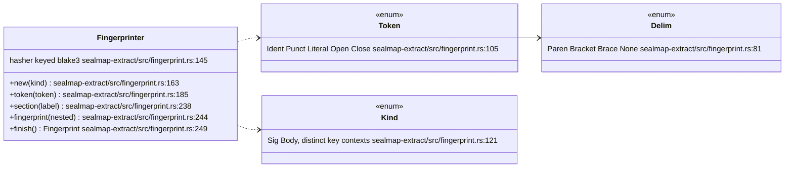
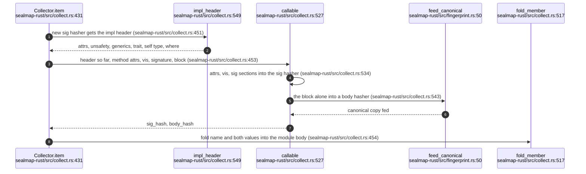
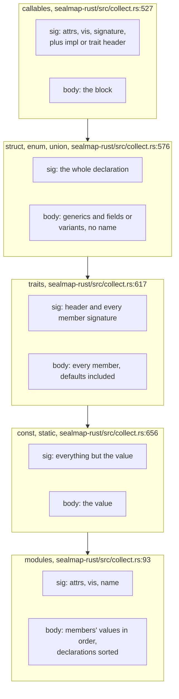
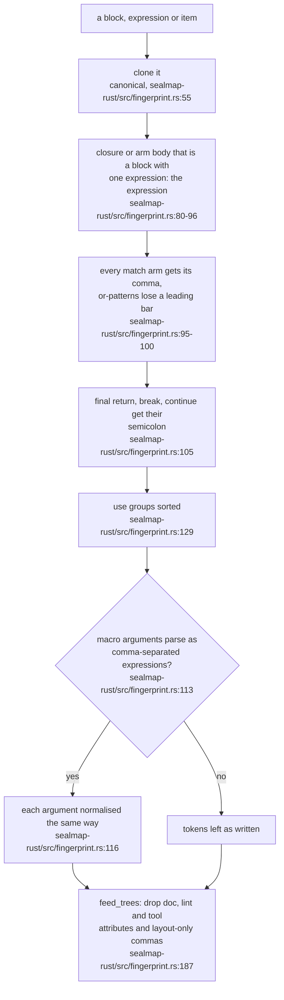
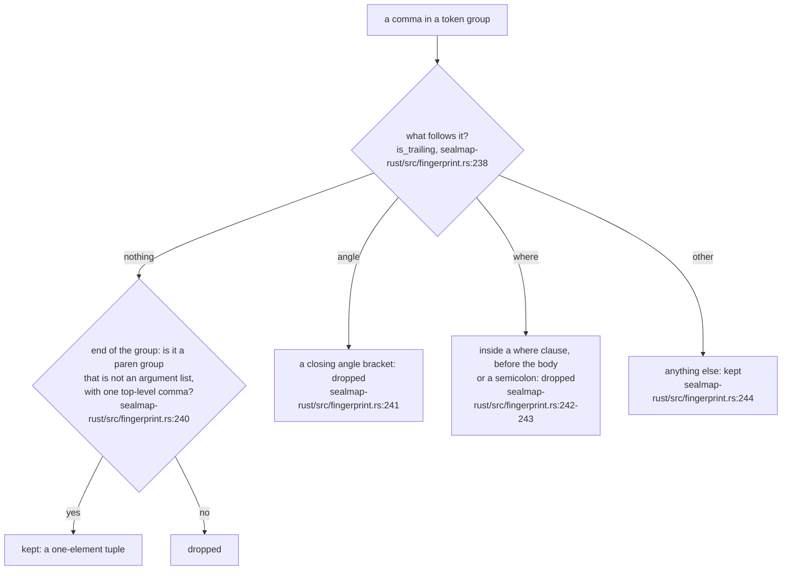
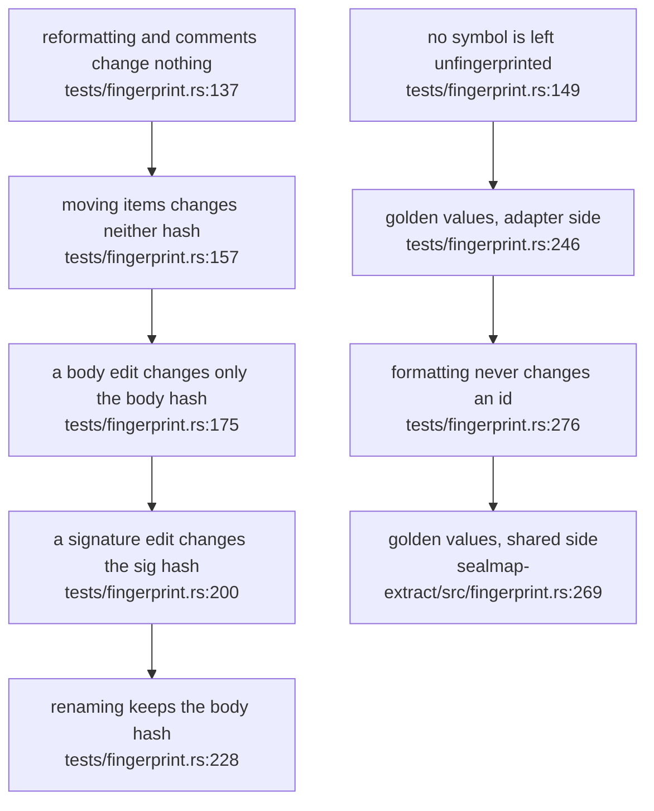

## For developers

MOD-02 drew the fingerprint as a value. This topic draws how one is made: a
language adapter feeds a `Fingerprinter` a token stream (identifiers,
punctuation, literals and delimited groups, in source order) and decides which
tokens form the contract and which the implementation
(`crates/sealmap-extract/src/fingerprint.rs:4`-`24`). Whitespace and comments
are never tokens, positions are never hashed, so reformatting, editing
comments or moving an item changes neither value.

The Rust adapter adds a second layer of normalisation on top of syn's tokens
(`crates/sealmap-rust/src/fingerprint.rs:1`-`30`): doc and lint attributes are
dropped, layout-only trailing commas are dropped, and the structural rewrites
rustfmt makes (braces round a single-expression closure or match arm, the
comma after each arm, a leading `|`, `return;`, `use` group order) are undone
on a copy of the syntax tree before it is fed. All of this arrived in commit
`0a304ba`, algorithm id `sm1`, with golden values pinned in both crates.

## For the business

The promise to an adopter is narrow and testable: tidying code costs nothing,
changing it costs exactly one re-look. Running rustfmt, adding a comment,
silencing a lint or moving a function to another file leaves every
fingerprint as it was, so no reviewed diagram is flagged. Changing what a
function does changes its body fingerprint; changing how it is called changes
its signature fingerprint. The README records the experiment behind the
claim: reflowing tokio, VisionClaw and sealmap at a 50-column width changed no
id and no hash (`README.md:200`-`201`).

The one gap an adopter should know about is macros: when a macro's arguments
are not ordinary expressions, its body is only normalised token by token, so
a formatter rewrite inside it can still change a fingerprint.

## EXT-06.1 The shared fingerprinter

**What it shows.** One streaming hasher per value, fed tokens, section markers
that separate the parts of a declaration, and the fingerprints of nested
symbols.

**Why it is this way.** Each record is a tag byte, a little-endian length and
the payload, so the byte stream decodes to exactly one token sequence: `ab` is
never `a b`, and an identifier is never a literal of the same text
(`crates/sealmap-extract/src/fingerprint.rs:148`-`159`). Sections stop tokens
drifting from one part into the next without changing the value
(`crates/sealmap-extract/src/fingerprint.rs:235`-`240`).

**Invariant:** an invisible group contributes its tokens but no delimiters,
and a literal's line endings are normalised, so macro artefacts and Windows
checkouts fingerprint like their plain equivalents
(`crates/sealmap-extract/src/fingerprint.rs:189`-`206`).

## EXT-06.2 Fingerprinting one method

**What it shows.** A method's contract includes the header of the impl it
sits in; its body is the block alone; both are then folded into the enclosing
module's body.

**Why it is this way.** The body never sees the name, so a renamed function
keeps its `body_hash` and a rename detector can match it
(`crates/sealmap-rust/src/collect.rs:524`-`526`); the test
`renaming_changes_the_id_and_keeps_the_body_hash` pins it
(`crates/sealmap-rust/tests/fingerprint.rs:228`).

**Open:** because the impl header is part of every method's contract
(`crates/sealmap-rust/src/collect.rs:450`-`452`), adding a bound to an
impl's `where` clause changes the `sig_hash` of every method in it; the design's
contract class (`docs/DESIGN.md:105`) does not say whether that is meant to
read as a contract change for each of them.

## EXT-06.3 What goes into each value

**What it shows.** The per-kind rule table from the shared crate
(`crates/sealmap-extract/src/fingerprint.rs:17`-`24`) as the Rust adapter
implements it.

**Why it is this way.** Data-type fields are fed one by one, each with its own
separator, so the trailing comma of a field list never enters the stream
(`crates/sealmap-rust/src/collect.rs:572`-`575`).

**Open:** a module's `body_hash` folds the values of every member
(`crates/sealmap-rust/src/collect.rs:179`-`181`), so it changes on any edit
anywhere in the module; neither the design nor the README says whether a
module is meant to be a sealable symbol.

## EXT-06.4 Undoing what rustfmt does

**What it shows.** Structural rewrites are undone on a copy of the syntax tree;
token-level layout is dropped while feeding.

**Why it is this way.** Some rustfmt rewrites change the tree, not just the
spacing, so they cannot be ignored at the token level
(`crates/sealmap-rust/src/fingerprint.rs:20`-`26`). Lint and tool attributes
change diagnostics, not the program, so adding an `#[allow]` is not a contract
change (`crates/sealmap-rust/src/fingerprint.rs:6`-`10`).

**Debt:** macro bodies are only normalised when their arguments parse as
expressions (`crates/sealmap-rust/src/fingerprint.rs:111`-`123`); any other
macro body is hashed token by token
(`crates/sealmap-rust/src/fingerprint.rs:27`-`30`), so a formatter rewrite
inside, for example, a `macro_rules!` arm or a DSL macro changes the
fingerprint, and a `macro_rules!` definition's body is fed raw
(`crates/sealmap-rust/src/collect.rs:423`).

## EXT-06.5 Is this comma layout?

**What it shows.** A comma before a closing brace, bracket or `>` is layout;
before a closing parenthesis it is layout only in an argument or parameter
list, or when the group holds other commas; `(T,)` keeps its comma because it
is a tuple and `(T)` is not.

**Why it is this way.** rustfmt adds trailing commas when it breaks a list over
lines (`crates/sealmap-rust/src/fingerprint.rs:12`-`18`); deciding "argument
list" looks at the token before the group, with a keyword list to tell
`if (a,)` from `f(a,)` (`crates/sealmap-rust/src/fingerprint.rs:177`-`185`).

**Invariant:** the one-tuple distinction is tested both ways
(`crates/sealmap-rust/src/fingerprint.rs:329`-`331`).

## EXT-06.6 The semantics the tests pin

**What it shows.** Each claim in the README's change table has a test, and the
encoding itself is pinned by golden values in both crates.

**Why it is this way.** Any change to the encoding or the per-kind table is a
new algorithm id; the golden tests fail until it is bumped
(`crates/sealmap-extract/src/fingerprint.rs:42`-`44`).

**Invariant:** the Windows-line-ending case, including inside a multi-line
string literal, hashes like the Unix one
(`crates/sealmap-rust/tests/fingerprint.rs:142`-`145`).
