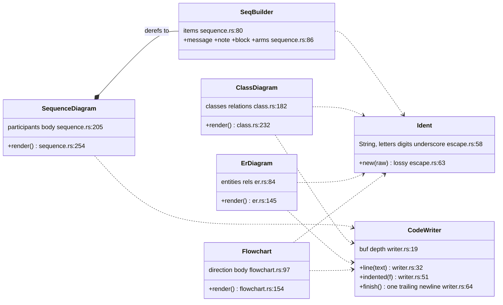
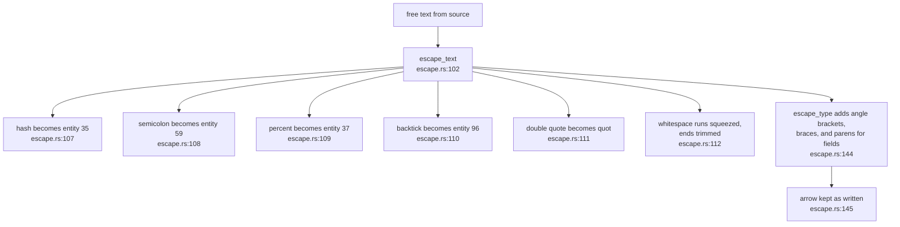
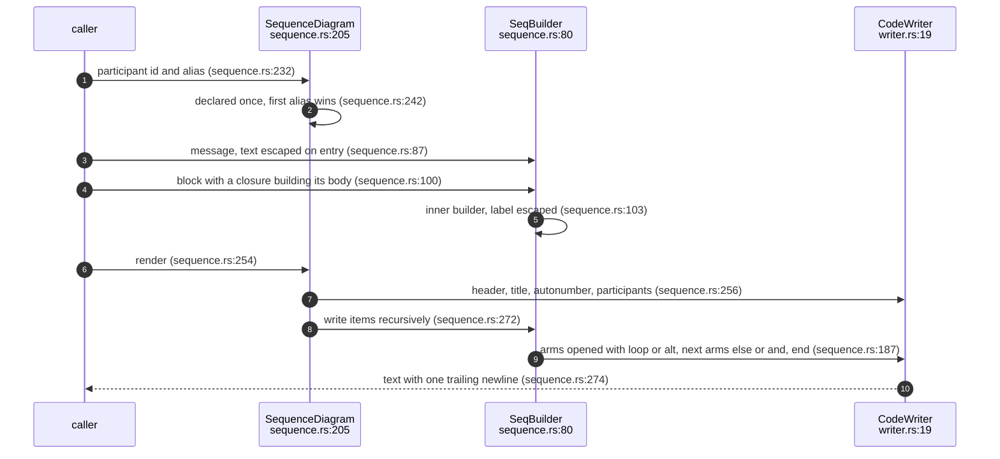
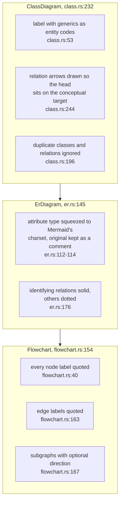
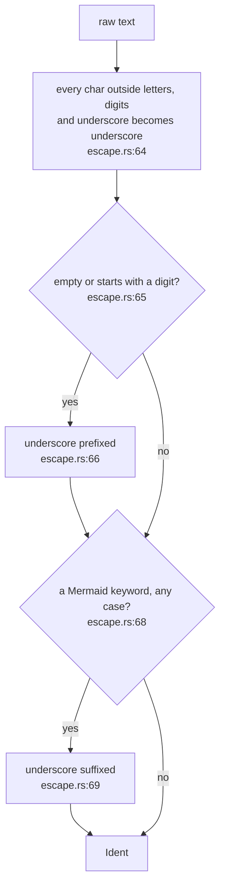

## For developers

`sealmap-mermaid` is a safe Mermaid emitter that knows nothing about code
models: four typed builders (`SequenceDiagram`, `ClassDiagram`, `ErDiagram`,
`Flowchart`), one line writer, and two escaping functions that every value
passes through on its way to the output (`crates/sealmap-mermaid/src/lib.rs:3`-`25`).
With `default-features = false` it has no dependencies at all; the default
`model` feature adds the injective `Ident::from_symbol` drawn in MER-02
(`crates/sealmap-mermaid/Cargo.toml:17`-`20`).

The reason for builders over `format!` is Mermaid's grammar: `;` ends a
statement in a sequence message, `end` is a keyword in node ids, braces close
class bodies, `(` turns a class member into a method, angle brackets collide
with generics and `#` starts an entity code
(`crates/sealmap-mermaid/src/lib.rs:17`-`21`). This topic draws the writer
contract, the escaping rules and how each builder renders. It is the reason a
whole generated corpus parses: the README counts 4,680 diagrams from five
codebases and 6,142 from a VisionClaw corpus (`README.md:237`-`240`).

## For the business

Every diagram sealmap generates has to open in an ordinary Mermaid renderer,
or the corpus is a liability rather than a map. Source code is full of
characters that break Mermaid, and a generator that concatenates strings
breaks on them sooner or later. These writers make that structurally hard:
an identifier is cleaned, and every label is escaped with codes Mermaid turns
back into the original characters, so a reader still sees `Vec<String>`.

The writers are also deterministic and minimal: same calls, same bytes, no
styling. That matters for cost, because diagrams are read by models and every
decorative token is paid for. The crate can be adopted on its own, with no
dependencies, by anyone who needs safe Mermaid output.

## MER-01.1 The writers and what they share

**What it shows.** Each builder collects typed statements and renders through
one `CodeWriter`; every id is an `Ident`; a `SequenceDiagram` dereferences to
its `SeqBuilder`, so fragments can be built separately and spliced in.

**Why it is this way.** Rendering is a pure function of the builder; statement
order is preserved because in a sequence order is meaning, and nothing is
sorted behind the caller's back (`crates/sealmap-mermaid/src/lib.rs:29`-`32`).
The writer itself is a reduced port of ts-morph's `CodeBlockWriter`
(`crates/sealmap-mermaid/src/writer.rs:1`-`2`).

**Invariant:** output always uses two-space indentation, `\n` endings, no
trailing whitespace and exactly one trailing newline
(`crates/sealmap-mermaid/src/writer.rs:4`-`5`, enforced at
`crates/sealmap-mermaid/src/writer.rs:33` and
`crates/sealmap-mermaid/src/writer.rs:65`-`70`).

## MER-01.2 Escaping a label

**What it shows.** Labels are escaped with Mermaid's own entity codes, which
render back to the original characters; type text in class bodies also escapes
angle brackets, braces and, in fields, parentheses.

**Why it is this way.** Each rule closes one break: a backtick can never end a
Markdown fence and a percent can never start a `%%` comment
(`crates/sealmap-mermaid/src/escape.rs:93`-`95`); a brace would close a class
body and a parenthesis would turn a field into a method
(`crates/sealmap-mermaid/src/escape.rs:131`-`136`). Generics use entity codes
because Mermaid's `~` generic marker cannot nest reliably
(`crates/sealmap-mermaid/src/escape.rs:133`-`134`).

**Invariant:** a label is single-line by construction: newlines and tabs
collapse to one space (`crates/sealmap-mermaid/src/escape.rs:112`-`118`).

## MER-01.3 Building and rendering a sequence

**What it shows.** Text is escaped when it enters the builder, not when it
leaves, so the stored items are already safe; blocks nest by building an inner
`SeqBuilder` in a closure.

**Why it is this way.** Escaping on entry means `extend` can splice a
separately built fragment in without re-escaping it
(`crates/sealmap-mermaid/src/sequence.rs:150`-`153`), which is how the corpus
builds `alt` and `loop` bodies.

**Debt:** a single-arm block kind given extra arms renders them as `else`
rather than refusing (`crates/sealmap-mermaid/src/sequence.rs:61`-`63`), so a
caller's misuse produces a diagram that parses but says something other than
what was built.

## MER-01.4 Class, ER and flowchart rendering rules

**What it shows.** Each builder has its own guard against its diagram kind's
grammar: class labels move generics to entity codes, ER attribute types are
squeezed into the narrow charset ER accepts with the readable original kept
as a comment, flowchart labels are always quoted.

**Why it is this way.** ER attribute types cannot hold `<` or spaces, so a
lossless form is computed and compared; the comment appears only when the
squeezed form lost something (`crates/sealmap-mermaid/src/er.rs:112`-`114`).

**Debt:** `Class::raw_member` takes a member line with only braces and
newlines removed (`crates/sealmap-mermaid/src/class.rs:96`-`99`), so it is the
one public path to class-diagram output that does not go through
`escape_type`, against the crate's claim that every value goes through `Ident`
or `escape_text` (`crates/sealmap-mermaid/src/lib.rs:22`-`25`).

## MER-01.5 Identifiers from arbitrary text

**What it shows.** `Ident::new` sanitises any text into a valid, keyword-safe
id, for ids a caller mints itself.

**Why it is this way.** The keyword list covers words that are reserved in at
least one diagram kind, from `end` and `graph` to `autonumber` and `default`
(`crates/sealmap-mermaid/src/escape.rs:3`-`38`), so one id is safe in every
kind.

**Invariant:** `Ident::new` is documented as lossy; only `Ident::from_symbol`
is injective (`crates/sealmap-mermaid/src/escape.rs:43`-`48`, MER-02).
