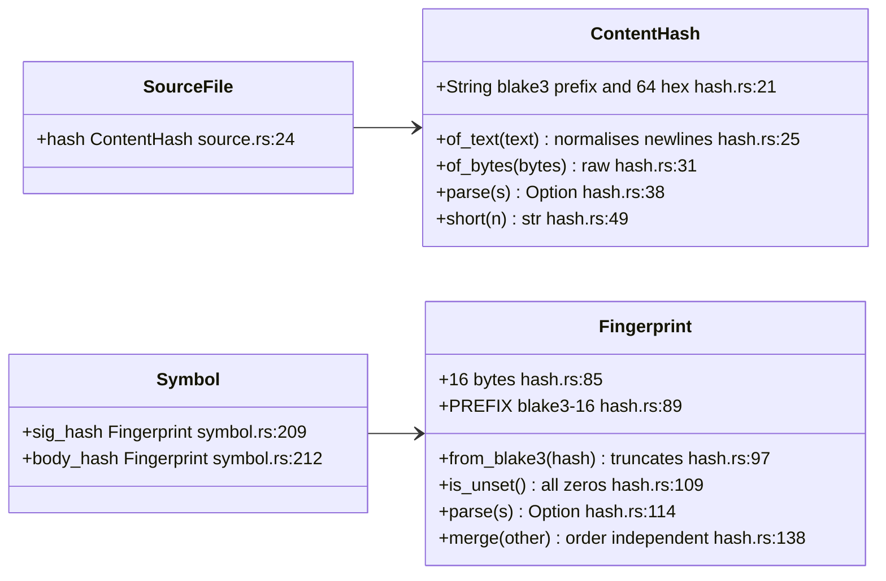
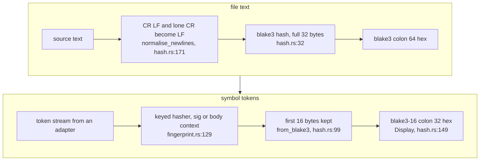
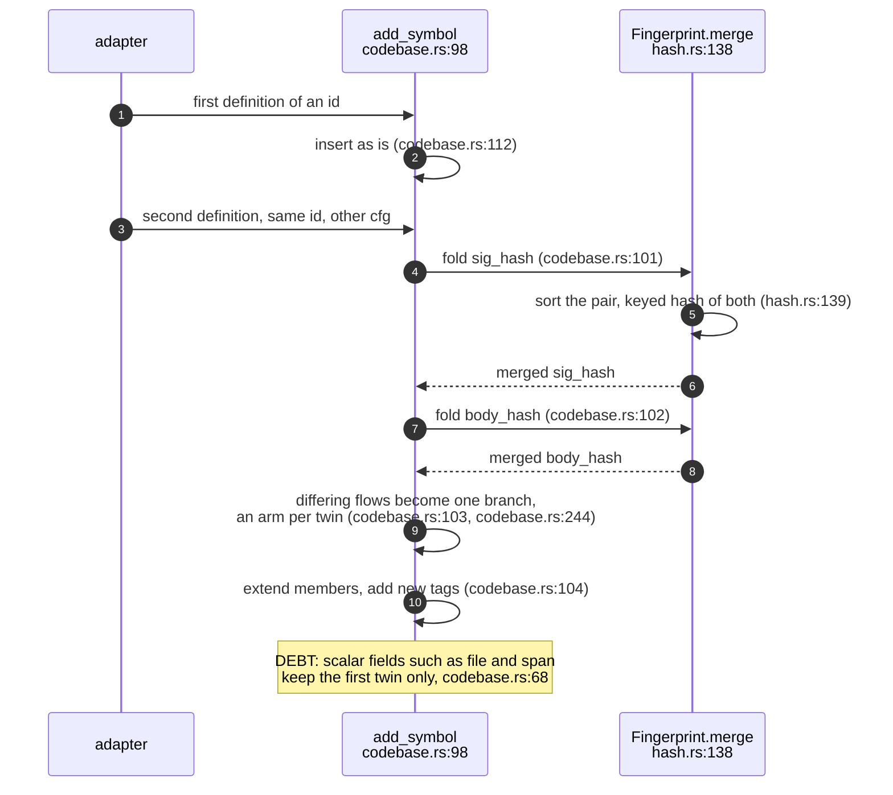
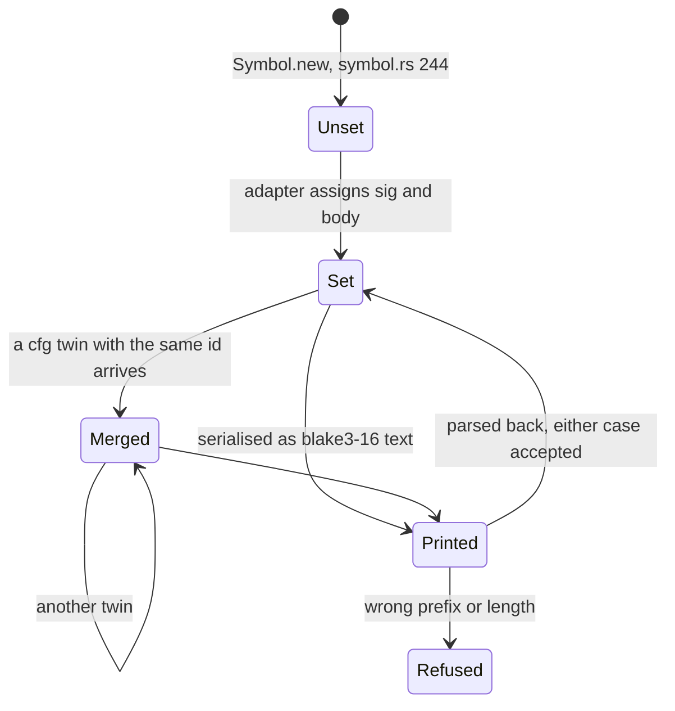
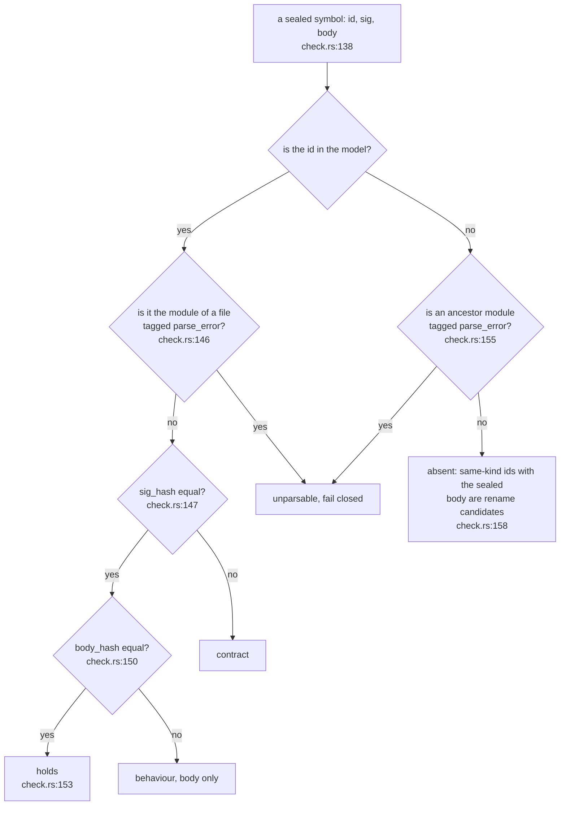

## For developers

sealmap keeps two kinds of hash and never confuses them. A `ContentHash` is
BLAKE3 over a whole file's text with line endings normalised, printed
`blake3:<64 hex>`; it is what the 0.1 corpus uses to tell a stale document
from a hand-edited one. A `Fingerprint` is 16 bytes of a keyed BLAKE3 digest,
printed `blake3-16:<32 hex>`, and every symbol carries two of them:
`sig_hash` for its contract and `body_hash` for its implementation
(`crates/sealmap-model/src/symbol.rs:209`, `crates/sealmap-model/src/symbol.rs:212`).

The model crate only stores, compares, prints, parses and merges these values
(`crates/sealmap-model/src/hash.rs:61`-`65`). How the token streams that
feed a fingerprint are chosen per kind of symbol is the extraction core's job
and is drawn in EXT-06. After this topic you should know what each value
means, how two `#[cfg]` twins that share an id end up with one fingerprint,
and what the pair lets the seal check decide (built; drawn in COR-04).

The fingerprints arrived in commit `0a304ba` (step 2 of the 0.2 plan,
`docs/DESIGN.md:296`), after rustc's split between a definition's identity
and its query fingerprints (`docs/DESIGN.md:130`).

## For the business

Keeping a reviewed diagram true has a cost, and the expensive part today is
deciding *whether* a change touched what a topic describes. A content hash
per file answers that coarsely: any edit anywhere in a file flags every topic
that cites it. Per-symbol fingerprints answer it per function, and they answer
two questions rather than one: did the function's contract change, or only its
behaviour?

That split is what lets an adopter route maintenance by cost. A behaviour
change is a cheap re-review; a contract change is worth a more careful look.
The values are deliberately blind to formatting and comments, so a
reformatting commit costs nothing at all. The tooling that acts on this split
(seals, `sealmap verify` and `sealmap stale`) now exists (COR-04); this
repository's own topics are not sealed yet.

## MOD-02.1 The two hash types

**What it shows.** Files carry a full-length content hash; symbols carry two
truncated fingerprints. Both print with a self-describing algorithm prefix.

**Why it is this way.** The prefix keeps the algorithm visible in every
model and lock if it ever changes (`crates/sealmap-model/src/hash.rs:8`-`9`).
Truncating to 128 bits keeps an accidental collision out of reach while
halving the text a full digest costs in every model and lock
(`crates/sealmap-model/src/hash.rs:67`-`69`).

**Invariant:** the default fingerprint is all zeros and means "not
fingerprinted" (`crates/sealmap-model/src/hash.rs:109`-`111`); a symbol built
by hand starts there (`crates/sealmap-model/src/symbol.rs:244`-`245`) until an
adapter fills it in.

## MOD-02.2 From bytes to printed value

**What it shows.** A file hash normalises newlines and hashes everything; a
symbol fingerprint hashes a token stream under one of two key-derivation
contexts and keeps the first 16 bytes.

**Why it is this way.** Distinct contexts mean a signature and a body with
identical tokens still get different values
(`crates/sealmap-extract/src/fingerprint.rs:40`-`41`). The context strings
embed the algorithm id and a date, so any change to the scheme is a new
algorithm id (`crates/sealmap-extract/src/fingerprint.rs:77`).

**Invariant:** golden values pin the scheme; an encoding change fails
`golden_values` until `ALGORITHM` is bumped
(`crates/sealmap-extract/src/fingerprint.rs:269`).

## MOD-02.3 Merging cfg twins

**What it shows.** Two definitions with one id, typically
`#[cfg(unix)]` and `#[cfg(windows)]` twins, become one symbol whose
fingerprints are an order-independent fold of both. Their flows are kept
too: when they differ (other than in line numbers) each twin becomes an arm
of one branch labelled `cfg twin at <file>:<line>`, so the second twin's calls
reach the sequence and the call relations
(`crates/sealmap-model/src/codebase.rs:73`-`76`,
`crates/sealmap-model/src/codebase.rs:244`-`259`).

**Why it is this way.** A seal on a cfg-gated function has to notice an edit
to either twin; folding both values with a dedicated key context means an
edit to either changes the result, whichever twin was seen first
(`crates/sealmap-model/src/hash.rs:126`-`130`).

**Debt:** the merged symbol keeps only the first twin's file, span, signature
and doc (`crates/sealmap-model/src/codebase.rs:67`-`71`), so the second
definition has no location in the model except in a twin arm's label, which
exists only when the twins' flows differ
(`crates/sealmap-model/src/codebase.rs:238`-`239`).

## MOD-02.4 A fingerprint's life

**What it shows.** A fingerprint starts unset, is set by an adapter, may be
merged with twins, and travels as text in the JSON model; text with the wrong
prefix or length is refused on read.

**Why it is this way.** Serialisation goes through `Display` and `parse`
rather than serde's byte encoding (`crates/sealmap-model/src/hash.rs:157`-`168`),
so the JSON is readable and identical to what a lock would hold.

**Invariant:** a malformed fingerprint string fails deserialisation instead of
reading as zeros (`crates/sealmap-model/src/hash.rs:166`).

## MOD-02.5 What the pair decides

**What it shows.** The decision the seal check takes from the two
fingerprints: a body-only change is behaviour, a signature change is
contract, and a vanished id whose body reappears in a symbol of the same kind
is a suspected rename. Unparsable code is decided first, so it is never
reported as holding or absent (`crates/sealmap-corpus/src/seal/check.rs:146`,
`crates/sealmap-corpus/src/seal/check.rs:155`); the design's table is
`docs/DESIGN.md:99`-`107`.

**Why it is this way.** The name sits in `sig_hash` and never in `body_hash`,
which is what makes a rename detectable by body
(`crates/sealmap-extract/src/fingerprint.rs:26`-`27`); the README states the
same table for users (`README.md:191`-`198`).

The crate-surface table records that an optional `flow_hash` was considered
and not built (`docs/DESIGN.md:130`); the model has only the two
(`crates/sealmap-model/src/symbol.rs:209`-`212`), as commit `0a304ba` left it.
