# E0 judgement ab-04

You are an independent judge for a pre-registered experiment. Below are (1) a TOPIC: a Markdown file of Mermaid diagrams that document code, with `path:line` citations, where paths under `../project/` are in the VisionClaw repository and paths under `../project/agentbox/` are in the agentbox repository; and (2) a DIFF: one commit's changes in the agentbox repository, restricted to the files the topic lists under `sources:`.

Answer exactly one question:

> **Does this change make any statement in the topic false or incomplete?**

Judge only from the two texts below; do not look anything else up. Reply with a single JSON object and nothing else:

```json
{"verdict": "yes" | "no", "statements": ["<diagram id>: <the statement, quoted>", ...], "line_anchors_only": true | false, "reason": "<one or two sentences>"}
```

`statements` lists every topic statement the change makes false or incomplete (empty when the verdict is no). `line_anchors_only` is true when the only such statements are `path:line` anchors whose cited code merely moved.

## TOPIC (docs/diagrams/agentbox/14-governance-journal-actions-approvals.md)

````markdown
---
id: AB-14
title: Governance — journal, action pipeline, approvals
area: agentbox
governing:
  - ../project/agentbox/docs/GOVERNANCE-capabilities.md
  - ../project/agentbox/docs/SECURITY-profiles.md
adrs: [ADR-2022, ADR-2027, ADR-2041, ADR-2071, ADR-2085, ADR-2087, ADR-2108, ADR-2122]
sources:
  - ../project/agentbox/management-api/lib/action-plane.js
  - ../project/agentbox/docs/GOVERNANCE-capabilities.md
  - ../project/agentbox/management-api/routes/system.js
  - ../project/agentbox/docs/adr/ADR-2041-wire-execution-journal-and-action-pipeline.md
  - ../project/agentbox/management-api/lib/execution-journal.js
  - ../project/agentbox/management-api/lib/execution-projections.js
  - ../project/agentbox/management-api/lib/execution-coverage.js
  - ../project/agentbox/management-api/lib/agent-action-pipeline.js
  - ../project/agentbox/management-api/routes/approvals.js
  - ../project/agentbox/management-api/lib/governance-correlation.js
  - ../project/agentbox/management-api/lib/governance-decision-waiter.js
  - ../project/agentbox/management-api/lib/receipt-minter.js
  - ../project/agentbox/management-api/lib/audit-chain.js
  - ../project/agentbox/management-api/lib/elevation-publisher.js
  - ../project/agentbox/management-api/lib/project-tracker.js
  - ../project/agentbox/management-api/lib/project-primer.js
  - ../project/agentbox/management-api/routes/projects.js
  - ../project/agentbox/management-api/routes/tasks.js
  - ../project/agentbox/management-api/server.js
  - ../project/agentbox/docs/adr/ADR-2022-governed-ontology-writes.md
  - ../project/agentbox/docs/adr/ADR-2027-secret-custody-rotation-break-glass.md
  - ../project/agentbox/docs/archive/adr/ADR-057-replayable-agent-execution-journal.md
  - ../project/agentbox/docs/archive/adr/ADR-059-monotonic-agent-action-policy-pipeline.md
  - ../project/agentbox/mcp/mcp.json
  - ../project/agentbox/mcp/nostr-bridge/relay-consumer.js
  - ../project/agentbox/mcp/servers/nostr-bridge.js
  - ../project/agentbox/tests/contract/agent-action-pipeline.contract.spec.js
  - ../project/agentbox/agentbox.toml
  - ../project/agentbox/config/hooks/project-tracking-publish.cjs
  - ../project/agentbox/management-api/lib/authority.js
  - ../project/agentbox/management-api/lib/uris.js
  - ../project/agentbox/skills/lint-skills.sh
  - ../project/agentbox/management-api/lib/task-properties.js
  - ../project/agentbox/management-api/lib/governance-application-receipts.js
  - ../project/agentbox/management-api/lib/authority-journal.js
  - ../project/agentbox/management-api/lib/governance-receipt-publisher.js
  - ../project/agentbox/management-api/lib/governance-manual-continue.js
  - ../project/agentbox/mcp/servers/governance-bridge.js
  - ../project/agentbox/docs/adr/ADR-2087-task-properties-receipts-and-manual-continuation.md
  - ../project/agentbox/docs/adr/ADR-2108-ontology-bridge-retired-vault-baked-by-nix.md
  - ../project/agentbox/docs/adr/ADR-2071-journal-the-nightly-dream-cycle.md
  - ../project/agentbox/management-api/routes/broker-bridge.js
  - ../project/agentbox/management-api/routes/llm-marketplace.js
  - ../project/agentbox/management-api/routes/agent-events.js
  - ../project/agentbox/management-api/routes/exec-record.js
  - ../project/agentbox/scripts/activation/adr-2087-check.sh
  - ../project/agentbox/scripts/activation/adr-2071-api-down-night.sh
  - ../project/agentbox/scripts/experiments/exp-b8-label-log.cjs
  - ../project/agentbox/services/nostr-pod-bridge/src/main.rs
  - ../project/agentbox/services/nostr-pod-bridge/src/lib.rs
  - ../project/agentbox/services/nostr-pod-bridge/src/identity_port/mod.rs
  - ../project/agentbox/services/nostr-pod-bridge/src/identity_port/server.rs
  - ../project/agentbox/services/nostr-pod-bridge/src/identity_port/port.rs
  - ../project/agentbox/services/nostr-pod-bridge/src/identity_port/acl.rs
  - ../project/agentbox/services/nostr-pod-bridge/src/identity_port/receipts.rs
  - ../project/agentbox/config/custody/identity-port-acl.json
  - ../project/agentbox/config/role-accounts.json
  - ../project/agentbox/flake.nix
  - ../project/agentbox/management-api/lib/pod-signer.js
  - ../project/agentbox/management-api/lib/junkiejarvis-agent.js
  - ../project/agentbox/scripts/dream-forum-suggestions.mjs
  - ../project/agentbox/docs/adr/ADR-2122-role-service-accounts-run-secrets-and-the-identity-port.md
verified_commit: d03defbeaca6c52d6bf3f7338d3f465a109fcdbf
---

## AB-14.1 Governance plane — surfaces that reach the decision point vs surfaces that miss it

```mermaid
flowchart TB
    subgraph SURF["Agent-initiated side-effect surfaces GOVERNANCE-capabilities.md:46-70"]
        DTC["Direct tool call<br/>MCP fleet mcp/mcp.json"]
        CMS["Code-mode sub-call<br/>codeact / code-interpreter agentbox.toml:588,604"]
        ACISHELL["ACI shell<br/>test allowlist agentbox.toml:788<br/>raw Bash still reachable outside it"]
        CONSULT["Consultant / subagent action<br/>tree-search-coder agentbox.toml:824"]
        DREAM["Background job dream-engine<br/>01:00-05:00 UTC unattended"]
        BEADS["Background job beads work-DAG<br/>spawn_child mcp/mcp.json:219"]
        ALTHARNESS["Alternate harness path<br/>non-Claude harness"]
        TASKAPI["POST /v1/tasks<br/>routes/tasks.js:16 spawnTask"]
    end

    PIPE{{"AgentActionPipeline.dispatch<br/>agent-action-pipeline.js:110<br/>9-stage legacy-ADR-059 pipeline"}}
    JOURNAL[["ExecutionJournal.append<br/>execution-journal.js:133"]]
    ACTPLANE(["action-plane.js getActionPlane<br/>lazy singleton, ADR-2041, see AB-14.14"])
    COSTGATE["costGate middleware<br/>middleware/cost-gate.js, see AB-15.x"]
    ACSPGATE["ACSP authority gate<br/>authority.js:226 buildAuthorityGate.guard, see AB-11.10"]
    AXIOMGUARD["direct_axiom_load=false guard agentbox.toml:841<br/>ADR-2108 supersedes ADR-2022, see AB-25"]
    EXEC(["side effect executes"])

    DTC -.->|"designed target, never instantiated for this surface"| PIPE
    CMS -->|"own guard only, no interceptor"| EXEC
    ACISHELL -->|"allowlist only, no interceptor"| EXEC
    CONSULT -->|"spend cap only, see AB-15.x"| EXEC
    DREAM -->|"own evidence/merge gate, see AB-23"| EXEC
    DREAM -.->|"records only, never polices: POST /v1/exec/record exec-record.js:63, ADR-2071 Phase 1"| JOURNAL
    BEADS -->|"own work-DAG guard, see AB-26"| EXEC
    ALTHARNESS -->|"no interceptor at all"| EXEC
    TASKAPI --> COSTGATE --> ACTPLANE
    ACTPLANE -->|"ADR-2041: dispatchTaskSpawn, ready:true"| PIPE
    ACTPLANE -.->|"events adapter off/unresolvable: ready:false, 503"| EXEC
    PIPE --> JOURNAL
    PIPE -->|"executor seam, capability token minted"| EXEC
    ACSPGATE --> EXEC
    AXIOMGUARD --> EXEC

    DRIFT["DOC-DRIFT GOVERNANCE-capabilities.md:81-82 claims a repo-wide search of src/, services/, mcp/ for SessionEvent / execution-journal code returns nothing<br/>execution-journal.js:85 class ExecutionJournal and agent-action-pipeline.js:58 class AgentActionPipeline fully implement legacy-ADR-057/059 D1-D5<br/>under management-api/lib/, a path outside the doc's stated search scope"]
    DIVERGE1["DIVERGENCE (NARROWED by ADR-2041) TOP OPEN RISK GOVERNANCE-capabilities.md:276-281 named 'no single policy decision point' with zero production instantiations<br/>action-plane.js now builds a real ExecutionJournal + AgentActionPipeline singleton and POST /v1/tasks calls dispatchTaskSpawn — one surface is now wired, journalled and capability-tokened<br/>the dream engine now RECORDS each side effect into the same journal through POST /v1/exec/record (ADR-2071, activation live, decision still proposed) but nothing there approves or denies<br/>every OTHER surface above (direct tool call, code-mode, ACI shell, consultant, dream, beads, alt harness) still reaches EXEC with no interceptor — the gap is narrower, not closed, see AB-14.14"]
    DRIFT2["DOC-DRIFT the capability-surface list cites agentbox.toml line numbers that have moved and keep moving —<br/>GOVERNANCE-capabilities.md:53 says aci_shell is at agentbox.toml line 582 (it is agentbox.toml:782),<br/>GOVERNANCE-capabilities.md:56-57 says code_interpreter line 539 and codeact line 554 (they are agentbox.toml:588 and agentbox.toml:604),<br/>GOVERNANCE-capabilities.md:60 says the test allowlist is line 585 (it is agentbox.toml:788), GOVERNANCE-capabilities.md:64 says tree_search_coder line 624 (it is agentbox.toml:824),<br/>GOVERNANCE-capabilities.md:55 says spawn_child is at mcp.json line 197 (it is mcp/mcp.json:219)"]
    DIVERGE7["DIVERGENCE GOVERNANCE-capabilities.md:307-308 skill lint is advisory, not a runtime capability gate<br/>lint-skills.sh gates estate hygiene only; an enabled skill with clean frontmatter is trusted at runtime with no further check"]
```

## AB-14.2 Action lifecycle — intent through policy, approval, execution, receipt, journal

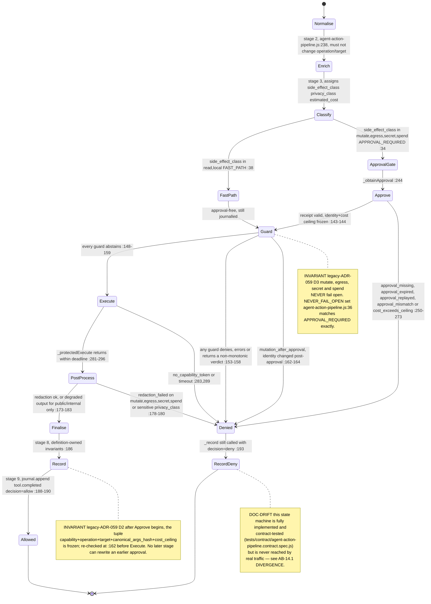

## AB-14.3 AgentActionPipeline.dispatch — intentSpec construction and policy evaluation

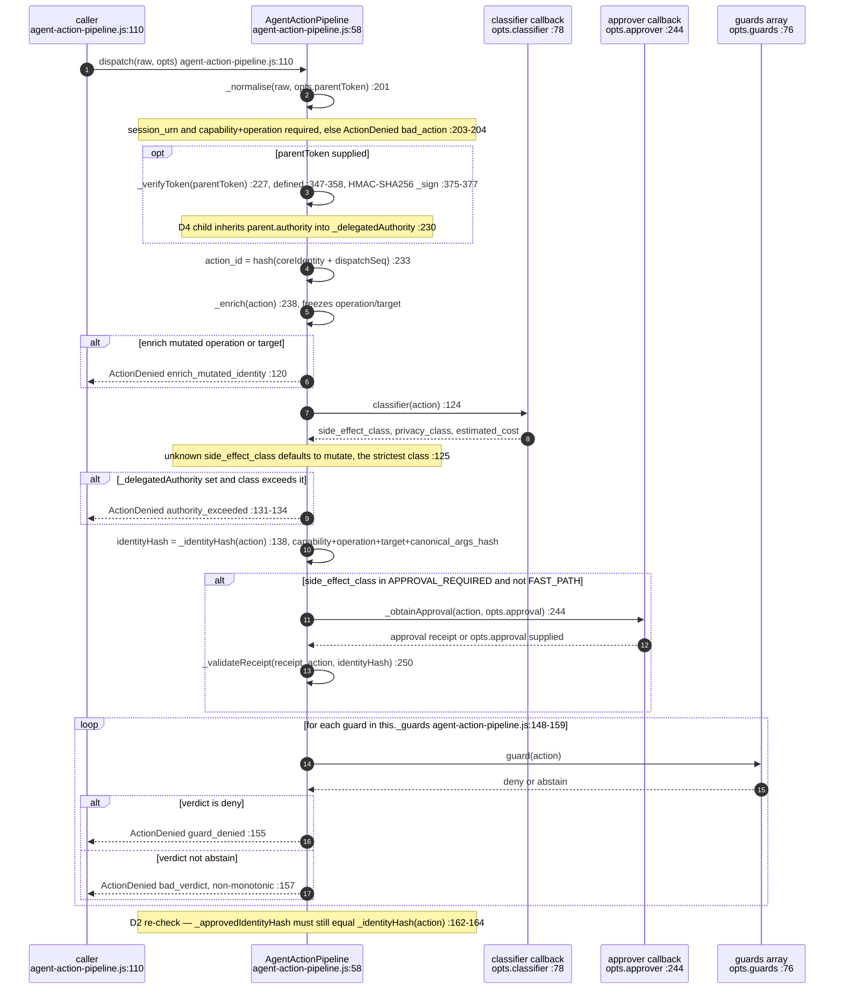

## AB-14.4 F2 operator-gated approval — pending, decide, 409 already-decided

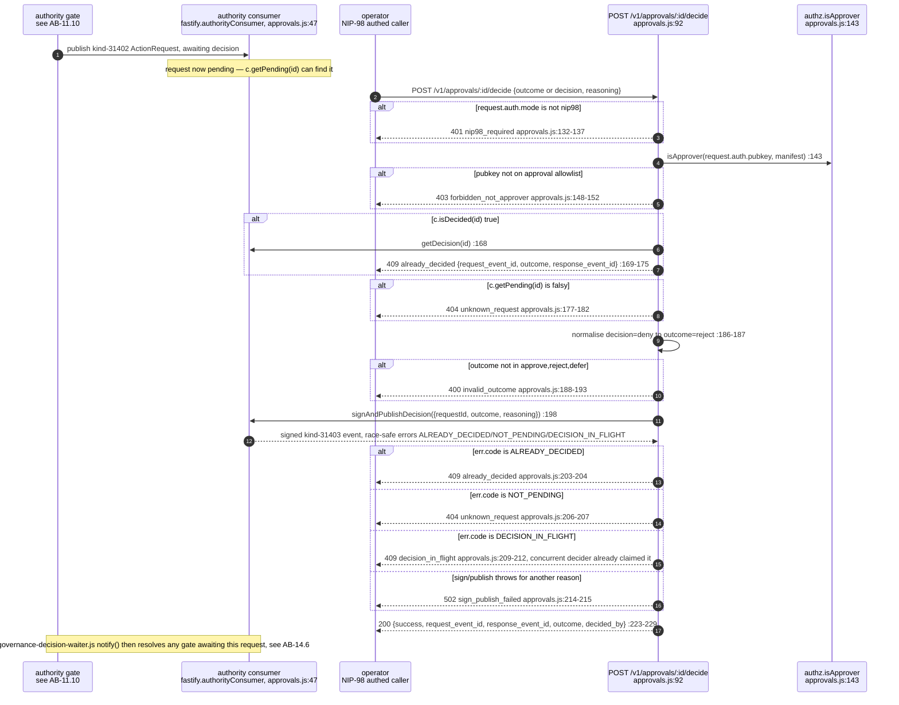

## AB-14.5 routes/approvals.js — every route and status code

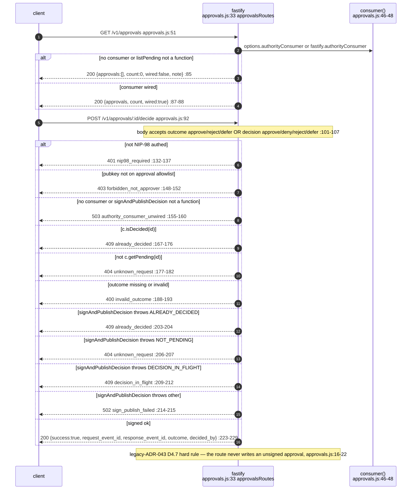

## AB-14.6 Decision waiter — exact request and bounded timeout

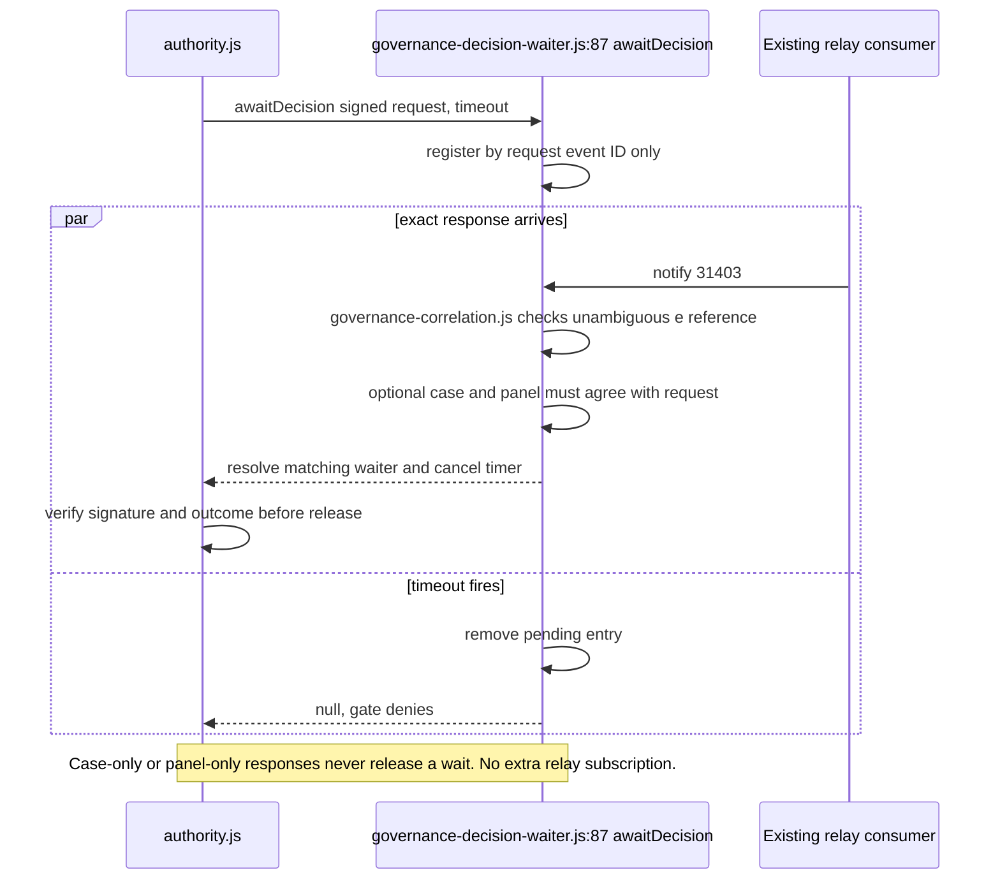

## AB-14.7 ExecutionJournal.append — what is written, where, and the ordering guarantee

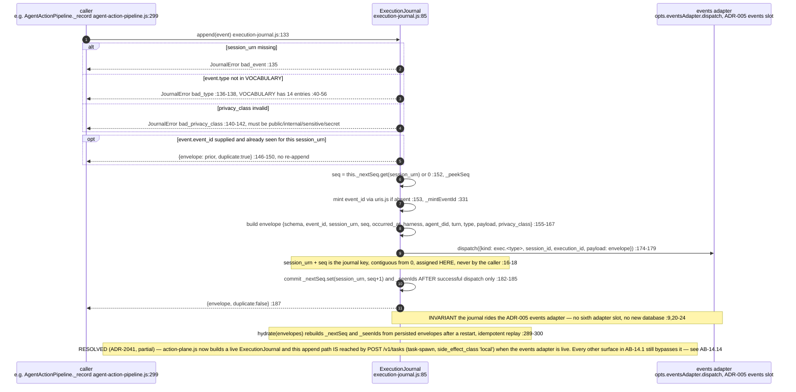

## AB-14.8 execution-projections and execution-coverage over the journal

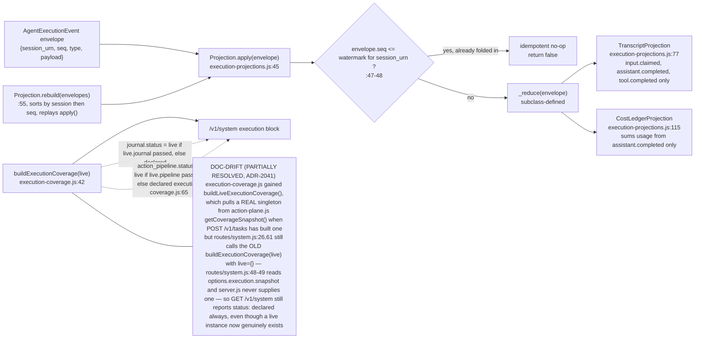

## AB-14.9 receipt-minter then audit-chain — the hash chain link and break detection

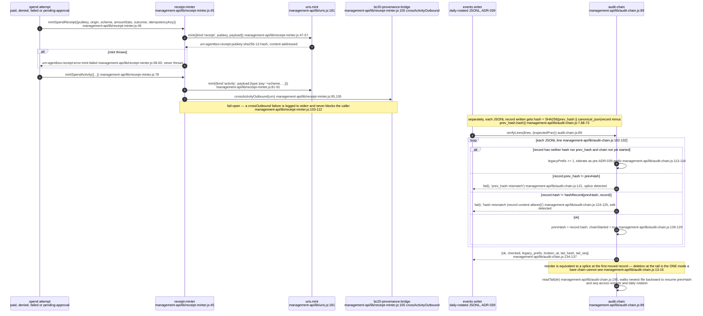


## AB-14.11 ADR-2087 — the task-property triple, the deny journal, the receipt ladder and manual continuation

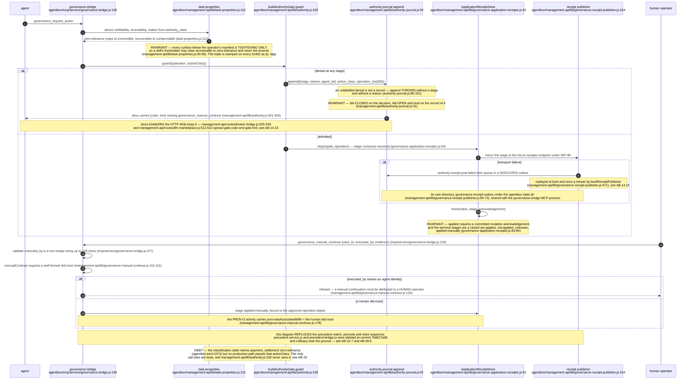

## AB-14.12 project-tracker.js publish path and /v1/projects

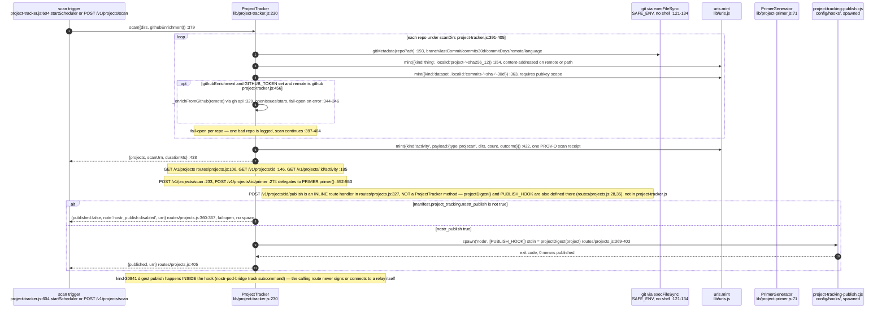

## AB-14.13 elevation-publisher.js — outbound elevation boundary to VisionClaw

ADR-2108 deleted the agentbox-local ontology write path (`ontology-local.cjs`, `ontology-authoring-authority.js`); the
governed door is now `vault propose`/`vault edit --expect`, argv built by `lib/ontology-propose.js` and carried in the
31402 as `propose_command`/`propose_iri` instead of the retired HTTP `propose_request` descriptor.

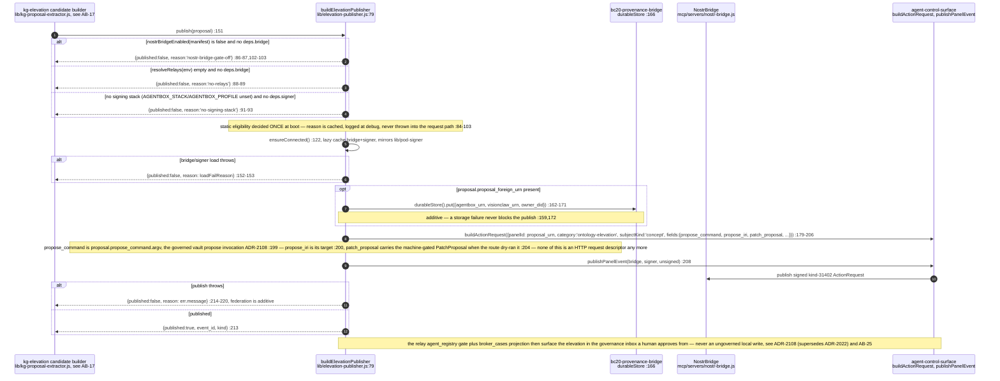

## AB-14.14 action-plane.js — the one wired production instantiation (ADR-2041)

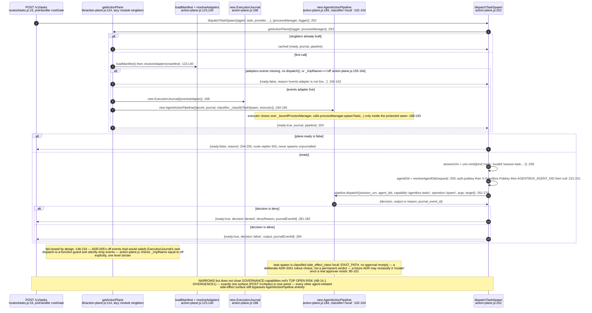

## AB-14.15 ADR-2087 activation wiring — boot replay, per-request resolution, and the staged check

**What it shows.** The four wiring defects the 2 October activation found, as they are now wired at
`c4ed3ec65`: one receipt publisher booted by `server.js` and replayed without overlap, broker-bridge
resolving the boot-built gate and publisher per request, both HTTP denial routes carrying `{code, hint}`,
the governance-bridge MCP server recognising itself through the Nix-store symlink, and the activation
check that turns all of it into a `staged` or `live` verdict.

**Why it is this way.** Every unit suite passed while the shipped image stayed inert: Fastify loads a
top-level-registered plugin at the first awaited `register` inside `start()`, before the boot block
decorates the gate, journal and publisher, so anything read at registration was `undefined`
(ADR-2087 "Activation finding", fixed at `b18a52f03`). `scripts/activation/adr-2087-check.sh`
(`ddfb6d056`) checks the running process rather than the tests; ADR-2087 moved to `staged` on its exit 2
at `c4ed3ec65`.

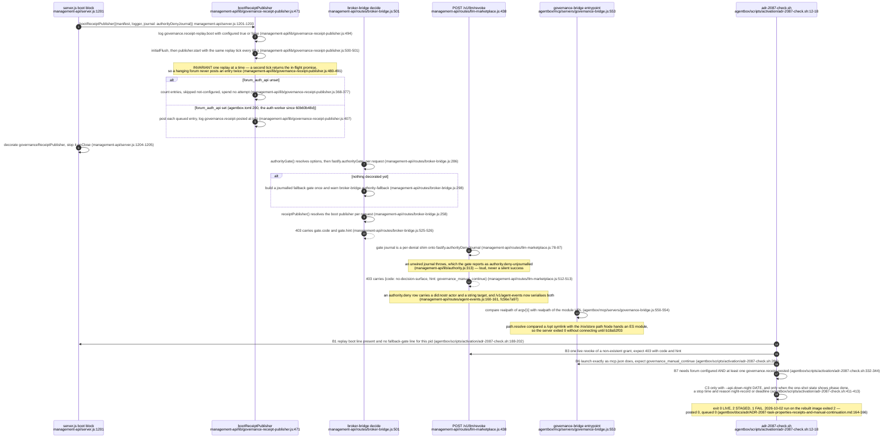

**Invariant:** a receipt the forum has not yet received spends no retry budget while `forum_auth_api` is unset, so the degraded state queues rather than abandons (`management-api/lib/governance-receipt-publisher.js:368-377`).

**Drift (resolved 2026-10-02, `e8460a2e3`):** ADR-2087's Consequences used to say the forum receipts endpoint did not exist yet on the deployed edge; they now record it deployed, with `forum_auth_api` pointing at it, so the queue drains once a real governance response exists (`docs/adr/ADR-2087-task-properties-receipts-and-manual-continuation.md:94-98`), matching the staged section (`docs/adr/ADR-2087-task-properties-receipts-and-manual-continuation.md:164-166`) and the manifest (`agentbox.toml:200`).

**Invariant:** ADR-2071 clause (c) cannot pass on a night of failed journal posts alone: C3 also requires the one-shot's state file to record a clean stop and a `night-record` or `deadline` restart, and an `interrupted` night fails (`scripts/activation/adr-2087-check.sh:403-413`, `scripts/activation/adr-2071-api-down-night.sh:136-145`). AB-23.19 draws the one-shot.

**Open:** the EXP-B8 tick takes two outward side effects when its stopping rule fires, a signed forum post (`scripts/experiments/exp-b8-label-log.cjs:550-563`) and a pull request opened with `gh` (`scripts/experiments/exp-b8-label-log.cjs:573-606`), and records neither through `POST /v1/exec/record` or the authority journal; no record says whether an unattended experiment tick is meant to sit outside the governance journal that ADR-2071 put round the dream night.

**Open:** ADR-2087 reaches `live` only on the first real governance response after the rebuild (B7, `scripts/activation/adr-2087-check.sh:332-344`); the record does not say who is expected to produce that response, or when.

## AB-14.16 The identity port as the signer — named operations by caller uid, flag off versus flag on

```mermaid
flowchart TB
    subgraph OFF["role_isolation = false, the default the image ships: every signer holds its own key"]
        direction TB
        OEXIT["serve-identity prints one line and exits 0, reading no key<br/>services/nostr-pod-bridge/src/identity_port/mod.rs:92-96"]
        OJJ["JunkieJarvis, forum suggestions and EXP-B8 read the JJ key through role-secret,<br/>where the bare variable still counts while the flag is off<br/>management-api/lib/junkiejarvis-agent.js:92-99, scripts/dream-forum-suggestions.mjs:194-200"]
        OCOL["colloquy publish and the digests load the bridge key from AGENTBOX_BRIDGE_SK_FILE<br/>or the legacy variable, services/nostr-pod-bridge/src/lib.rs:179-192"]
        OPOD["pods NIP-98 keeps its key-file or stack-key source<br/>management-api/lib/pod-signer.js:76-79"]
        OEXIT --> OJJ --> OCOL --> OPOD
    end
    subgraph ON["role_isolation = true: one process holds the keys and signs named operations"]
        direction TB
        PROG["serve-identity runs under ab-identity in the isolated config,<br/>env -i so PID 1's inherited environment never reaches it, flake.nix:2515-2531"]
        SOCK["socket /run/secrets/ab-identity-port/identity.sock, mode 0660 in group ab-identity-port<br/>services/nostr-pod-bridge/src/identity_port/server.rs:17, config/role-accounts.json:94-102"]
        PEER["the peer uid comes from SO_PEERCRED on every connection, never from the socket mode<br/>server.rs:104-111"]
        GATE{"uid in the ACL, op in the closed list, op granted to that uid<br/>services/nostr-pod-bridge/src/identity_port/port.rs:361-379"}
        OPS["closed list: pubkey, nip98, sign_event, forum_event, nip42_auth, mirror_key<br/>services/nostr-pod-bridge/src/identity_port/acl.rs:43-50"]
        DEV["uid 1000 devuser: nip98 and nip42_auth on core, sign_event core kinds 38410-38413, 38415, 30840, 30841,<br/>forum_event junkiejarvis kinds 1, 42, 31923, mirror_key with the child secret<br/>config/custody/identity-port-acl.json:34-44"]
        GWY["uid 961 ab-gateway: pubkey, nip42_auth on core, mirror_key public half only<br/>identity-port-acl.json:45-52"]
        REC["one JSONL receipt per decision, admit or refuse, 0640, under /var/lib/agentbox/events/sign<br/>services/nostr-pod-bridge/src/identity_port/receipts.rs:124-138"]
        PROG --> SOCK --> PEER --> GATE --> OPS
        OPS --> DEV
        OPS --> GWY
        DEV --> REC
        GWY --> REC
    end
    OFF --> ON
    GATE -.-> INV1["INVARIANT: kinds 27235, 22242, 31400-31405 and 38414 can never be granted to sign_event or forum_event.<br/>The ACL loader refuses a file that tries, so a container key never signs a governance decision<br/>or a graduation, services/nostr-pod-bridge/src/identity_port/acl.rs:71-73, acl.rs:267-268"]
    REC -.-> INV2["INVARIANT: nothing is signed off the record. An admitted request whose receipt line<br/>cannot be written is answered as a refusal, port.rs:320-326"]
    DEV -.-> WIRE["pods NIP-98 is the one wired client: the flag forces the port, then<br/>nostr-pod-bridge sign-request nip98 over the socket, management-api/lib/pod-signer.js:132-136,<br/>pod-signer.js:152-170, services/nostr-pod-bridge/src/main.rs:81"]
    WIRE -.-> OPEN1["OPEN: sign_event, forum_event and nip42_auth have no client at this revision. JunkieJarvis,<br/>forum suggestions, colloquy publish and the gateway still read ab-identity key files<br/>that devuser cannot open under the flag, so they fail closed until the W3b cutover,<br/>docs/adr/ADR-2122-role-service-accounts-run-secrets-and-the-identity-port.md:218-219"]
```

**What it shows.** Flag off, nothing changes: `serve-identity` exits at once and every governance-adjacent signer reads its own key as before. Flag on, `nostr-pod-bridge serve-identity` is the only holder of the core and JunkieJarvis keys. It authorises each connection by the kernel's peer uid, admits only a closed set of operations per uid, writes a receipt for every admit and refusal, and refuses outright any ACL that would let a container key sign a governance kind or a graduation.

**Why it is this way.** ADR-2122 (custody X-1 step 1) keeps the boundary in-container: a second supervisor config runs role programs under their own uids, and ADR-2101's rule that a generic "sign this payload" port is a bypass becomes the closed operation list. Only the pods signer was moved onto the port in W3. The remaining consumers are owed as W3b, which is why the flag must stay off until the owner's boot rehearsal says otherwise (see AB-36).

**Invariant (under role_isolation):** the governance kinds 31400-31405 and the graduation kind 38414 cannot be signed by any container process through the port, because no ACL that grants them loads (`../project/agentbox/services/nostr-pod-bridge/src/identity_port/acl.rs:71-73`, `../project/agentbox/services/nostr-pod-bridge/src/identity_port/acl.rs:267-268`). With the flag off the port does not run (`../project/agentbox/services/nostr-pod-bridge/src/identity_port/mod.rs:92-96`) and this says nothing about the env-key signers.

**Open:** under the flag the JunkieJarvis agent reads its key through role-secret and gets nothing it can open (`../project/agentbox/management-api/lib/junkiejarvis-agent.js:92-99`), so forum replies and governance-panel posts signed as JunkieJarvis stop until the W3b consumer cutover lands (`../project/agentbox/docs/adr/ADR-2122-role-service-accounts-run-secrets-and-the-identity-port.md:218-219`); the port's `forum_event` grant (`../project/agentbox/config/custody/identity-port-acl.json:40`) has no caller yet.
````

## DIFF

```diff
diff --git a/services/nostr-pod-bridge/src/lib.rs b/services/nostr-pod-bridge/src/lib.rs
index 4b8e208aa..08cdfb862 100644
--- a/services/nostr-pod-bridge/src/lib.rs
+++ b/services/nostr-pod-bridge/src/lib.rs
@@ -61,6 +61,7 @@ use std::path::{Path, PathBuf};
 use std::sync::Arc;
 
 pub mod admission;
+pub mod blocktrail;
 pub mod bootstrap;
 pub mod colloquy_publish;
 pub mod contract;
```
