# E0 judgement ab-06

You are an independent judge for a pre-registered experiment. Below are (1) a TOPIC: a Markdown file of Mermaid diagrams that document code, with `path:line` citations, where paths under `../project/` are in the VisionClaw repository and paths under `../project/agentbox/` are in the agentbox repository; and (2) a DIFF: one commit's changes in the agentbox repository, restricted to the files the topic lists under `sources:`.

Answer exactly one question:

> **Does this change make any statement in the topic false or incomplete?**

Judge only from the two texts below; do not look anything else up. Reply with a single JSON object and nothing else:

```json
{"verdict": "yes" | "no", "statements": ["<diagram id>: <the statement, quoted>", ...], "line_anchors_only": true | false, "reason": "<one or two sentences>"}
```

`statements` lists every topic statement the change makes false or incomplete (empty when the verdict is no). `line_anchors_only` is true when the only such statements are `path:line` anchors whose cited code merely moved.

## TOPIC (docs/diagrams/agentbox/24-loom-facade.md)

````markdown
---
id: AB-24
title: Ontology Loom facade and the model-swap seam
area: agentbox
governing:
  - ../project/agentbox/docs/GOVERNANCE-capabilities.md
adrs: [ADR-2023, ADR-2053, ADR-2055, ADR-2075, ADR-2084, ADR-2122]
sources:
  - ../project/agentbox/mcp/servers/lib/ontology-retrieval.js
  - ../project/agentbox/docs/adr/ADR-2084-one-published-loom-client-for-every-facade-caller.md
  - ../project/agentbox/services/dream-engine/src/llm.rs
  - ../project/agentbox/services/podcast-ingest/src/ingest/loom.rs
  - ../project/agentbox/services/podcast-ingest/src/promote/loom.rs
  - ../project/agentbox/services/explainer-tools/src/bin/loom_draft.rs
  - ../project/agentbox/services/explainer-tools/src/draft.rs
  - ../project/agentbox/services/agentbox-mcp/src/web_summary/llm.rs
  - ../loom/docs/design/ADR-139-per-request-scaffold-opt-out.md
  - ../project/agentbox/scripts/aoe-seed-sessions.mjs
  - ../project/agentbox/mcp/servers/lib/ontology-budget.js
  - ../project/agentbox/agentbox.toml
  - ../project/docker-compose.unified.yml
  - ../project/loom/README.md
  - ../project/agentbox/scripts/opf-router.py
  - ../project/agentbox/mcp/servers/lib/ontology-telemetry.js
  - ../project/agentbox/flake.nix
  - ../loom/docs/design/ADR-140-loom-v2-agent-drivable-grounding.md
  - ../loom/docs/design/ADR-141-loom-consumes-the-vault-build.md
  - ../loom/crates/loom-mcp/src/lib.rs
  - ../loom/crates/loom-mcp/src/schema.rs
  - ../loom/crates/loom-facade/src/mcp_host.rs
  - ../project/agentbox/config/egress-policy.json
  - ../project/agentbox/config/custody/env-classes.json
  - ../project/agentbox/scripts/ci/render-egress-register.js
  - ../loom/crates/loom-facade/src/routes/mod.rs
  - ../loom/crates/loom-facade/src/routes/attest.rs
  - ../loom/crates/loom-facade/src/routes/health.rs
  - ../loom/crates/loom-domain/src/model.rs
  - ../project/agentbox/services/dream-engine/src/engine.rs
  - ../project/agentbox/services/dream-engine/src/config.rs
  - ../project/agentbox/scripts/dream-machine-nightly.mjs
  - ../project/agentbox/docs/GOVERNANCE-capabilities.md
verified_commit: {agentbox: d03defbeaca6c52d6bf3f7338d3f465a109fcdbf, visionclaw: dd420fbc722a7a4a50e968162ac6c3eaff6972b2, loom: 7ea1f6bd5dce1958137d2e5ec3a39533a7e14ca4}
---

## AB-24.1 Two deployments of one facade contract — topology

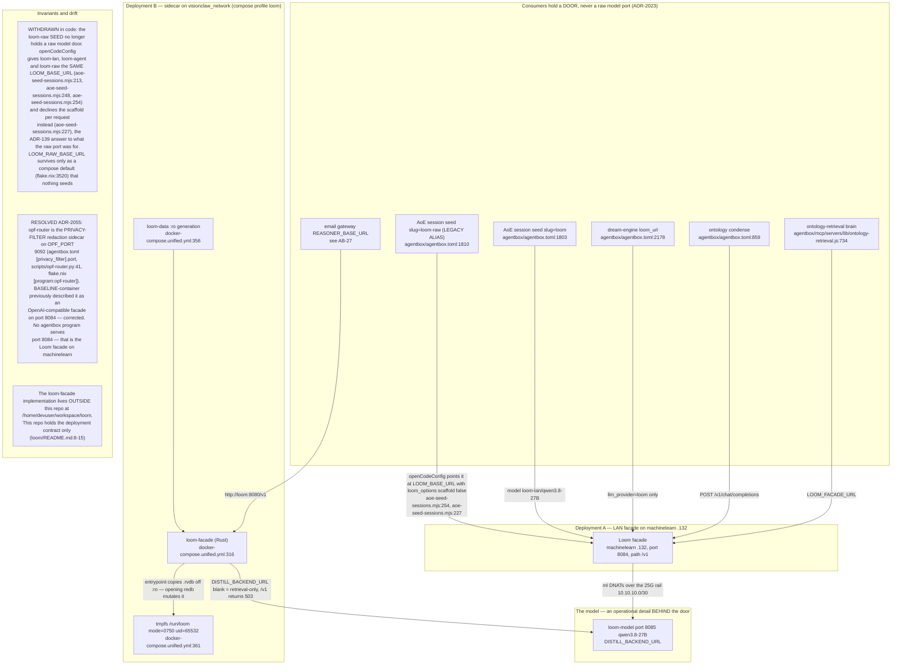

## AB-24.2 selectBackend — which store answers, and why

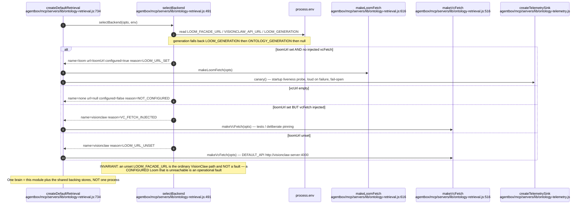

## AB-24.3 Loom-backed retrieval — /loom/search seed then /loom/sparql expand

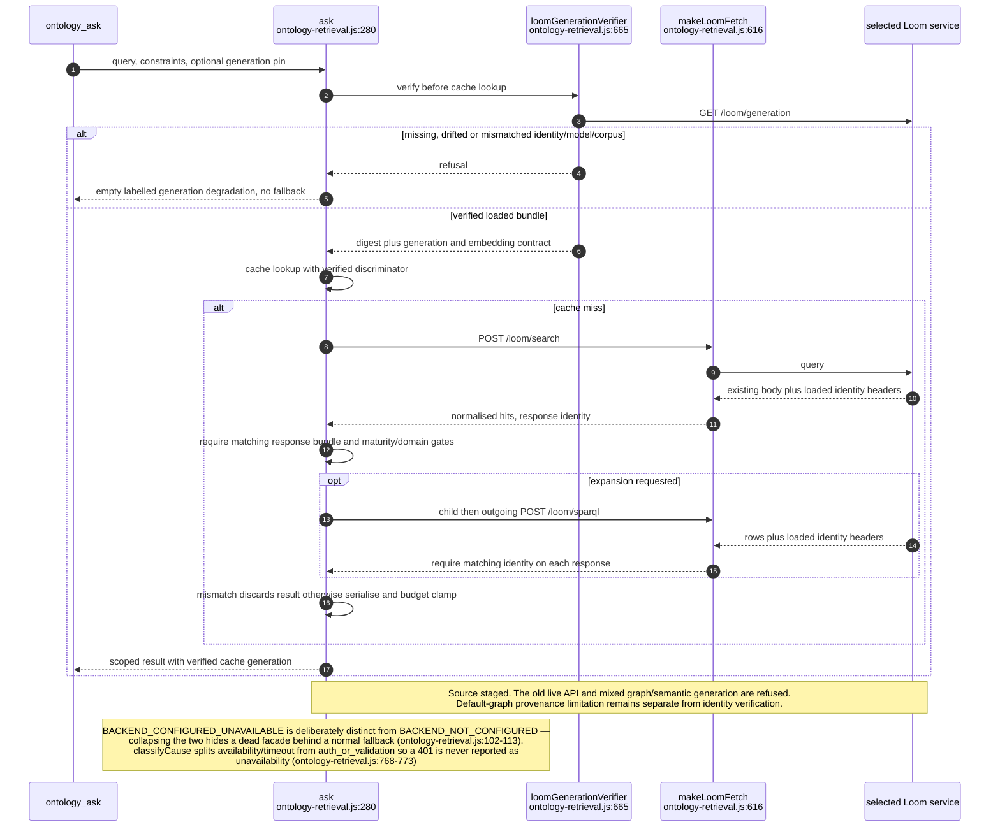

## AB-24.4 Cache key completeness and cache-hit constraint revalidation

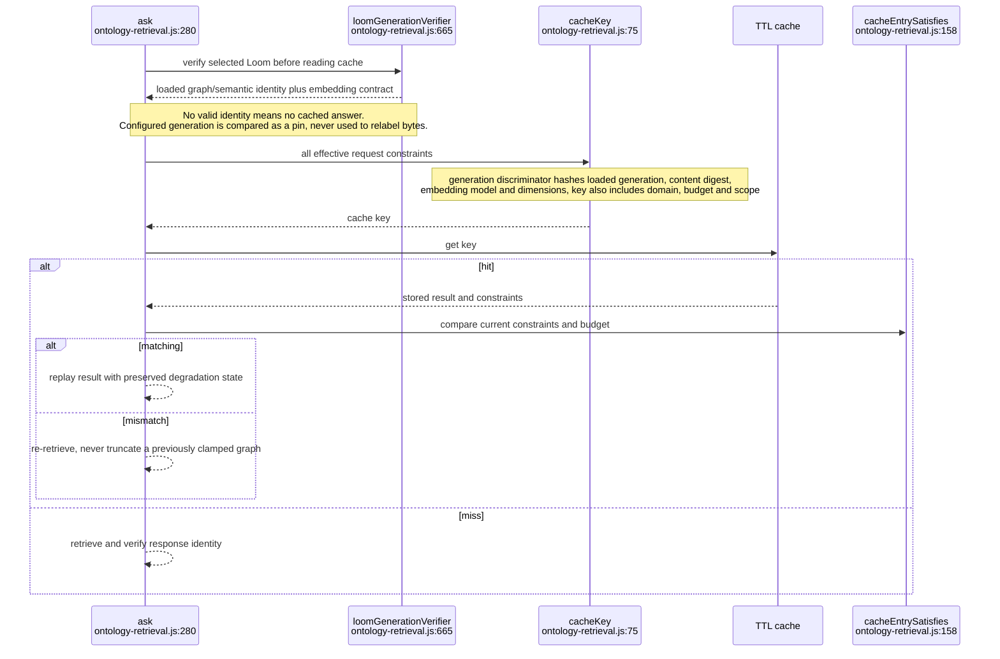

## AB-24.6 POST /v1/chat/completions — scaffold injection then delegate

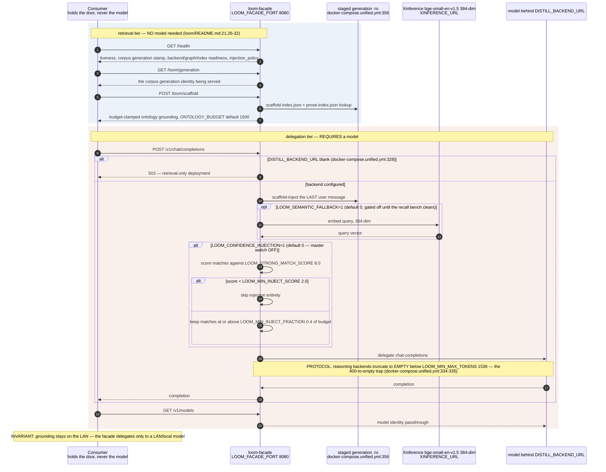

## AB-24.7 Model swap — zero consumer change

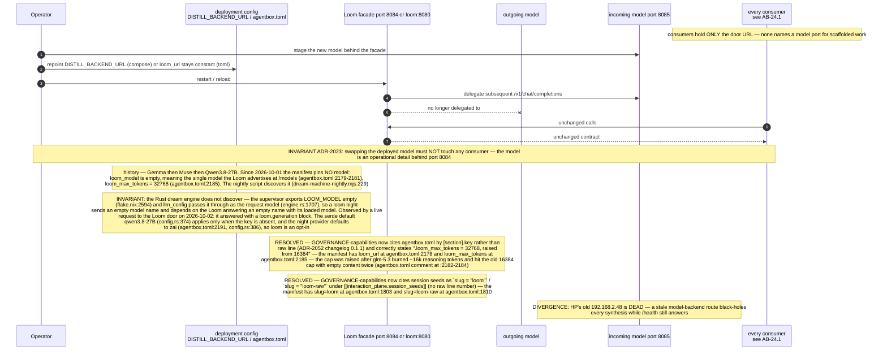

**Drift:** `../project/agentbox/docs/GOVERNANCE-capabilities.md:257` still names **Qwen3.8-27B** as the current model by `[dream_machine].loom_model`, which has been empty since `878f23311` (`../project/agentbox/agentbox.toml:2181`): the manifest now leaves the model to whatever the Loom advertises.

## AB-24.8 Deployment B bring-up and the staging traps

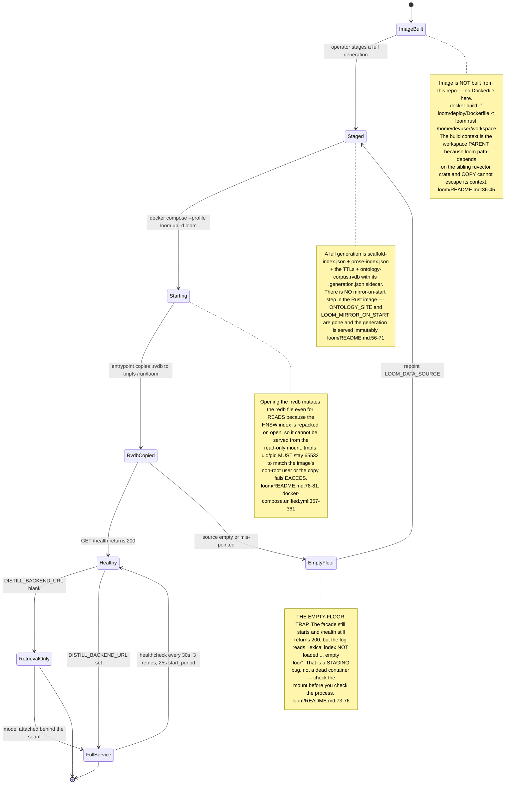

## AB-24.9 Consumer register — which door each one holds

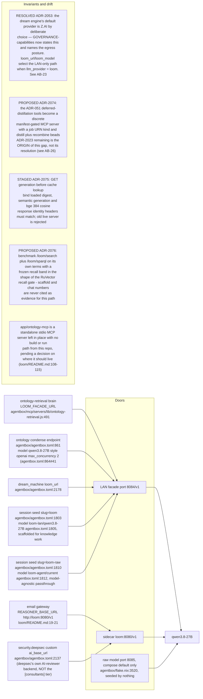

## AB-24.10 ADR-2084 - five callers, one published client

```mermaid
flowchart TB
    subgraph before["Before: five hand-rolled chat-completions clients"]
        B1["each knew a DIFFERENT subset of the same three traps<br/>ADR-2084-one-published-loom-client-for-every-facade-caller.md:21-28"]
        B2["only dream-engine knew a facade can answer 200 with ontology prose<br/>and never call the model"]
        B3["only loom-draft knew about truncation retries and the ADR-139 assertion"]
        B4["only agentbox-mcp floored max_tokens, so the others could ask a<br/>reasoning model for 400 and read empty content as success"]
        B1 --> B2 --> B3 --> B4
    end
    subgraph after["After: the loom-client crate, published from the loom repository"]
        C1["dream-engine call_loom<br/>agentbox/services/dream-engine/src/llm.rs:196"]
        C2["podcast-ingest extraction<br/>agentbox/services/podcast-ingest/src/ingest/loom.rs:34"]
        C3["podcast-ingest promotion<br/>agentbox/services/podcast-ingest/src/promote/loom.rs:69"]
        C4["explainer-loom-draft<br/>agentbox/services/explainer-tools/src/bin/loom_draft.rs:22"]
        C5["web-summary MCP server<br/>agentbox/services/agentbox-mcp/src/web_summary/llm.rs:65"]
    end
    B4 --> C1
    C1 --> C2 --> C3 --> C4 --> C5
    subgraph knows["What the one place now knows"]
        direction TB
        K1["INVARIANT ADR-2084: hand-rolled chat-completions construction against a<br/>facade is PROHIBITED - a sixth caller takes the crate<br/>ADR-2084-one-published-loom-client-for-every-facade-caller.md:37"]
        K2["verbatim and scaffold are INDEPENDENT switches. Three callers sent only<br/>the first and agentbox-mcp sent neither, so a page summary could be<br/>answered from the ontology without the page being read<br/>ADR-2084-one-published-loom-client-for-every-facade-caller.md:30-33"]
        K3["a reasoning model truncated below 1536 tokens returns EMPTY content,<br/>not a short answer - web_summary/llm.rs:20 floors every ask and<br/>web_summary/llm.rs:63 clamps the caller's number up to it"]
        K1 ~~~ K2 ~~~ K3
    end
    C5 -.-> knows
```

**Invariant:** the web-summary path clamps every request to at least 1536 tokens and is pinned by `max_tokens_is_always_clamped_to_at_least_1536` (`../project/agentbox/services/agentbox-mcp/src/web_summary/llm.rs:151`); a scaffold-only serve is reported as a failure, not an answer (`../project/agentbox/services/agentbox-mcp/src/web_summary/llm.rs:198`).

## AB-24.11 ADR-139 - the per-request scaffold opt-out

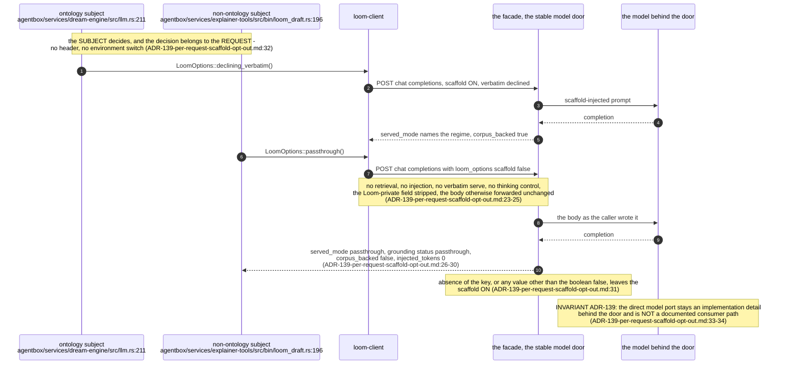

**Debt:** grounding applied to a subject the ontology does not cover is a WRONG answer, not a weak one: on 2026-09-09 a packet about a test script scored the blockchain class Node at 42 and was served from the corpus in 40 ms with zero completion tokens (`../loom/docs/design/ADR-139-per-request-scaffold-opt-out.md:13-16`), which is why `../project/agentbox/services/explainer-tools/src/draft.rs:4` declines the scaffold on every request.

## AB-24.12 ADR-140 — a third door, same gate: the agentic MCP plane

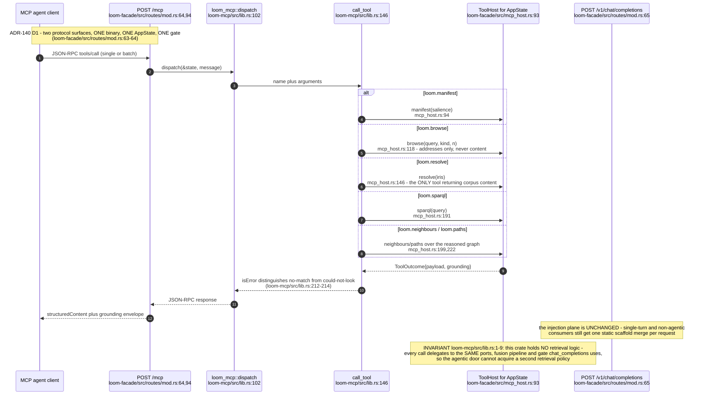

**What it shows:** `/mcp` (ADR-140 D1) puts a JSON-RPC tool surface beside `/v1/chat/completions` in the same `loom-facade` binary, dispatching six tools (`loom.manifest`, `loom.browse`, `loom.resolve`, `loom.sparql`, `loom.neighbours`, `loom.paths`) through the one `ToolHost` implementation the chat plane's scaffold assembly also uses. **Why it is this way:** ADR-139's incident — a static scaffold fragment served the blockchain class `Node` to a consumer discussing a test script — is, per [Evo] (arXiv:2609.15779, cited ADR-140 §1), the generic failure mode of pre-reasoning static injection; per-turn tool-driven retrieval is the ecosystem's answer, and Loom ships it as a second surface rather than replacing the first because non-agentic consumers (the email gateway, single-turn lookups) have nothing to drive a tool loop with.

## AB-24.13 ADR-141 — the served generation becomes `visionGraph@sha`, and a governance ledger route lands

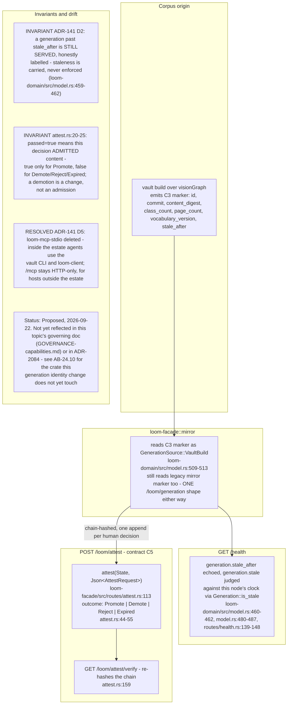

**What it shows:** the corpus stops being GitHub-published; `loom-facade::mirror` now recognises a `vault build` marker (`GenerationSource::VaultBuild`) naming the generation `visionGraph@<sha>`, and `/health` reports a `stale_after` promise plus this node's own staleness judgement without ever refusing to serve. A `POST /loom/attest` route gives the corpus's human promotion/demotion decisions a chain-hashed, restart-surviving ledger. **Why it is this way:** ADR-141 fixes the gap ADR-140 §1.3 measured — a Loom bundle stale by a month against the vault it should mirror — and, per ADR-136 D5, moves `AttestationLedger` from a build/CI-time port to a serving-path writer so `passed` on an entry answers "is this in the corpus because someone said so", the one question the audit trail exists for.

**Debt (corpus door behind the vault, 2026-10-02):** the next generation `visionGraph@015ca2c1f` is built, promoted and verified, but the door still serves `visionGraph@ae913f93…`, and the `vault` 0.1.0 baked into the agentbox image predates the portable-records file, so it cannot produce a promotable bundle (`../loom/docs/design/ADR-141-loom-consumes-the-vault-build.md:138-147`). The pin is fixed in source, since `vaultSrc` now names VisionClaw `64512141bd01` (`../project/agentbox/flake.nix:41-42`), but that reaches a running `vault` only at the next image rebuild.

## AB-24.14 Custody X-1 step 1 at the Loom door — what the register and the env classes say

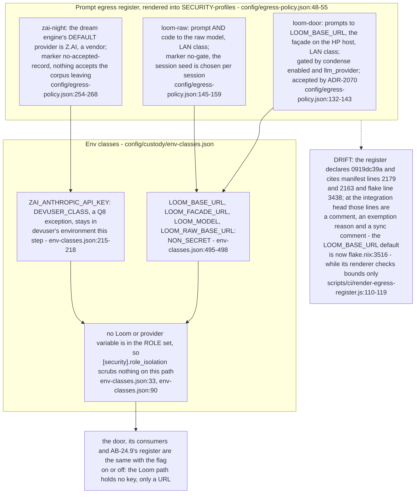

**Invariant:** the Loom path carries no secret: every Loom variable is classified `NON_SECRET`, and the only credential beside it, the Z.AI key the dream engine falls back to, is `DEVUSER_CLASS` by the Q8 exception (`../project/agentbox/config/custody/env-classes.json:495-498`, `../project/agentbox/config/custody/env-classes.json:215-218`). So custody X-1 step 1 changes nothing at this door in either mode.

**Drift (egress register vs the integration head):** the register is stamped `0919dc39a` (`../project/agentbox/config/egress-policy.json:51`), and its loom-door and zai-night rows cite manifest lines 2179 and 2163 and flake line 3438 (`../project/agentbox/config/egress-policy.json:138-139`, `../project/agentbox/config/egress-policy.json:262`). Those were the right lines at that stamp. At this revision the `[security].role_isolation` block has shifted the manifest by twelve lines and the façade default moved to `flake.nix:3516` (`../project/agentbox/flake.nix:3516`). The renderer's `--check` only tests that a cited line falls inside the file, so it cannot see the shift (`../project/agentbox/scripts/ci/render-egress-register.js:110-119`).

## Audit qualification - 2026-09-07

The execution pass implements consumer verification in `ontology-retrieval.js::loomGenerationVerifier`: GET generation before every cache lookup, compare the configured pin and loaded digest/model/corpus, and validate identity headers on search/SPARQL responses. The local Loom route implementation preserves response bodies and adds those headers. This source is staged: the live façade was probed and still reports lexical generation 2026-08-22 versus semantic 2026-08-17, without loaded identity/embedding fields. A coordinated bundle/server rollout is required before activating the stricter client. See [execution evidence](../../estate-review/closeout/2026-09-07-execution-agentbox.md). The graph loader still uses the shared default graph, so ADR-2073 remains open. Generation reporting is not an automatic corpus reload.
````

## DIFF

```diff
diff --git a/services/dream-engine/src/engine.rs b/services/dream-engine/src/engine.rs
index 30dbc77ab..76bc7a941 100644
--- a/services/dream-engine/src/engine.rs
+++ b/services/dream-engine/src/engine.rs
@@ -137,7 +137,7 @@ impl Engine {
         if governance::enabled() {
             let c = nj.called("forum.governance", json!({ "op": "ingest" })).await;
             let r = governance::ingest(&inbox::inbox_path(), false).await;
-            nj.completed(c, true, json!({ "resolved": r.resolved, "rejected": r.rejected, "skipped": r.skipped }))
+            nj.completed(c, true, json!({ "resolved": r.resolved, "withdrawn": r.withdrawn, "rejected": r.rejected, "skipped": r.skipped }))
                 .await;
         }
 
@@ -306,7 +306,7 @@ impl Engine {
         if governance::enabled() {
             let c = nj.called("forum.governance", json!({ "op": "publish" })).await;
             let r = governance::publish(&inbox::inbox_path(), false).await;
-            nj.completed(c, r.rejected == 0, json!({ "published": r.published, "rejected": r.rejected }))
+            nj.completed(c, r.rejected == 0, json!({ "published": r.published, "withdrawn": r.withdrawn, "rejected": r.rejected }))
                 .await;
         }
         if std::env::var("DREAM_DIGEST").as_deref() != Ok("0") {
```
