# E0 judgement ab-08

You are an independent judge for a pre-registered experiment. Below are (1) a TOPIC: a Markdown file of Mermaid diagrams that document code, with `path:line` citations, where paths under `../project/` are in the VisionClaw repository and paths under `../project/agentbox/` are in the agentbox repository; and (2) a DIFF: one commit's changes in the agentbox repository, restricted to the files the topic lists under `sources:`.

Answer exactly one question:

> **Does this change make any statement in the topic false or incomplete?**

Judge only from the two texts below; do not look anything else up. Reply with a single JSON object and nothing else:

```json
{"verdict": "yes" | "no", "statements": ["<diagram id>: <the statement, quoted>", ...], "line_anchors_only": true | false, "reason": "<one or two sentences>"}
```

`statements` lists every topic statement the change makes false or incomplete (empty when the verdict is no). `line_anchors_only` is true when the only such statements are `path:line` anchors whose cited code merely moved.

## TOPIC (docs/diagrams/agentbox/16-secrets-custody-seccomp-profiles.md)

````markdown
---
id: AB-16
title: Secrets custody, seccomp and runtime profiles
area: agentbox
governing:
  - ../project/agentbox/docs/SECURITY-profiles.md
  - ../project/agentbox/docs/INGRESS-identity.md
adrs: [ADR-2007, ADR-2026, ADR-2027, ADR-2033, ADR-2046, ADR-2122]
sources:
  - ../project/agentbox/config/seccomp-agentbox.json
  - ../project/agentbox/docker-compose.yml
  - ../project/agentbox/scripts/ci/check-seccomp.sh
  - ../project/agentbox/config/hooks/trust-seed.cjs
  - ../project/agentbox/config/hooks/nostr-live-mirror.cjs
  - ../project/agentbox/config/nostr-gateway/gateway.cjs
  - ../project/agentbox/config/nip98-proxy/proxy.mjs
  - ../project/agentbox/management-api/lib/agent-identity.js
  - ../project/agentbox/config/entrypoint-unified.sh
  - ../project/agentbox/skills/email-search/SKILL.md
  - ../project/agentbox/docs/adr/ADR-2027-secret-custody-rotation-break-glass.md
  - ../project/scripts/backup-secrets.sh
  - ../project/agentbox/services/secret-backup/src/main.rs
  - ../project/agentbox/services/secret-backup/README.md
  - ../project/agentbox/agentbox.toml
  - ../project/agentbox/config/lib/role-custody.sh
  - ../project/agentbox/config/role-accounts.json
  - ../project/agentbox/services/agentbox-manifest/src/role_accounts.rs
  - ../project/agentbox/config/custody/env-classes.json
  - ../project/agentbox/config/custody/identity-port-acl.json
  - ../project/agentbox/scripts/ci/env-secret-inventory.js
  - ../project/agentbox/config/hooks/lib/operator-key.cjs
  - ../project/agentbox/management-api/lib/role-secret.js
  - ../project/agentbox/services/nostr-pod-bridge/src/role_secret.rs
  - ../project/agentbox/services/nostr-pod-bridge/src/bootstrap.rs
  - ../project/agentbox/services/nostr-pod-bridge/src/identity.rs
  - ../project/agentbox/services/nostr-pod-bridge/src/lib.rs
  - ../project/agentbox/services/nostr-pod-bridge/src/mirror_key.rs
  - ../project/agentbox/services/nostr-pod-bridge/src/identity_port/port.rs
  - ../project/agentbox/docs/adr/ADR-2122-role-service-accounts-run-secrets-and-the-identity-port.md
  - ../project/agentbox/tests/runtime-contract/RC-X1-06.sh
  - ../project/agentbox/docs/adr/ADR-2101-federation-topology-and-key-separation.md
verified_commit: {agentbox: 8f55d9a435a1abdf6a2c77d362ba1379a8f2520f, visionclaw: 7d3ea2edb067432a57e6fe1fd951fd8254380bb8}
---

## AB-16.1 Container hardening posture — what actually confines the box

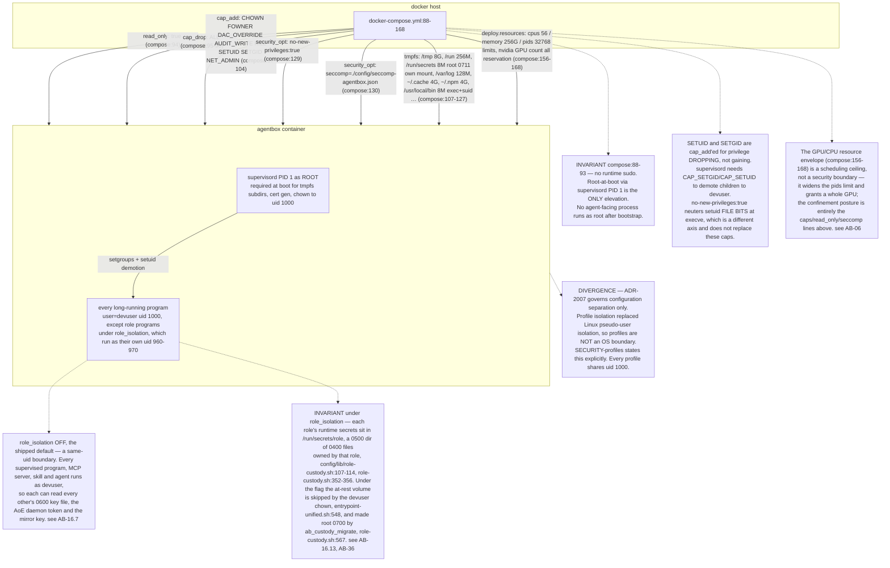

## AB-16.2 The seccomp profile is a supplemental denylist, not a sandbox

```mermaid
classDiagram
    class SeccompProfile {
        <<agentbox/config/seccomp-agentbox.json>>
        +string defaultAction
        +List~string~ architectures
        +List~SyscallRule~ syscalls
    }
    class RuleAfAlg {
        <<syscalls[0]>>
        +names socket
        +action SCMP_ACT_ERRNO
        +errnoRet 1
        +arg index 0 value 38 op SCMP_CMP_EQ
    }
    class RuleHighRisk {
        <<syscalls[1] — 46 names>>
        +action SCMP_ACT_ERRNO
        +errnoRet 1
        +args empty
    }
    class DockerDefault {
        <<overridden by explicit profile selection>>
        +not implicitly stacked
    }
    SeccompProfile --> RuleAfAlg
    SeccompProfile --> RuleHighRisk
    SeccompProfile ..> DockerDefault : explicit security_opt overrides default
    note for SeccompProfile "defaultAction = SCMP_ACT_ALLOW. This is INTENTIONALLY allow-by-default.<br/>The file calls itself supplemental, but explicit Docker security_opt selects it IN PLACE OF the default profile.<br/>An allowlist was REJECTED deliberately — the workload surface (Chromium, CUDA, Godot) is too wide to enumerate safely without breakage.<br/>architectures: SCMP_ARCH_X86_64, X86, AARCH64, ARM."
    note for RuleAfAlg "CVE-2026-31431 'Copy Fail' — blocks AF_ALG (family 38) socket creation,<br/>the algif_aead local privesc via splice(). Arg-indexed, so other socket families are unaffected."
    note for RuleHighRisk "add_key bpf clock_adjtime clock_settime create_module delete_module finit_module get_kernel_syms get_mempolicy<br/>init_module ioperm iopl kcmp kexec_file_load kexec_load keyctl lookup_dcookie mbind mount move_pages nfsservctl<br/>perf_event_open pivot_root process_vm_readv process_vm_writev ptrace query_module quotactl reboot request_key<br/>set_mempolicy setns settimeofday stime swapon swapoff sysfs _sysctl umount umount2 unshare uselib userfaultfd ustat vm86 vm86old"
    note for DockerDefault "DIVERGENCE — reading this file as the confinement boundary is wrong.<br/>Confinement comes from the COMBINATION: cap_drop ALL, read_only root, uid 1000, no-new-privileges,<br/>plus the selected custom seccomp profile and any independently configured host controls. Docker's default is not automatically stacked. see AB-16.1"
```

## AB-16.3 check-seccomp.sh — the invariant gate

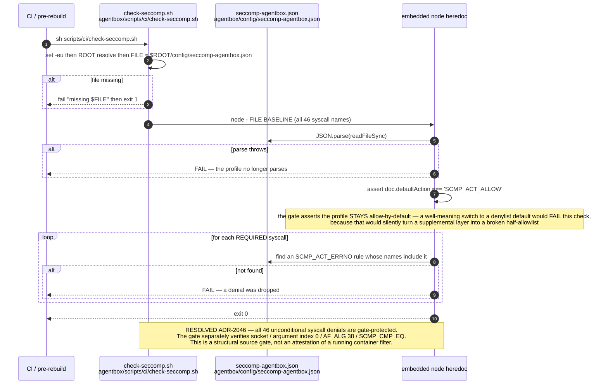

## AB-16.4 Boot privilege drop and the trust-seed hook

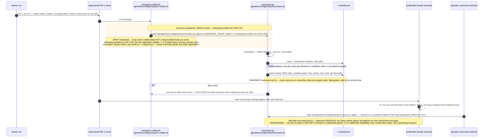

## AB-16.5 Derived keys — HMAC-SHA256 domain separation

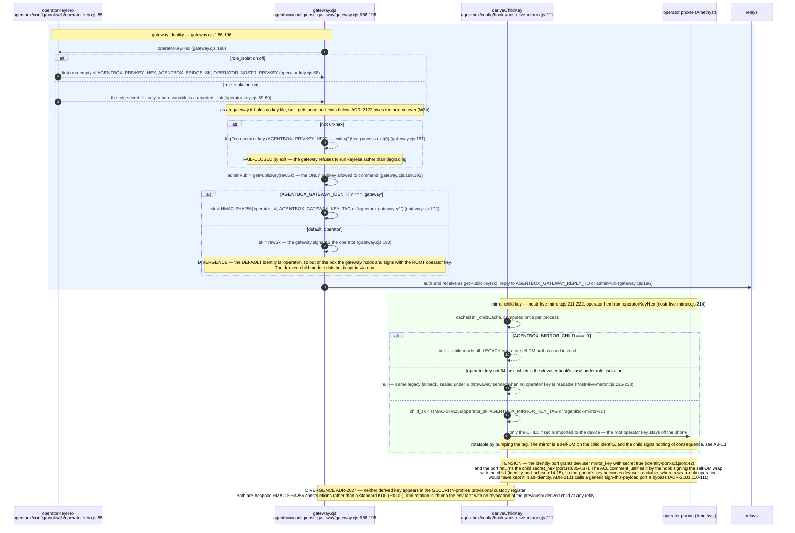

## AB-16.6 Break-glass — the least governed credential

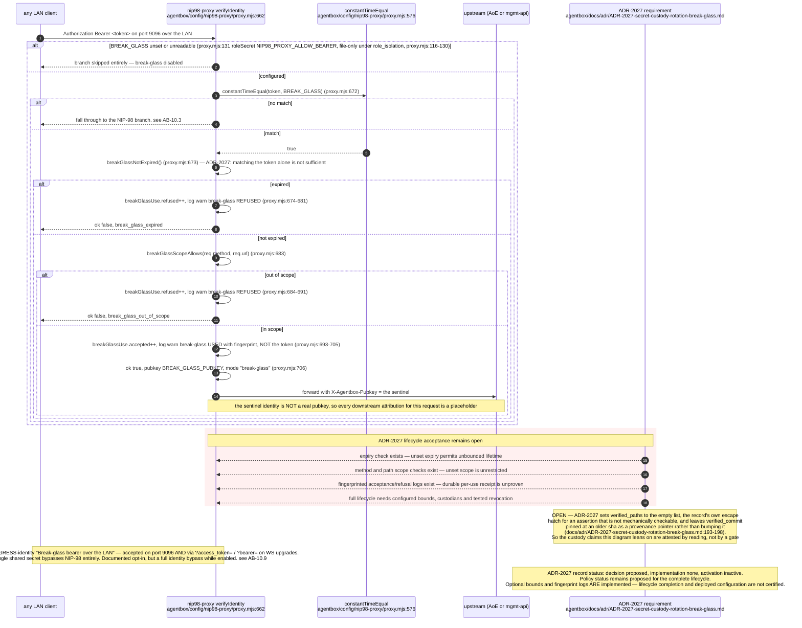

## AB-16.7 Key files at 0600 — what that boundary is and is not

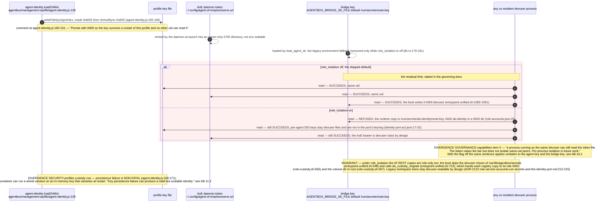

## AB-16.8 A secret's lifecycle — implemented versus proposed

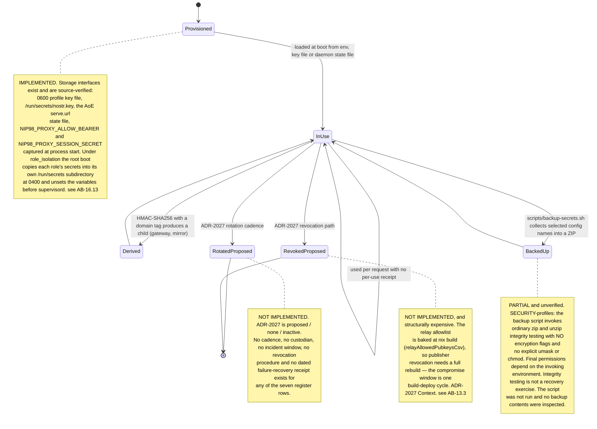

## AB-16.9 Provisional custody register — seven roles, zero confirmed custodians

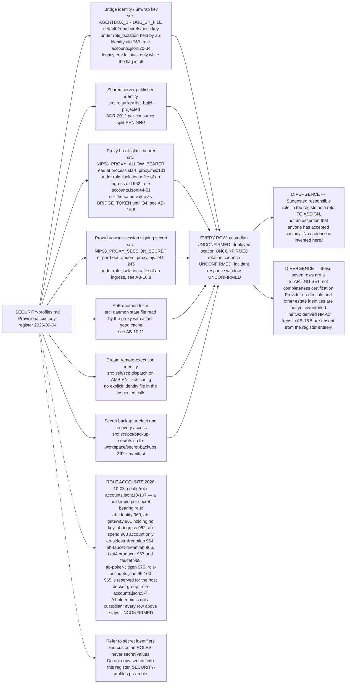

## AB-16.10 email-search — the owner-authorised break-glass tier

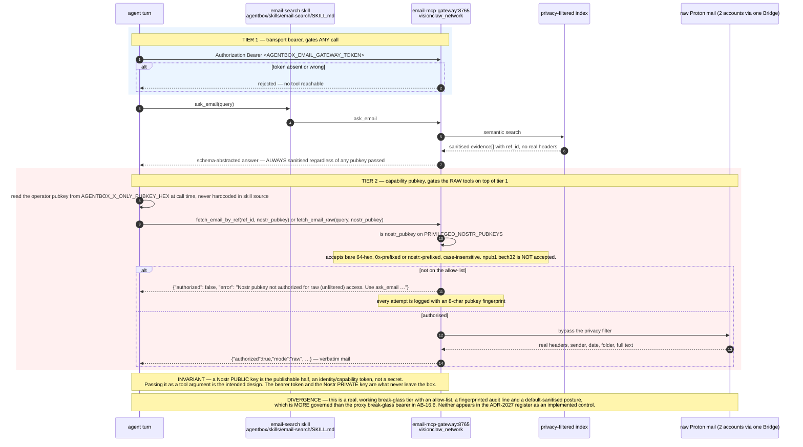

## AB-16.11 Egress profiles — mirror versus digest have different contracts

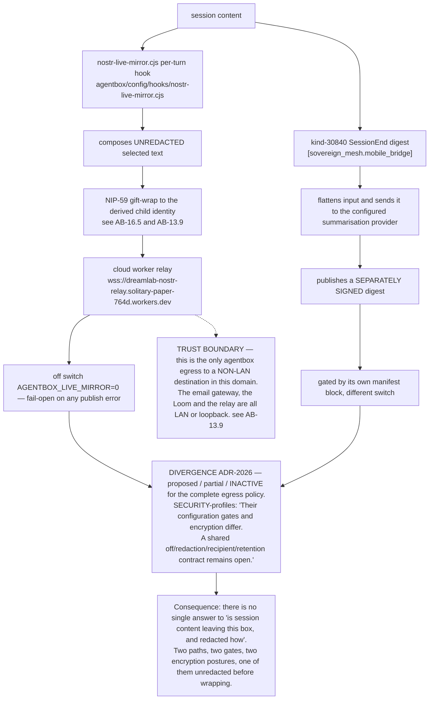

## Audit qualification — 2026-09-07

AB-16.2 corrects an upstream comment as well as the previous drawing: Docker explicitly selected seccomp profiles override the default; they are not automatically stacked ([Docker seccomp documentation](https://docs.docker.com/engine/security/seccomp/)). No running filter or credential contents were inspected. AB-16.3 passed `check-seccomp.sh` against the current source. The same-UID custody limitation remains. See [audit](../../estate-review/2026-09-07-agentbox-audit.md).


## AB-16.12 agentbox-secret-backup — an age-encrypted archive tool packaged for explicit invocation

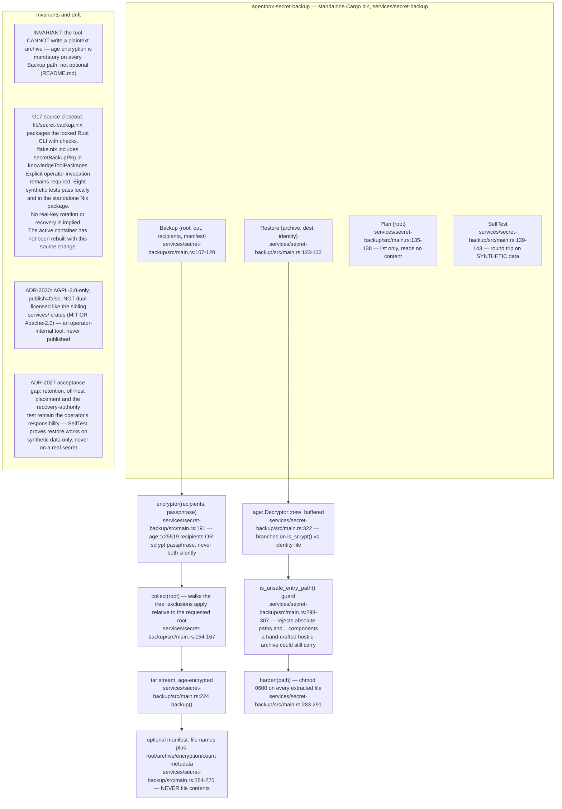

## AB-16.13 Role secret delivery — the shipped default versus role_isolation

```mermaid
flowchart TB
    subgraph OFF["role_isolation = false, the shipped default: today's boot, unchanged"]
        direction TB
        O1["/run/secrets handed to devuser at 0700<br/>config/entrypoint-unified.sh:388-391"]
        O2["the bridge key written 0400 devuser and AGENTBOX_BRIDGE_SK unset<br/>entrypoint-unified.sh:1082-1091"]
        O3["capture and scrub return at their first line, so every other ROLE variable stays in PID 1<br/>and reaches every child, entrypoint-unified.sh:424, entrypoint-unified.sh:468"]
        O4["exec supervisord with /etc/supervisord.conf and a byte-identical environment<br/>entrypoint-unified.sh:1207, tests/runtime-contract/RC-X1-06.sh:12"]
        O1 --> O2 --> O3 --> O4
    end
    subgraph ON["role_isolation = true: per-role files under a root-owned mount"]
        direction TB
        N1["/run/secrets is its own root tmpfs, prepared root 0711, a mount point devuser cannot rename<br/>config/lib/role-custody.sh:89-103, entrypoint-unified.sh:352-355"]
        N2["each ROLE variable from the eleven-name list goes to /run/secrets/role/NAME at 0400 and is unset,<br/>before the identity bootstrap runs, entrypoint-unified.sh:411, entrypoint-unified.sh:489"]
        N3["identity.env is rendered public-only: no AGENTBOX_NSEC, no AGENTBOX_BRIDGE_SK,<br/>only the key file's path, services/nostr-pod-bridge/src/bootstrap.rs:230-250"]
        N4["the baked plan /etc/agentbox/role-secrets.tsv is executed row by row<br/>entrypoint-unified.sh:1210, role-custody.sh:218-359"]
        N5["each file lands via a 0400 temp owned by the role, then a rename, role-custody.sh:107-114.<br/>Role dirs are sealed 0500 and role-owned last, role-custody.sh:352-356"]
        N6["final scrub: a ROLE variable still present is logged ROLE-ISOLATION-LEAK and unset,<br/>entrypoint-unified.sh:1221, then exec the roles config, entrypoint-unified.sh:1222"]
        N7["readers take NAME_FILE, then AGENTBOX_SECRETS_DIR/NAME, then a default file,<br/>and the bare variable only with the flag off<br/>services/nostr-pod-bridge/src/role_secret.rs:9-22, management-api/lib/role-secret.js:13-25"]
        N1 --> N2 --> N3 --> N4 --> N5 --> N6 --> N7
    end
    OFF --> ON
    N6 -.-> INV1["INVARIANT under role_isolation: no ROLE variable reaches supervisord's environment.<br/>Captured at entrypoint-unified.sh:489, scrubbed at entrypoint-unified.sh:1221"]
    N5 -.-> INV2["Each chain's signer key and parent credential are delivered to that chain's producer uid only,<br/>role-accounts.json:66-67, role-accounts.json:85-86. The treasury source is now the volume copy,<br/>role-accounts.json:76, its workspace twin a legacy copy migrate never deletes, ADR-2122-role-service-accounts-run-secrets-and-the-identity-port.md:212-215"]
    N3 -.-> TEN1["INVARIANT: role-accounts.json:22 calls ab-identity the sole holder of the sovereign key;<br/>under role_isolation the identity file, which carries private_key_hex (identity.rs:71),<br/>is ab-identity 0400, entrypoint-unified.sh:757-758, role-accounts.json:32.<br/>Flag off it stays devuser 0600, entrypoint-unified.sh:759-761"]
    N4 -.-> TEN2["INVARIANT: under the flag the at-rest volume /var/lib/agentbox/secrets is never handed to devuser,<br/>entrypoint-unified.sh:548; ab_custody_migrate, role-custody.sh:447, called at entrypoint-unified.sh:723,<br/>makes it root 0700, role-custody.sh:567. Flag off, ab_custody_revert hands it back, entrypoint-unified.sh:725"]
```

**What it shows.** With the flag off the boot is unchanged and every ROLE secret is ambient. With it on the root boot moves each role's secrets into its own 0500 directory of 0400 files under a root-owned mount, writes a public-only `identity.env`, and scrubs the environment twice before `supervisord` starts, so no role program and no devuser process inherits a signing key from PID 1.

**Why it is this way.** ADR-2122 chose per-role Unix accounts over a separate signing container because supervisord already drops privilege per program; the flag is boot-class so the image carries both paths and the owner's rehearsal flips it without a rebuild (see AB-36). The runtime copies are only half of custody: the at-rest volumes are W2's, and until that lands the flag's confidentiality claim is about the environment and `/run/secrets`, not the disk.

## AB-16.14 Environment classes — every secret-shaped name in exactly one class

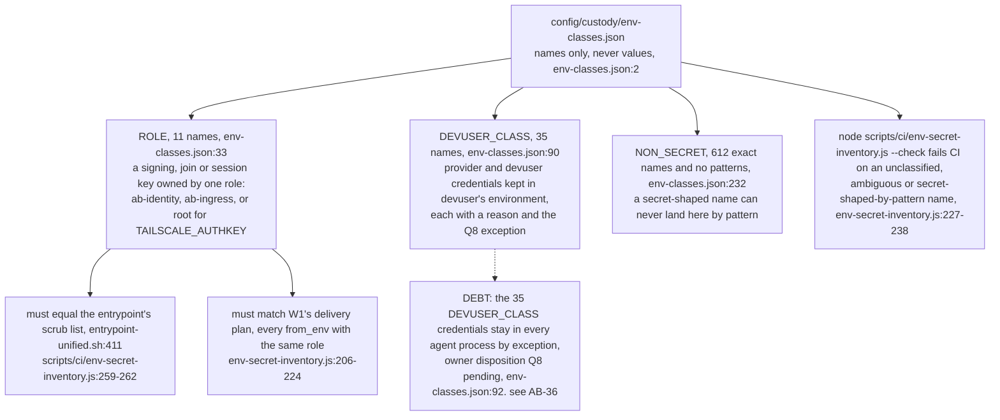

**What it shows.** One table classifies every environment name the boot path and the role-secret consumers read. Only the ROLE class leaves PID 1 under the flag; the CI inventory keeps that set equal to the entrypoint's scrub list and to the role table's delivery plan, so a new key cannot be added to one and forgotten in another.

**Why it is this way.** Bypass 3 of the custody design was that `.env` reached every process through PID 1. A denylist of role secrets, rather than an allowlist of the environment, lets the flag ship without breaking agent tooling; the price is the DEVUSER_CLASS exception, which the owner has not yet ruled on.

**Invariant (under role_isolation):** the runtime copy of every role secret is readable only by its role — each file is `0400` and role-owned inside a `0500` role-owned directory (`../project/agentbox/config/lib/role-custody.sh:107-114`, `../project/agentbox/config/lib/role-custody.sh:352-356`) on a root-owned mount devuser cannot rename (`../project/agentbox/config/lib/role-custody.sh:89-103`). With the flag off, `/run/secrets` is devuser's as before (`../project/agentbox/config/entrypoint-unified.sh:388-391`).

**Invariant (under role_isolation):** no ROLE variable is in PID 1's environment when `supervisord` starts (`../project/agentbox/config/entrypoint-unified.sh:489`, `../project/agentbox/config/entrypoint-unified.sh:1221`); with the flag off both functions return at their first line and the environment is today's (`../project/agentbox/config/entrypoint-unified.sh:424`, `../project/agentbox/config/entrypoint-unified.sh:468`).

**Invariant (role isolation vs the at-rest volumes):** under `[security].role_isolation` the at-rest copies are role-only as well as the runtime ones. The boot skips the devuser chown of `/var/lib/agentbox/secrets` when the flag is on (`../project/agentbox/config/entrypoint-unified.sh:548`) and calls `ab_custody_migrate` on the baked plan (`../project/agentbox/config/entrypoint-unified.sh:723`), whose `atrest`/`atrestdir` rows `agentbox-manifest role-accounts isolate` derives from the role table (`../project/agentbox/services/agentbox-manifest/src/role_accounts.rs:1011-1028`). `ab_custody_migrate` (`../project/agentbox/config/lib/role-custody.sh:447`) hands each registry copy to its role at 0400 (`../project/agentbox/config/lib/role-custody.sh:556`) and each volume dir to root (`../project/agentbox/config/lib/role-custody.sh:567`); with the flag off `ab_custody_revert` hands them back (`../project/agentbox/config/entrypoint-unified.sh:725`). The legacy workspace twins are copied once and never deleted, so they stay devuser-readable by design until a manual purge (`../project/agentbox/docs/adr/ADR-2122-role-service-accounts-run-secrets-and-the-identity-port.md:212-215`).

**Invariant (role table vs the identity file):** the role table names `ab-identity` the sole holder of the sovereign key (`../project/agentbox/config/role-accounts.json:22`) and registers the identity JSON carrying `private_key_hex` (`../project/agentbox/services/nostr-pod-bridge/src/identity.rs:71`) as its at-rest copy (`../project/agentbox/config/role-accounts.json:32`). Under the flag the boot hands that file to `ab-identity` at 0400 after the bootstrap rewrites it (`../project/agentbox/config/entrypoint-unified.sh:757-758`); with the flag off, which is how it ships, it stays `devuser 0600` for the pods signer (`../project/agentbox/config/entrypoint-unified.sh:759-761`).

**Tension (identity port vs the mirror child):** the port hands devuser the live-mirror child secret (`../project/agentbox/config/custody/identity-port-acl.json:42`, `../project/agentbox/services/nostr-pod-bridge/src/identity_port/port.rs:635-637`) because the hook signs the self-DM wrap with it (`../project/agentbox/config/custody/identity-port-acl.json:14-15`), so the phone's key is a devuser-class credential under the flag; ADR-2101 allows named operations only (`../project/agentbox/docs/adr/ADR-2101-federation-topology-and-key-separation.md:110-111`). The ACL comment cites the wrap at `nostr-live-mirror.cjs:487`; the signing line is `../project/agentbox/config/hooks/nostr-live-mirror.cjs:488`.

**Open:** under the flag the live-mirror hook, still on its own key read, gets no operator key as devuser (`../project/agentbox/config/hooks/nostr-live-mirror.cjs:214`, `../project/agentbox/config/hooks/lib/operator-key.cjs:59-69`) and does not yet call the port's `mirror_key`, so the mirror falls back to a throwaway sender (`../project/agentbox/config/hooks/nostr-live-mirror.cjs:225-233`) until the W3b cutover (`../project/agentbox/docs/adr/ADR-2122-role-service-accounts-run-secrets-and-the-identity-port.md:224-225`).

**Drift (resolved 2026-10-03, secrets inventory vs the sealed chain):** this topic used to omit two files in the `agentbox-secrets` volume — the sidestr signer key at mode 0400, which ADR-2101 D3 requires be neither in `identity.env` nor derived from the identity key, and the parent node's testnet4 RPC cookie. The role table now names both as deliveries to the producer uid (`../project/agentbox/config/role-accounts.json:66-67`, `../project/agentbox/config/role-accounts.json:85-86`) and AB-16.13 draws them. Both are still read by path rather than passed as arguments (see AB-32.4, AB-32.3, AB-34.1).

**Tension (custody boundary vs the faucet key):** since the sidechain faucet became a supervised program (2026-09-30), its treasury signing key is read from the workspace bind, not the `agentbox-secrets` volume — the manifest points at `/home/devuser/workspace/sidestr/agents/treasury.key` (`../project/agentbox/agentbox.toml:1578`), which is also the schema's default when the key is empty — so a spend-capable key sits on a host-visible bind, outside the `agentbox-secrets` volume this topic's custody model inventories. Narrowed again at `8f55d9a43`: the role table now sources the treasury key from the volume copy and names the workspace file only as its legacy twin (`../project/agentbox/config/role-accounts.json:76`), so under the flag the faucet uid reads a role-owned copy; but the migrate step copies the legacy file once and never deletes it (`../project/agentbox/docs/adr/ADR-2122-role-service-accounts-run-secrets-and-the-identity-port.md:212-215`), and with the flag off the manifest still points the faucet at the bind.
````

## DIFF

```diff
diff --git a/services/nostr-pod-bridge/src/lib.rs b/services/nostr-pod-bridge/src/lib.rs
index dd6454e5d..4b8e208aa 100644
--- a/services/nostr-pod-bridge/src/lib.rs
+++ b/services/nostr-pod-bridge/src/lib.rs
@@ -738,7 +738,7 @@ async fn publish_to_relay(bind_addr: &str, signed: &NostrEvent) -> anyhow::Resul
     let url = format!("ws://{bind_addr}/");
     let (mut ws, _) = tokio_tungstenite::connect_async(&url).await?;
     let frame = serde_json::to_string(&json!(["EVENT", signed]))?;
-    ws.send(Message::Text(frame)).await?;
+    ws.send(Message::Text(frame.into())).await?;
     let _ = tokio::time::timeout(std::time::Duration::from_secs(2), ws.next()).await;
     ws.close(None).await.ok();
     Ok(())
@@ -846,11 +846,9 @@ async fn serve_admitting_ws(
     stream: TcpStream,
 ) {
     let limits = RelayLimits::default();
-    let config = WebSocketConfig {
-        max_message_size: Some(limits.max_text_frame_bytes),
-        max_frame_size: Some(limits.max_text_frame_bytes),
-        ..WebSocketConfig::default()
-    };
+    let config = WebSocketConfig::default()
+        .max_message_size(Some(limits.max_text_frame_bytes))
+        .max_frame_size(Some(limits.max_text_frame_bytes));
     let mut ws = match tokio_tungstenite::accept_async_with_config(stream, Some(config)).await {
         Ok(ws) => ws,
         Err(e) => {
@@ -875,12 +873,12 @@ async fn serve_admitting_ws(
                             ),
                         };
                         for out in responses {
-                            if ws.send(Message::Text(out)).await.is_err() { return; }
+                            if ws.send(Message::Text(out.into())).await.is_err() { return; }
                         }
                     }
                     Some(Ok(Message::Binary(_))) => {
                         let frame = json!(["NOTICE", "binary frames not accepted"]).to_string();
-                        if ws.send(Message::Text(frame)).await.is_err() { return; }
+                        if ws.send(Message::Text(frame.into())).await.is_err() { return; }
                     }
                     Some(Ok(Message::Ping(p))) => {
                         if ws.send(Message::Pong(p)).await.is_err() { return; }
@@ -898,7 +896,7 @@ async fn serve_admitting_ws(
                             sub_id,
                             serde_json::to_value(&event).unwrap_or(Value::Null),
                         ]).to_string();
-                        if ws.send(Message::Text(frame)).await.is_err() { return; }
+                        if ws.send(Message::Text(frame.into())).await.is_err() { return; }
                     }
                 }
             }
```
