# E0 judgement ab-09

You are an independent judge for a pre-registered experiment. Below are (1) a TOPIC: a Markdown file of Mermaid diagrams that document code, with `path:line` citations, where paths under `../project/` are in the VisionClaw repository and paths under `../project/agentbox/` are in the agentbox repository; and (2) a DIFF: one commit's changes in the agentbox repository, restricted to the files the topic lists under `sources:`.

Answer exactly one question:

> **Does this change make any statement in the topic false or incomplete?**

Judge only from the two texts below; do not look anything else up. Reply with a single JSON object and nothing else:

```json
{"verdict": "yes" | "no", "statements": ["<diagram id>: <the statement, quoted>", ...], "line_anchors_only": true | false, "reason": "<one or two sentences>"}
```

`statements` lists every topic statement the change makes false or incomplete (empty when the verdict is no). `line_anchors_only` is true when the only such statements are `path:line` anchors whose cited code merely moved.

## TOPIC (docs/diagrams/agentbox/22-skills-and-routing.md)

````markdown
---
id: AB-22
title: Skills estate — discovery, lint gate, the live router, harness and colloquy MCP bridges
area: agentbox
governing:
  - ../project/agentbox/docs/GOVERNANCE-capabilities.md
adrs: [ADR-2020, ADR-2021, ADR-2028, ADR-2056, ADR-2057, ADR-2083, ADR-2085, ADR-2086, ADR-2089, ADR-2090, ADR-2091, ADR-2092, ADR-2095, ADR-2110, ADR-2116]
sources:
  - ../project/agentbox/skills/lint-skills.sh
  - ../project/agentbox/docs/GOVERNANCE-capabilities.md
  - ../project/agentbox/AGENTS.md
  - ../project/agentbox/skills/lint-skills.mjs
  - ../project/agentbox/skills/SKILL-DIRECTORY.md
  - ../project/agentbox/skills/skill-router/SKILL.md
  - ../project/agentbox/skills/skill-router/references/routing-table.md
  - ../project/agentbox/.github/workflows/invariants.yml
  - ../project/agentbox/skills/tree-search-coder/SKILL.md
  - ../project/agentbox/skills/tree-search-coder/references/algorithm.md
  - ../project/agentbox/scripts/skill-count-check.js
  - ../project/agentbox/tests/fixtures/skill-router-prompts.json
  - ../project/agentbox/mcp/servers/harness-bridge.js
  - ../project/agentbox/mcp/servers/continual-harness.cjs
  - ../project/agentbox/mcp/servers/lib/continual-harness.js
  - ../project/agentbox/skills/mcp.json
  - ../project/agentbox/mcp/mcp.json
  - ../project/agentbox/scripts/project-mcp-servers.mjs
  - ../project/agentbox/config/entrypoint-unified.sh
  - ../project/agentbox/agentbox.toml
  - ../project/agentbox/docs/adr/ADR-2020-capability-gating.md
  - ../project/agentbox/docs/adr/ADR-2021-skills-jit-context-lint.md
  - ../project/agentbox/docs/adr/ADR-2028-vault-manifest-path-authority.md
  - ../project/agentbox/services/agentbox-ops/src/cost_cap/mod.rs
  - ../project/agentbox/services/agentbox-ops/src/bin/tree-search-cap.rs
  - ../project/agentbox/management-api/lib/system-manifest.js
  - ../project/agentbox/flake.nix
  - ../project/agentbox/mcp/servers/mcp-ws-relay.js
  - ../project/agentbox/skills/registered-skills.txt
  - ../project/agentbox/skills/codex-registered-skills.txt
  - ../project/agentbox/skills/gen-routing-table.mjs
  - ../project/agentbox/skills/skill-router/references/section-map.json
  - ../project/agentbox/config/hooks/skill-route.cjs
  - ../project/agentbox/config/hooks/lib/skill-route.cjs
  - ../project/agentbox/config/hooks/lib/hook-output.cjs
  - ../project/agentbox/agents/registered-agents.txt
  - ../project/agentbox/scripts/reconcile-agents.sh
  - ../project/agentbox/config/registered-commands.txt
  - ../project/agentbox/scripts/reconcile-commands.sh
  - ../project/agentbox/crates/colloquy/colloquy-mcp/src/server.rs
  - ../project/agentbox/crates/colloquy/colloquy-mcp/src/main.rs
  - ../project/agentbox/crates/colloquy/colloquy-core/src/confidence.rs
  - ../project/agentbox/crates/colloquy/colloquy-core/src/unit.rs
  - ../project/agentbox/crates/colloquy/colloquy-core/src/principal.rs
  - ../project/agentbox/crates/colloquy/colloquy-core/src/graduation.rs
  - ../project/agentbox/docs/adr/ADR-2083-skills-estate-authoring-contract-and-generated-discovery.md
  - ../project/agentbox/docs/adr/ADR-2085-colloquy-knowledge-units-on-the-forum.md
  - ../project/agentbox/docs/adr/ADR-2086-confirmation-weight-follows-authorising-principals.md
  - ../project/agentbox/docs/adr/ADR-2089-skill-status-and-measured-discovery.md
  - ../project/agentbox/docs/adr/ADR-2090-skill-routing-prompt-egress.md
  - ../project/agentbox/docs/adr/ADR-2091-live-skill-router.md
  - ../project/agentbox/docs/adr/ADR-2092-govern-the-agent-and-command-registries.md
verified_commit: 5ab197a9d49e9721b85b791bf9efe30842c9e047
---

## AB-22.1 Skill discovery and JIT load at a turn

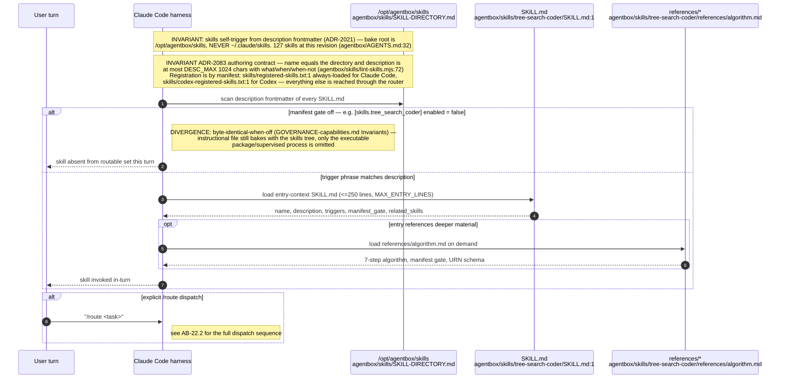

## AB-22.2 Routing — the live Jev router, its local BM25 cascade, and the table it falls open to

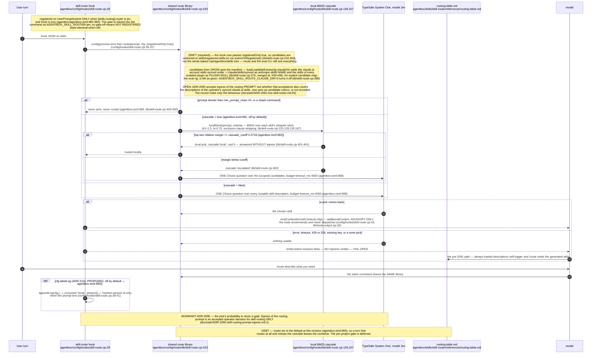

## AB-22.3 Lint gate (ADR-2021) — findings and the advisory divergence

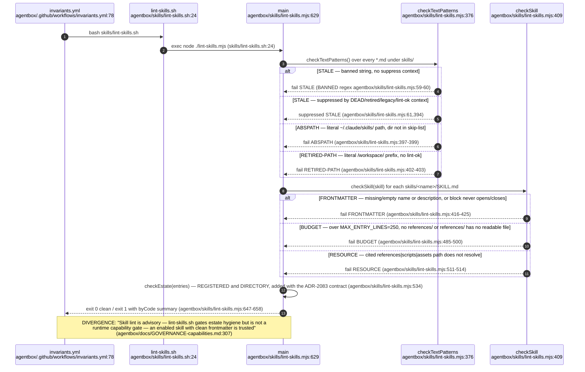

## AB-22.4 SKILL-DIRECTORY.md maintenance vs the machine-checked count

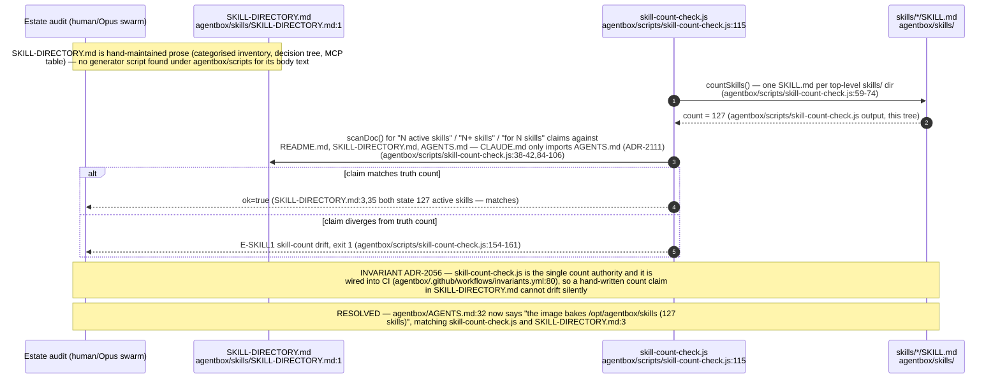

## AB-22.5 harness-bridge MCP — list/inspect/validate

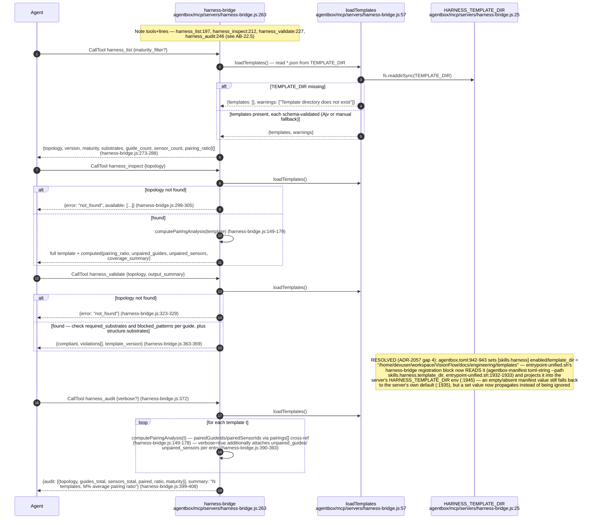

## AB-22.7 Colloquy knowledge-unit lifecycle — Draft/Active/Stale/Disputed/Superseded/Retired

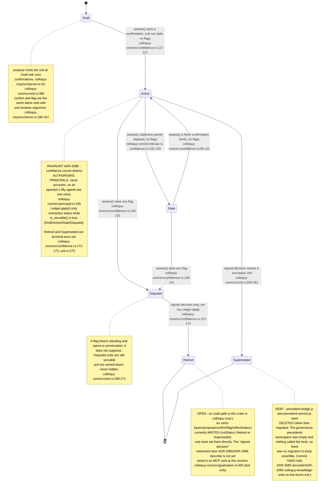

Tier graduation (Local to Shared to Public) is a separate axis from lifecycle status: `GraduationPolicy::for_tier`
sets `min_distinct_principals` per target tier (Shared 2, Public 3, both requiring a human confirmer; Public also
a signed approval), gated independently of Draft/Active/Stale/Disputed (`colloquy-core/src/graduation.rs:64-92`).

## AB-22.8 colloquy-mcp — six verbs over stdio, tier chosen by env

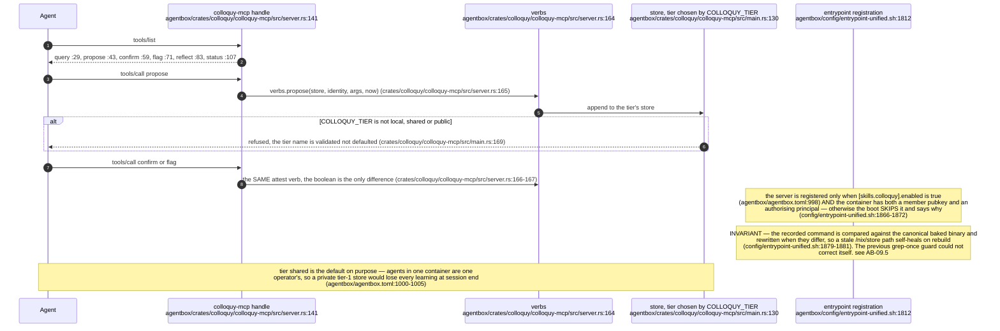

## AB-22.9 continual-harness — evidence-anchored signed refine

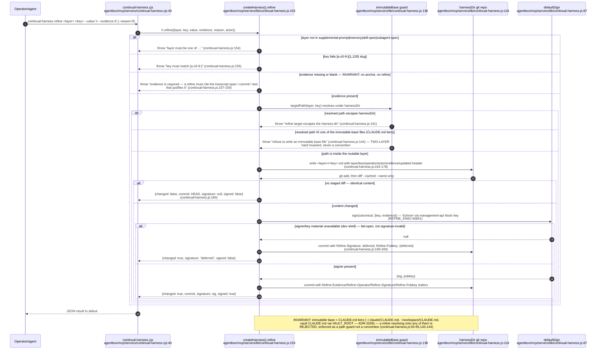

## AB-22.10 Skills-side MCP projection boundary — skills/mcp.json to workspace .mcp.json

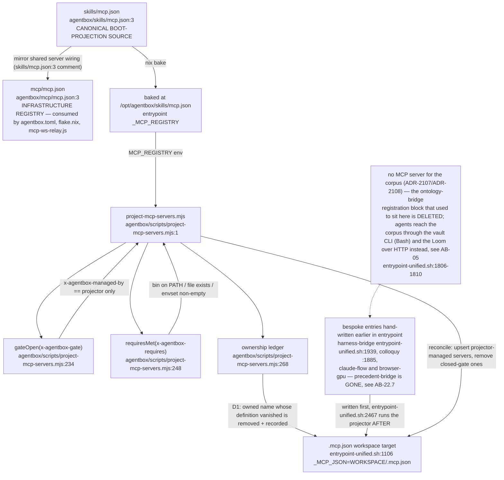

AB-22.11 retired: it depicted `ensureFrontmatter()` in `mcp/servers/lib/vault-frontmatter.js`, deleted at this
revision (ADR-2107/ADR-2108). Vault mutation is now the `vault propose` / `vault edit --expect` CLI door; see
AB-05 (`docs/diagrams/agentbox/05-manifest-gates-and-cli.md`, AB-05.4) for the current `[vault]` path authority
and CLI gate.

## AB-22.12 tree-search-coder — execution-gated branching with enforced spend cap

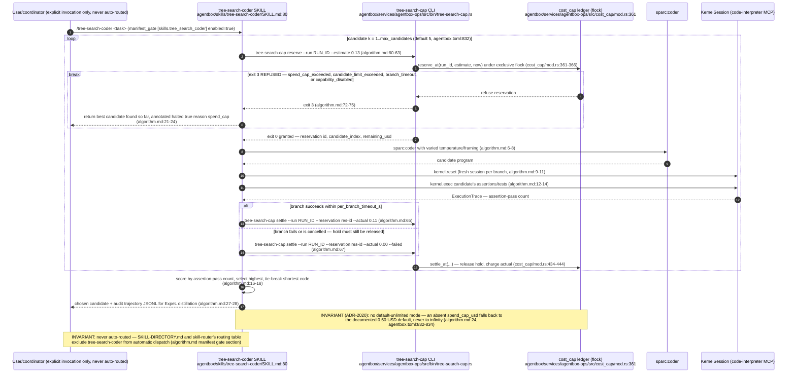

## AB-22.13 [skills.*] manifest gate table, plus [claude_code] (ADR-2020/ADR-2116, catalogue parity closed)

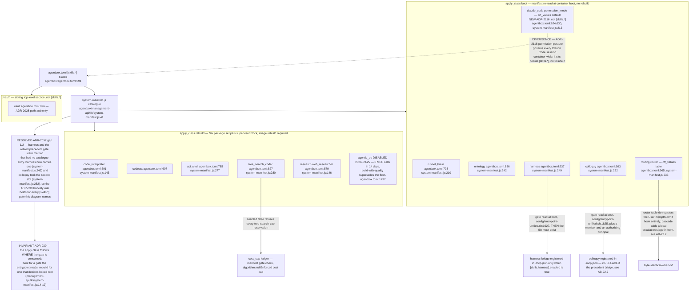

## AB-22.14 Generated discovery — the table nobody hand-edits (ADR-2083)

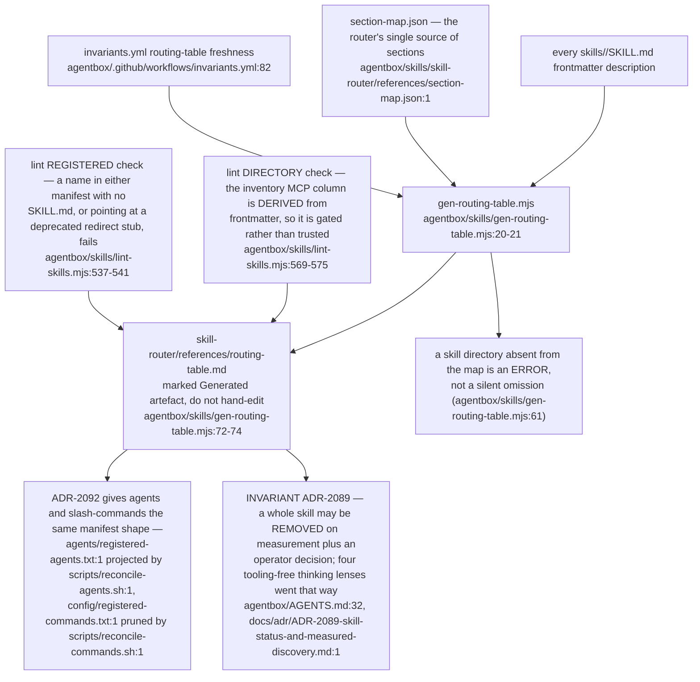
````

## DIFF

```diff
diff --git a/services/agentbox-ops/src/cost_cap/mod.rs b/services/agentbox-ops/src/cost_cap/mod.rs
index 29ad1fd53..bb6645fe9 100644
--- a/services/agentbox-ops/src/cost_cap/mod.rs
+++ b/services/agentbox-ops/src/cost_cap/mod.rs
@@ -113,7 +113,7 @@ impl CapConfig {
     /// block, so a second execution-gated skill can reuse the limiter.
     pub fn from_manifest_toml_at(text: &str, skill_key: &str) -> Self {
         let mut cfg = Self::default();
-        let Ok(root) = text.parse::<toml::Value>() else {
+        let Ok(root) = text.parse::<toml::Table>() else {
             return cfg;
         };
         let Some(block) = root
```
