# E0 judgement vc-02

You are an independent judge for a pre-registered experiment. Below are (1) a TOPIC: a Markdown file of Mermaid diagrams that document code, with `path:line` citations, where paths under `../project/` are in the VisionClaw repository and paths under `../project/agentbox/` are in the agentbox repository; and (2) a DIFF: one commit's changes in the visionclaw repository, restricted to the files the topic lists under `sources:`.

Answer exactly one question:

> **Does this change make any statement in the topic false or incomplete?**

Judge only from the two texts below; do not look anything else up. Reply with a single JSON object and nothing else:

```json
{"verdict": "yes" | "no", "statements": ["<diagram id>: <the statement, quoted>", ...], "line_anchors_only": true | false, "reason": "<one or two sentences>"}
```

`statements` lists every topic statement the change makes false or incomplete (empty when the verdict is no). `line_anchors_only` is true when the only such statements are `path:line` anchors whose cited code merely moved.

## TOPIC (docs/diagrams/visionclaw/09-config-and-env-flags.md)

````markdown
---
id: VC-09
title: Configuration loading, boot-time profile assertion and the environment-flag register
area: visionclaw
governing:
  - ../project/docs/BASELINE-architecture.md
  - ../project/docs/SECURITY-profiles.md
adrs: [ADR-2012, ADR-2026, ADR-2037, ADR-2038, ADR-2039, ADR-2041, ADR-2043, ADR-2046, ADR-2094, ADR-2114, ADR-2115, ADR-2119]
sources:
  - ../project/src/main.rs
  - ../project/src/app_state.rs
  - ../project/src/config/mod.rs
  - ../project/src/config/security_profile.rs
  - ../project/scripts/rust-backend-wrapper.sh
  - ../project/Cargo.toml
  - ../project/src/config/path_accessible_impls.rs
  - ../project/src/config/feature_access.rs
  - ../project/src/services/role_store.rs
  - ../project/src/services/github/config.rs
  - ../project/src/middleware/rbac_gate.rs
  - ../project/src/middleware/public_demo.rs
  - ../project/src/handlers/socket_flow_handler/position_updates.rs
  - ../project/src/utils/auth.rs
  - ../project/crates/visionclaw-domain/src/config/visualisation.rs
  - ../project/data/settings.yaml
  - ../project/src/actors/agent_monitor_actor.rs
  - ../project/src/actors/decision_elevation_actor.rs
  - ../project/src/actors/elevation_actor.rs
  - ../project/src/actors/optimized_settings_actor.rs
  - ../project/src/actors/presence_actor.rs
  - ../project/src/actors/task_orchestrator_actor.rs
  - ../project/src/actors/voice_interface_actor.rs
  - ../project/src/agent_events/ingest.rs
  - ../project/src/bin/sync_corpus.rs
  - ../project/crates/visionclaw-domain/src/config/graph_type.rs
  - ../project/src/config/dev_config.rs
  - ../project/src/config/path_access.rs
  - ../project/src/handlers/bots_handler.rs
  - ../project/src/handlers/enrichment_proposals_handler.rs
  - ../project/src/handlers/fastwebsockets_handler.rs
  - ../project/src/handlers/image_gen_handler.rs
  - ../project/src/handlers/liveness_harness_handler.rs
  - ../project/src/handlers/mcp_relay_handler.rs
  - ../project/src/handlers/nostr_handler.rs
  - ../project/src/handlers/pay_handler.rs
  - ../project/src/handlers/settings_handler/physics.rs
  - ../project/src/handlers/socket_flow_handler/http_handler.rs
  - ../project/src/handlers/solid_proxy_handler.rs
  - ../project/src/services/bots_client.rs
  - ../project/src/services/canary_nostr_tap.rs
  - ../project/src/services/github_pr_service.rs
  - ../project/src/services/github_sync_service.rs
  - ../project/src/services/liveness_harness.rs
  - ../project/src/services/corpus_source/mod.rs
  - ../project/src/services/corpus_source/local.rs
  - ../project/client/src/store/settings/settingsHelpers.ts
  - ../project/src/services/multi_mcp_agent_discovery.rs
  - ../project/src/services/nostr_bead_publisher.rs
  - ../project/src/services/nostr_bridge.rs
  - ../project/src/services/nostr_service.rs
  - ../project/src/services/ontology_class_index.rs
  - ../project/src/services/proposal_spine.rs
  - ../project/src/services/ragflow_service.rs
  - ../project/src/services/speech_service.rs
  - ../project/src/services/voice_intent_client.rs
  - ../project/src/utils/advanced_logging.rs
  - ../project/src/utils/gpu_diagnostics.rs
  - ../project/src/utils/unified_gpu_compute/execution.rs
  - ../project/src/handlers/api_handler/analytics/anomaly_handlers.rs
  - ../project/src/handlers/api_handler/analytics/clustering_handlers.rs
  - ../project/scripts/launch.sh
verified_commit: dd420fbc722a7a4a50e968162ac6c3eaff6972b2
---

## VC-09.1 Config load precedence — main() boot order
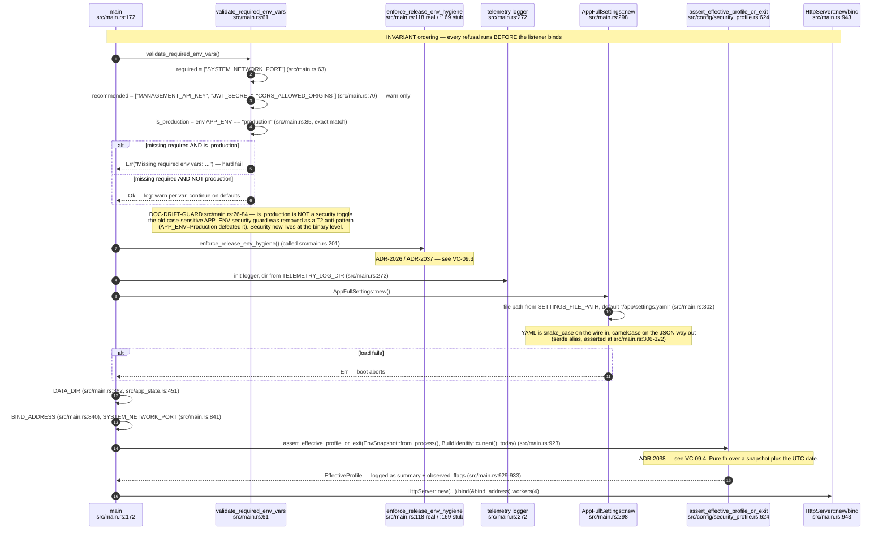

## VC-09.2 src/config module surface — shims into visionclaw-domain, orphans removed
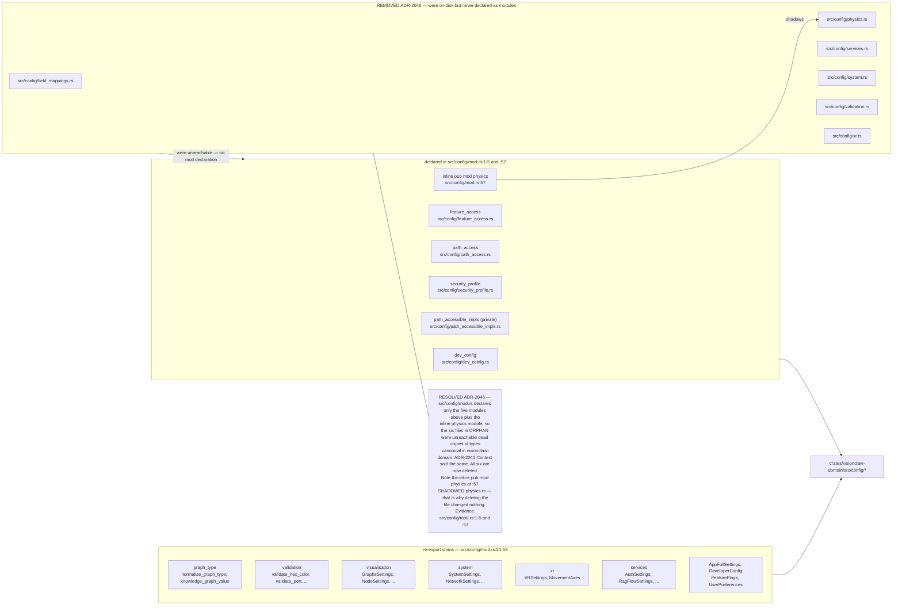

## VC-09.3 enforce_release_env_hygiene — argv and env refusal (ADR-2026, ADR-2037)
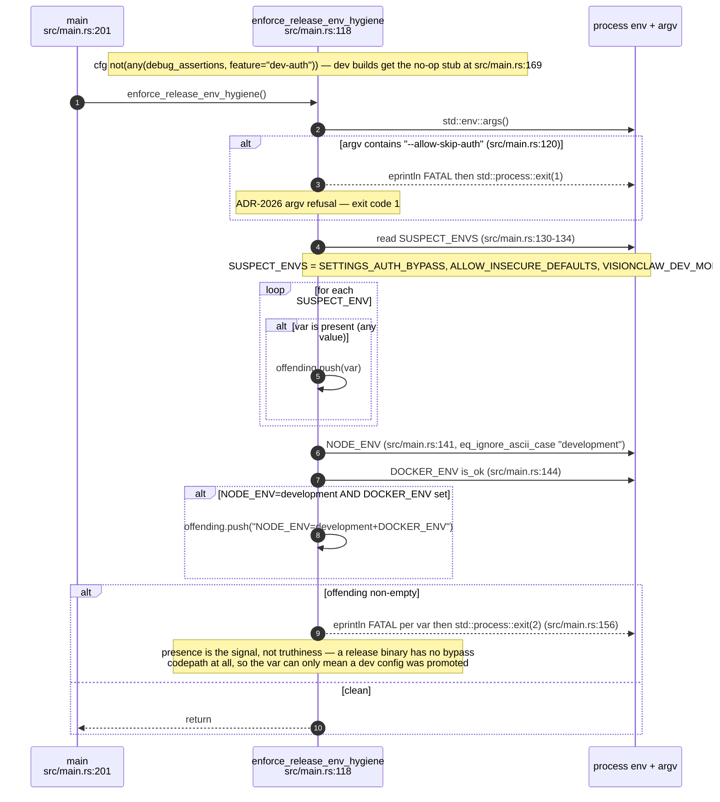

## VC-09.4 Boot-time effective-profile assertion (ADR-2038) — the pure evaluator
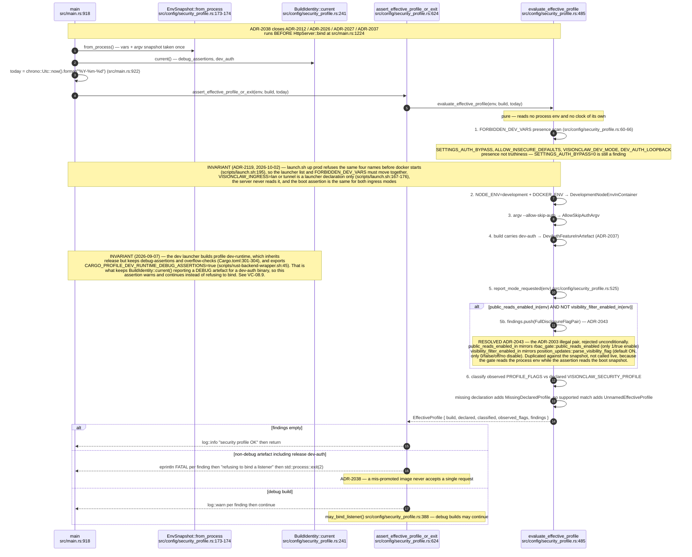

## VC-09.5 ProfileFinding and EffectiveProfile — the rejection vocabulary
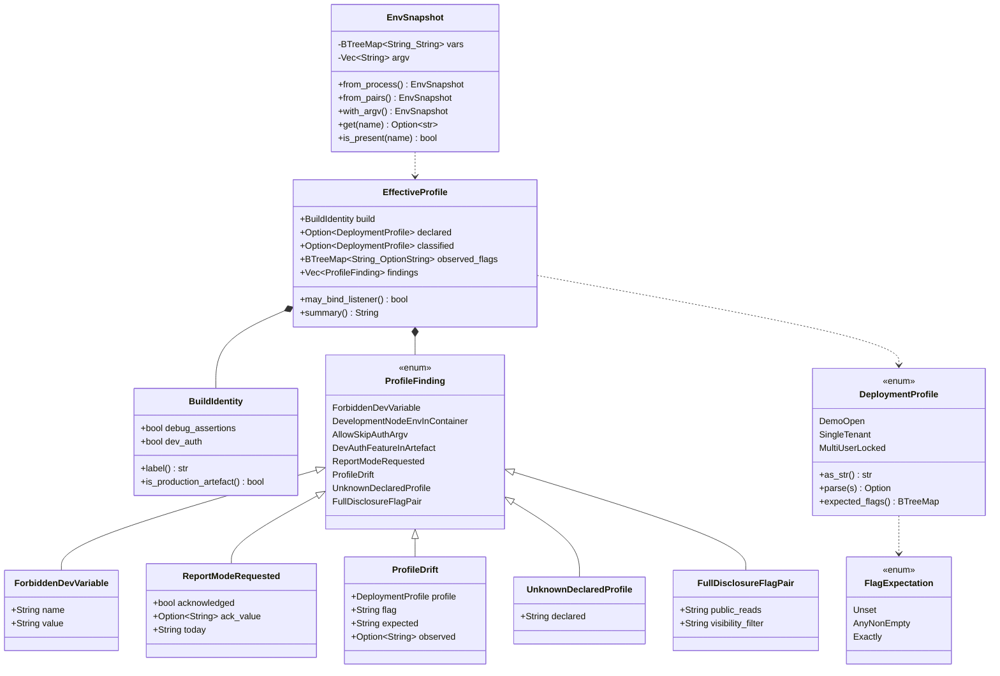

## VC-09.6 DeploymentProfile expected-flag matrix (ADR-2027 as coded)
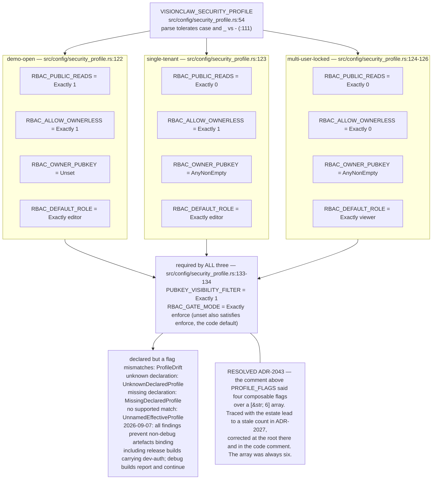

## VC-09.7 RBAC report mode — the dated acknowledgement (ADR-2012)
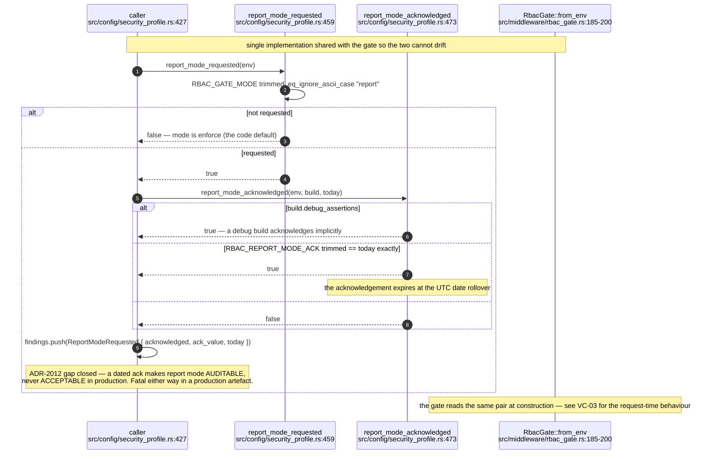

## VC-09.8 Env register — boot, process identity and storage
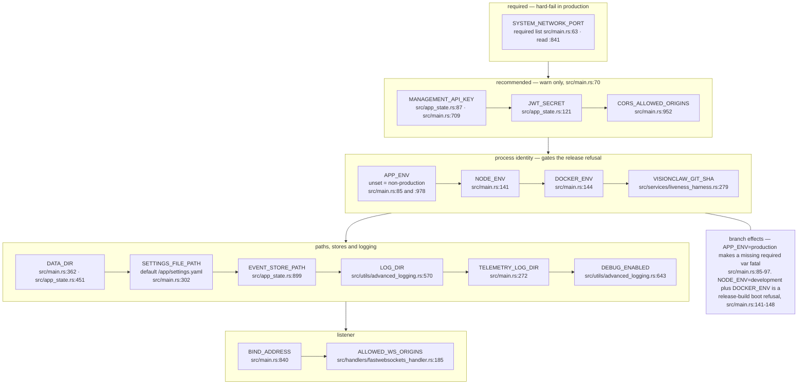


## VC-09.9 Env register — security and authorisation
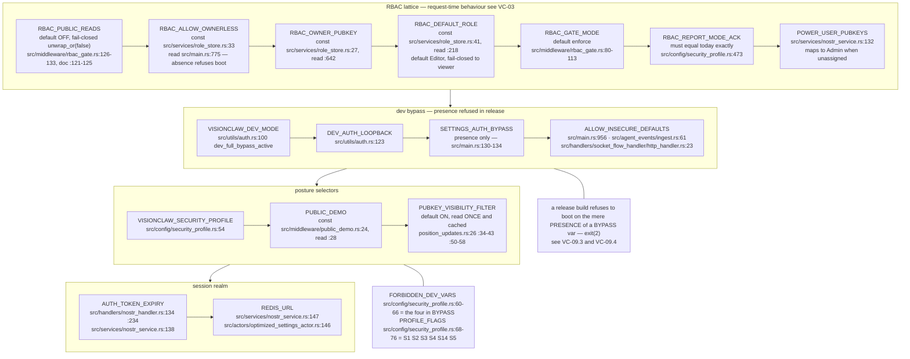


## VC-09.10 Env register — Nostr, ACSP and canary taps
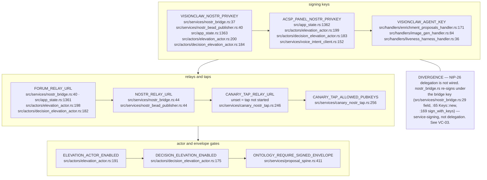


## VC-09.11 Env register — corpus source selection and GitHub sync (ADR-2114, ADR-2115)
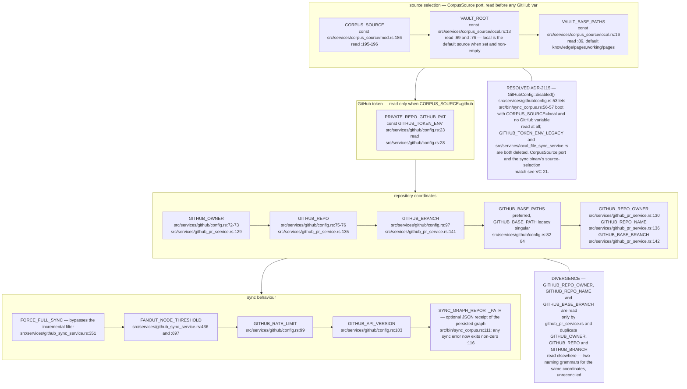


## VC-09.12 Env register — MCP, agents and the management plane
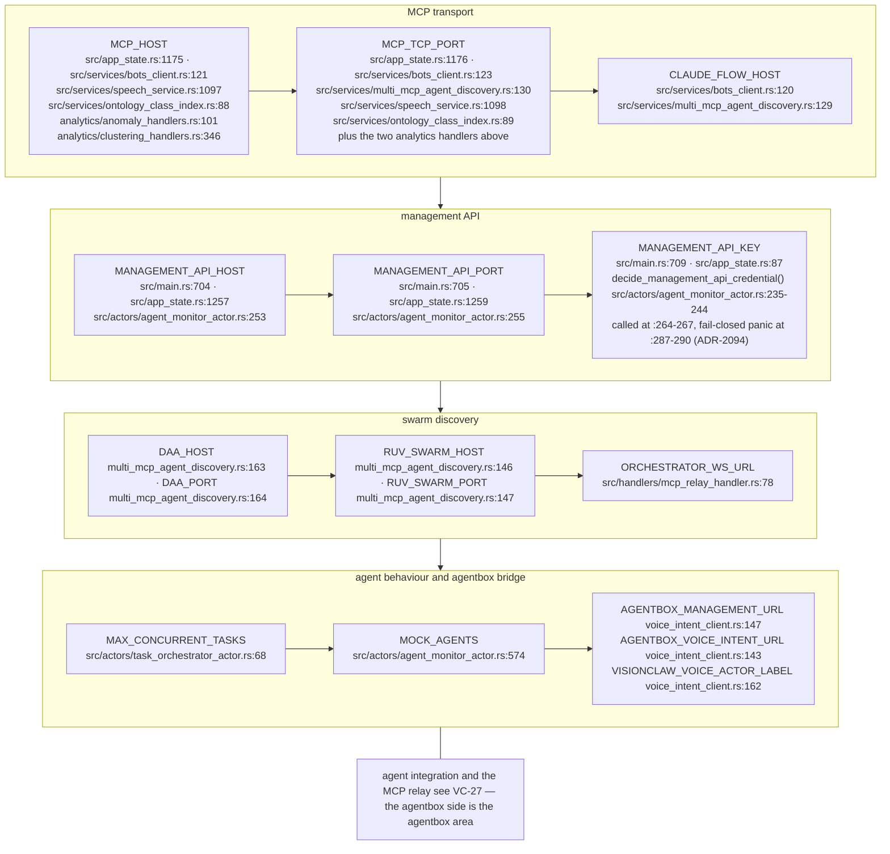


## VC-09.13 Env register — external services, payment and Solid
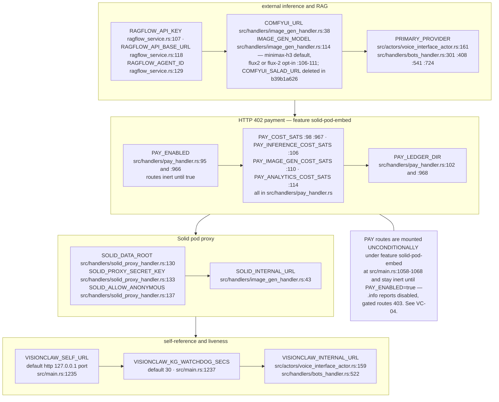


## VC-09.14 Env register — GPU, ontology index and XR presence
```mermaid
flowchart LR
    subgraph GPU["GPU runtime"]
        U1["CUDA_VISIBLE_DEVICES<br/>src/utils/gpu_diagnostics.rs:316"]
        U2["VISIONCLAW_PTX_PATH<br/>src/utils/gpu_diagnostics.rs:86"]
        U3["VISIONCLAW_BLOCK_SIZE<br/>src/utils/unified_gpu_compute/execution.rs:123"]
    end
    subgraph ONT["ontology class index"]
        C1["ONTOLOGY_CLASS_INDEX_ENABLED<br/>src/services/ontology_class_index.rs:75"]
        C2["ONTOLOGY_CLASS_INDEX_NAMESPACE<br/>src/services/ontology_class_index.rs:82"]
        C3["ONTOLOGY_CLASS_INDEX_CANARY_QUERY<br/>src/services/ontology_class_index.rs:94"]
    end
    subgraph XR["XR presence"]
        Y1["PRESENCE_HAND_REACH_M<br/>src/actors/presence_actor.rs:46, :1063"]
    end
    subgraph DYN["dynamic reads — name not a literal"]
        Z1["src/config/feature_access.rs:30<br/>env::var(var_name) — feature-gate name resolved at runtime"]
        Z2["src/main.rs:65 and :72<br/>env::var(var) over the required and recommended lists"]
        Z3["src/utils/gpu_diagnostics.rs:129<br/>env::var(var) over a diagnostic list"]
    end
    GPU --> ONT --> XR
    DYN -.->|"invisible to a literal grep"| GPU
    N6["GPU internals see VC-10. The register above lists only the env surface."]
    GPU --- N6
```

## VC-09.15 ADR-2115 (supersedes ADR-2041) — the knowledge graph-settings key, logseq fully retired server-side
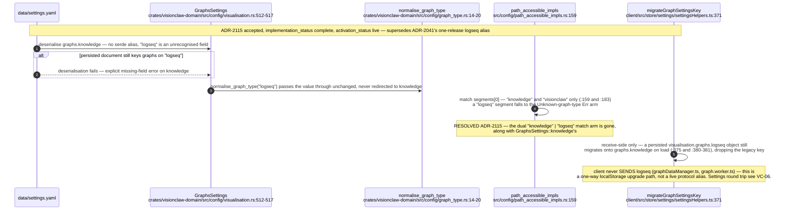
````

## DIFF

```diff
diff --git a/src/handlers/solid_proxy_handler.rs b/src/handlers/solid_proxy_handler.rs
index d630bb1d2..d298c4f57 100644
--- a/src/handlers/solid_proxy_handler.rs
+++ b/src/handlers/solid_proxy_handler.rs
@@ -881,6 +881,12 @@ async fn handle_patch(
 
 /// Walk up the path hierarchy to find the nearest .acl sidecar.
 /// Returns the parsed ACL document, or None if no ACL is found.
+///
+/// A document found at an ancestor container is marked `inherited`, so the
+/// evaluator honours only its `acl:default` rules and ignores its `accessTo`
+/// (WAC §4.2, as solid-pod-rs's own resolver does). A pod root granting public
+/// read through `accessTo ./` alone therefore covers the root, not its
+/// children.
 #[cfg(feature = "solid-pod-embed")]
 async fn load_acl_for_path(
     storage: &Arc<FsBackend>,
@@ -905,7 +911,7 @@ async fn load_acl_for_path(
             Some(0) => {
                 // Root container
                 if let Ok((body, _)) = storage.get("/.acl").await {
-                    return parse_acl_body(&body);
+                    return parse_acl_body(&body).map(inherited_from_ancestor);
                 }
                 break;
             }
@@ -917,13 +923,22 @@ async fn load_acl_for_path(
 
         let parent_acl = format!("{}/.acl", current);
         if let Ok((body, _)) = storage.get(&parent_acl).await {
-            return parse_acl_body(&body);
+            return parse_acl_body(&body).map(inherited_from_ancestor);
         }
     }
 
     None
 }
 
+/// Mark a document as found by walking up rather than at the resource itself.
+#[cfg(feature = "solid-pod-embed")]
+fn inherited_from_ancestor(
+    mut doc: solid_pod_rs::wac::AclDocument,
+) -> solid_pod_rs::wac::AclDocument {
+    doc.inherited = true;
+    doc
+}
+
 #[cfg(feature = "solid-pod-embed")]
 fn parse_acl_body(body: &[u8]) -> Option<solid_pod_rs::wac::AclDocument> {
     // Try JSON-LD first, then Turtle
@@ -1804,3 +1819,77 @@ pub fn configure_routes(cfg: &mut web::ServiceConfig) {
     let _ = cfg;
     info!("=== SOLID POD ROUTES DISABLED (no solid-pod-embed feature): registering none ===");
 }
+
+#[cfg(all(test, feature = "solid-pod-embed"))]
+mod wac_inheritance_tests {
+    use super::*;
+    use bytes::Bytes;
+    use solid_pod_rs::wac::{evaluate_access, AccessMode, IdOrIds, IdRef};
+
+    /// The pod root ACL the host writes, except that the public rule names
+    /// the pod container absolutely (`/pod/`), so `accessTo` would cover the
+    /// container's direct children if an ancestor ACL were treated as direct.
+    async fn pod() -> (tempfile::TempDir, Arc<FsBackend>) {
+        let dir = tempfile::tempdir().unwrap();
+        let storage = Arc::new(FsBackend::new(dir.path()).await.unwrap());
+        let mut acl = build_pod_root_acl("owner", "/pod");
+        for rule in acl.graph.iter_mut().flatten() {
+            if rule.id.as_deref() == Some("#public") {
+                rule.access_to = Some(IdOrIds::Single(IdRef { id: "/pod/".into() }));
+            }
+        }
+        let body = serde_json::to_vec(&acl).unwrap();
+        storage
+            .put("/pod/.acl", Bytes::from(body), "application/ld+json")
+            .await
+            .unwrap();
+        (dir, storage)
+    }
+
+    #[tokio::test]
+    async fn own_acl_is_direct_and_ancestor_acl_is_inherited() {
+        let (_d, storage) = pod().await;
+        let own = load_acl_for_path(&storage, "/pod/").await.unwrap();
+        assert!(!own.inherited, "a container's own .acl is not inherited");
+        let up = load_acl_for_path(&storage, "/pod/a.ttl").await.unwrap();
+        assert!(up.inherited, "an ACL found by walking up is inherited");
+    }
+
+    #[tokio::test]
+    async fn ancestor_access_to_no_longer_reaches_children() {
+        let (_d, storage) = pod().await;
+        let root = load_acl_for_path(&storage, "/pod/").await;
+        assert!(
+            evaluate_access(root.as_ref(), None, "/pod/", AccessMode::Read, None),
+            "public read still applies to the container its own ACL names"
+        );
+        let mut child = load_acl_for_path(&storage, "/pod/a.ttl").await.unwrap();
+        assert!(
+            !evaluate_access(Some(&child), None, "/pod/a.ttl", AccessMode::Read, None),
+            "an ancestor's accessTo-only public read must not reach a child (WAC §4.2)"
+        );
+        // The inherited flag is what stops it: read as a direct ACL, the
+        // same document would grant the child.
+        child.inherited = false;
+        assert!(evaluate_access(
+            Some(&child),
+            None,
+            "/pod/a.ttl",
+            AccessMode::Read,
+            None
+        ));
+    }
+
+    #[tokio::test]
+    async fn owner_default_still_reaches_descendants() {
+        let (_d, storage) = pod().await;
+        let child = load_acl_for_path(&storage, "/pod/notes/a.ttl").await;
+        assert!(evaluate_access(
+            child.as_ref(),
+            Some("did:nostr:owner"),
+            "/pod/notes/a.ttl",
+            AccessMode::Read,
+            None
+        ));
+    }
+}
```
