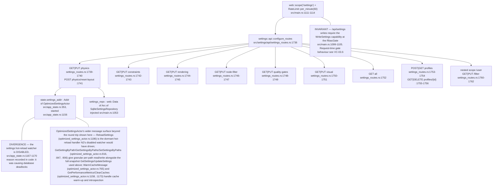
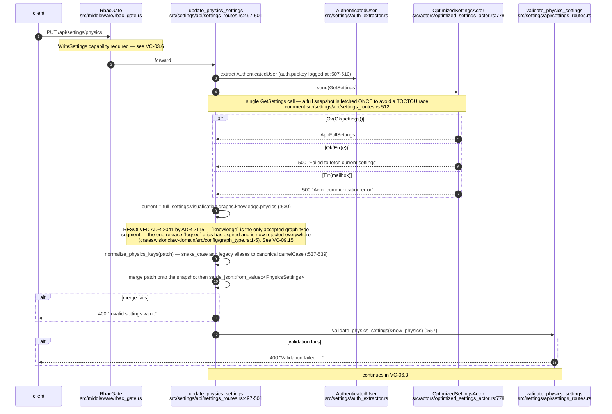
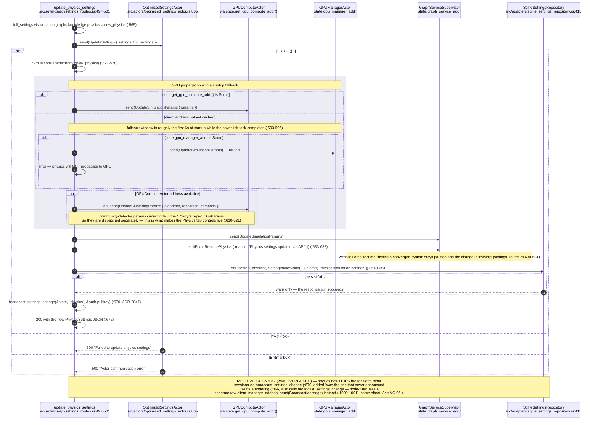
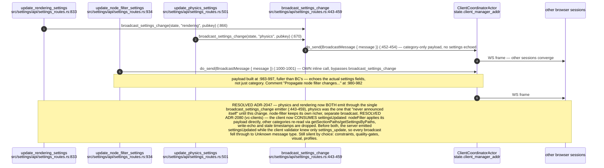
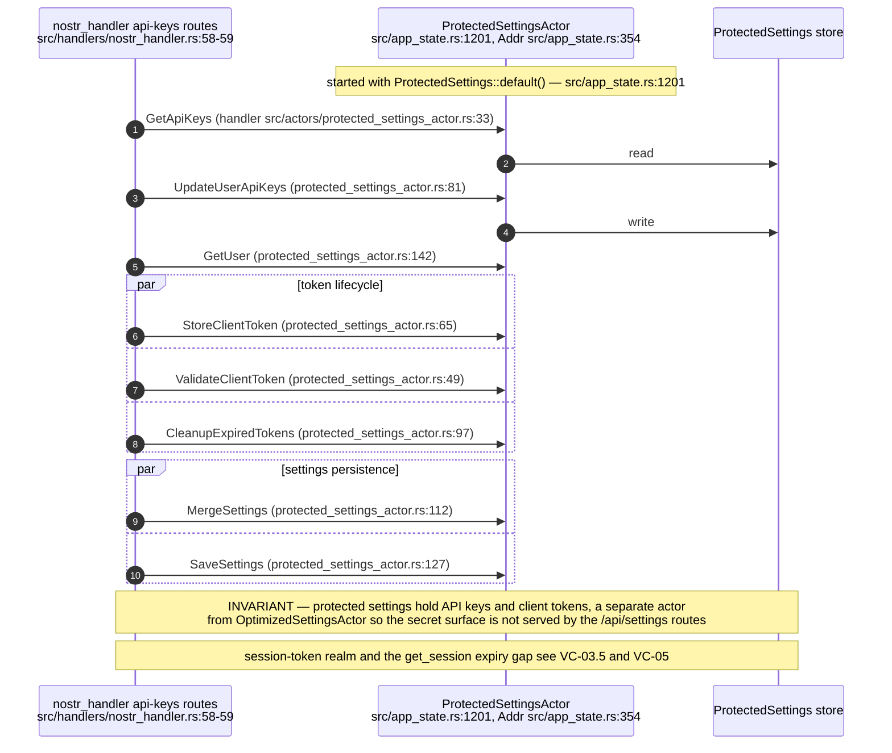
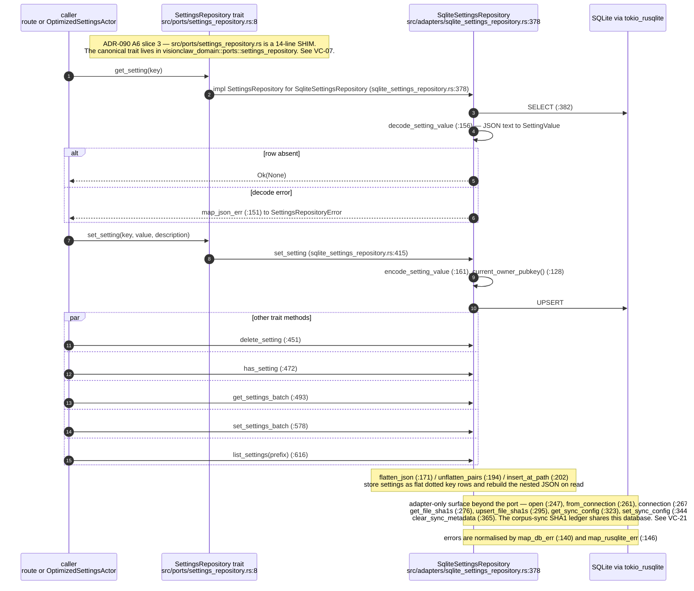
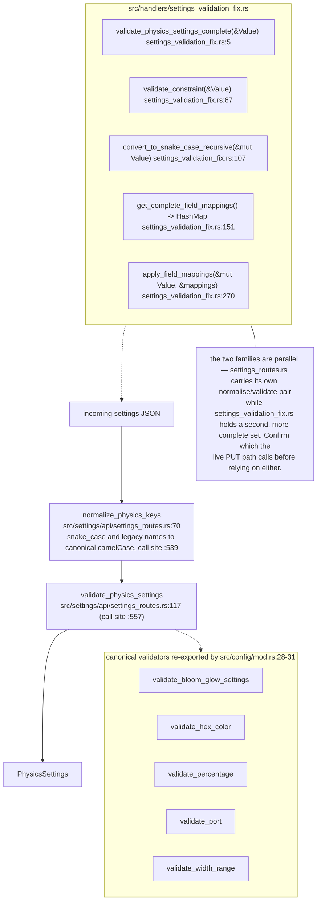
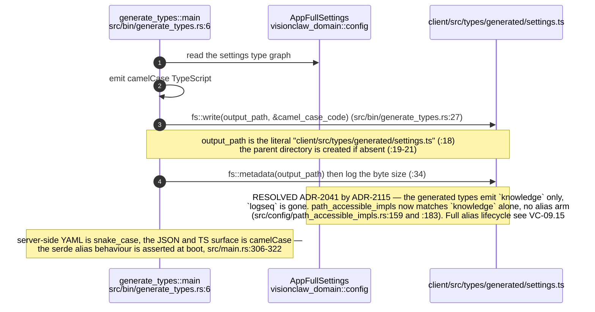

# E0 judgement vc-12

You are an independent judge for a pre-registered experiment. Below are (1) a TOPIC: a Markdown file of Mermaid diagrams that document code, with `path:line` citations, where paths under `../project/` are in the VisionClaw repository and paths under `../project/agentbox/` are in the agentbox repository; and (2) a DIFF: one commit's changes in the visionclaw repository, restricted to the files the topic lists under `sources:`.

Answer exactly one question:

> **Does this change make any statement in the topic false or incomplete?**

Judge only from the two texts below; do not look anything else up. Reply with a single JSON object and nothing else:

```json
{"verdict": "yes" | "no", "statements": ["<diagram id>: <the statement, quoted>", ...], "line_anchors_only": true | false, "reason": "<one or two sentences>"}
```

`statements` lists every topic statement the change makes false or incomplete (empty when the verdict is no). `line_anchors_only` is true when the only such statements are `path:line` anchors whose cited code merely moved.

## TOPIC (docs/diagrams/visionclaw/06-settings-round-trip.md)

````markdown
---
id: VC-06
title: Settings round trip — REST, actors, SQLite adapter and generated client types
area: visionclaw
governing:
  - ../project/docs/BASELINE-architecture.md
adrs: [ADR-2005, ADR-2011, ADR-2041, ADR-2046, ADR-2047, ADR-2080, ADR-2115]
sources:
  - ../project/src/settings/api/settings_routes.rs
  - ../project/src/settings/auth_extractor.rs
  - ../project/src/settings/mod.rs
  - ../project/src/settings/models.rs
  - ../project/src/actors/optimized_settings_actor.rs
  - ../project/src/actors/protected_settings_actor.rs
  - ../project/src/adapters/sqlite_settings_repository.rs
  - ../project/src/ports/settings_repository.rs
  - ../project/src/ports/mod.rs
  - ../project/src/handlers/settings_validation_fix.rs
  - ../project/src/config/mod.rs
  - ../project/src/config/path_accessible_impls.rs
  - ../project/src/bin/generate_types.rs
  - ../project/src/app_state.rs
  - ../project/src/main.rs
  - ../project/client/src/types/generated/settings.ts
  - ../project/src/handlers/nostr_handler.rs
  - ../project/src/middleware/rbac_gate.rs
  - ../project/crates/visionclaw-domain/src/config/graph_type.rs
verified_commit: 58f04f2eb272a2707737f2065f8241b931229e81
---

## VC-06.1 Settings route surface and the actor behind it


## VC-06.2 PUT /api/settings/physics — the flagship round trip, phase 1 read and merge


## VC-06.3 PUT /api/settings/physics — phase 2 write-back, GPU propagation, persistence


## VC-06.4 Broadcast asymmetry — which settings reach other sessions


## VC-06.6 ProtectedSettingsActor — API keys, client tokens and user records


## VC-06.7 Hexagonal hop — SettingsRepository port to the SQLite adapter


## VC-06.8 Validation and field-mapping helpers


## VC-06.9 Generated client types — src/bin/generate_types.rs

````

## DIFF

```diff
diff --git a/crates/visionclaw-domain/src/config/graph_type.rs b/crates/visionclaw-domain/src/config/graph_type.rs
index 9683d91f7..3d257f42c 100644
--- a/crates/visionclaw-domain/src/config/graph_type.rs
+++ b/crates/visionclaw-domain/src/config/graph_type.rs
@@ -40,9 +40,9 @@ mod tests {
 
     #[test]
     fn the_retired_alias_is_no_longer_normalised() {
-        // ADR-2115: `logseq` is an unknown graph type, passed through for the
+        // ADR-2115: a retired or unknown graph type is passed through for the
         // caller to reject rather than silently resolved to `knowledge`.
-        assert_eq!(normalise_graph_type("logseq"), "logseq");
+        assert_eq!(normalise_graph_type("retired-graph"), "retired-graph");
         assert_eq!(normalise_graph_type("knowledge"), "knowledge");
         assert_eq!(normalise_graph_type("visionclaw"), "visionclaw");
         assert_eq!(normalise_graph_type("agent"), "visionclaw");
@@ -52,11 +52,11 @@ mod tests {
 
     #[test]
     fn json_lookups_take_the_canonical_key_only() {
-        let retired = serde_json::json!({ "logseq": { "physics": { "springK": 1 } } });
+        let retired = serde_json::json!({ "retired-graph": { "physics": { "springK": 1 } } });
         let canonical = serde_json::json!({ "knowledge": { "physics": { "springK": 1 } } });
         assert!(
             knowledge_graph_value(&retired).is_none(),
-            "the retired `logseq` key must not resolve"
+            "an unknown graph key must not resolve"
         );
         assert_eq!(
             knowledge_graph_value(&canonical),
@@ -74,7 +74,7 @@ mod tests {
     #[test]
     fn paths_match_the_canonical_segment_only() {
         assert!(!path_targets_knowledge_graph(
-            "visualisation.graphs.logseq.physics.springK"
+            "visualisation.graphs.retired-graph.physics.springK"
         ));
         assert!(path_targets_knowledge_graph(
             "visualisation.graphs.knowledge.physics.springK"
```
