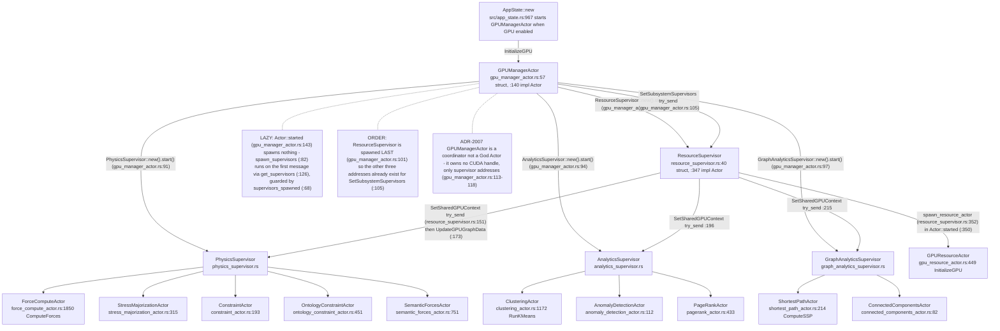
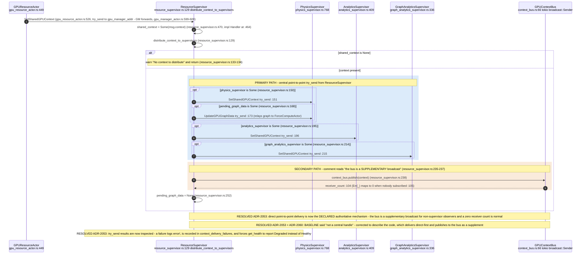
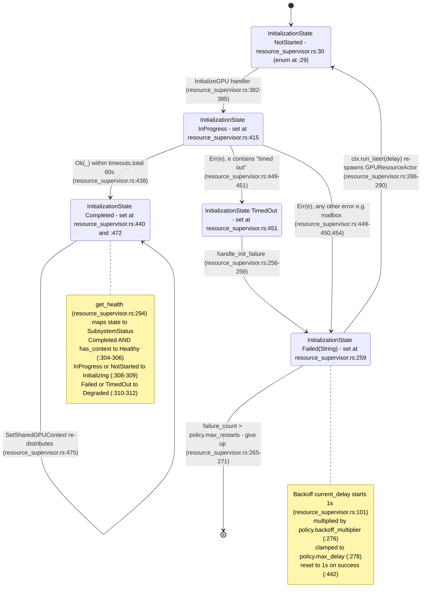
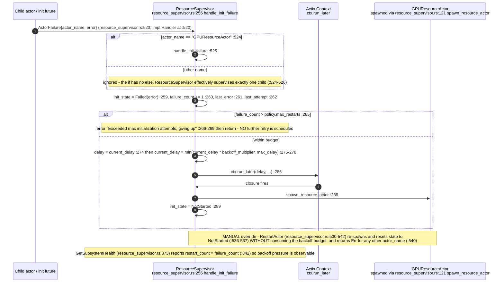
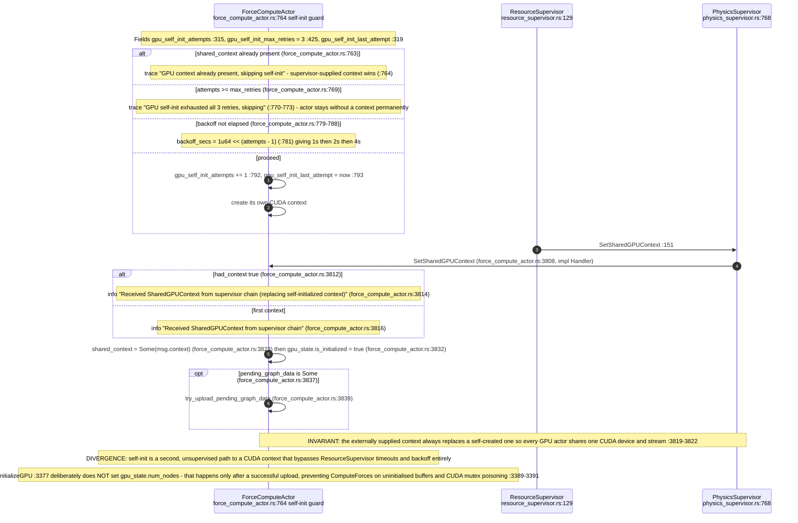
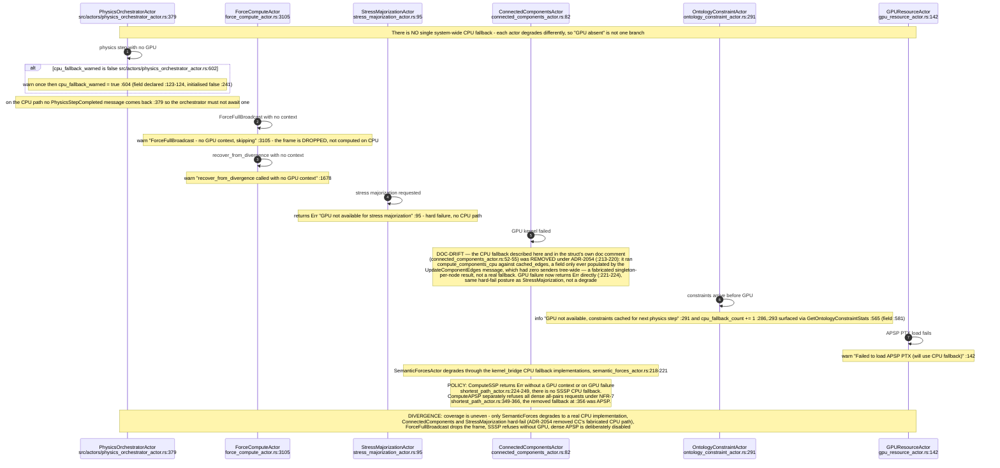

# E0 judgement vc-16

You are an independent judge for a pre-registered experiment. Below are (1) a TOPIC: a Markdown file of Mermaid diagrams that document code, with `path:line` citations, where paths under `../project/` are in the VisionClaw repository and paths under `../project/agentbox/` are in the agentbox repository; and (2) a DIFF: one commit's changes in the visionclaw repository, restricted to the files the topic lists under `sources:`.

Answer exactly one question:

> **Does this change make any statement in the topic false or incomplete?**

Judge only from the two texts below; do not look anything else up. Reply with a single JSON object and nothing else:

```json
{"verdict": "yes" | "no", "statements": ["<diagram id>: <the statement, quoted>", ...], "line_anchors_only": true | false, "reason": "<one or two sentences>"}
```

`statements` lists every topic statement the change makes false or incomplete (empty when the verdict is no). `line_anchors_only` is true when the only such statements are `path:line` anchors whose cited code merely moved.

## TOPIC (docs/diagrams/visionclaw/10-gpu-supervision-and-context-bus.md)

````markdown
---
id: VC-10
title: GPU supervision and context bus
area: visionclaw
governing:
  - ../project/docs/BASELINE-architecture.md
  - ../project/docs/GPU-wire-abi.md
adrs: [ADR-2007, ADR-2053]
sources:
  - ../project/src/actors/gpu/gpu_manager_actor.rs
  - ../project/src/actors/gpu/resource_supervisor.rs
  - ../project/src/actors/gpu/physics_supervisor.rs
  - ../project/src/actors/gpu/analytics_supervisor.rs
  - ../project/src/actors/gpu/graph_analytics_supervisor.rs
  - ../project/src/actors/gpu/context_bus.rs
  - ../project/src/actors/gpu/gpu_resource_actor.rs
  - ../project/src/actors/gpu/force_compute_actor.rs
  - ../project/src/actors/gpu/supervisor_messages.rs
  - ../project/src/actors/gpu/constraint_actor.rs
  - ../project/src/actors/gpu/ontology_constraint_actor.rs
  - ../project/src/actors/gpu/semantic_forces_actor.rs
  - ../project/src/actors/gpu/stress_majorization_actor.rs
  - ../project/src/actors/gpu/clustering_actor.rs
  - ../project/src/actors/gpu/anomaly_detection_actor.rs
  - ../project/src/actors/gpu/pagerank_actor.rs
  - ../project/src/actors/gpu/shortest_path_actor.rs
  - ../project/src/actors/gpu/connected_components_actor.rs
  - ../project/src/actors/physics_orchestrator_actor.rs
  - ../project/src/app_state.rs
verified_commit: dd420fbc722a7a4a50e968162ac6c3eaff6972b2
---

## VC-10.1 GPU supervision tree



## VC-10.2 Boot — GPU initialisation with total timeout

```mermaid
sequenceDiagram
    autonumber
    participant APP as AppState::new<br/>src/app_state.rs:967
    participant GM as GPUManagerActor<br/>gpu_manager_actor.rs:253
    participant RS as ResourceSupervisor<br/>resource_supervisor.rs:40
    participant GRA as GPUResourceActor<br/>gpu_resource_actor.rs:449
    participant PS as PhysicsSupervisor<br/>physics_supervisor.rs:768

    Note over GM: Actor::started (gpu_manager_actor.rs:143) spawns NO supervisors - they are created on first message via get_supervisors (:126)
    APP->>GM: InitializeGPU with graph + graph_service_addr
    GM->>GM: get_supervisors (gpu_manager_actor.rs:126) then spawn_supervisors (:82)
    GM->>RS: InitializeGPU forwarded
    RS->>RS: pending_graph_data = Some(graph) :395
    alt resource_actor is None
        RS->>RS: spawn_resource_actor :402
    end
    RS->>RS: init_state = InProgress :415
    Note over RS: timeout = self.timeouts.total = 60s<br/>supervisor_messages.rs:222 (device_init 10s :218, ptx_load 5s :219, graph_upload 30s :220, context_distribution 5s :221)
    RS->>GRA: tokio::time::timeout(60s, resource_addr.send(InitializeGPU)) (resource_supervisor.rs:424)
    Note over RS: the inner Ok(Err(mailbox))/Err(elapsed) split collapses to one Result before the outer<br/>match (resource_supervisor.rs:429-433) - the code below distinguishes them by string-matching<br/>"timed out" in the error text (:450), not by nested Result variants
    alt Ok(_) device + PTX ready
        GRA-->>RS: Ok
        RS->>RS: init_state = Completed :440, failure_count = 0 :441, current_delay = 1s :442
        opt shared_context.is_some() :445
            RS->>RS: distribute_context_to_supervisors :446
        end
    else Err(e), e contains "timed out"
        RS->>RS: init_state = TimedOut :451
        Note over RS: warn "GPU initialization timed out, system will continue in degraded mode" :452
        RS->>RS: handle_init_failure :454
    else Err(e), any other error (e.g. mailbox)
        RS->>RS: handle_init_failure :454 with the raw error string (e.g. "Mailbox error: ...", :431)
    end
    GRA->>RS: SetSharedGPUContext (resource_supervisor.rs:464, impl Handler) (context flows back up, not down)
    RS->>RS: init_state = Completed :472 then distribute_context_to_supervisors :475
    RS->>PS: SetSharedGPUContext try_send :151
```



## VC-10.3 SharedGPUContext distribution — direct messages, bus is additive



## VC-10.4 GPU readiness lifecycle



## VC-10.5 Initialisation failure, backoff and manual restart



## VC-10.6 ForceComputeActor self-initialisation and supersession



## VC-10.10 GPU-absent and CPU-fallback behaviour per actor


````

## DIFF

```diff
diff --git a/src/app_state.rs b/src/app_state.rs
index 0fb6517ee..7d6a9e378 100644
--- a/src/app_state.rs
+++ b/src/app_state.rs
@@ -1264,7 +1264,7 @@ impl AppState {
 
         // ADR-110: flagship ACSP agentic actor — knowledge elevation through
         // forum governance cases, voice-guided when the local speech stack
-        // (Whisper STT / Kokoro TTS) is up. ADR-130 Decision 2: the gate now
+        // (Whisper STT / PocketTts TTS) is up. ADR-130 Decision 2: the gate now
         // defaults ON in dev/staging (opt-in in production) and still requires
         // FORUM_RELAY_URL + a panel secret to publish; None means the gate is
         // closed for this profile/config.
@@ -1290,7 +1290,7 @@ impl AppState {
 
         // ADR-110: voice → settings-assistant bridge. Spoken configuration
         // requests reach the same agent the Control Center command box drives;
-        // active whenever the local speech stack (Whisper/Kokoro) is up.
+        // active whenever the local speech stack (Whisper/PocketTts) is up.
         match crate::actors::voice_interface_actor::VoiceInterfaceActor::new(
             task_orchestrator_addr.clone(),
             speech_service.clone(),
```
