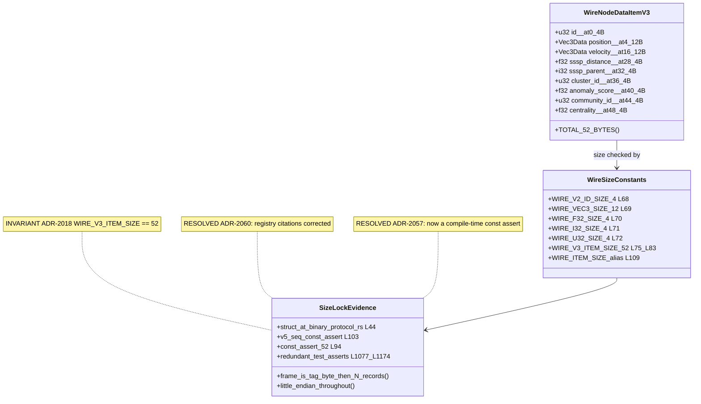
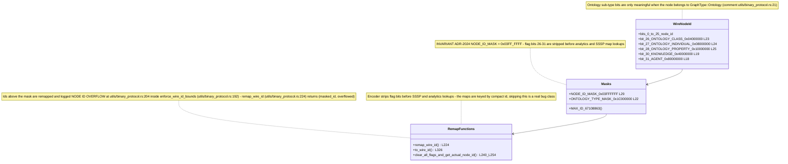
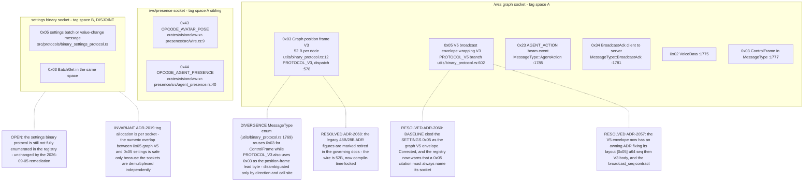
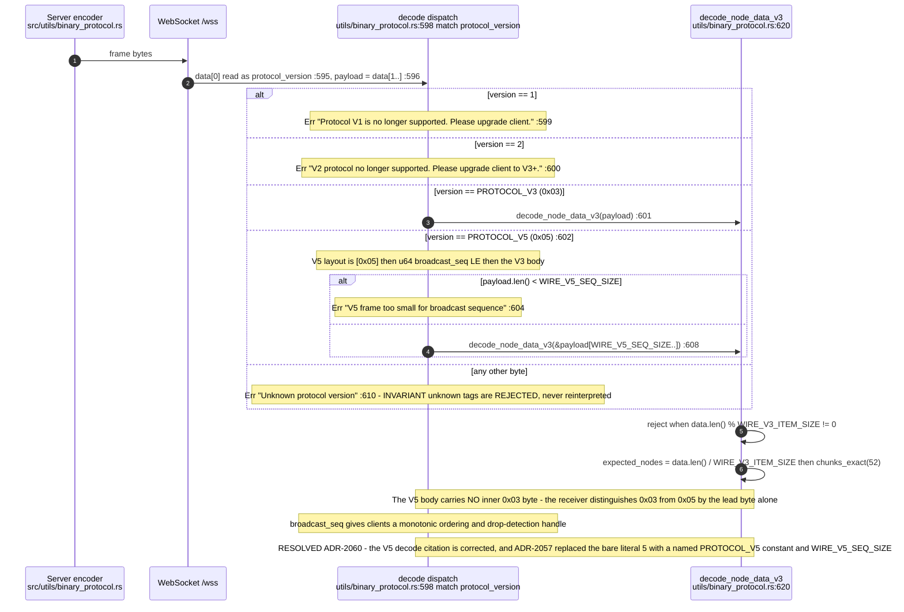
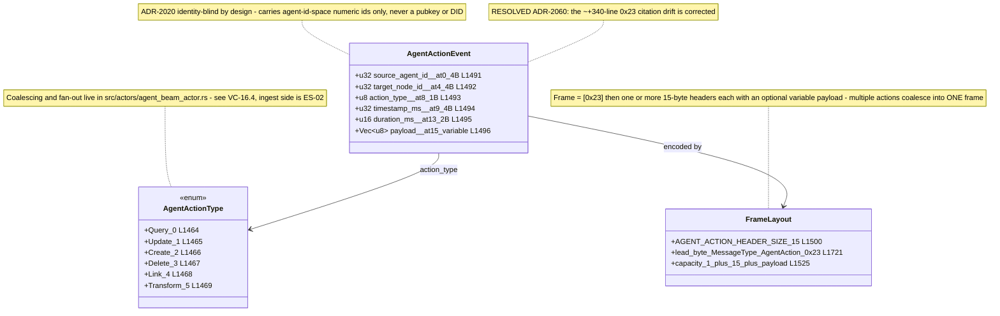
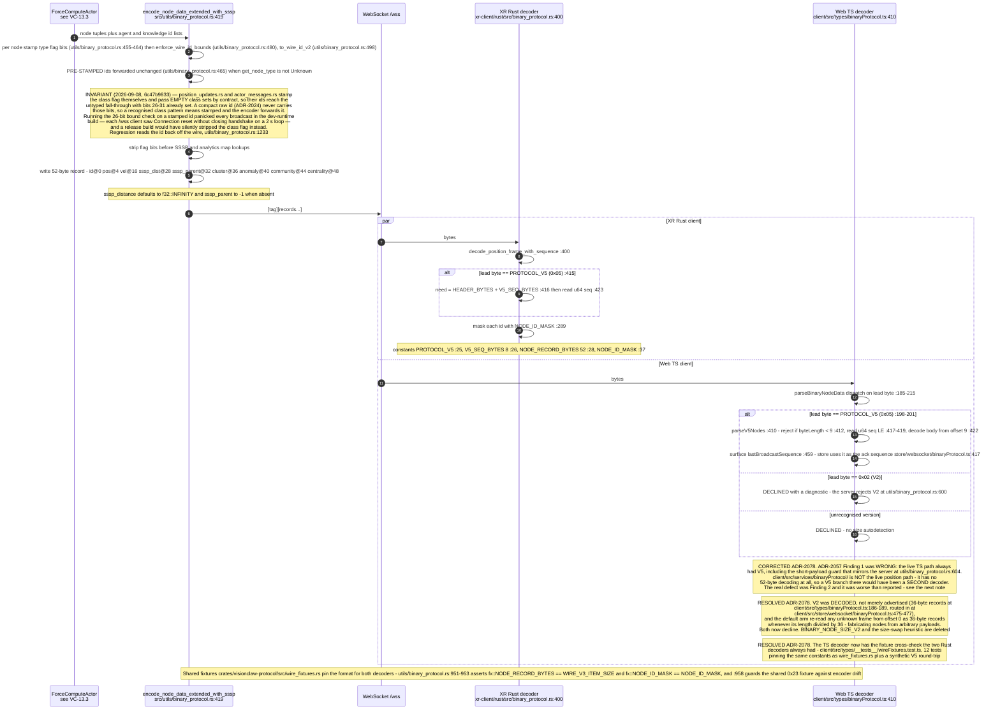
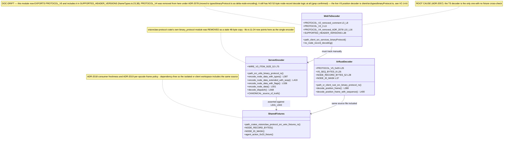
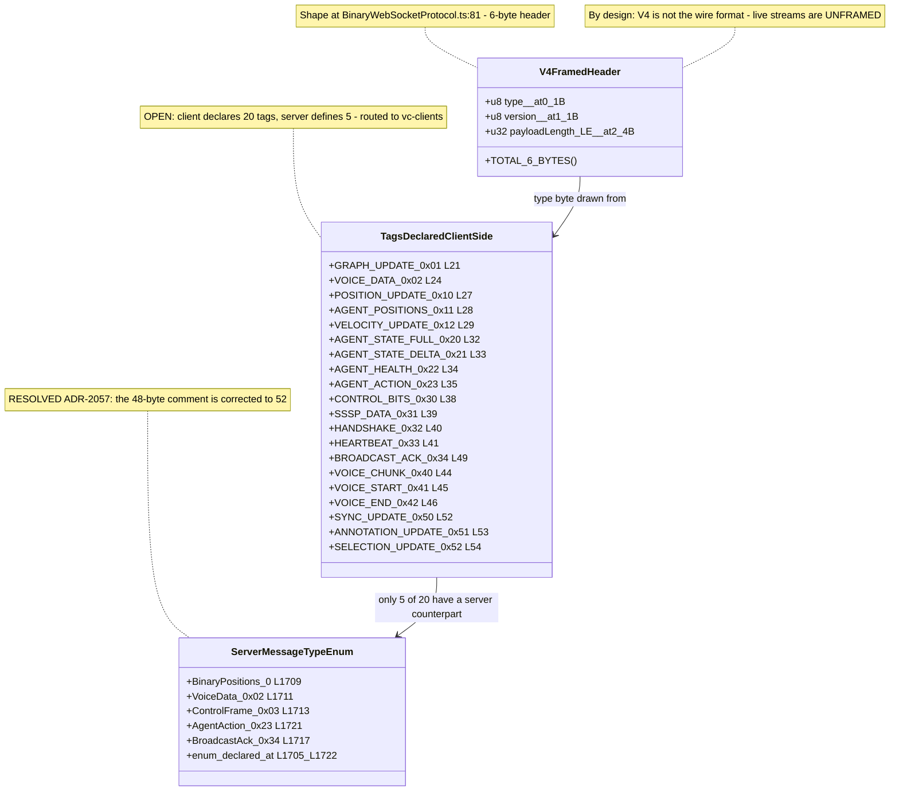
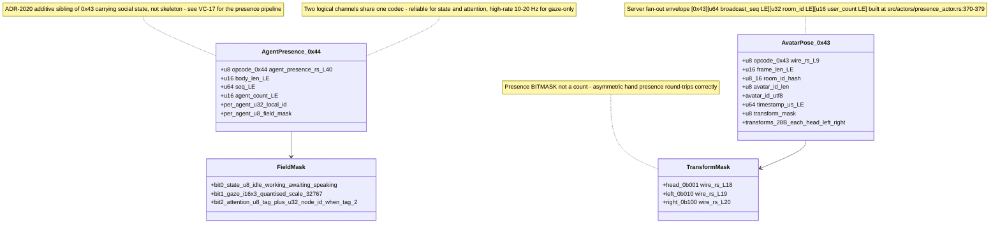

# E0 judgement vc-17

You are an independent judge for a pre-registered experiment. Below are (1) a TOPIC: a Markdown file of Mermaid diagrams that document code, with `path:line` citations, where paths under `../project/` are in the VisionClaw repository and paths under `../project/agentbox/` are in the agentbox repository; and (2) a DIFF: one commit's changes in the visionclaw repository, restricted to the files the topic lists under `sources:`.

Answer exactly one question:

> **Does this change make any statement in the topic false or incomplete?**

Judge only from the two texts below; do not look anything else up. Reply with a single JSON object and nothing else:

```json
{"verdict": "yes" | "no", "statements": ["<diagram id>: <the statement, quoted>", ...], "line_anchors_only": true | false, "reason": "<one or two sentences>"}
```

`statements` lists every topic statement the change makes false or incomplete (empty when the verdict is no). `line_anchors_only` is true when the only such statements are `path:line` anchors whose cited code merely moved.

## TOPIC (docs/diagrams/visionclaw/14-wire-frames-and-tag-registry.md)

````markdown
---
id: VC-14
title: Wire frames and tag registry
area: visionclaw
governing:
  - ../project/docs/PROTOCOL-registry.md
  - ../project/docs/GPU-wire-abi.md
adrs: [ADR-2018, ADR-2019, ADR-2020, ADR-2024, ADR-2057, ADR-2060]
sources:
  - ../project/src/utils/binary_protocol.rs
  - ../project/src/protocols/binary_settings_protocol.rs
  - ../project/crates/visionclaw-protocol/src/lib.rs
  - ../project/crates/visionclaw-protocol/src/wire_fixtures.rs
  - ../project/crates/visionclaw-xr-presence/src/wire.rs
  - ../project/crates/visionclaw-xr-presence/src/agent_presence.rs
  - ../project/xr-client/rust/src/binary_protocol.rs
  - ../project/client/src/services/binaryProtocol/frameTypes.ts
  - ../project/client/src/services/BinaryWebSocketProtocol.ts
  - ../project/src/actors/agent_beam_actor.rs
  - ../project/client/src/types/__tests__/wireFixtures.test.ts
  - ../project/client/src/types/binaryProtocol.ts
  - ../project/src/actors/presence_actor.rs
  - ../project/client/src/store/websocket/binaryProtocol.ts
verified_commit: 58f04f2eb272a2707737f2065f8241b931229e81
---

## VC-14.1 V3 position record — 52 bytes, little-endian



## VC-14.2 Wire node id — 26-bit id plus type flag bits



## VC-14.3 Tag byte 0 registry — two disjoint socket spaces



## VC-14.4 V5 envelope and tag dispatch with unknown-tag rejection



## VC-14.5 0x23 AGENT_ACTION frame



## VC-14.6 Encode to decode of one V5 frame, server to clients



## VC-14.7 The coexisting binary codecs



## VC-14.8 V4 framed-message header — client-emitted only



## VC-14.9 Presence sibling opcodes 0x43 and 0x44


````

## DIFF

```diff
diff --git a/xr-client/rust/src/binary_protocol.rs b/xr-client/rust/src/binary_protocol.rs
index 2f81bcdcc..db126e28f 100644
--- a/xr-client/rust/src/binary_protocol.rs
+++ b/xr-client/rust/src/binary_protocol.rs
@@ -1182,6 +1182,45 @@ impl BinaryProtocolClient {
         PackedFloat32Array::from(self.store.build_beam_buffer(radius_comp).as_slice())
     }
 
+    /// Publish embodiment anchors (server space) for agents the scene embodies:
+    /// `ids[i]` pairs with `positions[i]`. The work beam then starts at the
+    /// avatar the user sees instead of the agent's streamed node position (or at
+    /// all, for synthetic agents that have no node). Visual-only: node positions
+    /// and physics are never touched. Call once per frame for embodied agents.
+    #[func]
+    fn set_agent_anchors(&mut self, ids: PackedInt32Array, positions: PackedVector3Array) {
+        let ids: Vec<u32> = ids.as_slice().iter().map(|&x| x as u32).collect();
+        let pos: Vec<[f32; 3]> = positions
+            .as_slice()
+            .iter()
+            .map(|p| [p.x, p.y, p.z])
+            .collect();
+        self.store.set_agent_anchors(&ids, &pos);
+    }
+
+    /// Remove agents from the registry outright (record + anchor). The explicit
+    /// lifecycle end for agents that will not return — the demo director retires
+    /// its synthetic ids on Stop so no demo state can outlive the demo. Returns
+    /// the number of records removed.
+    #[func]
+    fn retire_agents(&mut self, ids: PackedInt32Array) -> i64 {
+        let ids: Vec<u32> = ids.as_slice().iter().map(|&x| x as u32).collect();
+        self.store.retire_agents(&ids) as i64
+    }
+
+    /// Estimated current server-clock milliseconds (ADR-2034 anchor + locally
+    /// elapsed time), or `-1` before any `0x23` action has anchored the clock.
+    /// A producer of synthetic actions (the demo director) stamps its frames
+    /// from this clock so its evidence orders and expires coherently alongside
+    /// live agents' evidence instead of on an unrelated local clock.
+    #[func]
+    fn server_clock_ms(&self) -> i64 {
+        match self.estimated_server_now_ms() {
+            Some(ms) => ms as i64,
+            None => -1,
+        }
+    }
+
     /// Refine an agent's status + task from the JSON `state` channel. The GDScript
     /// scene layer already receives text frames via `text_message`; when a real
     /// `agent:state` producer lands server-side (a `BroadcastMessage` text frame,
```
