# E0 judgement vc-18

You are an independent judge for a pre-registered experiment. Below are (1) a TOPIC: a Markdown file of Mermaid diagrams that document code, with `path:line` citations, where paths under `../project/` are in the VisionClaw repository and paths under `../project/agentbox/` are in the agentbox repository; and (2) a DIFF: one commit's changes in the visionclaw repository, restricted to the files the topic lists under `sources:`.

Answer exactly one question:

> **Does this change make any statement in the topic false or incomplete?**

Judge only from the two texts below; do not look anything else up. Reply with a single JSON object and nothing else:

```json
{"verdict": "yes" | "no", "statements": ["<diagram id>: <the statement, quoted>", ...], "line_anchors_only": true | false, "reason": "<one or two sentences>"}
```

`statements` lists every topic statement the change makes false or incomplete (empty when the verdict is no). `line_anchors_only` is true when the only such statements are `path:line` anchors whose cited code merely moved.

## TOPIC (docs/diagrams/visionclaw/02-actor-supervision.md)

````markdown
---
id: VC-02
title: Actor supervision tree, GraphServiceSupervisor routing and peer actor surfaces
area: visionclaw
governing:
  - ../project/docs/BASELINE-architecture.md
adrs: [ADR-2005, ADR-2007, ADR-2045]
sources:
  - ../project/src/app_state.rs
  - ../project/src/main.rs
  - ../project/src/actors/graph_service_supervisor.rs
  - ../project/src/actors/event_coordination.rs
  - ../project/src/actors/graph_state_actor.rs
  - ../project/src/actors/physics_orchestrator_actor.rs
  - ../project/src/actors/client_coordinator_actor.rs
  - ../project/src/actors/ontology_actor.rs
  - ../project/src/actors/semantic_processor_actor.rs
  - ../project/src/actors/optimized_settings_actor.rs
  - ../project/src/actors/elevation_actor.rs
  - ../project/src/actors/elevation_voice.rs
  - ../project/src/actors/decision_elevation_actor.rs
  - ../project/src/actors/voice_interface_actor.rs
  - ../project/src/actors/voice_commands.rs
  - ../project/src/actors/multi_mcp_visualization_actor.rs
  - ../project/src/actors/agent_monitor_actor.rs
  - ../project/src/actors/agent_beam_actor.rs
  - ../project/crates/visionclaw-actors/src/supervisor.rs
  - ../project/tests/orchestration_improvements_test.rs
  - ../project/src/actors/mod.rs
verified_commit: 58f04f2eb272a2707737f2065f8241b931229e81
---

## VC-02.1 Supervision-tree topology — AppState::new boot order
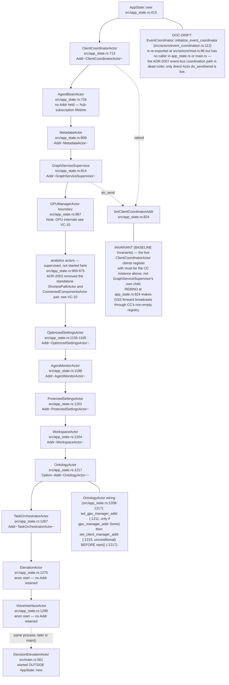

## VC-02.2 GraphServiceSupervisor::initialize_actors — child start order and wiring
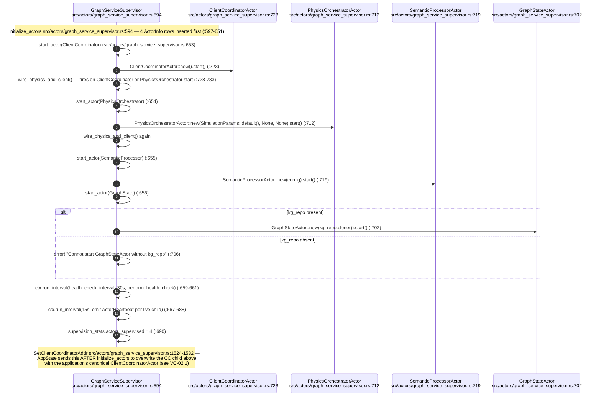

## VC-02.3 GraphServiceSupervisor message routing table
```mermaid
flowchart LR
    subgraph SUP["GraphServiceSupervisor handlers — grep impl Handler< src/actors/graph_service_supervisor.rs"]
        H1["SupervisorMessage graph_service_supervisor.rs:1411"]
        H2["ActorHeartbeat graph_service_supervisor.rs:1419"]
        H3["GetSupervisorStatus graph_service_supervisor.rs:1434"]
        H4["RestartActor graph_service_supervisor.rs:1442"]
        H5["RestartAllActors graph_service_supervisor.rs:1451"]
        H6["RESOLVED ADR-2045 (2026-09-05)<br/>SetParentSupervisor handler removed<br/>with src/actors/supervisor.rs, see VC-02.7"]
        H7["msgs::GetGraphData graph_service_supervisor.rs:1465"]
        H8["NotifyGraphUpdated graph_service_supervisor.rs:1500"]
        H9["SetClientCoordinatorAddr graph_service_supervisor.rs:1524"]
        H10["msgs::ReloadGraphFromDatabase graph_service_supervisor.rs:1534"]
        H11["msgs::ComputeShortestPaths graph_service_supervisor.rs:1638"]
        H12["msgs::UpdateGraphData graph_service_supervisor.rs:1664"]
        H13["msgs::AddNodesFromMetadata graph_service_supervisor.rs:1694"]
        H14["msgs::StartSimulation graph_service_supervisor.rs:1720"]
        H15["msgs::SimulationStep graph_service_supervisor.rs:1737"]
        H16["msgs::GetBotsGraphData graph_service_supervisor.rs:1764"]
        H17["msgs::UpdateSimulationParams graph_service_supervisor.rs:1797"]
        H18["msgs::ForceResumePhysics graph_service_supervisor.rs:1825"]
        H19["msgs::InitializeGPUConnection graph_service_supervisor.rs:1854"]
        H20["msgs::SetAppGpuComputeAddr graph_service_supervisor.rs:1952"]
        H21["msgs::UpdateBotsGraph graph_service_supervisor.rs:1966"]
        H22["msgs::UpdateNodePositions graph_service_supervisor.rs:1983"]
        H23["msgs::NodeInteractionMessage graph_service_supervisor.rs:2010"]
        H24["msgs::GetGraphStateActor graph_service_supervisor.rs:2078"]
        H25["msgs::GetPhysicsOrchestratorActor graph_service_supervisor.rs:2087"]
        H26["msgs::GetNodeTypeArrays graph_service_supervisor.rs:2102"]
        H27["msgs::GetNodeIdMapping graph_service_supervisor.rs:2124"]
        H28["msgs::AddEdge graph_service_supervisor.rs:2146"]
    end
    GS["self.graph_state (GraphStateActor)"]
    PH["self.physics (PhysicsOrchestratorActor)"]
    CL["self.client (ClientCoordinatorActor)"]
    GM["self.gpu_manager (GPUManagerActor) — boundary, see VC-10"]
    SELF["self (in-place state)"]

    H7 --> GS
    H10 --> GS
    H11 --> GS
    H12 --> GS
    H13 --> GS
    H16 --> GS
    H21 --> GS
    H26 --> GS
    H27 --> GS
    H28 --> GS
    H22 -->|"do_send both"| GS
    H22 --> PH
    H14 --> PH
    H15 --> PH
    H17 --> PH
    H18 --> PH
    H23 --> PH
    H25 --> PH
    H19 -->|"query GetForceComputeActor, InitializeGPU"| GM
    H19 -->|"StoreGPUComputeAddress"| PH
    H1 --> SELF
    H2 --> SELF
    H3 --> SELF
    H4 --> SELF
    H5 --> SELF
    H8 --> SELF
    H9 -->|"self.client = msg.addr, rewire"| CL
    H20 --> SELF
    H24 --> SELF

    N1["H12/H13/H28 also call notify_graph_updated (debounced graphUpdated broadcast) before forwarding<br/>H24/H26/H27 default-value fallback when the target child is None (never propagate an error to caller)<br/>H22 UpdateNodePositions mutates GraphStateActor's Arc~GraphData~ in-place (graph_state_actor.rs:857-858)<br/>so a subsequent GetGraphData poll (H7) returns the GPU-computed layout — no separate read-model push"]
    H12 --- N1
```

## VC-02.4 GraphServiceSupervisor restart and backoff lifecycle — the one live supervision path
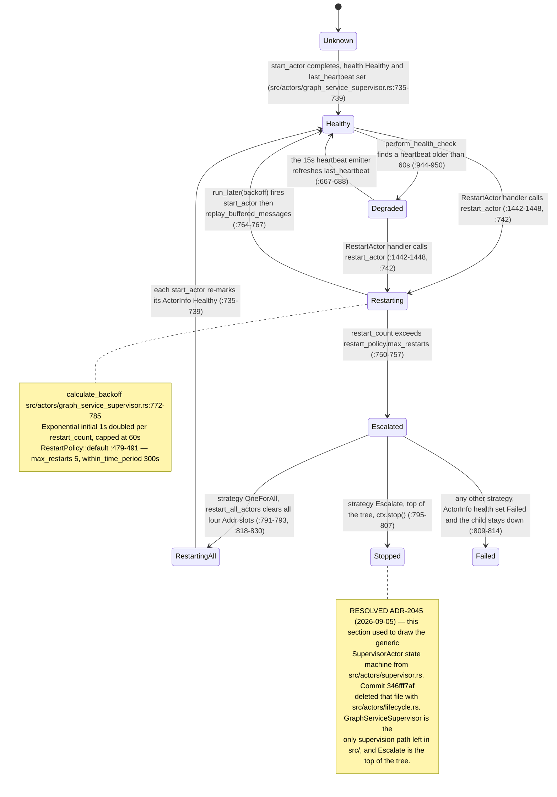

## VC-02.5 GraphServiceSupervisor restart sequence — RestartActor to replay or escalate
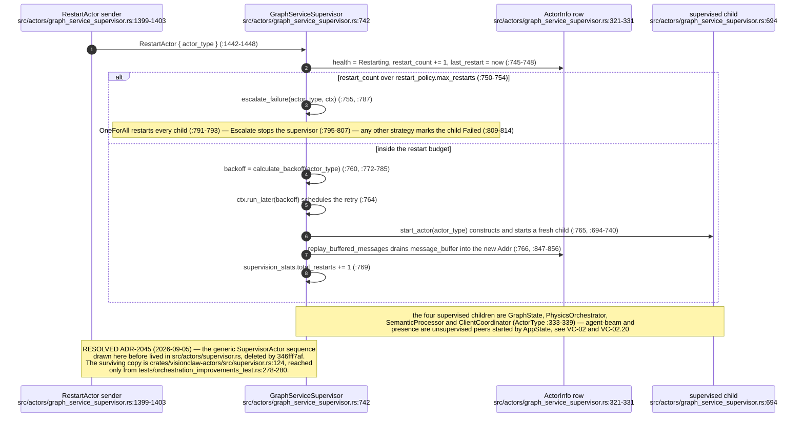

## VC-02.6 Drain and shutdown — GraphServiceSupervisor stop and the test-only crate drain
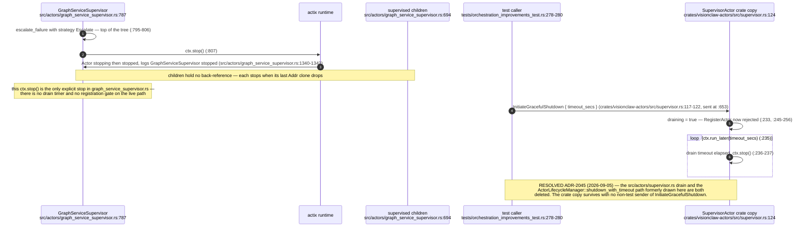

## VC-02.7 RESOLVED ADR-2045 — the removed supervision machinery and its survivor
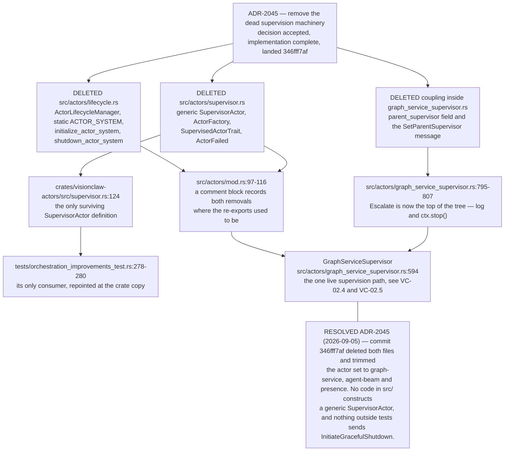

## VC-02.9 Message catalogue — client_messages, graph_messages, broadcast_messages
```mermaid
classDiagram
    class ClientCoordinatorActor {
      <<actor>>
      src/actors/client_coordinator_actor.rs
    }
    class RegisterClient {
      +ClientRecipients recipients
      result() Result~usize,String~
    }
    class ClientRecipients {
      +Recipient~SendToClientBinary~ binary
      +Recipient~SendToClientText~ text
      +Recipient~SendInitialGraphLoad~ initial_load
    }
    class UnregisterClient {
      +usize client_id
    }
    class BroadcastMessage {
      +String message
    }
    class GraphServiceSupervisor {
      <<actor>>
    }
    class GetGraphData {
      result() Result~Arc,String~
    }
    class UpdateGraphData {
      +Arc~ServiceGraphData~ graph_data
      result() Result~(),String~
    }
    class UpdateNodePositions {
      +List~u32,BinaryNodeData~ positions
      +Option~MessageId~ correlation_id
      result() Result~(),String~
    }
    class AddNodesFromMetadata {
      +MetadataStore metadata
      result() Result~(),String~
    }
    class AddEdge {
      +Edge edge
      result() Result~(),String~
    }
    class NodeInteractionMessage {
      +u32 node_id
      +NodeInteractionType interaction_type
      +Option~List~f32~~ position
      result() Result~(),VisionClawError~
    }
    RegisterClient *-- ClientRecipients
    ClientCoordinatorActor ..> RegisterClient
    ClientCoordinatorActor ..> UnregisterClient
    ClientCoordinatorActor ..> BroadcastMessage
    GraphServiceSupervisor ..> GetGraphData
    GraphServiceSupervisor ..> UpdateGraphData
    GraphServiceSupervisor ..> UpdateNodePositions
    GraphServiceSupervisor ..> AddNodesFromMetadata
    GraphServiceSupervisor ..> AddEdge
    GraphServiceSupervisor ..> NodeInteractionMessage
    note for GetGraphData "src/actors/messages/ — RegisterClient/UnregisterClient/BroadcastMessage\nowned by client_coordinator_actor.rs consumer; Result types confirmed from\nHandler impls at graph_service_supervisor.rs:1465,1664,1983,1694,2146,2010"
```

## VC-02.10 Message catalogue — supervision and heartbeat messages
```mermaid
classDiagram
    class GraphServiceSupervisor {
      <<actor>>
    }
    class SupervisorMessage {
      <<enum>>
      UpdateGraphData
      ReloadGraphFromDatabase
      StartSimulation
      StopSimulation
      SimulationStep
      UpdateSimulationParams
      UpdateNodePositions
      BroadcastMessage
      result() Result~(),VisionClawError~
    }
    class ActorHeartbeat {
      +ActorType actor_type
      +Instant timestamp
      +ActorHealth health
      +Option~ActorStats~ stats
    }
    class GetSupervisorStatus {
      result() SupervisorStatus
    }
    class RestartActor {
      +ActorType actor_type
      result() Result~(),VisionClawError~
    }
    class RestartAllActors {
      result() Result~(),VisionClawError~
    }
    class SetParentSupervisor {
      +Addr~SupervisorActor~ parent
    }
    class SetClientCoordinatorAddr {
      +Addr~ClientCoordinatorActor~ addr
    }
    class NotifyGraphUpdated {
      +str reason
    }
    class ActorFailed {
      +String actor_name
      +VisionClawError error
    }
    GraphServiceSupervisor ..> SupervisorMessage
    GraphServiceSupervisor ..> ActorHeartbeat
    GraphServiceSupervisor ..> GetSupervisorStatus
    GraphServiceSupervisor ..> RestartActor
    GraphServiceSupervisor ..> RestartAllActors
    GraphServiceSupervisor ..> SetClientCoordinatorAddr
    GraphServiceSupervisor ..> NotifyGraphUpdated
    note for SetClientCoordinatorAddr "src/actors/graph_service_supervisor.rs:1524-1532 —\nfield and handler both confirmed by direct read.\nRESOLVED ADR-2045 (2026-09-05) — SetParentSupervisor and ActorFailed\nwere removed from this actor with src/actors/supervisor.rs, see VC-02.7"
```

## VC-02.12 PhysicsOrchestratorActor — handled messages and broadcast invariant
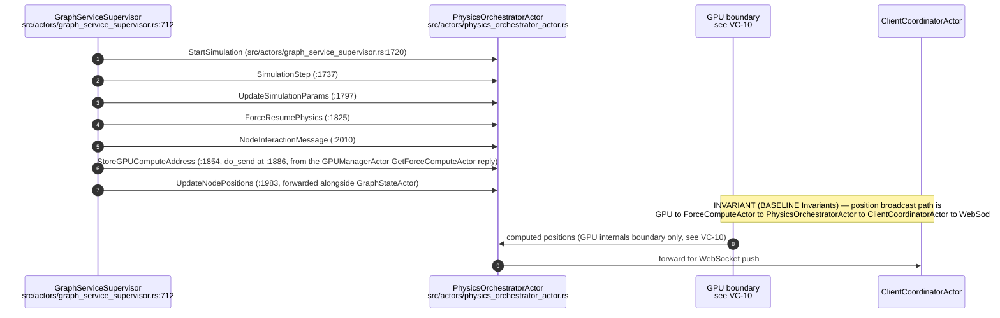

## VC-02.15 SemanticProcessorActor and OptimizedSettingsActor — message surfaces
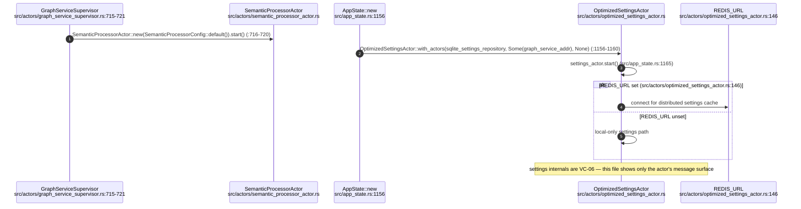

## VC-02.18 ElevationActor (+ elevation_voice.rs) and DecisionElevationActor
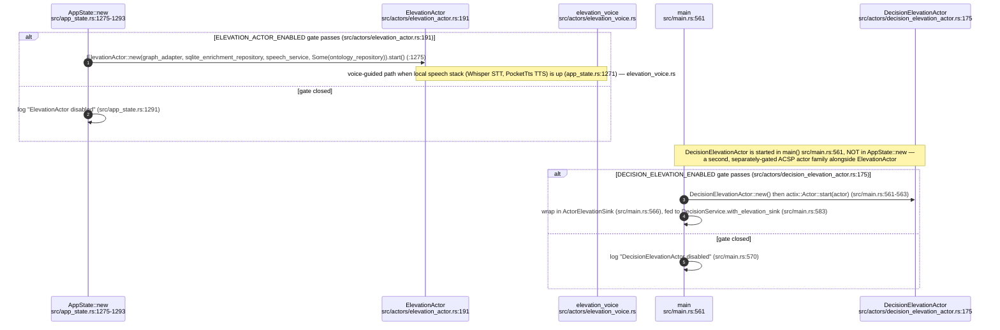

## VC-02.19 VoiceInterfaceActor (+ voice_commands.rs) and MultiMcpVisualizationActor
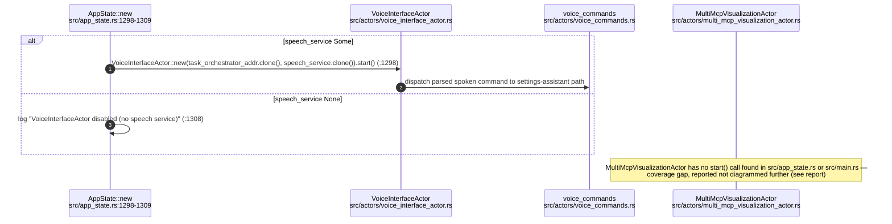

## VC-02.20 AgentMonitorActor and AgentBeamActor — message surfaces
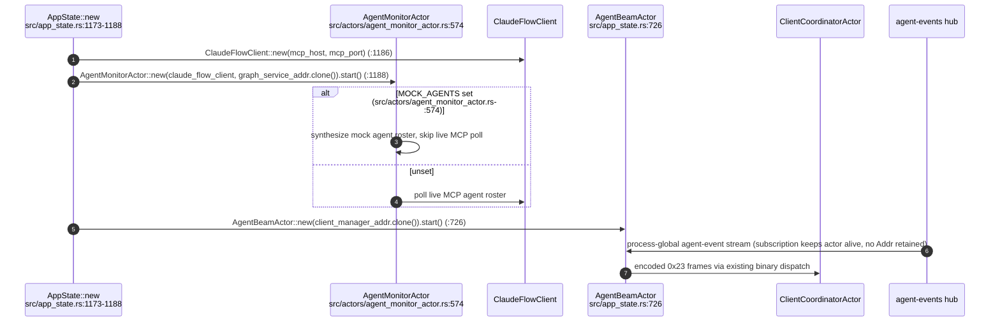
````

## DIFF

```diff
diff --git a/src/actors/decision_elevation_actor.rs b/src/actors/decision_elevation_actor.rs
index 472abe2c7..4070ef4d7 100644
--- a/src/actors/decision_elevation_actor.rs
+++ b/src/actors/decision_elevation_actor.rs
@@ -292,14 +292,29 @@ impl DecisionElevationActor {
                             "[DecisionElevation] decision row {id} persisted for {case_id} (outcome '{}', event {:?})",
                             record.outcome, record.decision_event_id
                         ),
-                        // Fail-open: the case row stays non-terminal, so boot
-                        // reconciliation picks it up again rather than losing it.
-                        Err(e) => error!(
-                            "[DecisionElevation] decision persist FAILED for {case_id}: {e}; case left open for reconciliation"
-                        ),
+                        Err(e) => {
+                            error!("[DecisionElevation] decision persist FAILED for {case_id}: {e}; external write refused, reconcile the open case");
+                            return None;
+                        },
                     }
                 }
+                if record.is_some() && store.is_none() {
+                    error!("[DecisionElevation] no durable store for {case_id}; external write refused");
+                    return None;
+                }
                 let case = elevate?;
+                let durable_store = store.as_ref()?;
+                match durable_store.claim_application(&case_id).await {
+                    Ok(true) => {},
+                    Ok(false) => {
+                        warn!("[DecisionElevation] case {case_id} is not an unclaimed approval; PR refused");
+                        return None;
+                    },
+                    Err(e) => {
+                        error!("[DecisionElevation] cannot persist application claim for {case_id}: {e}; PR refused");
+                        return None;
+                    }
+                }
                 let agent_id = format!(
                     "decision-{}",
                     decision_slug(&case.decision_urn, &case.summary)
@@ -344,7 +359,8 @@ impl DecisionElevationActor {
                         Some((case_id, case.decision_urn, url))
                     }
                     Err(e) => {
-                        // The case stays `approved`, so reconciliation retries.
+                        // Outcome may be unknown after an upstream timeout. Keep
+                        // `applying` for manual reconciliation, never blindly retry.
                         error!("[DecisionElevation] PR creation failed for {case_id}: {e}");
                         None
                     }
@@ -625,6 +641,7 @@ impl Handler<ElevateDecision> for DecisionElevationActor {
                     "decision_urn": dec.decision_urn,
                     "causal_edges": causal,
                     "file_path": file_path.clone(),
+                    "operation": { "kind": "corpus-pr", "file_path": file_path.clone(), "draft": draft.clone() },
                     "acsp_approved": dec.acsp_approved,
                 }),
                 reasoning: Some(reasoning),
@@ -658,9 +675,12 @@ impl Handler<ElevateDecision> for DecisionElevationActor {
             actix::fut::wrap_future::<_, Self>(async move {
                 if let Some(store) = store.as_ref() {
                     if let Err(e) = store.open_case(&record).await {
-                        warn!("[DecisionElevation] durable case persist failed for {persist_id}: {e}; case is in-process only and will not survive a restart");
+                        return Err(format!("durable case persist failed for {persist_id}: {e}; request refused"));
                     }
                 }
+                if store.is_none() {
+                    return Err("durable case store unavailable; request refused".into());
+                }
                 let published = acsp.publish(&build_action_request(&spec)).await.map(|_| ());
                 if published.is_err() {
                     if let Some(store) = store.as_ref() {
@@ -802,6 +822,10 @@ fn plan_reconciliation(cases: Vec<DecisionCase>, now_s: i64, ttl_s: i64) -> Vec<
             let stale = now_s.saturating_sub(case.opened_at_s) > ttl_s;
             match case.status.as_str() {
                 _ if tracking => Some(ReconcileAction::ResumeTracking(case)),
+                case_status::APPLYING => {
+                    warn!("[DecisionElevation] case {} has an uncertain PR application; reconcile upstream before retry", case.case_id);
+                    None
+                }
                 _ if stale => Some(ReconcileAction::Expire(case)),
                 // `elevating` with no PR url can only be a partially written
                 // row; treat it like an approval whose PR never landed.
@@ -990,6 +1014,12 @@ impl DecisionElevationSink for ActorElevationSink {
 mod tests {
     use super::*;
 
+    #[test]
+    fn uncertain_pr_application_never_replays_or_expires_as_if_unapplied() {
+        let c = case("uncertain", "applying", None, NOW - TTL - 1);
+        assert!(plan_reconciliation(vec![c], NOW, TTL).is_empty());
+    }
+
     #[test]
     fn production_gate_defaults_dev_on_prod_off() {
         assert!(!is_production_from(None, None));
```
