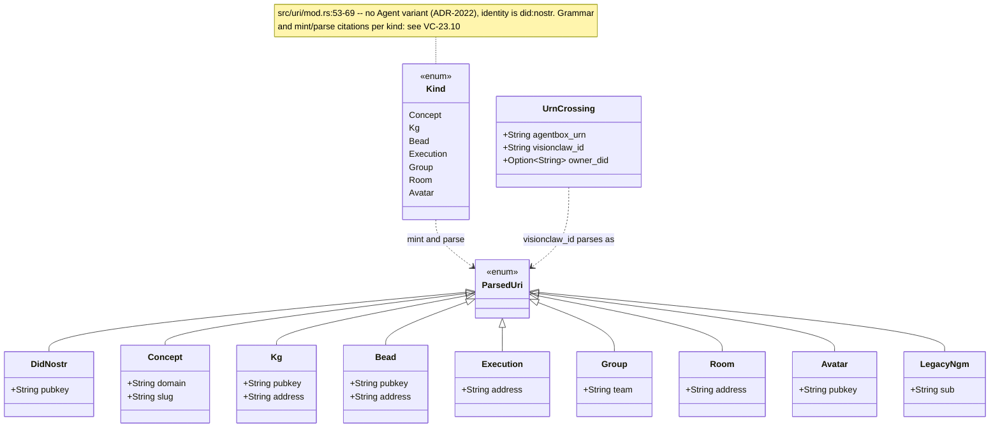
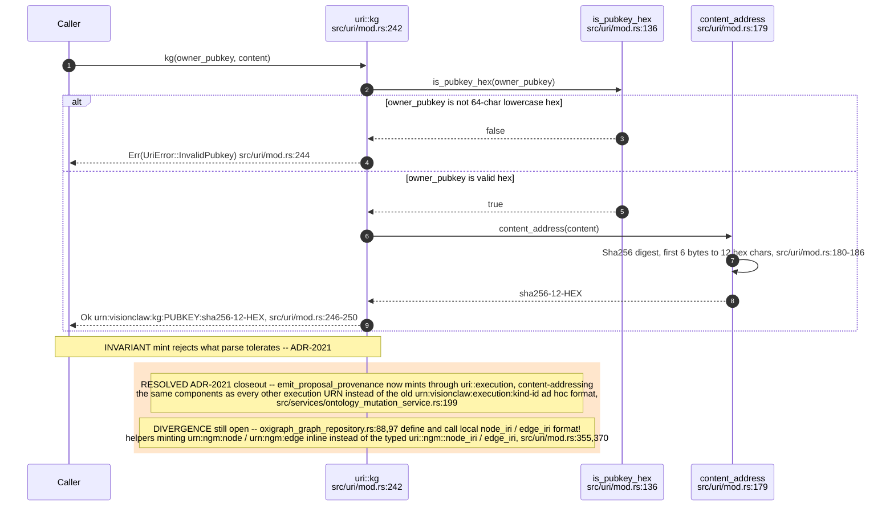
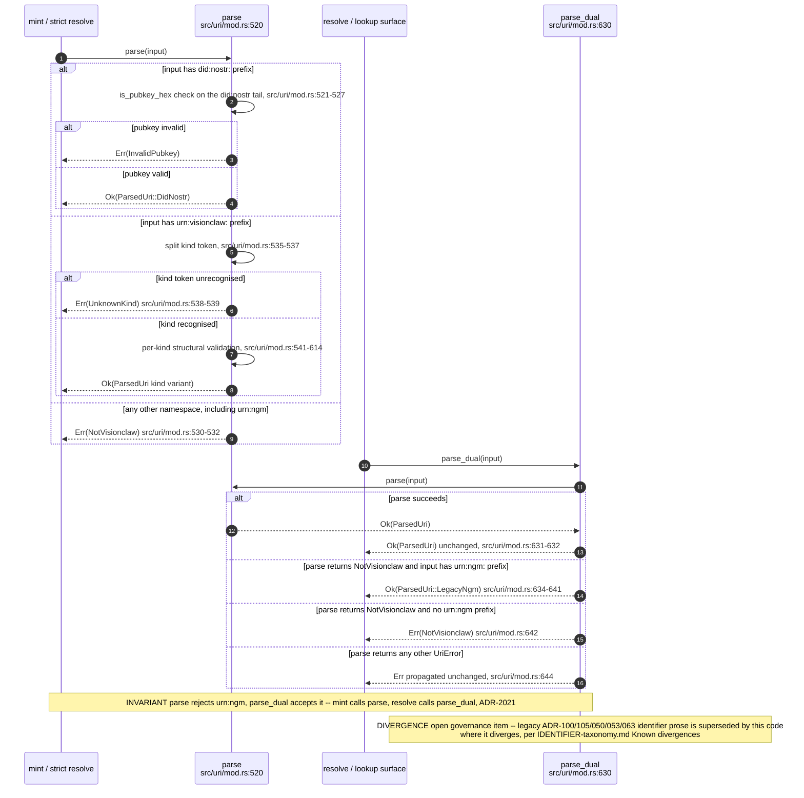
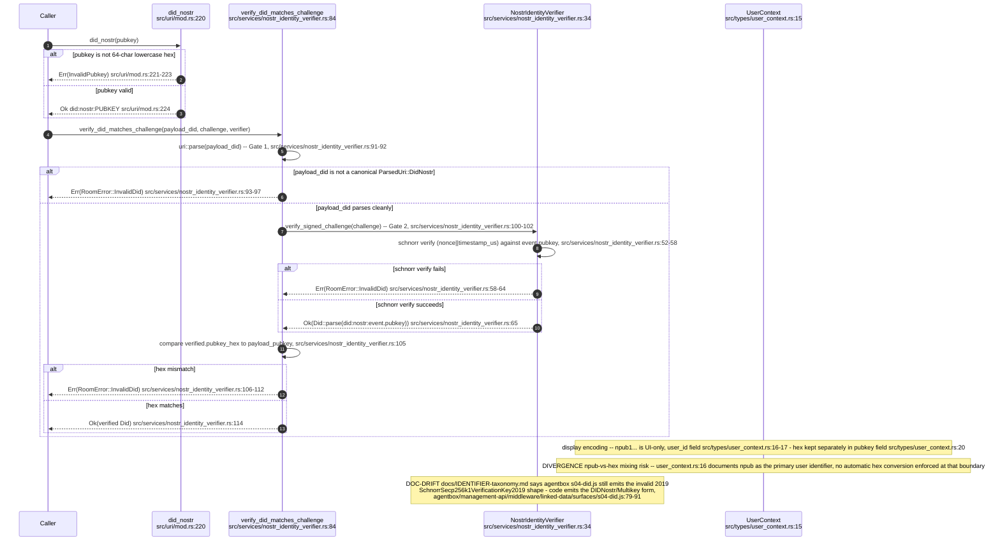
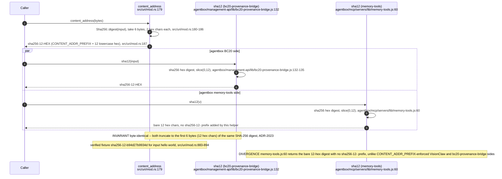
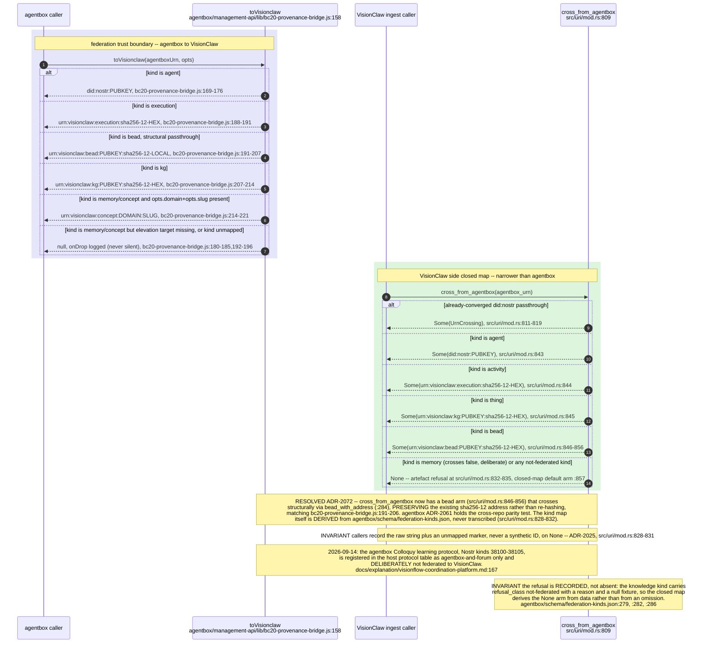
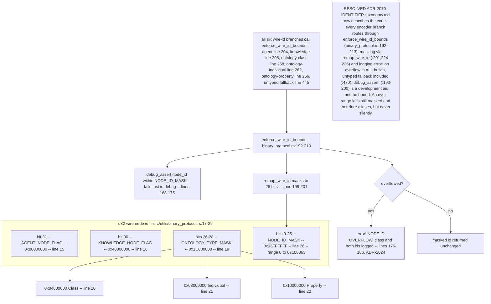
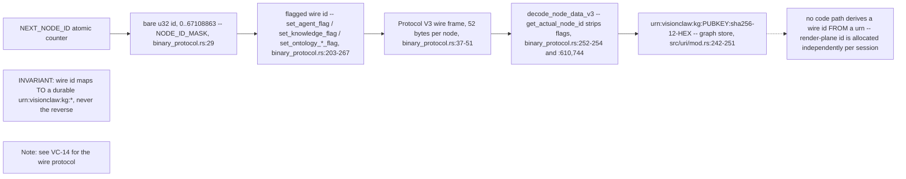
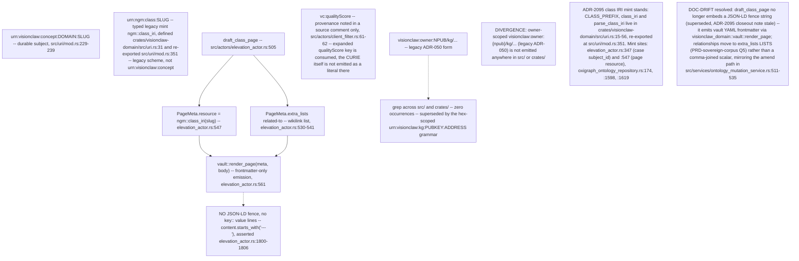

# E0 judgement vc-20

You are an independent judge for a pre-registered experiment. Below are (1) a TOPIC: a Markdown file of Mermaid diagrams that document code, with `path:line` citations, where paths under `../project/` are in the VisionClaw repository and paths under `../project/agentbox/` are in the agentbox repository; and (2) a DIFF: one commit's changes in the visionclaw repository, restricted to the files the topic lists under `sources:`.

Answer exactly one question:

> **Does this change make any statement in the topic false or incomplete?**

Judge only from the two texts below; do not look anything else up. Reply with a single JSON object and nothing else:

```json
{"verdict": "yes" | "no", "statements": ["<diagram id>: <the statement, quoted>", ...], "line_anchors_only": true | false, "reason": "<one or two sentences>"}
```

`statements` lists every topic statement the change makes false or incomplete (empty when the verdict is no). `line_anchors_only` is true when the only such statements are `path:line` anchors whose cited code merely moved.

## TOPIC (docs/diagrams/visionclaw/23-identifiers-urn-did-sha12.md)

````markdown
---
id: VC-23
title: Identifier taxonomy — typed URN, did:nostr, sha256-12, federation crossing, wire node-id
area: visionclaw
governing:
  - ../project/docs/IDENTIFIER-taxonomy.md
adrs: [ADR-2021, ADR-2022, ADR-2023, ADR-2024, ADR-2025, ADR-2070, ADR-2072]
sources:
  - ../project/crates/visionclaw-adapters/src/oxigraph_ontology_repository.rs
  - ../project/crates/visionclaw-domain/src/uri.rs
  - ../project/src/uri/mod.rs
  - ../project/src/utils/binary_protocol.rs
  - ../project/src/types/user_context.rs
  - ../project/src/services/nostr_identity_verifier.rs
  - ../project/src/services/ontology_mutation_service.rs
  - ../project/src/handlers/enrichment_proposals_handler.rs
  - ../project/src/domain/broker/precedent_registry.rs
  - ../project/src/actors/presence_actor.rs
  - ../project/src/actors/elevation_actor.rs
  - ../project/src/actors/client_filter.rs
  - ../project/src/adapters/oxigraph_graph_repository.rs
  - ../project/agentbox/schema/federation-kinds.json
  - ../project/docs/explanation/visionflow-coordination-platform.md
  - ../project/agentbox/management-api/lib/bc20-provenance-bridge.js
  - ../project/agentbox/management-api/middleware/linked-data/surfaces/s04-did.js
  - ../project/agentbox/mcp/servers/lib/memory-tools.js
verified_commit: {visionclaw: 58f04f2eb272a2707737f2065f8241b931229e81, agentbox: 6a4ad132f2dc5ddaedd05c679fdd10066bf30a0f}
---

## VC-23.1 Typed URN kind taxonomy — src/uri/mod.rs


## VC-23.2 Fail-closed mint path — kg() (ADR-2021)


## VC-23.3 parse (strict) vs parse_dual (lenient legacy resolve)


## VC-23.4 did:nostr identity — hex canonical, npub display-only (ADR-2022)


## VC-23.5 sha256-12 content addressing — VisionClaw and agentbox (ADR-2023)


## VC-23.6 Federation crossing — toVisionclaw / cross_from_agentbox closed map (ADR-2025)


## VC-23.7 Wire node-id u32 bit layout and overflow policy (ADR-2024)


## VC-23.8 Durable urn:visionclaw vs ephemeral wire node-id


## VC-23.9 Legacy class IRI mint, frontmatter-only page emission, unminted forms


## VC-23.10 Per-kind URN grammar, mint/parse sites and live emission

```mermaid
flowchart TD
    subgraph ID["Identity kinds"]
        direction TB
        K1["DidNostr<br/>did:nostr:HEXPUBKEY<br/>mint src/uri/mod.rs:220-225<br/>parse :521-528<br/>kind() returns None :467-470"]
        K9["Avatar<br/>urn:visionclaw:avatar:HEXPUBKEY<br/>1:1 with the avatar DID<br/>mint :313-318 / parse :606-613"]
    end
    subgraph OWNED["Owner-scoped content-addressed kinds"]
        direction TB
        K3["Kg<br/>urn:visionclaw:kg:HEXPUBKEY:sha256-12-HEX<br/>mint :242-251<br/>kg_with_address :255-262<br/>parse :557-578"]
        K4["Bead<br/>urn:visionclaw:bead:HEXPUBKEY:sha256-12-HEX<br/>mint :265-274 / parse :557-578"]
    end
    subgraph UNSCOPED["Unscoped content-addressed kinds"]
        direction TB
        K5["Execution<br/>urn:visionclaw:execution:sha256-12-HEX<br/>owner travels in owner_did, not the URN<br/>mint src/uri/mod.rs:293 / parse src/uri/mod.rs:579, :583<br/>live emission enrichment_proposals_handler.rs:219"]
        K7["Room<br/>urn:visionclaw:room:sha256-12-HEX<br/>unscoped XR presence room<br/>mint src/uri/mod.rs:308-310 / parse :598-605"]
    end
    subgraph SHARED["Shared and team-scoped kinds"]
        direction TB
        K2["Concept<br/>urn:visionclaw:concept:DOMAIN:SLUG<br/>mint src/uri/mod.rs:229-239 / parse src/uri/mod.rs:542-556<br/>live emission precedent_registry.rs:88"]
        K6["Group<br/>urn:visionclaw:group:TEAM-hash-members<br/>mint src/uri/mod.rs:298-304 / parse :587-597"]
    end
    subgraph LEGACY["Legacy exception"]
        direction TB
        K8["LegacyNgm<br/>urn:ngm:SUB opaque<br/>accepted only by parse_dual src/uri/mod.rs:630-646, LegacyNgm branch :633-642<br/>rejected by strict parse() (NotVisionclaw) :530-532<br/>typed ngm module :320-431 -- ADR-2021"]
    end
    XR["Room has no production emission site -- only RoomId::parse under cfg(test), presence_actor.rs:920-921"]
    K7 -.-> XR
    CROSS["UrnCrossing -- federation boundary record, src/uri/mod.rs:772-779 -- see VC-23.6"]
    ID --> CROSS
    OWNED --> CROSS
    UNSCOPED --> CROSS
```

````

## DIFF

```diff
diff --git a/crates/visionclaw-adapters/src/oxigraph_ontology_repository.rs b/crates/visionclaw-adapters/src/oxigraph_ontology_repository.rs
index e806ffe92..dd1deb4fe 100644
--- a/crates/visionclaw-adapters/src/oxigraph_ontology_repository.rs
+++ b/crates/visionclaw-adapters/src/oxigraph_ontology_repository.rs
@@ -3597,10 +3597,7 @@ mod tests {
         for (position, bad, expected) in cases {
             let repo = in_memory_repo();
             let err = repo
-                .append_derived_quads(vec![
-                    quad(GRAPH_ONTOLOGY_SUMMARY, S, P, "legitimate"),
-                    bad,
-                ])
+                .append_derived_quads(vec![quad(GRAPH_ONTOLOGY_SUMMARY, S, P, "legitimate"), bad])
                 .await
                 .unwrap_err();
             assert!(
@@ -3645,14 +3642,9 @@ mod tests {
         let repo = in_memory_repo();
         let hostile_literal =
             "value\" . } INSERT DATA { GRAPH <urn:ngm:graph:ontology:assert> { <urn:e> <urn:p> \"x";
-        repo.append_derived_quads(vec![quad(
-            GRAPH_ONTOLOGY_SUMMARY,
-            S,
-            P,
-            hostile_literal,
-        )])
-        .await
-        .expect("a literal is escaped, not refused");
+        repo.append_derived_quads(vec![quad(GRAPH_ONTOLOGY_SUMMARY, S, P, hostile_literal)])
+            .await
+            .expect("a literal is escaped, not refused");
 
         assert_eq!(graph_len(&repo, GRAPH_ONTOLOGY_SUMMARY), 1);
         assert_eq!(
diff --git a/src/actors/presence_actor.rs b/src/actors/presence_actor.rs
index b0bcea882..535b0c444 100644
--- a/src/actors/presence_actor.rs
+++ b/src/actors/presence_actor.rs
@@ -438,7 +438,10 @@ impl PresenceActor {
         }
 
         if let Err(node_id) = Self::check_node_correlation(&msg.presence) {
-            warn!(node_id, "agent presence attention target is outside wire id space");
+            warn!(
+                node_id,
+                "agent presence attention target is outside wire id space"
+            );
             return AgentPresenceOutcome::InvalidNodeCorrelation { node_id };
         }
 
@@ -1113,8 +1116,7 @@ mod tests {
 
     use actix::Addr;
     use visionclaw_xr_presence::agent_presence::{
-        decode_agent_presence, AgentActivity, AgentPresence, AttentionTarget,
-        OPCODE_AGENT_PRESENCE,
+        decode_agent_presence, AgentActivity, AgentPresence, AttentionTarget, OPCODE_AGENT_PRESENCE,
     };
 
     fn presence(activity: AgentActivity, gaze: [f32; 3], attn: AttentionTarget) -> AgentPresence {
@@ -1219,7 +1221,11 @@ mod tests {
         let outcome = actor
             .send(IngestAgentPresence {
                 avatar_id: outsider.clone(),
-                presence: presence(AgentActivity::Speaking, [0.0, 0.0, -1.0], AttentionTarget::User),
+                presence: presence(
+                    AgentActivity::Speaking,
+                    [0.0, 0.0, -1.0],
+                    AttentionTarget::User,
+                ),
             })
             .await
             .unwrap();
@@ -1227,7 +1233,9 @@ mod tests {
 
         // Nothing was recorded for the outsider.
         assert!(actor
-            .send(GetAgentPresence { avatar_id: outsider })
+            .send(GetAgentPresence {
+                avatar_id: outsider
+            })
             .await
             .unwrap()
             .is_none());
@@ -1265,7 +1273,11 @@ mod tests {
         let outcome = actor
             .send(IngestAgentPresence {
                 avatar_id: a,
-                presence: presence(AgentActivity::Working, [0.0, 0.0, -1.0], AttentionTarget::None),
+                presence: presence(
+                    AgentActivity::Working,
+                    [0.0, 0.0, -1.0],
+                    AttentionTarget::None,
+                ),
             })
             .await
             .unwrap();
@@ -1305,7 +1317,11 @@ mod tests {
         actor
             .send(IngestAgentPresence {
                 avatar_id: a.clone(),
-                presence: presence(AgentActivity::Speaking, [0.0, 0.0, -1.0], AttentionTarget::User),
+                presence: presence(
+                    AgentActivity::Speaking,
+                    [0.0, 0.0, -1.0],
+                    AttentionTarget::User,
+                ),
             })
             .await
             .unwrap();
@@ -1480,7 +1496,11 @@ mod tests {
         actor
             .send(IngestAgentPresence {
                 avatar_id: a.clone(),
-                presence: presence(AgentActivity::Working, [0.0, 0.0, -1.0], AttentionTarget::None),
+                presence: presence(
+                    AgentActivity::Working,
+                    [0.0, 0.0, -1.0],
+                    AttentionTarget::None,
+                ),
             })
             .await
             .unwrap();
@@ -1496,7 +1516,9 @@ mod tests {
         let outcome = actor
             .send(IngestPose {
                 avatar_id: a.clone(),
-                frame_bytes: encode(&sample_frame(1_000), &sample_room(), &a).unwrap().to_vec(),
+                frame_bytes: encode(&sample_frame(1_000), &sample_room(), &a)
+                    .unwrap()
+                    .to_vec(),
             })
             .await
             .unwrap();
@@ -1505,7 +1527,10 @@ mod tests {
 
         let f = frames_b.lock().unwrap().clone();
         assert_eq!(f.len(), 2, "one presence frame and one pose frame");
-        assert_eq!(f[1].bytes[0], PREAMBLE_OPCODE, "the second is the 0x43 pose");
+        assert_eq!(
+            f[1].bytes[0], PREAMBLE_OPCODE,
+            "the second is the 0x43 pose"
+        );
 
         let still = actor
             .send(GetAgentPresence {
@@ -1574,6 +1599,9 @@ mod tests {
         let delta = &batch.deltas[0];
         assert_eq!(delta.state, Some(AgentActivity::Working));
         assert!(delta.gaze_dir.is_none(), "unchanged gaze must be elided");
-        assert!(delta.attention.is_none(), "unchanged attention must be elided");
+        assert!(
+            delta.attention.is_none(),
+            "unchanged attention must be elided"
+        );
     }
 }
diff --git a/src/services/ontology_mutation_service.rs b/src/services/ontology_mutation_service.rs
index c19e017b6..40f4f27ac 100644
--- a/src/services/ontology_mutation_service.rs
+++ b/src/services/ontology_mutation_service.rs
@@ -39,7 +39,6 @@ use visionclaw_domain::ports::ontology_repository::{
 };
 use visionclaw_domain::vault;
 
-
 /// Generate a vault page for a proposal: a §V2 YAML frontmatter block
 /// followed by the definition prose (ADR-2040 §V5).
 ///
@@ -50,11 +49,7 @@ use visionclaw_domain::vault;
 /// invisible to the §V4 gate as well. `owl-class` alone would admit the
 /// page; `public: true` is emitted because these pages are published
 /// ontology terms.
-fn generate_vault_markdown(
-    proposal: &NoteProposal,
-    term_id: &str,
-    user_id: &str,
-) -> String {
+fn generate_vault_markdown(proposal: &NoteProposal, term_id: &str, user_id: &str) -> String {
     let today = Utc::now().format("%Y-%m-%d").to_string();
 
     let mut extra: std::collections::BTreeMap<String, String> = std::collections::BTreeMap::new();
@@ -88,8 +83,7 @@ fn generate_vault_markdown(
         public: true,
         owl_class: (!proposal.owl_class.is_empty()).then(|| proposal.owl_class.clone()),
         source_domain: (!proposal.domain.is_empty()).then(|| proposal.domain.clone()),
-        title: (!proposal.preferred_term.is_empty())
-            .then(|| proposal.preferred_term.clone()),
+        title: (!proposal.preferred_term.is_empty()).then(|| proposal.preferred_term.clone()),
         extra,
         ..vault::PageMeta::default()
     };
@@ -97,7 +91,11 @@ fn generate_vault_markdown(
     let body = if proposal.definition.trim().is_empty() {
         format!("# {}\n", proposal.preferred_term)
     } else {
-        format!("# {}\n\n{}\n", proposal.preferred_term, proposal.definition.trim())
+        format!(
+            "# {}\n\n{}\n",
+            proposal.preferred_term,
+            proposal.definition.trim()
+        )
     };
 
     vault::render_page(&meta, &body)
@@ -115,7 +113,6 @@ fn wikilink_list(targets: &[String]) -> String {
         .join(", ")
 }
 
-
 /// Error-string sentinel prefix: a blocking conflict-integrity report. The
 /// handler maps this to HTTP 409 and returns the serialised [`ConflictReport`].
 pub const CONFLICT_BLOCKED_PREFIX: &str = "CONFLICT_BLOCKED:";
@@ -505,8 +502,7 @@ impl OntologyMutationService {
         let (mut meta, body) = vault::split(&existing_markdown);
 
         if let Some(ref new_def) = amendment.update_definition {
-            meta.extra
-                .insert("definition".to_string(), new_def.clone());
+            meta.extra.insert("definition".to_string(), new_def.clone());
         }
 
         for (rel_type, targets) in &amendment.add_relationships {
@@ -1171,7 +1167,6 @@ mod provenance_wiring_tests {
     }
 }
 
-
 #[cfg(test)]
 mod vault_writer_tests {
     use super::*;
@@ -1209,7 +1204,10 @@ mod vault_writer_tests {
         assert_eq!(meta.format, PageFormat::Obsidian);
         assert!(meta.is_kg_included());
         assert!(meta.public);
-        assert_eq!(meta.owl_class.as_deref(), Some("mv:ArbitrationDecisionEngine"));
+        assert_eq!(
+            meta.owl_class.as_deref(),
+            Some("mv:ArbitrationDecisionEngine")
+        );
         assert_eq!(meta.source_domain.as_deref(), Some("mv"));
         assert_eq!(meta.title.as_deref(), Some("Arbitration Decision Engine"));
     }
@@ -1219,8 +1217,14 @@ mod vault_writer_tests {
         let markdown = generate_vault_markdown(&proposal(), "MV-0042", "did:nostr:abc");
         let meta = vault::parse(&markdown);
 
-        assert_eq!(meta.extra.get("term-id").map(String::as_str), Some("MV-0042"));
-        assert_eq!(meta.extra.get("maturity").map(String::as_str), Some("draft"));
+        assert_eq!(
+            meta.extra.get("term-id").map(String::as_str),
+            Some("MV-0042")
+        );
+        assert_eq!(
+            meta.extra.get("maturity").map(String::as_str),
+            Some("draft")
+        );
         assert_eq!(
             meta.extra.get("contributed-by").map(String::as_str),
             Some("did:nostr:abc")
diff --git a/src/uri/mod.rs b/src/uri/mod.rs
index fde16fc76..b8db7f7b6 100644
--- a/src/uri/mod.rs
+++ b/src/uri/mod.rs
@@ -1070,10 +1070,7 @@ mod tests {
                 "{addr:?} must be rejected ({why})"
             );
             assert!(
-                matches!(
-                    kg_with_address(PK_A, addr),
-                    Err(UriError::Malformed(_))
-                ),
+                matches!(kg_with_address(PK_A, addr), Err(UriError::Malformed(_))),
                 "kg_with_address must reject {addr:?} ({why})"
             );
         }
diff --git a/src/utils/binary_protocol.rs b/src/utils/binary_protocol.rs
index 45f0d1983..54a681c68 100644
--- a/src/utils/binary_protocol.rs
+++ b/src/utils/binary_protocol.rs
@@ -10,8 +10,8 @@ use visionclaw_domain::models::constraints::{AdvancedParams, Constraint};
 // Protocol versions for wire format (V1 REMOVED - no backward compatibility)
 // PROTOCOL_V2 (value: 2) removed — server no longer sends or decodes V2 frames
 const PROTOCOL_V3: u8 = 3; // Analytics extension protocol (P0-4) - CURRENT
-// V5 broadcast envelope: wraps a V3 body with a monotonic sequence for client-side
-// drop/reorder detection. Owned by docs/PROTOCOL-registry.md, locked by ADR-2057.
+                           // V5 broadcast envelope: wraps a V3 body with a monotonic sequence for client-side
+                           // drop/reorder detection. Owned by docs/PROTOCOL-registry.md, locked by ADR-2057.
 const PROTOCOL_V5: u8 = 5;
 
 // Node type flag constants for u32 (server-side)
```
