# E0 judgement vc-22

You are an independent judge for a pre-registered experiment. Below are (1) a TOPIC: a Markdown file of Mermaid diagrams that document code, with `path:line` citations, where paths under `../project/` are in the VisionClaw repository and paths under `../project/agentbox/` are in the agentbox repository; and (2) a DIFF: one commit's changes in the visionclaw repository, restricted to the files the topic lists under `sources:`.

Answer exactly one question:

> **Does this change make any statement in the topic false or incomplete?**

Judge only from the two texts below; do not look anything else up. Reply with a single JSON object and nothing else:

```json
{"verdict": "yes" | "no", "statements": ["<diagram id>: <the statement, quoted>", ...], "line_anchors_only": true | false, "reason": "<one or two sentences>"}
```

`statements` lists every topic statement the change makes false or incomplete (empty when the verdict is no). `line_anchors_only` is true when the only such statements are `path:line` anchors whose cited code merely moved.

## TOPIC (docs/diagrams/visionclaw/01-boot-and-app-state.md)

````markdown
---
id: VC-01
title: Server boot, AppState construction and the full route table
area: visionclaw
governing:
  - ../project/docs/BASELINE-architecture.md
adrs: [ADR-2004, ADR-2005, ADR-2007, ADR-2008, ADR-2026, ADR-2037, ADR-2038, ADR-2045, ADR-2053]
sources:
  - ../project/src/main.rs
  - ../project/src/app_state.rs
  - ../project/src/handlers/mod.rs
  - ../project/src/handlers/consolidated_health_handler.rs
  - ../project/src/handlers/api_handler/mod.rs
  - ../project/src/handlers/api_handler/graph/mod.rs
  - ../project/src/handlers/api_handler/files/mod.rs
  - ../project/src/handlers/api_handler/bots/mod.rs
  - ../project/src/handlers/api_handler/analytics/mod.rs
  - ../project/src/handlers/api_handler/ontology/mod.rs
  - ../project/src/handlers/api_handler/ontology_physics/mod.rs
  - ../project/src/handlers/api_handler/semantic_forces.rs
  - ../project/src/handlers/graph_state_handler.rs
  - ../project/src/handlers/graph_export_handler.rs
  - ../project/src/handlers/layout_handler.rs
  - ../project/src/handlers/physics_handler.rs
  - ../project/src/handlers/schema_handler.rs
  - ../project/src/handlers/semantic_handler.rs
  - ../project/src/handlers/natural_language_query_handler.rs
  - ../project/src/handlers/semantic_pathfinding_handler.rs
  - ../project/src/handlers/constraints_handler.rs
  - ../project/src/handlers/validation_handler.rs
  - ../project/src/handlers/workspace_handler.rs
  - ../project/src/handlers/pages_handler.rs
  - ../project/src/handlers/kpi_handler.rs
  - ../project/src/handlers/trace_handler.rs
  - ../project/src/handlers/insight_loop_handler.rs
  - ../project/src/handlers/liveness_harness_handler.rs
  - ../project/src/handlers/ingest_writeback_handler.rs
  - ../project/src/handlers/metrics_handler.rs
  - ../project/src/handlers/multi_mcp_websocket_handler.rs
  - ../project/src/handlers/bots_visualization_handler.rs
  - ../project/src/handlers/ontology_derived_handler.rs
  - ../project/src/handlers/ontology_class_count_handler.rs
  - ../project/src/handlers/ontology_agent_handler.rs
  - ../project/src/handlers/admin_rbac_handler.rs
  - ../project/src/handlers/admin_sync_handler.rs
  - ../project/src/handlers/nostr_handler.rs
  - ../project/src/handlers/broker_inbox_handler.rs
  - ../project/src/handlers/decision_handler.rs
  - ../project/src/handlers/enrichment_proposals_handler.rs
  - ../project/src/handlers/briefing_handler.rs
  - ../project/src/handlers/memory_flash_handler.rs
  - ../project/src/handlers/image_gen_handler.rs
  - ../project/src/handlers/solid_proxy_handler.rs
  - ../project/src/handlers/ragflow_handler.rs
  - ../project/src/settings/api/settings_routes.rs
  - ../project/src/services/liveness_harness.rs
  - ../project/src/services/canary_nostr_tap.rs
  - ../project/src/config/security_profile.rs
  - ../project/src/services/github/config.rs
  - ../project/src/services/github_sync_service.rs
  - ../project/src/services/corpus_source/mod.rs
  - ../project/src/services/corpus_source/local.rs
  - ../project/src/services/corpus_source/github.rs
  - ../project/src/services/kpi_compute.rs
  - ../project/src/services/role_store.rs
  - ../project/src/utils/auth.rs
  - ../project/tests/resd_class_count_route.rs
  - ../project/src/services/ontology_pull.rs
  - ../project/Cargo.toml
  - ../project/src/adapters/mod.rs
verified_commit: dd420fbc722a7a4a50e968162ac6c3eaff6972b2
---

## VC-01.1 main() phase 1 — hygiene, logging, settings, stores
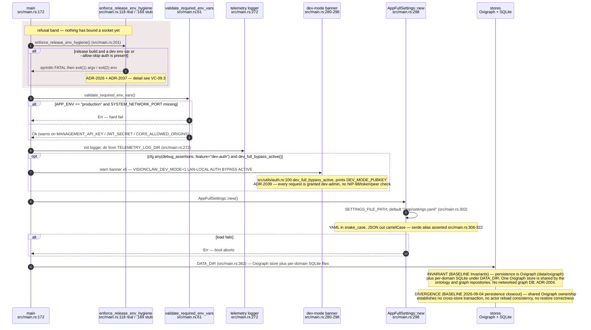

## VC-01.2 main() phase 2 — service graph, CorpusSource selection and RBAC owner bootstrap
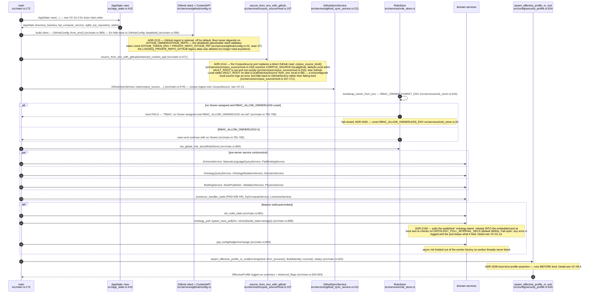

## VC-01.3 HttpServer worker factory and middleware stack order
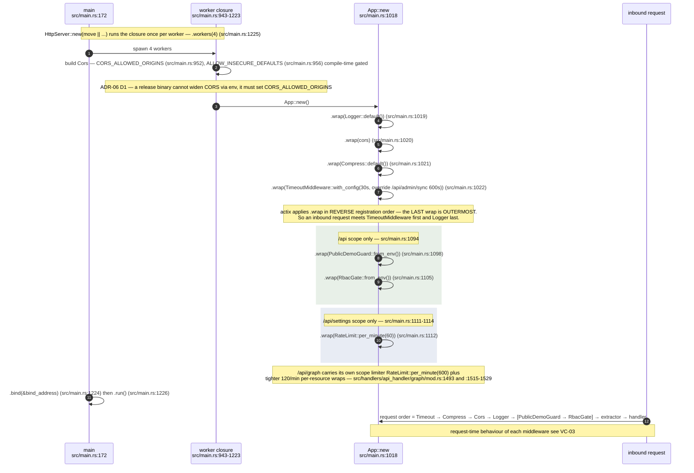

## VC-01.4 app_data registry — what each worker gets injected
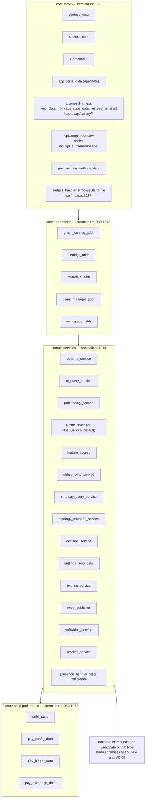

## VC-01.5 AppState::new — actor start order and the coordinator re-bind
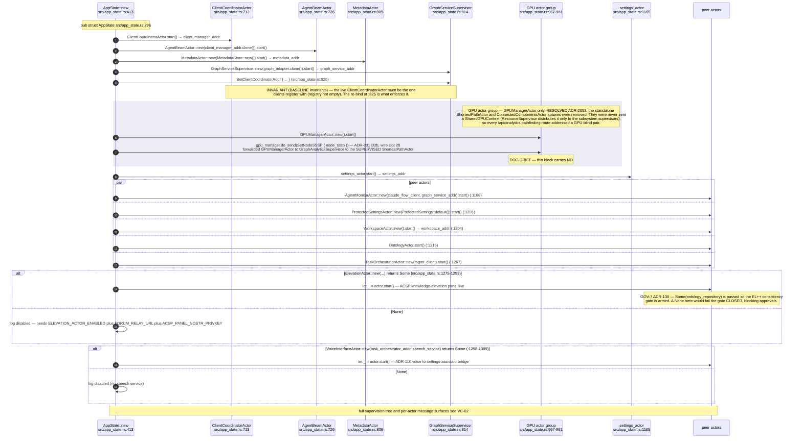

## VC-01.7 Health and readiness composition
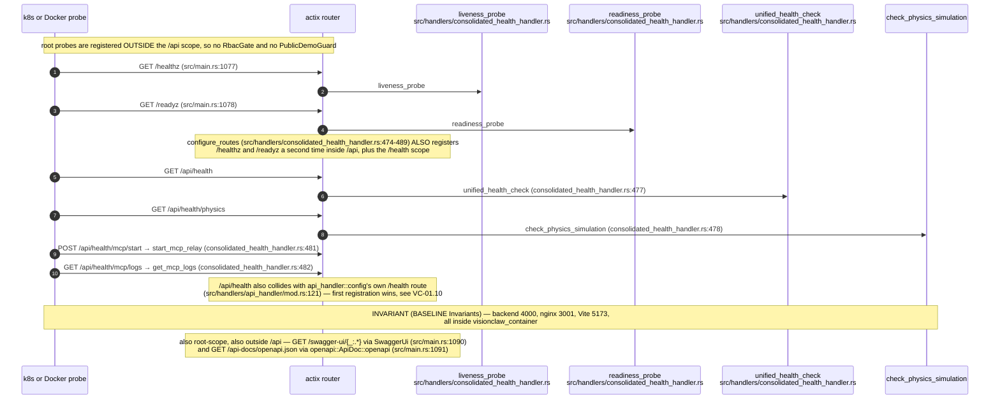

## VC-01.8 Post-bind background tasks and graceful shutdown
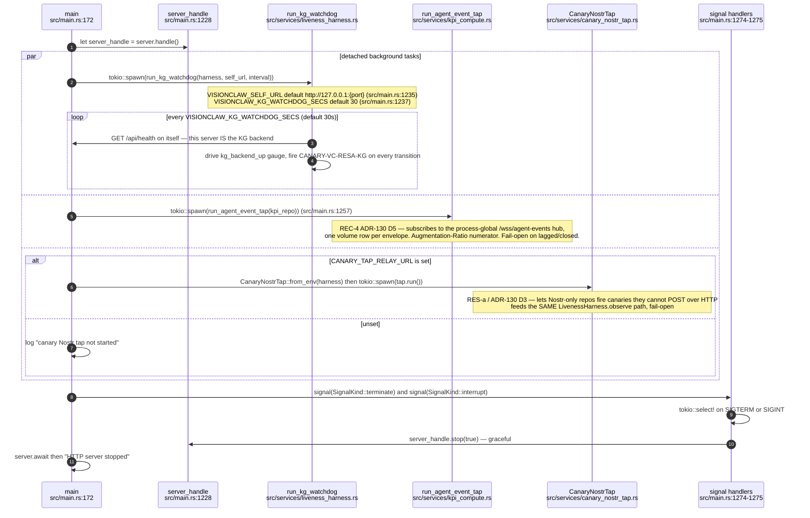

## VC-01.10 Route table 2 — /api scope registration ORDER
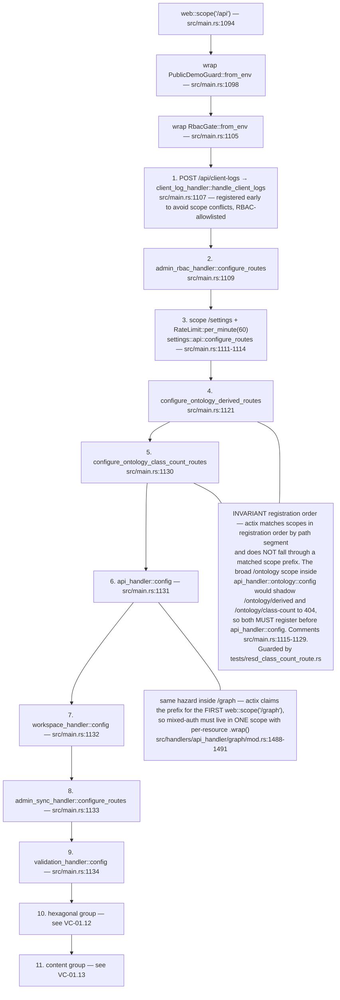

## VC-01.11 Route table 3 — api_handler::config fan-out
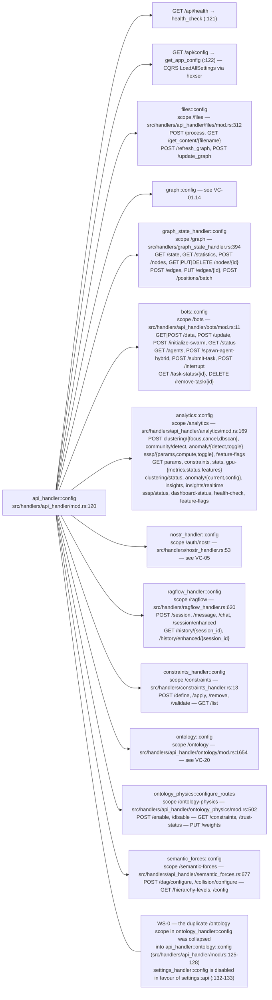

## VC-01.12 Route table 4 — hexagonal, health and MCP groups
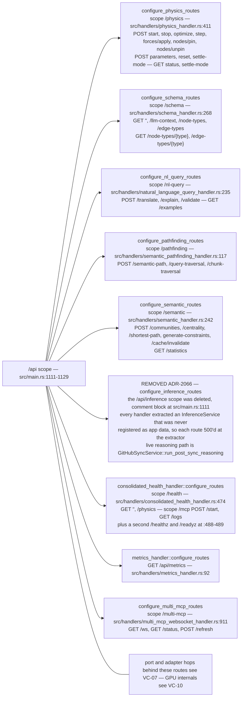

## VC-01.13 Route table 5 — content, governance and observability groups
```mermaid
flowchart LR
    S["/api scope — src/main.rs:1094-1212"]
    S --> PG["scope /pages + pages_handler::config<br/>src/main.rs:1160, src/handlers/pages_handler.rs:148 — GET ''"]
    S --> BO["scope /bots + api_handler::bots::config<br/>src/main.rs:1161"]
    S --> BV["bots_visualization_handler::configure_routes<br/>scope /visualization — src/handlers/bots_visualization_handler.rs:515<br/>GET /agents/ws, GET snapshot, POST initialize<br/>plus POST /bots/mock-agents at :530"]
    S --> GE["configure_graph_export_routes<br/>scope /graph-export — src/handlers/graph_export_handler.rs:319<br/>POST '', /share, /publish — GET /shared/{id}, /stats — DELETE /shared/{id}"]
    S --> OA["configure_ontology_agent_routes<br/>scope /ontology-agent — src/handlers/ontology_agent_handler.rs:366<br/>POST /discover, /read, /query, /traverse, /validate — GET /status<br/>POST /propose — RETIRED (ADR-2116): always 410 Gone, no auth or rate-limit,<br/>names vault propose as the replacement"]
    S --> DE["configure_decision_routes<br/>scope /decisions — src/handlers/decision_handler.rs:323<br/>GET /{urn}/trace — nested scope /record POST '' — PRD-022 W-B / ADR-048"]
    S --> SO["configure_solid_routes<br/>src/handlers/solid_proxy_handler.rs:1752<br/>re-exported at src/handlers/mod.rs:121 — see VC-05"]
    S --> IG["configure_image_gen_routes<br/>scope /image-gen — src/handlers/image_gen_handler.rs:935<br/>GET /health, /status/{job_id} — POST /submit, /agent-submit<br/>graph chosen by IMAGE_GEN_MODEL :114 — MiniMax H3 default, FLUX 2 opt-in"]
    S --> BR["configure_briefing_routes<br/>scope /briefs — src/handlers/briefing_handler.rs:118<br/>POST '' submit_brief, POST /{brief_id}/debrief"]
    S --> MF["configure_memory_flash_routes<br/>POST /api/memory-flash and the batch route<br/>src/handlers/memory_flash_handler.rs:134-137"]
    S --> EP["configure_enrichment_proposals_routes<br/>POST /api/enrichment-proposals/{id}/decide<br/>src/handlers/enrichment_proposals_handler.rs:715"]
    S --> BI["configure_broker_inbox_routes<br/>scope /broker — src/handlers/broker_inbox_handler.rs:177<br/>GET /inbox, GET /cases/{id}, POST decide_as_operator — WS-12"]
    S --> IW["configure_ingest_writeback_routes<br/>POST /api/ingest/writeback — src/handlers/ingest_writeback_handler.rs:103 — GOV-4"]
    S --> LV["configure_liveness_routes<br/>scope /canary — src/handlers/liveness_harness_handler.rs:212<br/>POST /register, POST /observe/{canary_id}, GET /status — RES-a"]
    S --> KP["configure_kpi_routes<br/>scope /kpi — src/handlers/kpi_handler.rs:49<br/>GET /summary, GET /lineage/{snapshot_id} — REC-4 ADR-043"]
    S --> IL["configure_insight_loop_routes<br/>scope /insight-loop — src/handlers/insight_loop_handler.rs:91<br/>GET /trace, GET /trace/{case_id} — REC-10 PRD-023 WP-12"]
    S --> TR["configure_trace_routes<br/>GET /api/trace — src/handlers/trace_handler.rs:76<br/>REC-11 joins agent-events and broker decisions on did:nostr"]
    S --> LA["configure_layout_routes<br/>scope /layout — src/handlers/layout_handler.rs:307<br/>GET /modes, /status, /zones — POST /mode, /radial, /zones, /reset — ADR-031"]
    N["handler internals for this group see VC-04 and VC-05"]
    S --- N
```

## VC-01.14 Route table 6 — /api/graph mixed-auth scope and /api/settings
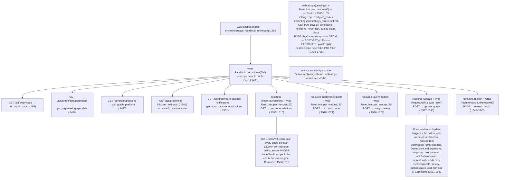

## VC-01.15 ADR-2106 — the embedded pod pulls the published ontology at boot
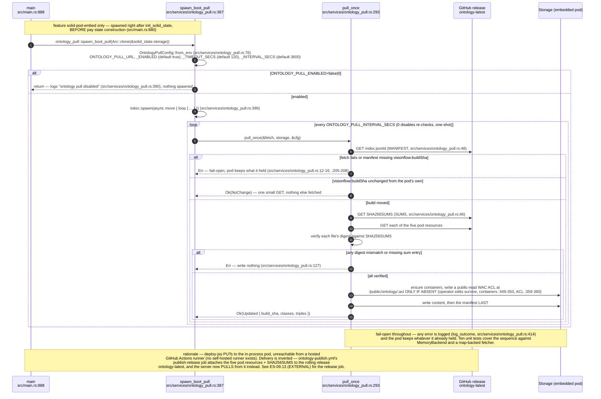
````

## DIFF

```diff
diff --git a/src/services/role_store.rs b/src/services/role_store.rs
index 2275c8975..80e7f755e 100644
--- a/src/services/role_store.rs
+++ b/src/services/role_store.rs
@@ -67,6 +67,84 @@ pub enum RoleStoreError {
     Forbidden(String),
     #[error("refused: this would remove the last Owner")]
     LastOwner,
+    /// ADR-2010: the caller's authority changed between admission and commit.
+    ///
+    /// The handler resolves the caller's role when the request is admitted, but
+    /// the mutation commits later. If a concurrent demotion lands in between,
+    /// the request was admitted under authority the caller no longer holds. The
+    /// transaction re-reads the caller's role and refuses rather than committing
+    /// on the stale value; the client must re-authenticate and retry.
+    #[error(
+        "refused: caller authority changed during the request \
+(admitted as {admission}, now {current}) — re-authenticate and retry"
+    )]
+    CallerAuthorityChanged {
+        admission: UserRole,
+        current: UserRole,
+    },
+}
+
+/// The caller's identity and admission-time authority for a role mutation.
+///
+/// ADR-2010: passing the resolved `UserRole` alone made the mutation
+/// transaction consume authority read *before* the transaction opened. Carrying
+/// the pubkey and the power-user flag lets the transaction re-resolve the
+/// caller's effective role against the same snapshot it reads the target from,
+/// so a concurrent demotion cannot be raced past the lattice check.
+#[derive(Debug, Clone)]
+pub struct CallerAuthority {
+    /// The caller's canonicalised pubkey.
+    pub pubkey: String,
+    /// Whether the caller is a legacy `POWER_USER_PUBKEYS` member. This is
+    /// process configuration rather than stored state, so it is resolved once
+    /// by the handler and carried in.
+    pub is_power_user: bool,
+    /// The effective role the request was admitted under. Retained so a
+    /// mid-request change is *reported* rather than silently absorbed.
+    pub admission_role: UserRole,
+}
+
+impl CallerAuthority {
+    /// Build a caller authority from the values the handler already has.
+    pub fn new(pubkey: &str, is_power_user: bool, admission_role: UserRole) -> Self {
+        Self {
+            pubkey: canonicalise_pubkey(pubkey),
+            is_power_user,
+            admission_role,
+        }
+    }
+}
+
+/// What a successful removal actually did to the target's access.
+///
+/// ADR-2010: "revoke" is a misnomer for this operation. Deleting the explicit
+/// row does not deny the target — it drops them back to whatever the ambient
+/// rules grant: `Admin` if they are a legacy power user, otherwise the
+/// configured unassigned-signer default (`Editor` unless overridden). For a
+/// target sitting at `Viewer`, removal *raises* their authority. Callers get
+/// the post-removal effective role and an explicit statement of whether access
+/// was actually reduced, so an operator is never told "revoked" when the user
+/// still holds write access.
+#[derive(Debug, Clone, Copy, PartialEq, Eq, serde::Serialize)]
+pub struct RemovalOutcome {
+    /// Was there an explicit row to remove?
+    pub had_explicit_role: bool,
+    /// The role the target held before removal, if any.
+    pub previous_role: Option<UserRole>,
+    /// The effective role the target holds now that the row is gone.
+    pub effective_after: UserRole,
+    /// True only when the target's effective authority actually decreased.
+    /// False means the removal was a no-op or an *increase* — it did not
+    /// revoke anything.
+    pub authority_reduced: bool,
+}
+
+impl RemovalOutcome {
+    /// The explicit assignment needed to genuinely deny a target that removal
+    /// would not reduce: assign `Viewer`, do not remove the row.
+    pub fn revocation_requires_explicit_viewer(&self) -> bool {
+        !self.authority_reduced && self.effective_after > UserRole::Viewer
+    }
 }
 
 /// Canonicalise a pubkey for storage AND lookup: trim + lowercase. This is the
@@ -222,6 +300,23 @@ impl RoleStore {
         Ok(Self { conn, default_role })
     }
 
+    /// Construct with an explicitly supplied unassigned-signer default,
+    /// bypassing [`RBAC_DEFAULT_ROLE_ENV`].
+    ///
+    /// The environment variable is the deployment-time control; this is the
+    /// programmatic one, for embedders that configure the posture in code and
+    /// for exercising the ADR-2010 removal semantics under both defaults
+    /// (removal restores the default, so the default decides whether removing
+    /// an assignment reduces authority or raises it).
+    pub async fn new_with_default(
+        conn: Arc<Connection>,
+        default_role: UserRole,
+    ) -> Result<Self, tokio_rusqlite::Error> {
+        let mut store = Self::new(conn).await?;
+        store.default_role = default_role;
+        Ok(store)
+    }
+
     /// The role an authenticated-but-unassigned pubkey resolves to, as
     /// configured by [`RBAC_DEFAULT_ROLE_ENV`] at construction.
     pub fn configured_default(&self) -> UserRole {
@@ -314,17 +409,30 @@ impl RoleStore {
         &self,
         target: &str,
         new_role: UserRole,
-        caller: UserRole,
-        caller_pubkey: &str,
+        caller: &CallerAuthority,
     ) -> Result<UserRole, RoleStoreError> {
         let key = validate_pubkey(target)?;
-        let assigned_by = canonicalise_pubkey(caller_pubkey);
+        let assigned_by = caller.pubkey.clone();
         let new_str = new_role.as_str().to_string();
+        let caller = caller.clone();
+        let default_role = self.default_role;
 
         let outcome: TxOutcome = self
             .conn
             .call(move |c| {
                 let tx = c.transaction()?;
+
+                // ADR-2010: re-resolve the CALLER's authority inside the same
+                // transaction that reads the target, so a concurrent demotion
+                // cannot be raced past the lattice check below.
+                let current = resolve_caller_role_in_tx(&tx, &caller, default_role)?;
+                let caller_role = match effective_mutation_authority(caller.admission_role, current)
+                {
+                    Ok(role) => role,
+                    Err(outcome) => return Ok(outcome),
+                };
+                let caller = caller_role;
+
                 let existing = read_role(&tx, &key)?;
                 if let ExistingRole::Invalid(role) = existing {
                     return Ok(TxOutcome::InvalidExisting { pubkey: key, role });
@@ -375,32 +483,62 @@ impl RoleStore {
         outcome.into_result(new_role)
     }
 
-    /// Remove an explicit assignment (revert to default), enforcing `can_assign`
-    /// on the current role and the last-Owner invariant, atomically.
-    pub async fn revoke_checked(
+    /// Remove an explicit assignment, enforcing `can_assign` on the current role
+    /// and the last-Owner invariant, atomically.
+    ///
+    /// ADR-2010 — **removal is not revocation.** Deleting the row drops the
+    /// target to their ambient authority: `Admin` if they are a legacy power
+    /// user, otherwise the configured unassigned-signer default. The returned
+    /// [`RemovalOutcome`] states the post-removal effective role and whether
+    /// authority actually fell, so an operator is never told "revoked" when the
+    /// user still holds write access. To genuinely deny a target, assign
+    /// `Viewer` explicitly — see
+    /// [`RemovalOutcome::revocation_requires_explicit_viewer`].
+    ///
+    /// `target_is_power_user` is process configuration the store cannot read,
+    /// so the caller supplies it; it decides the post-removal effective role.
+    pub async fn remove_checked(
         &self,
         target: &str,
-        caller: UserRole,
-    ) -> Result<bool, RoleStoreError> {
+        target_is_power_user: bool,
+        caller: &CallerAuthority,
+    ) -> Result<RemovalOutcome, RoleStoreError> {
         let key = canonicalise_pubkey(target);
+        let caller = caller.clone();
+        let default_role = self.default_role;
 
-        let outcome: TxOutcome = self
+        let outcome: TxRemoval = self
             .conn
             .call(move |c| {
                 let tx = c.transaction()?;
+
+                // ADR-2010: caller authority is re-read inside the transaction.
+                let current = resolve_caller_role_in_tx(&tx, &caller, default_role)?;
+                let caller_role = match effective_mutation_authority(caller.admission_role, current)
+                {
+                    Ok(role) => role,
+                    Err(outcome) => return Ok(TxRemoval::Other(outcome)),
+                };
+                let caller = caller_role;
+
                 let existing = read_role(&tx, &key)?;
                 if let ExistingRole::Invalid(role) = existing {
-                    return Ok(TxOutcome::InvalidExisting { pubkey: key, role });
+                    return Ok(TxRemoval::Other(TxOutcome::InvalidExisting {
+                        pubkey: key,
+                        role,
+                    }));
                 }
                 let existing = existing.into_option();
                 let Some(ex) = existing else {
-                    // Nothing to remove — succeed as a no-op (had_explicit=false).
-                    return Ok(TxOutcome::NoOp);
+                    // Nothing to remove — a no-op, not a revocation.
+                    return Ok(TxRemoval::Removed {
+                        previous_role: None,
+                    });
                 };
                 if !caller.can_assign(ex) {
-                    return Ok(TxOutcome::Forbidden(format!(
-                        "{caller} may not revoke a user currently holding {ex}"
-                    )));
+                    return Ok(TxRemoval::Other(TxOutcome::Forbidden(format!(
+                        "{caller} may not remove the assignment of a user currently holding {ex}"
+                    ))));
                 }
                 if ex == UserRole::Owner {
                     let owners: i64 = tx.query_row(
@@ -409,24 +547,33 @@ impl RoleStore {
                         |r| r.get(0),
                     )?;
                     if owners <= 1 {
-                        return Ok(TxOutcome::LastOwner);
+                        return Ok(TxRemoval::Other(TxOutcome::LastOwner));
                     }
                 }
                 tx.execute("DELETE FROM user_roles WHERE pubkey = ?1", [key])?;
                 tx.commit()?;
-                Ok(TxOutcome::Ok)
+                Ok(TxRemoval::Removed {
+                    previous_role: Some(ex),
+                })
             })
             .await?;
 
-        match outcome {
-            TxOutcome::Ok => Ok(true),
-            TxOutcome::NoOp => Ok(false),
-            TxOutcome::Forbidden(m) => Err(RoleStoreError::Forbidden(m)),
-            TxOutcome::LastOwner => Err(RoleStoreError::LastOwner),
-            TxOutcome::InvalidExisting { pubkey, role } => {
-                Err(RoleStoreError::InvalidRole { pubkey, role })
-            }
-        }
+        let previous_role = match outcome {
+            TxRemoval::Removed { previous_role } => previous_role,
+            TxRemoval::Other(other) => return Err(other.into_result(UserRole::Viewer).unwrap_err()),
+        };
+
+        let effective_after = if target_is_power_user {
+            UserRole::Admin
+        } else {
+            self.default_role
+        };
+        Ok(RemovalOutcome {
+            had_explicit_role: previous_role.is_some(),
+            previous_role,
+            effective_after,
+            authority_reduced: previous_role.is_some_and(|prev| effective_after < prev),
+        })
     }
 
     /// Whether any pubkey currently holds `Owner`. Used by the startup lockout
@@ -556,6 +703,67 @@ fn read_role(tx: &rusqlite::Transaction<'_>, pubkey: &str) -> rusqlite::Result<E
     })
 }
 
+/// Resolve the caller's effective role from *inside* an open transaction
+/// (ADR-2010).
+///
+/// Applies exactly the precedence [`RoleStore::effective_role`] uses — explicit
+/// assignment, then `Admin` for a legacy power user, then the configured
+/// unassigned default — but against the transaction's snapshot, so the value
+/// cannot be stale by the time the write commits. An unparseable stored role
+/// fails closed to `Viewer`, matching the async path: a corrupt row must never
+/// widen the caller's authority.
+fn resolve_caller_role_in_tx(
+    tx: &rusqlite::Transaction<'_>,
+    caller: &CallerAuthority,
+    default_role: UserRole,
+) -> rusqlite::Result<UserRole> {
+    Ok(match read_role(tx, &caller.pubkey)? {
+        ExistingRole::Some(role) => role,
+        ExistingRole::Invalid(role) => {
+            error!(
+                "RBAC: caller {} has invalid stored role '{role}'; failing closed to Viewer",
+                caller.pubkey
+            );
+            UserRole::Viewer
+        }
+        ExistingRole::None => {
+            if caller.is_power_user {
+                UserRole::Admin
+            } else {
+                default_role
+            }
+        }
+    })
+}
+
+/// The authority a mutation may act under, given admission-time and
+/// in-transaction readings (ADR-2010).
+///
+/// * A **demotion** (current < admission) aborts: the request was admitted on
+///   authority the caller no longer holds.
+/// * A **promotion** (current > admission) does not escalate: the mutation is
+///   still bound by the admission role, so winning a race cannot grant a
+///   privilege the request was not admitted for.
+/// * Unchanged authority proceeds normally.
+fn effective_mutation_authority(
+    admission: UserRole,
+    current: UserRole,
+) -> Result<UserRole, TxOutcome> {
+    if current < admission {
+        Err(TxOutcome::CallerChanged { admission, current })
+    } else {
+        Ok(admission)
+    }
+}
+
+/// Outcome of the removal transaction: either the row was removed (carrying the
+/// role it held) or the transaction refused, in which case the shared
+/// [`TxOutcome`] mapping applies.
+enum TxRemoval {
+    Removed { previous_role: Option<UserRole> },
+    Other(TxOutcome),
+}
+
 /// Outcome of a transactional check+mutate, mapped to [`RoleStoreError`] outside
 /// the `conn.call` closure (whose error type cannot carry our variants).
 enum TxOutcome {
@@ -563,7 +771,16 @@ enum TxOutcome {
     NoOp,
     Forbidden(String),
     LastOwner,
-    InvalidExisting { pubkey: String, role: String },
+    InvalidExisting {
+        pubkey: String,
+        role: String,
+    },
+    /// ADR-2010: the caller's in-transaction role is weaker than the role the
+    /// request was admitted under.
+    CallerChanged {
+        admission: UserRole,
+        current: UserRole,
+    },
 }
 
 impl TxOutcome {
@@ -575,6 +792,9 @@ impl TxOutcome {
             TxOutcome::InvalidExisting { pubkey, role } => {
                 Err(RoleStoreError::InvalidRole { pubkey, role })
             }
+            TxOutcome::CallerChanged { admission, current } => {
+                Err(RoleStoreError::CallerAuthorityChanged { admission, current })
+            }
         }
     }
 }
@@ -612,6 +832,22 @@ mod tests {
         RoleStore::new(Arc::new(conn)).await.expect("create table")
     }
 
+    /// Give `pubkey` an explicit `role` row and return the matching
+    /// [`CallerAuthority`]. ADR-2010: the admission role must be derivable from
+    /// what the transaction can read, so a test caller needs a real row (or the
+    /// power-user flag) — an admission role conjured from nothing is exactly
+    /// the stale authority the store now refuses.
+    async fn caller_with_role(store: &RoleStore, pubkey: &str, role: UserRole) -> CallerAuthority {
+        store.set(pubkey, role, None).await.expect("seed caller row");
+        CallerAuthority::new(pubkey, false, role)
+    }
+
+    /// A caller whose authority comes from the legacy power-user list rather
+    /// than a stored row.
+    fn power_user_caller(pubkey: &str) -> CallerAuthority {
+        CallerAuthority::new(pubkey, true, UserRole::Admin)
+    }
+
     #[tokio::test]
     async fn unassigned_user_gets_editor_default() {
         let store = mem_store().await;
@@ -697,9 +933,15 @@ mod tests {
     async fn remove_reverts_to_default() {
         let store = mem_store().await;
         store.set(PK_A, UserRole::Editor, None).await.unwrap();
-        assert!(store.revoke_checked(PK_A, UserRole::Owner).await.unwrap());
+        let caller = caller_with_role(&store, PK_B, UserRole::Owner).await;
+        let first = store.remove_checked(PK_A, false, &caller).await.unwrap();
+        assert!(first.had_explicit_role);
+        assert_eq!(first.previous_role, Some(UserRole::Editor));
         assert_eq!(store.get(PK_A).await.unwrap(), None);
-        assert!(!store.revoke_checked(PK_A, UserRole::Owner).await.unwrap());
+
+        let second = store.remove_checked(PK_A, false, &caller).await.unwrap();
+        assert!(!second.had_explicit_role, "second removal is a no-op");
+        assert!(!second.authority_reduced);
     }
 
     #[tokio::test]
@@ -739,18 +981,19 @@ mod tests {
         let store = mem_store().await;
         store.set(PK_A, UserRole::Owner, None).await.unwrap();
         // Owner demotes themselves → refused (they are the last Owner).
+        let self_caller = CallerAuthority::new(PK_A, false, UserRole::Owner);
         let err = store
-            .assign_checked(PK_A, UserRole::Admin, UserRole::Owner, PK_A)
+            .assign_checked(PK_A, UserRole::Admin, &self_caller)
             .await;
         assert!(matches!(err, Err(RoleStoreError::LastOwner)));
-        // Revoking the last Owner is likewise refused.
-        let rev = store.revoke_checked(PK_A, UserRole::Owner).await;
+        // Removing the last Owner's assignment is likewise refused.
+        let rev = store.remove_checked(PK_A, false, &self_caller).await;
         assert!(matches!(rev, Err(RoleStoreError::LastOwner)));
         // With a second Owner, demotion of the first is allowed.
-        store.set(PK_B, UserRole::Owner, None).await.unwrap();
+        let other_owner = caller_with_role(&store, PK_B, UserRole::Owner).await;
         assert_eq!(
             store
-                .assign_checked(PK_A, UserRole::Admin, UserRole::Owner, PK_B)
+                .assign_checked(PK_A, UserRole::Admin, &other_owner)
                 .await
                 .unwrap(),
             UserRole::Admin
@@ -760,21 +1003,30 @@ mod tests {
     #[tokio::test]
     async fn assign_checked_enforces_can_assign() {
         let store = mem_store().await;
+        let admin = caller_with_role(&store, PK_B, UserRole::Admin).await;
         // An Admin cannot mint an Admin/Owner.
         assert!(matches!(
-            store
-                .assign_checked(PK_A, UserRole::Admin, UserRole::Admin, PK_B)
-                .await,
+            store.assign_checked(PK_A, UserRole::Admin, &admin).await,
             Err(RoleStoreError::Forbidden(_))
         ));
         // ...but can grant Editor.
         assert_eq!(
             store
-                .assign_checked(PK_A, UserRole::Editor, UserRole::Admin, PK_B)
+                .assign_checked(PK_A, UserRole::Editor, &admin)
                 .await
                 .unwrap(),
             UserRole::Editor
         );
+        // A power-user caller with no stored row reaches the same Admin
+        // authority through the legacy fallback.
+        let legacy = power_user_caller(PK_PU);
+        assert_eq!(
+            store
+                .assign_checked(PK_A, UserRole::Viewer, &legacy)
+                .await
+                .unwrap(),
+            UserRole::Viewer
+        );
     }
 
     #[tokio::test]
@@ -867,4 +1119,310 @@ mod tests {
             .await;
         assert!(bad.is_err(), "migrated table must enforce the role CHECK");
     }
+
+    // ---- ADR-2010 caller-authority freshness ---------------------------------
+
+    /// The reproduced defect: the handler resolves the caller's role, then the
+    /// transaction consumes that stale value. Demote the caller after admission
+    /// and the mutation must refuse, not commit on the old authority.
+    #[tokio::test]
+    async fn concurrent_caller_demotion_is_refused() {
+        let store = mem_store().await;
+        // PK_B is admitted as Owner...
+        let caller = caller_with_role(&store, PK_B, UserRole::Owner).await;
+        // ...and is demoted to Editor before the mutation commits.
+        store.set(PK_B, UserRole::Editor, None).await.unwrap();
+
+        let err = store
+            .assign_checked(PK_A, UserRole::Admin, &caller)
+            .await
+            .expect_err("a demoted caller must not mint an Admin");
+        match err {
+            RoleStoreError::CallerAuthorityChanged { admission, current } => {
+                assert_eq!(admission, UserRole::Owner);
+                assert_eq!(current, UserRole::Editor);
+            }
+            other => panic!("expected CallerAuthorityChanged, got {other:?}"),
+        }
+        assert_eq!(
+            store.get(PK_A).await.unwrap(),
+            None,
+            "the refused mutation must not have written anything"
+        );
+    }
+
+    /// Removal is guarded by the same freshness check.
+    #[tokio::test]
+    async fn concurrent_caller_demotion_is_refused_on_removal() {
+        let store = mem_store().await;
+        store.set(PK_A, UserRole::Editor, None).await.unwrap();
+        let caller = caller_with_role(&store, PK_B, UserRole::Owner).await;
+        store.set(PK_B, UserRole::Viewer, None).await.unwrap();
+
+        let err = store
+            .remove_checked(PK_A, false, &caller)
+            .await
+            .expect_err("a demoted caller must not remove assignments");
+        assert!(matches!(
+            err,
+            RoleStoreError::CallerAuthorityChanged {
+                admission: UserRole::Owner,
+                current: UserRole::Viewer,
+            }
+        ));
+        assert_eq!(
+            store.get(PK_A).await.unwrap(),
+            Some(UserRole::Editor),
+            "the target's assignment must survive a refused removal"
+        );
+    }
+
+    /// Losing the explicit row entirely is also a demotion when the default is
+    /// weaker than the admission role.
+    #[tokio::test]
+    async fn caller_row_removed_mid_request_is_a_demotion() {
+        let store = mem_store().await;
+        let caller = caller_with_role(&store, PK_B, UserRole::Owner).await;
+        store
+            .conn
+            .call(|c| {
+                c.execute("DELETE FROM user_roles WHERE pubkey = ?1", [PK_B])?;
+                Ok(())
+            })
+            .await
+            .unwrap();
+
+        let err = store
+            .assign_checked(PK_A, UserRole::Owner, &caller)
+            .await
+            .expect_err("an unassigned caller falls back to the default role");
+        assert!(matches!(
+            err,
+            RoleStoreError::CallerAuthorityChanged {
+                admission: UserRole::Owner,
+                // the store default for an unassigned signer
+                current: UserRole::Editor,
+            }
+        ));
+    }
+
+    /// A caller whose stored role is corrupted mid-request fails closed to
+    /// Viewer inside the transaction, which is a demotion.
+    #[tokio::test]
+    async fn corrupt_caller_row_mid_request_fails_closed() {
+        let store = mem_store().await;
+        let caller = caller_with_role(&store, PK_B, UserRole::Owner).await;
+        // Bypass the CHECK constraint the way the migration test does, so the
+        // stored value is unparseable.
+        store
+            .conn
+            .call(|c| {
+                c.execute("PRAGMA writable_schema=ON", [])?;
+                c.execute(
+                    "UPDATE user_roles SET role = 'superuser' WHERE pubkey = ?1",
+                    [PK_B],
+                )
+                .ok();
+                c.execute("PRAGMA writable_schema=OFF", [])?;
+                Ok(())
+            })
+            .await
+            .ok();
+
+        // Either the CHECK held (role unchanged, mutation succeeds) or the row
+        // is now corrupt and the caller fails closed to Viewer. Both are safe;
+        // what must never happen is the mutation committing on Owner authority
+        // over a corrupt row.
+        let result = store.assign_checked(PK_A, UserRole::Owner, &caller).await;
+        match store.get(PK_B).await {
+            Ok(Some(UserRole::Owner)) => {
+                assert!(result.is_ok(), "an intact Owner row may still assign");
+            }
+            _ => {
+                assert!(
+                    result.is_err(),
+                    "a caller whose row no longer reads as Owner must be refused"
+                );
+            }
+        }
+    }
+
+    /// A promotion between admission and commit does not escalate: the
+    /// mutation stays bound by the authority the request was admitted under, so
+    /// winning a race cannot grant a privilege the request never had.
+    #[tokio::test]
+    async fn concurrent_caller_promotion_does_not_escalate() {
+        let store = mem_store().await;
+        let caller = caller_with_role(&store, PK_B, UserRole::Admin).await;
+        // Promoted to Owner after admission.
+        store.set(PK_B, UserRole::Owner, None).await.unwrap();
+
+        // Admin admission authority still cannot mint an Owner.
+        assert!(matches!(
+            store.assign_checked(PK_A, UserRole::Owner, &caller).await,
+            Err(RoleStoreError::Forbidden(_))
+        ));
+        // The same caller re-admitted as Owner can.
+        let reauthenticated = CallerAuthority::new(PK_B, false, UserRole::Owner);
+        assert_eq!(
+            store
+                .assign_checked(PK_A, UserRole::Owner, &reauthenticated)
+                .await
+                .unwrap(),
+            UserRole::Owner
+        );
+    }
+
+    /// Unchanged authority behaves exactly as before the freshness check.
+    #[tokio::test]
+    async fn unchanged_caller_authority_proceeds() {
+        let store = mem_store().await;
+        let caller = caller_with_role(&store, PK_B, UserRole::Owner).await;
+        assert_eq!(
+            store
+                .assign_checked(PK_A, UserRole::Admin, &caller)
+                .await
+                .unwrap(),
+            UserRole::Admin
+        );
+    }
+
+    /// The freshness check runs before the lattice check, so a demoted caller
+    /// gets the stale-authority answer rather than a plain denial — the client
+    /// needs to know re-authentication will help.
+    #[tokio::test]
+    async fn demotion_is_reported_distinctly_from_denial() {
+        let store = mem_store().await;
+        let demoted = caller_with_role(&store, PK_B, UserRole::Owner).await;
+        store.set(PK_B, UserRole::Viewer, None).await.unwrap();
+        assert!(matches!(
+            store.assign_checked(PK_A, UserRole::Editor, &demoted).await,
+            Err(RoleStoreError::CallerAuthorityChanged { .. })
+        ));
+
+        // A caller who never had the authority gets a plain Forbidden.
+        let viewer = caller_with_role(&store, PK_PU, UserRole::Viewer).await;
+        assert!(matches!(
+            store.assign_checked(PK_A, UserRole::Editor, &viewer).await,
+            Err(RoleStoreError::Forbidden(_))
+        ));
+    }
+
+    // ---- ADR-2010 removal versus revocation ----------------------------------
+
+    /// Removing a Viewer assignment RAISES the target's authority to the
+    /// unassigned default. The outcome must say so rather than reporting a
+    /// revocation.
+    #[tokio::test]
+    async fn removing_a_viewer_assignment_is_not_a_revocation() {
+        let store = mem_store().await;
+        store.set(PK_A, UserRole::Viewer, None).await.unwrap();
+        let caller = caller_with_role(&store, PK_B, UserRole::Owner).await;
+
+        let outcome = store.remove_checked(PK_A, false, &caller).await.unwrap();
+        assert!(outcome.had_explicit_role);
+        assert_eq!(outcome.previous_role, Some(UserRole::Viewer));
+        assert_eq!(
+            outcome.effective_after,
+            UserRole::Editor,
+            "removal drops to the unassigned default, which is above Viewer"
+        );
+        assert!(
+            !outcome.authority_reduced,
+            "removing a Viewer row increases authority; it revokes nothing"
+        );
+        assert!(outcome.revocation_requires_explicit_viewer());
+    }
+
+    /// Removing an Admin assignment does reduce authority, so it is a genuine
+    /// reduction — though still not a denial.
+    #[tokio::test]
+    async fn removing_an_admin_assignment_reduces_authority() {
+        let store = mem_store().await;
+        store.set(PK_A, UserRole::Admin, None).await.unwrap();
+        let caller = caller_with_role(&store, PK_B, UserRole::Owner).await;
+
+        let outcome = store.remove_checked(PK_A, false, &caller).await.unwrap();
+        assert_eq!(outcome.previous_role, Some(UserRole::Admin));
+        assert_eq!(outcome.effective_after, UserRole::Editor);
+        assert!(outcome.authority_reduced);
+        assert!(
+            !outcome.revocation_requires_explicit_viewer(),
+            "authority fell, so the operator is not misled"
+        );
+    }
+
+    /// For a legacy power user, removal restores Admin — the strongest
+    /// not-a-revocation case there is.
+    #[tokio::test]
+    async fn removing_a_power_user_assignment_restores_admin() {
+        let store = mem_store().await;
+        store.set(PK_PU, UserRole::Viewer, None).await.unwrap();
+        let caller = caller_with_role(&store, PK_B, UserRole::Owner).await;
+
+        let outcome = store.remove_checked(PK_PU, true, &caller).await.unwrap();
+        assert_eq!(
+            outcome.effective_after,
+            UserRole::Admin,
+            "a power user reverts to Admin, not the configured default"
+        );
+        assert!(!outcome.authority_reduced);
+        assert!(
+            outcome.revocation_requires_explicit_viewer(),
+            "removing a power user's Viewer row hands them Admin back"
+        );
+    }
+
+    /// The actual revocation: assign Viewer explicitly. It reduces a power
+    /// user's effective authority where removal would have raised it.
+    #[tokio::test]
+    async fn explicit_viewer_assignment_is_the_real_revocation() {
+        let store = mem_store().await;
+        let caller = caller_with_role(&store, PK_B, UserRole::Owner).await;
+        assert_eq!(
+            store
+                .assign_checked(PK_PU, UserRole::Viewer, &caller)
+                .await
+                .unwrap(),
+            UserRole::Viewer
+        );
+        assert_eq!(
+            store.effective_role(PK_PU, true).await,
+            UserRole::Viewer,
+            "the explicit row overrides the power-user fallback"
+        );
+    }
+
+    /// Removing an assignment the target never had is a no-op, not a
+    /// revocation, and reports the ambient authority truthfully.
+    #[tokio::test]
+    async fn removing_a_nonexistent_assignment_reports_ambient_authority() {
+        let store = mem_store().await;
+        let caller = caller_with_role(&store, PK_B, UserRole::Owner).await;
+
+        let outcome = store.remove_checked(PK_A, false, &caller).await.unwrap();
+        assert!(!outcome.had_explicit_role);
+        assert_eq!(outcome.previous_role, None);
+        assert_eq!(outcome.effective_after, UserRole::Editor);
+        assert!(!outcome.authority_reduced);
+    }
+
+    /// The store's configured default decides what removal restores, so a
+    /// Viewer-default deployment turns removal into a real reduction.
+    #[tokio::test]
+    async fn removal_semantics_follow_the_configured_default() {
+        let conn = Connection::open_in_memory().await.expect("open db");
+        let store = RoleStore::new_with_default(Arc::new(conn), UserRole::Viewer)
+            .await
+            .expect("create table");
+        store.set(PK_A, UserRole::Editor, None).await.unwrap();
+        let caller = caller_with_role(&store, PK_B, UserRole::Owner).await;
+
+        let outcome = store.remove_checked(PK_A, false, &caller).await.unwrap();
+        assert_eq!(outcome.effective_after, UserRole::Viewer);
+        assert!(
+            outcome.authority_reduced,
+            "with a Viewer default, removal really does reduce access"
+        );
+    }
 }
```
