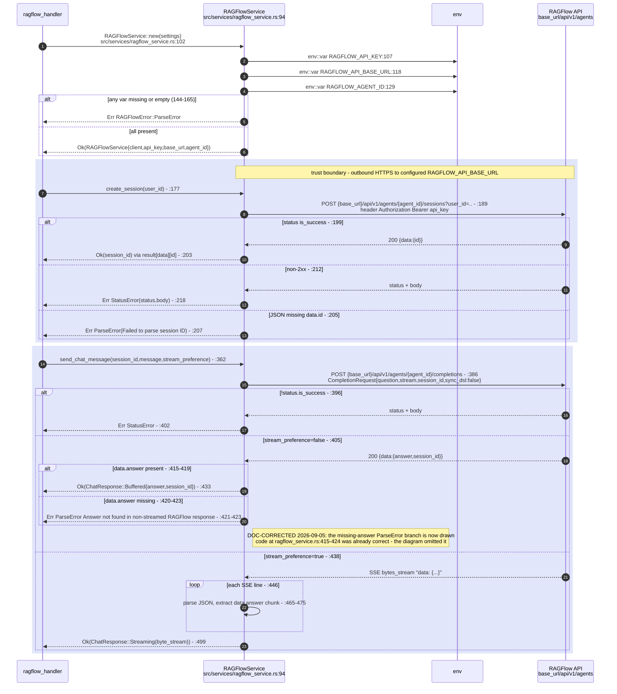
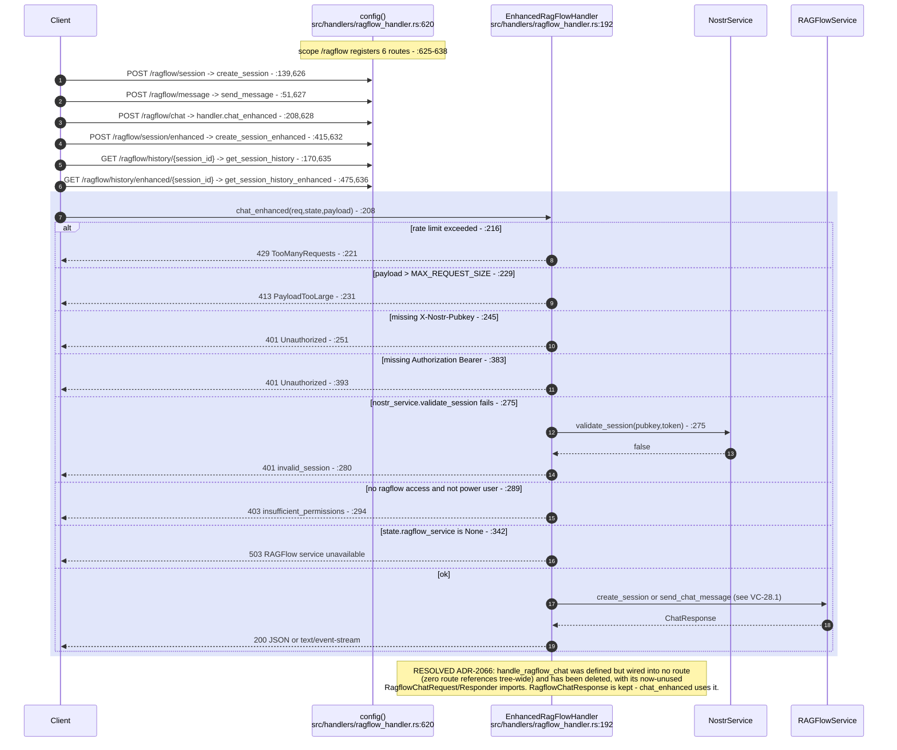
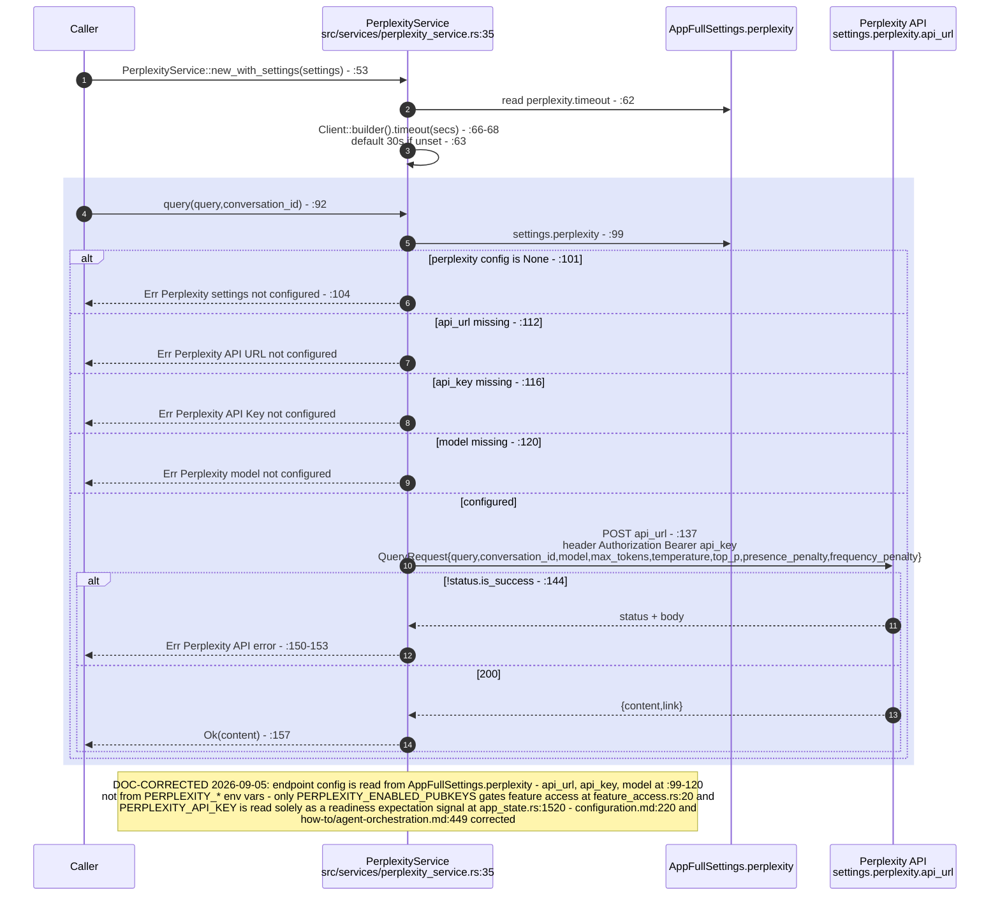
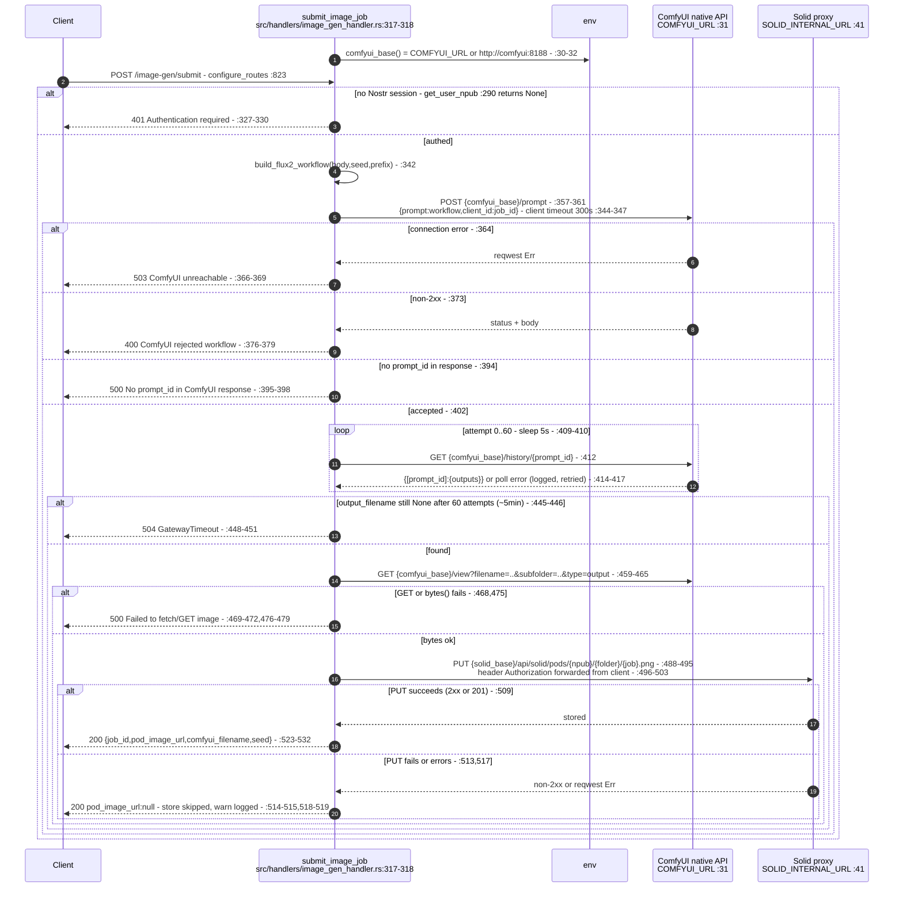
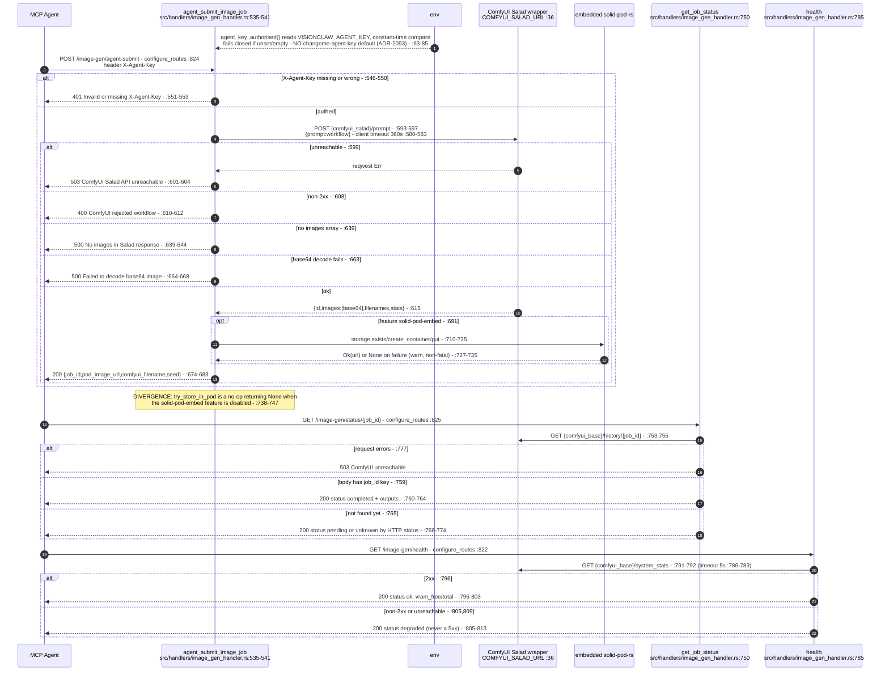
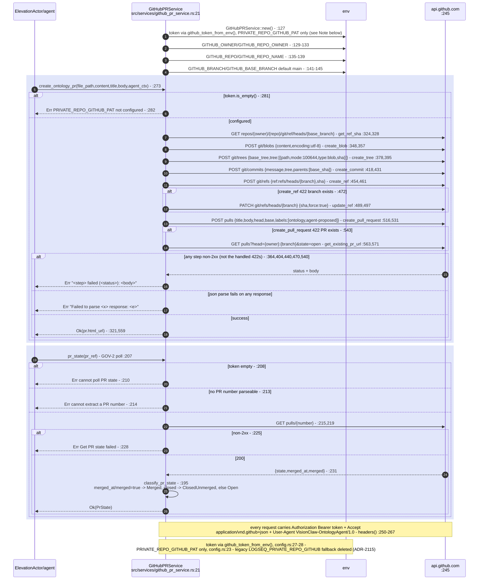
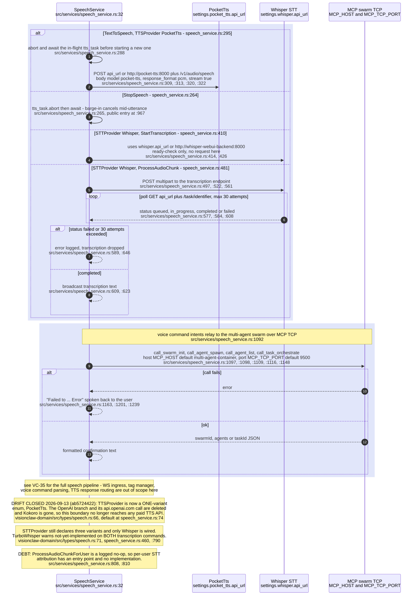
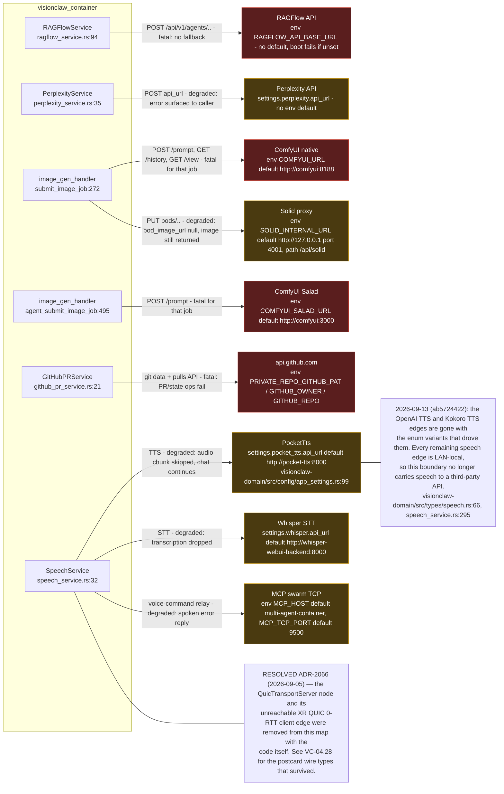

# E0 judgement vc-24

You are an independent judge for a pre-registered experiment. Below are (1) a TOPIC: a Markdown file of Mermaid diagrams that document code, with `path:line` citations, where paths under `../project/` are in the VisionClaw repository and paths under `../project/agentbox/` are in the agentbox repository; and (2) a DIFF: one commit's changes in the visionclaw repository, restricted to the files the topic lists under `sources:`.

Answer exactly one question:

> **Does this change make any statement in the topic false or incomplete?**

Judge only from the two texts below; do not look anything else up. Reply with a single JSON object and nothing else:

```json
{"verdict": "yes" | "no", "statements": ["<diagram id>: <the statement, quoted>", ...], "line_anchors_only": true | false, "reason": "<one or two sentences>"}
```

`statements` lists every topic statement the change makes false or incomplete (empty when the verdict is no). `line_anchors_only` is true when the only such statements are `path:line` anchors whose cited code merely moved.

## TOPIC (docs/diagrams/visionclaw/28-external-services.md)

````markdown
---
id: VC-28
title: External services — outbound integrations
area: visionclaw
governing:
  - ../project/docs/BASELINE-architecture.md
adrs: [ADR-2066, ADR-2115]
sources:
  - ../project/crates/visionclaw-domain/src/types/speech.rs
  - ../project/src/services/ragflow_service.rs
  - ../project/src/handlers/ragflow_handler.rs
  - ../project/src/services/perplexity_service.rs
  - ../project/src/handlers/image_gen_handler.rs
  - ../project/src/services/github_pr_service.rs
  - ../project/src/services/github/config.rs
  - ../project/src/services/speech_service.rs
  - ../project/crates/visionclaw-domain/src/config/app_settings.rs
  - ../project/src/app_state.rs
  - ../project/src/config/feature_access.rs
  - ../project/docs/reference/configuration.md
  - ../project/docs/how-to/agent-orchestration.md
verified_commit: {visionclaw: 58f04f2eb272a2707737f2065f8241b931229e81}
---
## VC-28.1 ragflow_service — outbound RAGFlow agent API

## VC-28.2 ragflow_handler — routes and dead handler

## VC-28.3 perplexity_service — outbound Perplexity query API

## VC-28.4 image_gen_handler — ComfyUI submit path (user session)

## VC-28.5 image_gen_handler — ComfyUI Salad agent path, status, health

## VC-28.6 github_pr_service — outbound GitHub REST API (git data + PR)

## VC-28.7 speech_service — outbound boundary only (see VC-35 for full pipeline)

## VC-28.9 consolidated external-dependency map

````

## DIFF

```diff
diff --git a/src/app_state.rs b/src/app_state.rs
index 16e7fcb29..37b253295 100644
--- a/src/app_state.rs
+++ b/src/app_state.rs
@@ -295,8 +295,6 @@ pub struct AppState {
     /// Use `get_gpu_compute_addr().await` to access this safely
     pub gpu_compute_addr: Arc<RwLock<Option<Addr<gpu::ForceComputeActor>>>>,
     pub stress_majorization_addr: Option<Addr<gpu::StressMajorizationActor>>,
-    pub shortest_path_actor: Option<Addr<gpu::ShortestPathActor>>,
-    pub connected_components_actor: Option<Addr<gpu::ConnectedComponentsActor>>,
 
     // Phase 7: Decomposed GPU subsystems (direct access, bypassing GPUManagerActor)
     pub physics: PhysicsSubsystem,
@@ -955,30 +953,23 @@ impl AppState {
             });
         });
 
-        let (
-            gpu_manager_addr,
-            stress_majorization_addr,
-            shortest_path_actor,
-            connected_components_actor,
-        ) = {
+        let gpu_manager_addr = {
             info!("[AppState::new] Starting GPUManagerActor (modular architecture)");
             let gpu_manager = GPUManagerActor::new().start();
 
-            // P2 Feature: Initialize ShortestPathActor and ConnectedComponentsActor
-            info!("[AppState::new] Starting ShortestPathActor and ConnectedComponentsActor for P2 features");
-            let shortest_path = gpu::ShortestPathActor::new().start();
-            let connected_components = gpu::ConnectedComponentsActor::new().start();
-
-            // ADR-031 D2b: give ShortestPathActor the shared SSSP map so ComputeSSP
-            // runs publish per-node distances to wire slot 28.
-            shortest_path.do_send(crate::actors::messages::SetNodeSSSP {
+            // ADR-2053: the shared SSSP map goes to the SUPERVISED ShortestPathActor,
+            // via GPUManagerActor -> GraphAnalyticsSupervisor. This used to start a
+            // second, standalone ShortestPathActor/ConnectedComponentsActor pair here
+            // and send the map to that one — but ResourceSupervisor distributes
+            // SharedGPUContext only to the subsystem supervisors, so the standalone
+            // pair never received a context and always took the GPU-absent arm. Every
+            // /api/analytics pathfinding route addressed that GPU-blind pair.
+            // ADR-031 D2b: without this map, wire slot 28 stops publishing per-node
+            // SSSP distances.
+            gpu_manager.do_send(crate::actors::messages::SetNodeSSSP {
                 node_sssp: node_sssp.clone(),
             });
-            info!("[AppState::new] Sent SetNodeSSSP to ShortestPathActor");
-
-            // Extract StressMajorizationActor from GPUManagerActor's child actors
-            // Note: The actor is spawned by GPUManagerActor, so we'll retrieve it after initialization
-            info!("[AppState::new] StressMajorizationActor will be available after GPU initialization");
+            info!("[AppState::new] Sent SetNodeSSSP to GPUManagerActor for the supervised ShortestPathActor");
 
             // ADR-014 DL4 fix: Send shared node_analytics to GPUManagerActor so it reaches
             // ClusteringActor and AnomalyDetectionActor via AnalyticsSupervisor.
@@ -995,12 +986,7 @@ impl AppState {
             github_sync_service.set_gpu_manager_addr(gpu_manager.clone());
             info!("[AppState::new] Registered GPUManagerActor with GitHubSyncService for semantic constraint dispatch");
 
-            (
-                Some(gpu_manager),
-                None,
-                Some(shortest_path),
-                Some(connected_components),
-            )
+            Some(gpu_manager)
         };
 
         // Create shared gpu_compute_addr that will be populated asynchronously
@@ -1342,14 +1328,16 @@ impl AppState {
             pagerank: None,
         };
 
-        // Graph ops subsystem initialized with the actors we already created
-        let graph_ops = GraphSubsystem {
-            shortest_path: shortest_path_actor.clone(),
-            components: connected_components_actor.clone(),
-        };
+        // ADR-2053: the graph-ops children (ShortestPathActor,
+        // ConnectedComponentsActor) are owned by GraphAnalyticsSupervisor, which
+        // spawns them and gives them a SharedGPUContext. AppState no longer holds
+        // their addresses — it previously held a SECOND, standalone pair that never
+        // received a context. This inventory is therefore empty by construction, and
+        // `GraphAnalyticsSupervisor`'s `GetSubsystemHealth` is the live health source.
+        let graph_ops = GraphSubsystem::default();
 
         info!(
-            "[AppState::new] GPU subsystems initialized (physics={}, analytics={}, graph_ops={})",
+            "[AppState::new] GPU subsystems initialized (physics={}, analytics={}, graph_ops={} — graph-ops children are supervisor-owned, see ADR-2053)",
             physics.active_count(),
             analytics.active_count(),
             graph_ops.active_count()
@@ -1389,9 +1377,13 @@ impl AppState {
             graph_service_addr,
             gpu_manager_addr,
             gpu_compute_addr, // Now Arc<RwLock<Option<...>>>, populated asynchronously
-            stress_majorization_addr,
-            shortest_path_actor,
-            connected_components_actor,
+            // ADR-2053: always None. This was the second slot of the tuple removed
+            // above and was already a literal `None` before that change — a comment
+            // there claimed the actor "will be available after GPU initialization",
+            // which never happened because nothing ever assigned it. It is kept as a
+            // field only because the readiness inventory below reports on it; the
+            // real StressMajorizationActor is a PhysicsSupervisor child.
+            stress_majorization_addr: None,
 
             // Phase 7: Decomposed subsystems
             physics,
```
