# E0 judgement vc-27

You are an independent judge for a pre-registered experiment. Below are (1) a TOPIC: a Markdown file of Mermaid diagrams that document code, with `path:line` citations, where paths under `../project/` are in the VisionClaw repository and paths under `../project/agentbox/` are in the agentbox repository; and (2) a DIFF: one commit's changes in the visionclaw repository, restricted to the files the topic lists under `sources:`.

Answer exactly one question:

> **Does this change make any statement in the topic false or incomplete?**

Judge only from the two texts below; do not look anything else up. Reply with a single JSON object and nothing else:

```json
{"verdict": "yes" | "no", "statements": ["<diagram id>: <the statement, quoted>", ...], "line_anchors_only": true | false, "reason": "<one or two sentences>"}
```

`statements` lists every topic statement the change makes false or incomplete (empty when the verdict is no). `line_anchors_only` is true when the only such statements are `path:line` anchors whose cited code merely moved.

## TOPIC (docs/diagrams/visionclaw/24-acsp-decision-elevation.md)

````markdown
---
id: VC-24
title: ACSP — governed decision/elevation pipeline
area: visionclaw
governing:
  - ../project/docs/BASELINE-architecture.md
adrs: [ADR-2006, ADR-2101]
sources:
  - ../project/src/actors/elevation_actor.rs
  - ../project/src/services/kpi_compute.rs
  - ../project/src/actors/decision_elevation_actor.rs
  - ../project/src/adapters/decision_elevation_store.rs
  - ../project/src/services/decision_elevation.rs
  - ../project/src/services/decision_service.rs
  - ../project/src/services/broker_events.rs
  - ../project/src/services/proposal_spine.rs
  - ../project/src/services/nostr_bead_publisher.rs
  - ../project/src/services/nostr_bridge.rs
  - ../project/src/services/acsp/client.rs
  - ../project/src/services/acsp/events.rs
  - ../project/src/services/acsp/mod.rs
  - ../project/src/services/ontology_enrichment_service.rs
  - ../project/src/adapters/sqlite_enrichment_repository.rs
  - ../project/src/handlers/enrichment_proposals_handler.rs
  - ../project/client/src/features/control-center/governance/brokerCaseQueue.ts
  - ../project/src/web_contract/ledger.rs
  - ../project/src/web_contract/reducer.rs
  - ../project/src/web_contract/ritual.rs
  - ../project/src/web_contract/state.rs
  - ../project/src/web_contract/trail.rs
  - ../project/src/app_state.rs
  - ../project/src/services/ontology_mutation_service.rs
  - ../project/src/services/voice_intent_client.rs
verified_commit: {visionclaw: 58f04f2eb272a2707737f2065f8241b931229e81, agentbox: 6a4ad132f2dc5ddaedd05c679fdd10066bf30a0f}
---

## VC-24.1 Enrichment-proposal lifecycle (real status values)

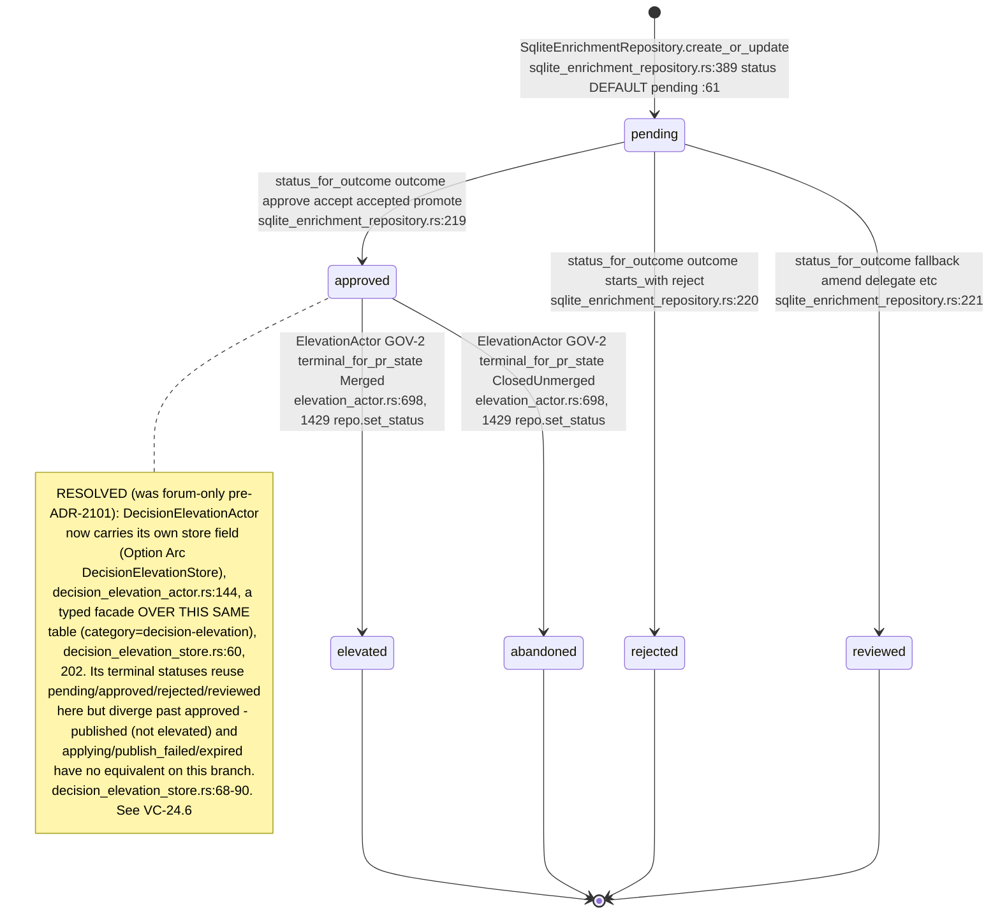

## VC-24.2 Enrichment-proposal creation — the real call chain

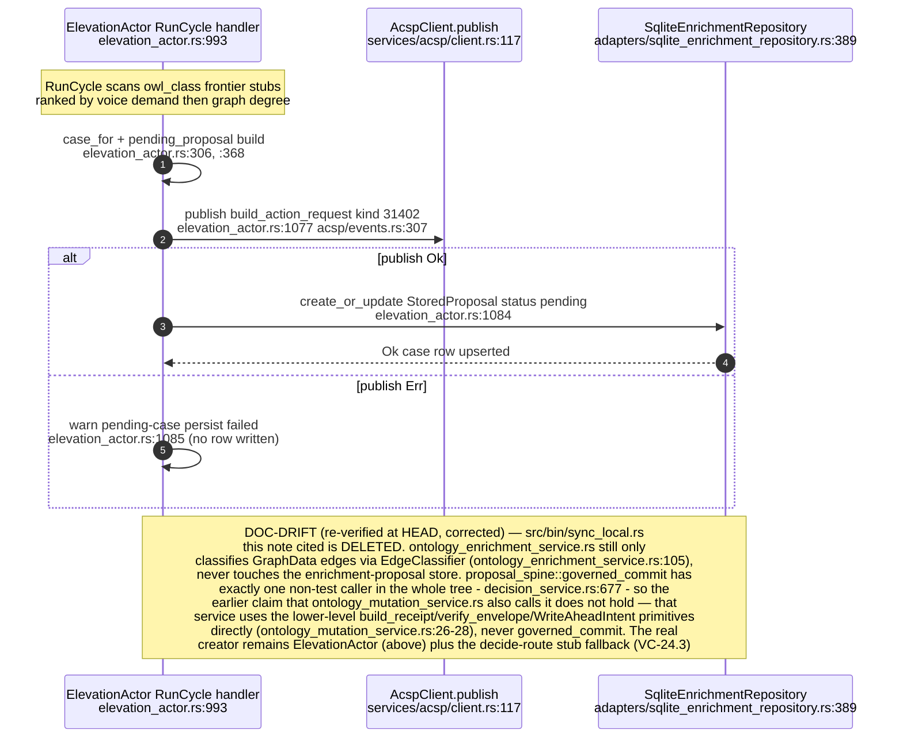

## VC-24.3 POST /api/enrichment-proposals/{id}/decide — decide route

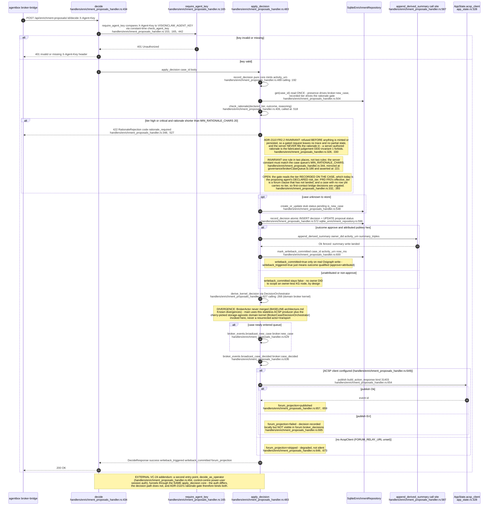

## VC-24.4 ElevationActor — draft → PR → GOV-2 merge poll → concept_elevated

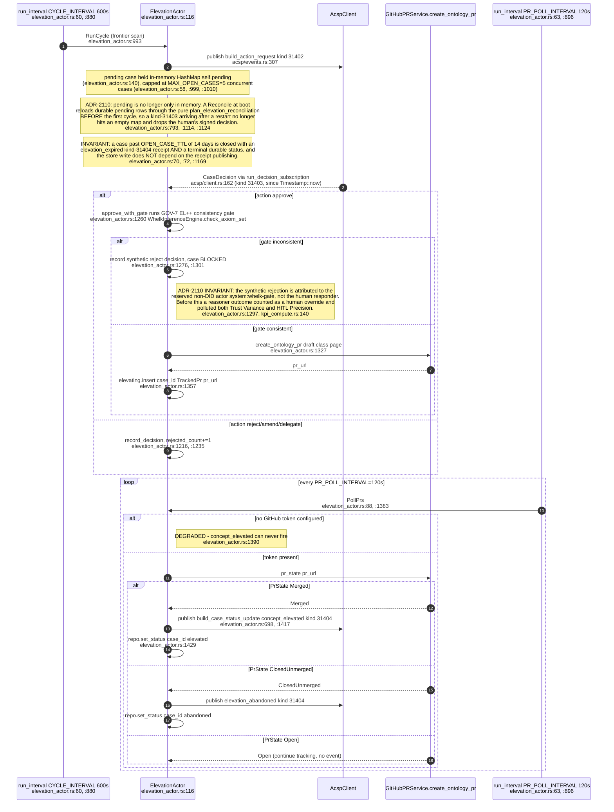

## VC-24.5 GOV-2 terminal PR state mapping + publish-failure warn path

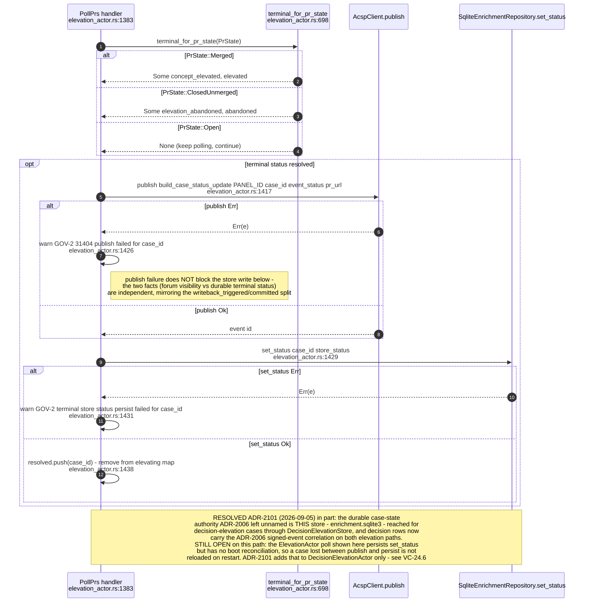

## VC-24.6 DecisionElevationActor — parallel path vs ElevationActor

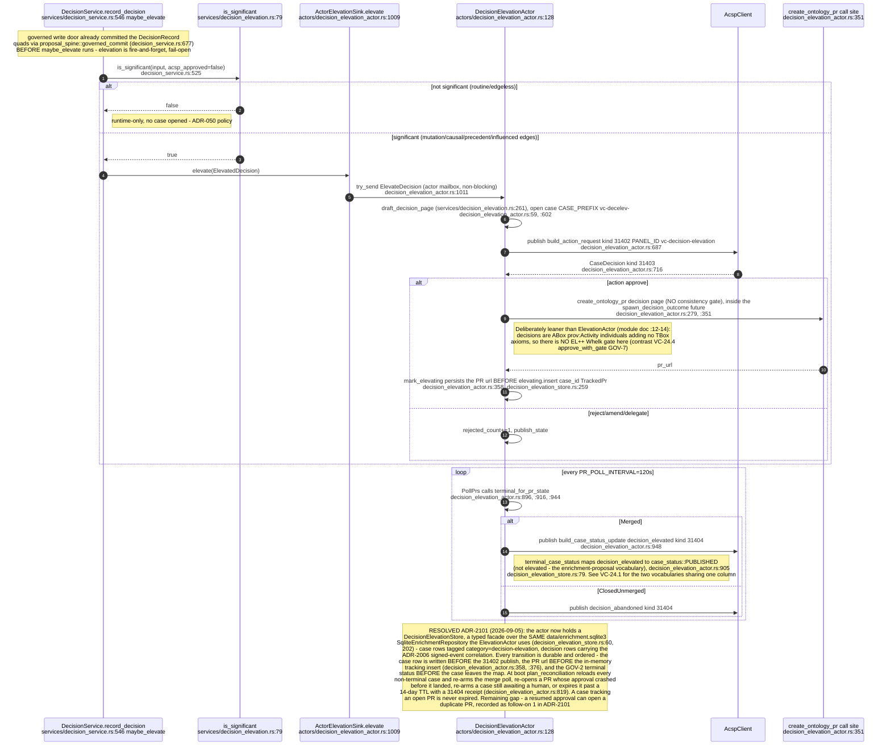

## VC-24.8 nostr_bead_publisher / nostr_bridge — governance event publish

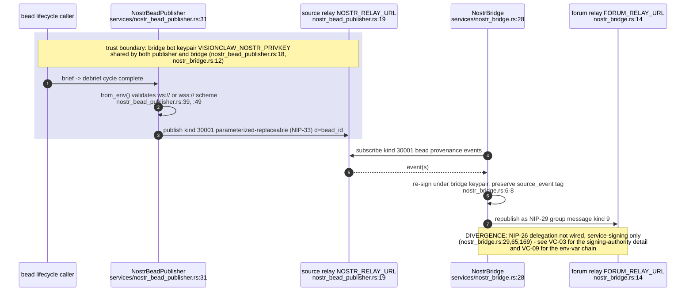

## VC-24.9 Governance kind map (31400-31405)

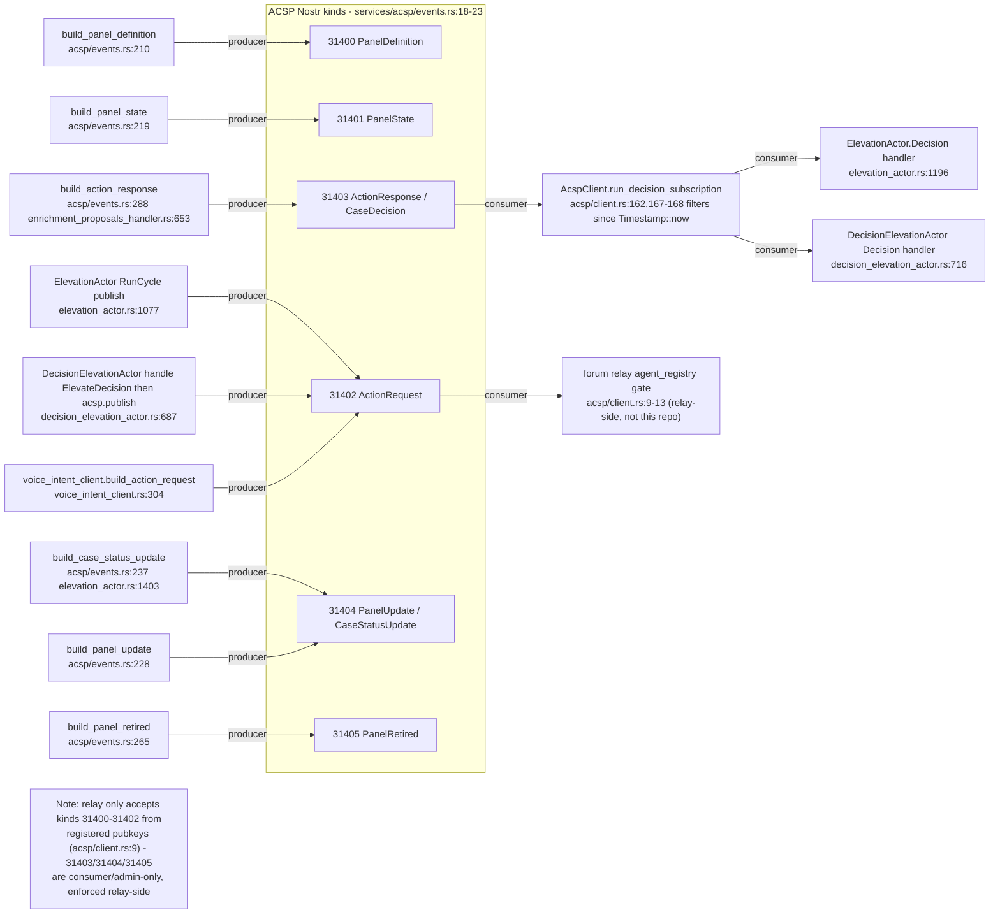

## VC-24.10 web_contract layer structure (reducer/state/ledger/trail/ritual)

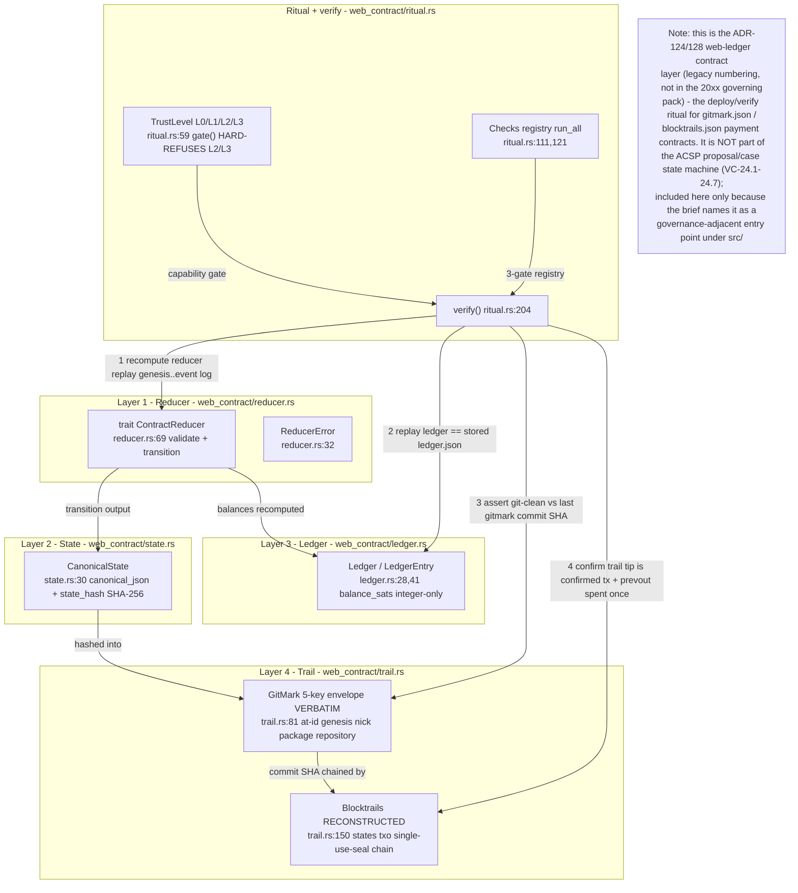

## VC-24.11 ACSP decision-projection client — app_state.rs boot + relay connect

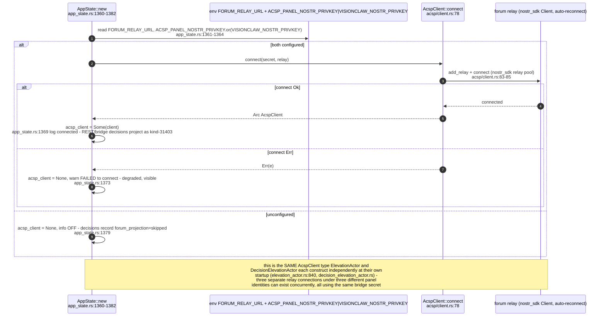

## VC-24.12 Decision-page OKF/vault frontmatter — draft, wikilinks and the read-back

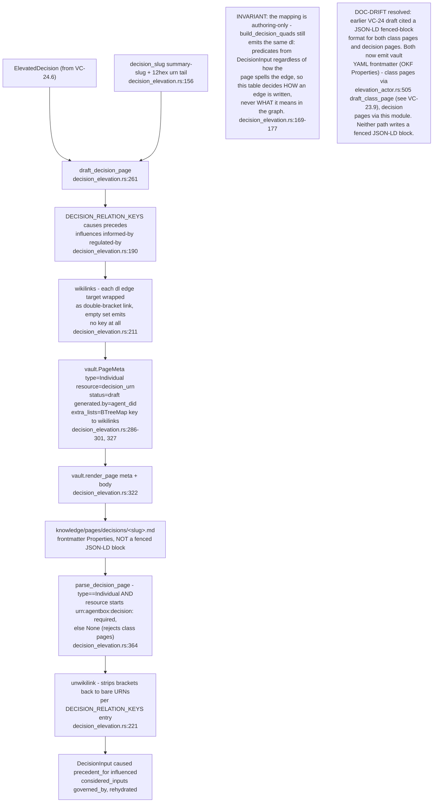
````

## DIFF

```diff
diff --git a/src/services/ontology_mutation_service.rs b/src/services/ontology_mutation_service.rs
index 7292f9cc1..96aa07900 100644
--- a/src/services/ontology_mutation_service.rs
+++ b/src/services/ontology_mutation_service.rs
@@ -1069,7 +1069,10 @@ mod provenance_wiring_tests {
         );
 
         // The query surface walks the chain for the entity.
-        let chain = repo.provenance_for_entity(iri.to_string(), 8).await.unwrap();
+        let chain = repo
+            .provenance_for_entity(iri.to_string(), 8)
+            .await
+            .unwrap();
         assert_eq!(chain.root, iri);
         let node = chain
             .nodes
@@ -1099,7 +1102,10 @@ mod provenance_wiring_tests {
             .expect("ok");
 
         let repo = OxigraphOntologyRepository::from_store(Arc::clone(&store));
-        let chain = repo.provenance_for_entity(iri.to_string(), 4).await.unwrap();
+        let chain = repo
+            .provenance_for_entity(iri.to_string(), 4)
+            .await
+            .unwrap();
         assert_eq!(chain.root, iri, "root URN preserved verbatim");
         assert!(
             chain.nodes.iter().any(|n| n.entity == iri),
```
